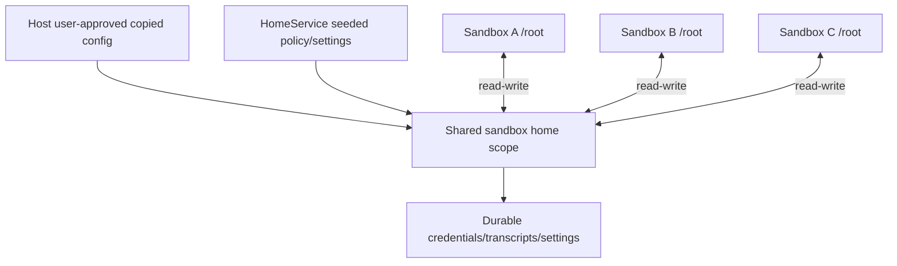

# Shared Harness Home Is an Explicit Credential Domain

Locki persists AI login state and configuration by mounting one host-backed sandbox home as `/root` in every container. This makes one login available across sandboxes and keeps the real host home out of reach. It also means every sandbox in that scope can read, overwrite, delete, backdoor, or exfiltrate every credential and mutable harness artifact stored there.

> [!summary]
> - Shared home is authoritative durable credential/collaboration state, not a cache and not per-sandbox state.
> - Persistence across sandboxes is the feature; cross-sandbox confidentiality and integrity are deliberately absent.
> - Harness adapters should declare files, merge semantics, sensitivity, sharing scope, generation, and postconditions.
> - Host-command authority must never be placed in shared home when it is intended to identify a particular sandbox.
> - Future isolation can use per-sandbox overlays or credential brokers, but sharing must remain explicit.

## Why this note exists

The same phrase—“shared projection”—can describe worktrees, home, and caches, but their semantics differ. Worktrees are authoritative per-workspace user data. Caches are optional accelerators. Shared home contains long-lived credentials, transcripts, settings, instructions, and hooks intended to cross sandbox lifetimes.

Combining them into one pattern hides which data can be deleted, which state is sensitive, and which sharing is intentional.

## Pattern statement

> **Assign every harness artifact to an explicit sharing scope. Every sandbox in scope $\sigma$ is assumed able to read, write, and exfiltrate every mutable artifact in that scope. Harness adapters may seed guest configuration but carry no host-command authority; durable home survives disposable infrastructure.**

For a home scope $\sigma$ and sandbox membership relation $member(s,\sigma)$:

$$
member(s,\sigma)\Rightarrow authority(s,Home_\sigma)=read\_write.
$$

This is a trust declaration, not an implementation accident.

## Concrete shape

`paths.py` defines `SANDBOX_HOME` under XDG data. Lima mounts it at `/root/.locki/home`; the Incus default profile mounts that source as `/root` for every container (`services/vm.py:16-18,147-160`; `data/vm-setup.sh:69-76`).

`setup.py` can copy selected host AI state:

```text
.claude
.gemini
.codex
.pi
.config/opencode
.config/github-copilot
.config/gh-copilot
.local/share/opencode
.claude.json
```

`HomeService.prepare` merges/writes:

- Claude trust, dangerous-mode settings, and a branch-guard hook;
- Gemini/Antigravity always-proceed settings and instructions;
- OpenCode allow policy and instructions;
- transcripts/project titles.

Claude resume transcripts and authentication persist because every sandbox resolves `/root/.claude` to the same host-backed tree.

## Authority and sharing model



The outer VM boundary still protects the real host home. It does not protect shared-home tenants from each other.

### Positive properties

- login once, reuse across sandboxes;
- persistent transcripts and titles;
- host real home remains unmounted;
- centralized sandbox-specific instructions and safe defaults;
- VM/container recreation does not erase credentials/config.

### Costs

- one compromised agent can read every shared token;
- one sandbox can modify hooks/instructions used by another;
- concurrent harness writes can race;
- network egress makes secrets exfiltratable;
- a shared bridge private key cannot establish per-sandbox identity.

## Harness adapter contract

Each adapter declares:

```text
adapter ID and generation
files/directories read
files/directories written
merge versus replace behavior
credential sensitivity
sharing scope: global | group | sandbox
postcondition probes
instructions supplied
host process authority: none
```

A target interface can be small:

```go
type HarnessHome interface {
    Ensure(context.Context, HomeSpec) (HomeObservation, error)
    Verify(context.Context, HomeSpec) (HomeVerification, error)
}
```

The storage/trust policy is core. Individual harness templates/adapters may be extensible only within declared guest-side files and authority.

## Sharing scopes

A future implementation may support:

| Scope | Meaning | Use |
|---|---|---|
| `global` | all Locki sandboxes share state | convenience-compatible current behavior |
| `group` | selected sandboxes share credentials/config | project/team/provider profile |
| `sandbox` | one sandbox owns an overlay | stronger tenant isolation |
| `brokered` | no token file projected; guest asks a scoped broker | least token exposure, highest complexity |

Scope changes are migrations. Moving global state into isolated overlays requires deciding copy, revocation, and conflict policy.

## Behavioral contract

```text
H1. Sharing scope is explicit in config/status/UI.
H2. Every sandbox in scope is assumed read-write authority over mutable home.
H3. Home survives environment/container deletion unless explicitly removed.
H4. Harness adapters cannot execute host processes or widen projections.
H5. Home generation/health is independent from container/environment generation.
H6. Sensitive files have deliberate permissions, ownership, and copy semantics.
H7. Per-sandbox authentication capabilities are injected outside shared home.
H8. Invalid JSON/merge failures produce degraded observations, not silent readiness.
H9. Copy operations preserve or deliberately reject symlink/permission semantics.
```

The reference establishes H2/H3 and partially H4. It warns on invalid JSON but otherwise has no home generation/health model.

## Security analysis

The no-exfiltration warning in the README is central. Any API key exposed to one shared-home sandbox must be treated as available to all sandboxes and external destinations.

Credentials should therefore be:

- scoped to minimum services/repositories;
- disposable/rotatable;
- separated from host-global credentials;
- audited for copy sources;
- not reused as per-sandbox identity proofs.

The current bridge client key violates the last rule: it lives under shared `/root/.ssh`. This is why design 03 requires a per-container secret path outside shared home.

## Pattern vocabulary

- **Credential Domain / Trust Domain:** all members share authority over the stored secret/config.
- **Profile / Overlay:** base shared state plus narrower per-sandbox changes.
- **Configuration Projection:** host-approved files become guest configuration.
- **Secret Broker:** scoped capability is mediated without projecting the raw token file.
- **Durable Shared State:** survives disposable runtime infrastructure.
- **Anti-Corruption Layer:** harness adapters map stable Locki policy to tool-specific files.

## Why tempting alternatives fail

### Call shared home “per-sandbox config”

The mount source is identical for every container. The label would be factually false.

### Store per-sandbox keys under different names in shared home

Every sandbox can list/read all names. Naming is not isolation.

### Treat home as a cache

Credentials and transcripts are authoritative user state. Deleting them has semantic consequences.

### Copy the entire real host home

It widens authority far beyond the intended sandbox identity and exposes unrelated credentials/config.

### Let repositories select harness-home plugins

Repository data is lower trust. It must not load host code, copy arbitrary host files, or widen credential scope.

## Failure modes and tricky details

1. Concurrent sandboxes race mutable JSON/transcript files.
2. Invalid JSON causes updates to be skipped, potentially leaving stale policy.
3. Copied credentials may be broader than intended for sandbox use.
4. Shared hook/settings modification affects future sessions.
5. Backup-suffix copies can accumulate sensitive historical values.
6. Harness internal file formats can change without a migration contract.
7. Shared home mounted as root may interact with UID/mount semantics in a PVE port.

## Testing and verification

- Enumerate exact copied/seeded files and permissions.
- Two-sandbox tests demonstrate expected sharing and mutation visibility.
- Per-sandbox overlay tests demonstrate non-sharing when selected.
- Invalid/torn JSON and concurrent write tests produce degraded status.
- Delete/recreate environment and prove home persistence.
- Verify no host-executable plugin or arbitrary copy source is repo-selectable.
- Verify gateway sandbox credentials are absent from shared home.
- Secret scanning/redaction tests for logs and backup files.

## Applicability

Use explicit shared credential domains when convenience and cross-session continuity outweigh mutual tenant isolation, and when tokens are limited/disposable.

Do not use global shared home for mutually hostile users, high-value long-lived credentials, or per-sandbox identity material.

## Candidate ecosystem guidance

1. Name credential sharing scope explicitly.
2. Treat every member as read-write/exfiltration authority.
3. Keep durable credentials separate from caches.
4. Prevent lower-trust config from widening copy/projection authority.
5. Inject tenant identity outside shared storage.
6. Make home migration/health independently observable.

## Open questions

- Should the default remain global for compatibility?
- Which harnesses support external credential brokers?
- How should overlays merge transcripts and mutable settings?
- What token scopes are safe for shared coding-agent use?
- Should home backups be encrypted or retention-bounded?

## Evidence and references

- `src/locki/paths.py:20-29`
- `src/locki/cmd/setup.py:60-72,75-149`
- `src/locki/services/home.py:18-115`
- `src/locki/services/vm.py:16-18,147-160`
- `src/locki/data/vm-setup.sh:69-76`
- `src/locki/cmd/internal.py:47-51,216-226`
- `README.md:83-90,114-115,147-153`
- [[Research/Software Architecture Garden/locki/README|Architecture Garden — Locki]]
