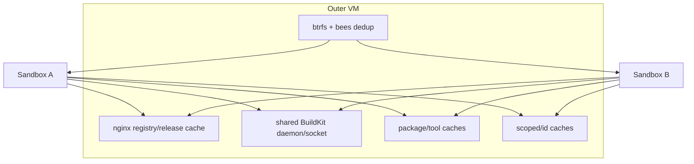

# Shared Acceleration Is an Explicit Contamination Domain

Locki makes disposable containers practical by sharing package caches, a registry/GitHub/k3s download proxy, a BuildKit daemon, tool installations, and btrfs deduplication. These mechanisms reduce cold-start and repeat-build cost. They also place every sandbox in one integrity, availability, and often confidentiality domain. The architecture is correct only when sharing is named rather than mistaken for isolation.

> [!summary]
> - Shared cache/build services are optional accelerators, not authoritative sandbox state.
> - Every privileged container can address `/var/cache/locki` and the shared BuildKit socket; “scoped” directory names organize cleanup but do not enforce ACLs.
> - Cache loss should change performance, not semantic correctness. This remains an explicit conformance obligation.
> - One acceleration subsystem owns sandbox-scoped cache cleanup; runtimes and janitors should not embed cache paths.
> - Registry interception and the VM-generated CA are security/supply-chain surfaces, not merely performance features.

## Why this note exists

“One VM, many containers” works economically because repeated dependencies and image layers are reused. Without that plane, fresh root filesystems would repeatedly download and rebuild the same material. But the same mechanisms can allow one sandbox to delete caches, fill disks, manipulate shared builder state, or influence another sandbox's dependency resolution.

The reusable pattern is not “share caches.” It is “declare the contamination domain and keep acceleration non-authoritative.”

## Pattern statement

> **Share accelerators only inside an explicit contamination domain. Scoped cache identities are cleanup/meaning coordinates, not access control. Cache loss, disablement, or corruption must not silently change product semantics; one subsystem owns capacity, validation, and cleanup.**

For semantic operation $F$ and acceleration state $K$:

$$
Result(F,K_{warm})\approx Result(F,K_{empty})
$$

under the declared input/tool versions. Performance may differ; intended results and authority must not.

## Concrete acceleration plane



The default Incus profile mounts `/var/cache/locki` into every container (`vm-setup.sh:69-72`). `ContainerService.env` redirects more than forty tool/package variables there (`container.py:27-89`). Per-sandbox caches live under `/var/cache/locki/scoped/<wt-id>`, but root in any privileged container can address other IDs.

`vm-setup.sh` configures:

- nginx TLS proxy/cache for registries, k3s installer, and GitHub release assets;
- a VM-generated CA trusted by containers;
- shared BuildKit on `/var/cache/locki/buildkit.sock`;
- btrfs Incus storage and bees dedup.

`container-setup.sh` routes Docker builds through the shared BuildKit daemon, redirects node_modules/.venv into scoped cache, and lazily installs tools under shared cache/install locks.

## Contamination dimensions

| Dimension | Shared consequence |
|---|---|
| Integrity | one sandbox can alter/delete shared cache or builder state |
| Availability | disk exhaustion, install-lock contention, BuildKit abuse affect all sandboxes |
| Confidentiality | cache contents and scoped directories may reveal artifacts/paths |
| Supply chain | intercepted downloads and shared CA/cache influence all consumers |
| Performance | a slow/large build or cache prune changes other tenants' latency |
| Versioning | one global tool/install path can drift under concurrent use |

Checksums, signatures, package metadata, and content-addressed layers mitigate some poisoning paths. They do not create tenant isolation.

## Shared versus scoped

```text
shared:
  registry blobs
  BuildKit cache/socket
  package download caches
  mise/tool installs

scoped/<SandboxID>:
  node_modules targets
  uv/poetry environments
  local image pins
  other caches unsafe to share semantically
```

The scoped coordinate preserves cleanup and semantic separation where tools cannot safely share one directory. It is not an ACL. The pattern's name deliberately says contamination domain.

## Cache ownership contract

```go
type CacheStore interface {
    Observe(context.Context) (CacheObservation, error)
    RemoveScoped(context.Context, SandboxID) error
    Prune(context.Context, PrunePolicy) (PruneResult, error)
}
```

The acceleration subsystem is the sole owner of scoped-cache paths and deletion. `SandboxRuntime.remove` deletes runtime instances; orchestration then calls `CacheStore.RemoveScoped`. The janitor requests the same operation rather than duplicating `rm -rf` logic.

Cache operations verify `SandboxID` ownership and refuse unbounded path input.

## Behavioral contract

```text
C1. Cache state is not authoritative sandbox/workspace state.
C2. Empty/disabled cache preserves functional semantics under pinned inputs.
C3. Scoped cache key includes SandboxID and every semantic scope dimension required by the tool.
C4. Scoped names do not imply access control.
C5. One cache subsystem owns scoped deletion and pruning.
C6. Capacity and cleanup are bounded and observable.
C7. Cached data is validated before becoming executable/authority where feasible.
C8. A cache hit never authorizes a destructive platform action; live ownership is revalidated.
C9. Registry interception trust and privacy scope are explicit.
```

The source strongly establishes sharing/reuse and C4. C2/C6/C7/C8 require stronger conformance and hostile-cache testing.

## Mathematical foundations

A cache is a partial memoization map:

$$
K:key(Input,Environment)\rightharpoonup Value.
$$

Correct reuse requires complete semantic identity:

$$
key(x)=key(y)\Rightarrow F(x)=F(y)
$$

for the cached computation's declared environment. A path named only by sandbox ID may still omit tool version, architecture, lockfile, or build context dimensions.

Sharing and access control are separate relations:

$$
shared(a,b,K)=true
\not\Rightarrow
isolated(a,b,K)=true.
$$

The design deliberately chooses sharing; documentation and tests must not infer isolation.

## Pattern vocabulary

- **Memoization / Shared Cache:** reuse by semantic key.
- **Content-Addressed Storage:** blobs/layers keyed by digest.
- **Contamination Domain:** members can influence common integrity/availability.
- **Bulkhead (absent internally):** the outer VM protects host, but caches lack per-tenant bulkheads.
- **Singleflight / Install Lock:** concurrent installers coordinate shared work.
- **Pull-Through Proxy:** cache mediates selected remote downloads.
- **Best-effort acceleration:** failure should fall back rather than corrupt semantics.

## Why tempting alternatives fail

### Call scoped paths isolated

Any privileged container can address them. Namespacing supports cleanup and semantics, not authorization.

### Put credentials in the cache plane

Caches are broadly writable and disposable. Credential state belongs in an explicit credential domain with different retention/trust rules.

### Let the runtime delete cache directories

Alternative runtimes should not know acceleration layout. It also causes current janitor/explicit-remove behavior to diverge.

### Assume checksums solve contamination

They validate some artifacts, not disk exhaustion, deletion, builder control, privacy, or every package ecosystem.

### Make acceleration mandatory for correctness

Then cache state becomes authority and recovery requires a stronger persistent-state protocol.

## Failure modes and tricky details

1. Install locks can deadlock under re-entrant shims; the source contains explicit guards/tests.
2. Node auto-install recursion previously risked process explosion/OOM; E2E includes a regression.
3. Shared BuildKit cannot see per-container dockerd images, requiring OCI pin/export logic.
4. Random/shared storage can be exhausted globally.
5. Registry cache may retain signed/private content under keys that omit query signatures; confidentiality needs explicit testing.
6. Pruning one shared service can disrupt active builds.
7. Mixed libc/distribution caches can be semantically unsafe.

## Testing and verification

- Run core E2E with caches disabled/empty and compare results.
- Corrupt/delete cache entries; verify checksum/fallback behavior.
- Two-sandbox reuse tests for package, registry, and BuildKit layers.
- Two-sandbox interference tests for deletion, capacity, lock contention, and builder state.
- Verify scoped cleanup only removes the owned sandbox coordinate.
- Test private/signed asset caching and authorization-header stripping.
- Quota/high-water/prune tests during active workloads.
- Mutation-test incomplete cache keys across architecture/tool versions.

## Applicability

Use a shared contamination domain when tenants are cooperative or same-principal, performance reuse matters, and the outer boundary limits host damage.

Do not use the same plane for mutually hostile customers, private per-tenant artifacts without ACLs, or correctness-critical state with no independent recovery source.

## Candidate ecosystem guidance

1. Declare contamination scope separately from namespace scope.
2. Key caches by complete semantic identity.
3. Make cache loss correctness-neutral.
4. Centralize cleanup/capacity ownership.
5. Revalidate live authority after cache/catalog lookup.
6. Test two instances for both reuse and interference.
7. Treat interception CAs and shared builders as security surfaces.

## Open questions

- Which cache dimensions require tenant/group separation?
- Can BuildKit workers be partitioned without losing most reuse?
- What quotas prevent one sandbox from exhausting the VM?
- Which private asset paths must bypass shared registry/release caches?
- Should scoped cache directories gain filesystem ACLs even within a same-principal model?

## Evidence and references

- `src/locki/services/container.py:17-89,228-237`
- `src/locki/data/vm-setup.sh:20-325`
- `src/locki/data/container-setup.sh:35-525`
- `src/locki/cmd/vm.py:91-143`
- `test/e2e.sh:134-156,461-503,703-840`
- [[Research/Software Architecture Garden/locki/README|Architecture Garden — Locki]]
- [[Research/Software Architecture Garden/flowkit/designs/01 - Validated Envelopes Preserve Cache Meaning Across Backends|Validated Envelopes Preserve Cache Meaning Across Backends]]
