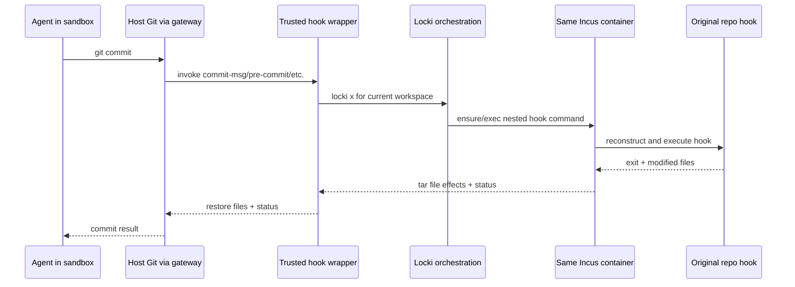

# Git Hook Re-entry Across the Sandbox Boundary

Locki executes Git itself on the authority host, but repository hooks can run arbitrary project code. Rather than run original hooks with host authority, each worktree receives a trusted wrapper. Host Git invokes the wrapper; the wrapper re-enters the same Locki sandbox, reconstructs the original hook there, transfers selected hook files, and returns the hook's status and file effects to host Git.

> [!summary]
> - The flow is guest → host Git → trusted wrapper → same guest sandbox → host Git.
> - The wrapper preserves repository hook semantics while moving arbitrary hook execution away from the authority host.
> - Re-entry is distinct from the command gateway: it nests a second sandbox session inside one already authorized Git effect.
> - Current transfer uses absolute `tar -P` paths and assumes identity path mapping; a portable design needs typed workspace-relative paths.
> - Recursion, cancellation, generation, and cleanup require explicit contracts.

## Why this note exists

Per-worktree `core.hooksPath` is not merely configuration. It is a control-flow boundary that prevents original repository hooks from inheriting host process authority when an agent commits through the bridge. It also creates a non-obvious recursive lifecycle: a sandbox command waits on host Git, which waits on a new `locki x`, which executes the hook in the sandbox.

This design deserves independent study because its direction, authority, and failure modes differ from ordinary guest-to-host command authorization.

## Pattern statement

> **When a trusted host effect must invoke untrusted project extension code, replace the extension entrypoint with a trusted wrapper that re-enters the same sandbox/workspace, transfers only typed workspace-relative inputs/effects, preserves exit semantics, and never executes the original extension on the authority host.**

## Concrete setup

`WorktreeService.add` enables worktree-specific Git config, creates a host-only hooks directory under `WORKTREES_META`, writes `locki-hook.sh` under every standard hook name, and sets `core.hooksPath` to that trusted directory (`worktree.py:176-207`). The original repository hook remains in the common Git directory.

At invocation, the wrapper:

1. locates the original hook via `git rev-parse --git-common-dir`;
2. exits successfully if no executable original hook exists;
3. identifies arguments naming existing files;
4. copies those files into the sandbox using absolute tar paths;
5. starts `locki x` and writes a temporary executable hook inside the guest;
6. runs it with original arguments;
7. copies selected files back;
8. returns the guest hook exit code.

## Recursive flow



The outer Git process remains host-owned; arbitrary hook code executes as guest root in the sandbox. That is a deliberate authority transfer.

## Same-sandbox binding

The wrapper invokes `locki x` from the worktree. `WorktreeService.resolve` detects the current managed worktree and selects the corresponding sandbox (`worktree.py:348-355,441-520`). This is implicit contextual binding.

A target contract should carry explicit identities:

```go
type HookInvocation struct {
    SandboxID   SandboxID
    WorkspaceID WorkspaceID
    HookName    HookName
    Arguments      []HookArgument
    WorkspaceFiles []WorkspacePath
    EphemeralFiles []HookEphemeralFile
}
```

The nested execution uses the same sandbox generation and workspace. A stale/replaced container must not receive the hook.

## Path transfer

Current `locki-hook.sh` identifies file arguments using `[[ -f "$arg" ]]`, then uses:

```sh
tar -cpf - -P "${file_args[@]}" | locki x sh -c 'tar -xpf - -P'
```

This works because Lima preserves exact worktree paths, but not every Git-hook file belongs to the worktree. `commit-msg` and `prepare-commit-msg` receive files such as `COMMIT_EDITMSG` in the host Git administrative directory, deliberately outside the guest projection. The E2E suite proves that modifying this file and copying it back is established behavior (`test/e2e.sh:258-275`).

The target flow distinguishes two path capabilities:

```text
worktree file argument
 -> validate under WorkspaceID host root
 -> convert to WorkspacePath
 -> map to guest workspace path

hook-owned administrative file (for a declared hook schema)
 -> validate exact host file role under trusted Git custody
 -> mint HookEphemeralFile capability
 -> copy to controlled guest scratch path
 -> execute hook with translated scratch argument
 -> copy result back only to the exact host-owned source file
```

`HookEphemeralFile` carries a capability ID, hook/file role, exact host destination held by the trusted wrapper, guest scratch destination, mutability, and cleanup policy. It does not project the Git administrative directory or classify `COMMIT_EDITMSG` as workspace data. No arbitrary absolute path crosses the wrapper boundary.

## Behavioral contract

```text
K1. The original repository hook never executes on the authority host.
K2. Wrapper invocation is bound to the same SandboxID and WorkspaceID as host Git.
K3. Hook name must be one of the installed trusted wrapper entrypoints.
K4. Worktree file arguments/effects are workspace-relative and path-confined.
K5. Declared Git administrative files use hook-schema-specific `HookEphemeralFile` capabilities and controlled guest scratch paths.
K6. Non-identity PathMap is applied to workspace paths in both directions.
K7. Hook stdin/stdout/stderr/exit status preserve Git hook semantics.
K8. Cancellation and timeout of outer Git propagate to nested hook execution.
K9. Temporary hook material is removed on success, failure, and cancellation.
K10. Nested ensure cannot race janitor stop/removal; one operation lease covers the enclosing effect.
K11. Hook execution is generation-bound so stale runtime completion cannot affect replacement state.
```

The reference strongly establishes K1 and ordinary exit/file behavior—including external `COMMIT_EDITMSG` mutation—through E2E. K2 is contextual rather than cryptographically bound; typed workspace/ephemeral capabilities and K6–K11 need explicit port/rewrite work.

## Re-entrancy and deadlock analysis

The enclosing agent process waits for host Git. Host Git waits for the wrapper. The wrapper calls Locki orchestration, which may acquire VM/container/daemon locks and execute in the same container.

A deadlock can occur if the outer operation retains a lock needed by nested `locki x`. Current bridge execution does not hold the policy resolver lock across the host subprocess, and file locks are narrow, so the tested flow succeeds. A rewrite must preserve this property:

> No host-effect authorization/lifecycle lock is held while extension code re-enters application orchestration.

The nested operation should inherit the outer operation lease or use a re-entrant sub-operation token rather than compete with itself.

## Pattern vocabulary

- **Sandboxed Extension / Plugin Host:** untrusted extension code runs under reduced authority.
- **Trusted Wrapper:** stable host entrypoint mediates the original hook.
- **Re-entrant Call:** one host effect nests another sandbox execution.
- **Anti-Corruption Layer:** Git hook argv/files are translated into typed invocation.
- **Path Capability:** workspace-relative files are explicit allowed inputs/effects.
- **Effect Acknowledgment:** guest hook exit and returned file effects complete host Git's operation.

## Why tempting alternatives fail

### Run hooks on the host

Repository hook code then receives host user authority and can bypass the sandbox boundary.

### Disable hooks entirely

It breaks repository semantics such as validation, message mutation, generated files, and signing workflows.

### Project the original `.git/hooks` directory

It exposes/mutates original Git metadata and lets the guest replace host extension code directly.

### Copy every argument as an absolute path

It assumes identity mounts and can transfer paths outside the intended workspace.

### Start a different fresh sandbox for hooks

It loses the active sandbox's tools, filesystem state, cache, and identity; hook effects may not match the committing environment.

## Failure modes and tricky details

1. Absolute `tar -P` paths break under non-identity projection and widen path risk.
2. Hook file arguments have distinct authority classes: worktree files versus trusted Git administrative files such as `COMMIT_EDITMSG`; hook-specific schemas matter.
3. Symlink, permission, ownership, newline, and partial-write semantics can differ in transfer.
4. Nested setup/provisioning during a commit can block for a long time.
5. Outer cancellation can leave temporary hook files/processes.
6. Concurrent removal/janitor stop can interrupt the nested operation.
7. Original hooks can invoke Git again and create deeper recursion.
8. Signing/agent-dependent hooks may need host credentials unavailable in the guest.

## Testing and verification

- Existing E2E: guest pre-commit creates a file; commit-msg modifies message.
- One test per standard hook argument schema used by supported repos.
- Non-identity path-map tests with nested directories/includes.
- `commit-msg`/`prepare-commit-msg` tests using `HookEphemeralFile`, controlled scratch paths, exact copy-back destination, and cleanup.
- Path traversal/symlink tests; reject arbitrary outside-workspace inputs while permitting only declared hook administrative roles.
- Cancellation/timeout tests proving temporary cleanup.
- Re-entrancy tests under container startup, janitor, and remove contention.
- Recursive Git-hook invocation depth policy.
- Differential behavior against normal Git hook exit/file semantics.
- Verify original hook bytes never execute as a host process.

## Applicability

Use this pattern when a privileged host tool has an extension/plugin callback that must preserve semantics but should execute with sandbox authority: VCS hooks, formatters, build hooks, package lifecycle scripts, or editor tasks.

Do not use it when the extension legitimately requires host-only secrets/effects without a separately mediated capability, or when transfer cannot preserve required semantics.

## Candidate ecosystem guidance

1. Replace untrusted host extension entrypoints with trusted wrappers.
2. Re-enter the same semantic sandbox/workspace.
3. Type and confine every path-bearing input/effect.
4. Preserve exit and stream semantics.
5. Avoid holding host authorization locks across extension execution.
6. Bind nested execution to the enclosing operation/generation.
7. Test recursion and cancellation explicitly.

## Open questions

- Which Git hooks and argument schemas are officially supported?
- Should hooks receive a reduced sandbox profile rather than full root?
- How should hooks request selected host signing credentials?
- What recursion/depth policy prevents hook loops?
- Can file transfer be eliminated when a coherent projection already exists?

## Evidence and references

- `src/locki/services/worktree.py:176-225,348-355,441-520`
- `src/locki/data/locki-hook.sh:1-31`
- `src/locki/cmd/exec.py:16-50`
- `src/locki/cmd/internal.py:203-279`
- `test/e2e.sh:134-164,260-323`
- [[Research/Software Architecture Garden/locki/README|Architecture Garden — Locki]]
