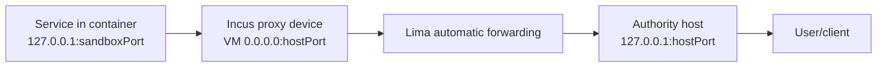
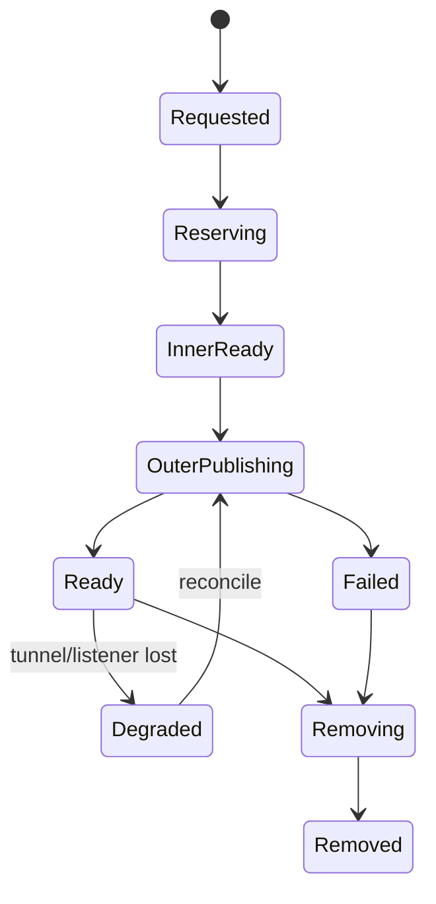

# Endpoint Exposure Owns the Whole Publication Path

A sandbox service is not exposed merely because an Incus proxy device exists. Traffic must traverse a container endpoint, an inner VM listener, an outer provider transport, and a controller bind address. One end-to-end exposure object must own allocation, scope, observations, recovery, and teardown across those layers.

> [!summary]
> - Current Locki configures an Incus proxy listener on the outer VM; Lima implicitly publishes that listener to the host.
> - The source selects a free port by binding port 0 and then closing the socket, creating a documented allocation race.
> - Provider outer transport is only a primitive. Exposure identity, bind-scope policy, durable records, advertised URL, and teardown belong to a core exposure subsystem.
> - Bind scope must be explicit (`loopback`, `tailnet`, `LAN`, `public`) and default to the narrowest scope.
> - A direct PVE provider must replace Lima's implicit publication with an owned tunnel/listener and conformance tests.

## Why this note exists

`port_forward.py` appears independent of Lima because it calls `vm.run(["incus", ...])`. The E2E suite reveals the hidden dependency: after the VM listener is added, the test waits for Lima to detect and forward the port to host loopback. A Proxmox VM will not provide that behavior automatically.

This is the same decomposition lesson as the provider bundle, but with a different owner. Provider code supplies the outer transport mechanism; the exposure subsystem owns the published service as a lifecycle object.

## Pattern statement

> **One `ExposureID` owns the complete publication path: atomic allocation, sandbox endpoint, inner runtime proxy, provider outer transport, controller bind address, declared scope, advertised URL, observations, recovery, and teardown. No adapter layer may independently widen scope or claim the exposure is ready.**

## Current path



`_parse_port_spec` accepts `port`, `host:sandbox`, and `:sandbox`; the last binds an ephemeral host socket only long enough to learn a free number (`port_forward.py:12-25`). The command verifies the container is running, mutates `port-fwd-*` Incus devices, and lists/removes devices (`:41-126`).

The agent policy permits only `locki port-forward :<number> ...`, forcing automatic host-port selection for guest requests (`data/AGENTS.md:112-118`). Host users can request fixed ports.

## Allocation race

The random allocator does:

```python
with socket.socket(...) as s:
    s.bind(("", 0))
    host = s.getsockname()[1]
# socket closes here
```

Another process may claim the number before Lima/Incus publishes it. The E2E comments document exactly this and retry with another port (`test/e2e.sh:426-443`).

A correct allocator either:

- holds the listener and hands it to the publisher;
- asks the actual outer transport to allocate atomically;
- or uses a durable reservation protocol with ownership and conflict detection.

## Target object

```go
type ExposureSpec struct {
    ExposureID   ExposureID
    SandboxID    SandboxID
    ContainerPort uint16
    RequestedHostPort *uint16
    Scope        BindScope
    Protocol     NetworkProtocol
}

type ExposureObservation struct {
    InnerProxy   InnerProxyObservation
    Outer        OuterEndpointObservation
    BindAddress  netip.AddrPort
    AdvertisedURL *url.URL
    State        ExposureState
}
```

The core service composes:

```text
ExposureRepository
SandboxRuntime.EnsureInnerProxy
OuterEndpointTransport.Publish/Observe/Remove
PortAllocator / listener reservation
```

The provider bundle does not own `ExposureID` or bind policy.

## State machine



Readiness requires end-to-end reachability at the declared scope, not merely device existence.

## Behavioral contract

```text
E1. ExposureID and SandboxID are allocated/owned before mutation.
E2. Port reservation is atomic with publication or held until transfer.
E3. Inner proxy and outer transport observations are distinct.
E4. Ready means the advertised endpoint is reachable with declared protocol/scope.
E5. Default scope is loopback/narrowest available.
E6. No adapter widens bind scope implicitly.
E7. Removal tears down outer transport and inner proxy idempotently.
E8. Lost outer transport becomes Degraded and is recoverable without duplicating exposure.
E9. Sandbox removal removes all owned exposures first.
E10. Host/LAN/tailnet/public addresses are reported accurately, not inferred from a VM listener.
```

The reference establishes inner device mutation and Lima host-loopback acceptance behavior. E1/E2/E4/E6/E8 require a stronger target implementation.

## Provider-specific outer transport

Possible outer mechanisms:

- Lima automatic forwarding (reference);
- SSH local/reverse tunnels;
- Tailscale listener/serve policy;
- direct PVE VM address plus firewall/bind rules;
- a controller-owned TCP relay.

Each mechanism implements `OuterEndpointTransport`. The core exposure service still owns scope, identity, record, and lifecycle.

A reverse tunnel must bind an address reachable from the Incus proxy or directly target the container network. A listener on guest `127.0.0.1` is not automatically reachable from an Incus container.

## Mathematical foundations

An exposure is a composition of partial forwarding functions:

$$
f = f_{outer}\circ f_{inner}.
$$

Readiness requires both functions to be defined for the exposure and to preserve the intended destination:

$$
Ready(e)\Rightarrow
f_{inner}(sandboxPort)=vmEndpoint
\land
f_{outer}(vmEndpoint)=advertisedEndpoint.
$$

Bind scope is an authority set $Reach(e)$ over principals/networks. The least-authority rule is:

$$
Reach(actual)\subseteq Reach(requested),
$$

never the reverse. A `0.0.0.0` listener at one layer cannot be interpreted as the final scope without outer-network analysis.

## Pattern vocabulary

- **Port Forward / Proxy:** maps one endpoint to another.
- **Tunnel:** provider transport carries connections across the environment boundary.
- **Resource Aggregate:** multiple listeners/devices form one exposure lifecycle.
- **Lease / Reservation:** holds scarce port ownership during publication.
- **Least Authority / Bind Scope:** publication reach is explicitly bounded.
- **Reconciliation:** restore a declared exposure after transport loss.
- **Service Discovery:** advertised URL is derived from actual ready observation.

## Why tempting alternatives fail

### Put everything in the VM backend

It hides exposure ownership and makes bind policy provider-specific.

### Treat Incus device existence as Ready

The outer transport may be absent, failed, or bound to an unexpected scope.

### Probe a free port and release it

It creates a time-of-check/time-of-use race.

### Bind `0.0.0.0` everywhere

It can expose services to LAN/tailnet/public networks beyond the user's request.

### Use the VM's LAN IP as the advertised host endpoint

It changes the reference `localhost` semantics and may be unreachable behind the crib network topology.

## Failure modes and tricky details

1. Port claimed after free-port probe.
2. Lima detects a listener once and does not retry after a collision.
3. Tunnel process dies while Incus device remains.
4. Recreated VM/container loses one layer but durable record claims Ready.
5. IPv4/IPv6 bind mismatch.
6. Tailscale/LAN route changes alter effective exposure.
7. Stale exposure ID removes another process's listener without ownership proof.
8. Janitor stops a container while an endpoint is intentionally serving.

## Testing and verification

- Force port collision between reservation and publication.
- Assert default loopback and negative LAN reachability.
- Test explicit tailnet/LAN scopes separately.
- Kill/restart outer tunnel; observe Degraded then recover same ExposureID.
- Delete/recreate VM/container and reconcile both layers.
- Concurrent publish/remove with operation leases.
- Verify removal ordering during sandbox teardown.
- IPv4/IPv6 and address-reporting cases.
- Differential Lima/PVE conformance.

## Applicability

Use this pattern whenever a service crosses multiple network namespaces/providers and users treat one endpoint as an owned resource.

A direct single-process listener may not need the aggregate, but still needs bind-scope and reservation semantics.

## Candidate ecosystem guidance

1. Give publication an identity and owner.
2. Separate inner proxy from outer transport.
3. Reserve atomically.
4. Make scope explicit and least-authority.
5. Derive advertised addresses from observations.
6. Reconcile and remove every layer idempotently.
7. Test negative reachability, not only successful connections.

## Open questions

- Which scopes should Locki expose: loopback, tailnet, LAN, public?
- Should endpoints survive container stop and auto-recover?
- Can one controller-owned relay simplify all providers?
- How are TLS/domain names handled for persistent exposures?
- Should active exposures suppress idle-container shutdown?

## Evidence and references

- `src/locki/cmd/port_forward.py:12-126`
- `src/locki/services/vm.py:77-122`
- `src/locki/services/container.py:239-261`
- `src/locki/data/AGENTS.md:112-118`
- `test/e2e.sh:413-461`
- [[Research/Software Architecture Garden/locki/README|Architecture Garden — Locki]]
