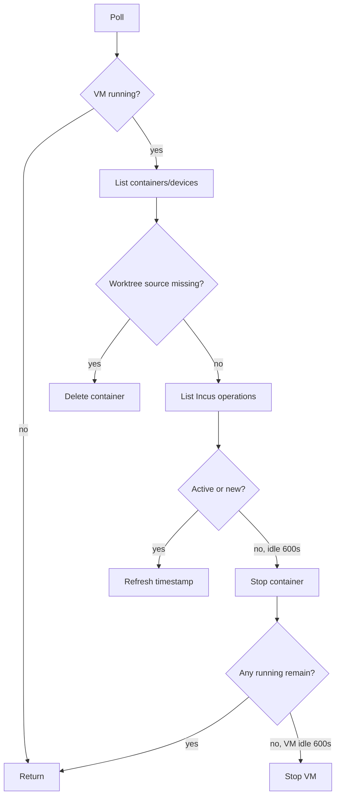

# Observed-State Idle Janitor Is Not Desired-State Reconciliation

Locki's daemon periodically stops idle containers, deletes containers whose projected worktree path disappeared, and powers down the VM after all containers remain stopped. This is useful resource hygiene. It is not a desired-state controller: there is no durable intent record, ownership-fenced plan, operation lease, or positive storage-health proof before destructive action.

> [!summary]
> - The current mechanism is an idle/orphan janitor and should be named that way.
> - “No running Incus operation” is an activity heuristic, not proof that a sandbox is unused.
> - Missing worktree paths can mean deletion or transient unmounted storage; future remote projections make the distinction safety-critical.
> - Explicit removal and janitor cleanup have different consequences: orphan deletion bypasses scoped-cache cleanup.
> - A reconciler requires desired records, ownership evidence, storage health, operation leases, idempotent plans, and durable observations.

## Why this note exists

Calling a periodic cleanup loop “reconciliation” overstates its contract and encourages new destructive behavior to depend on weak evidence. The current code was written for local Lima paths where `exists()` is usually meaningful. A PVE/NFS/virtiofs port introduces transient storage unavailability that can look identical to deletion.

The Garden should preserve both truths: the janitor is established useful behavior, and promoting it to a controller requires a stronger law.

## Current janitor

Constants in `cmd/internal.py` define 600-second container idle timeout, 600-second VM idle timeout, and 60-second polling.

`_cleanup_once`:

1. returns if the VM is not `Running`;
2. loads last-active timestamps;
3. lists Incus containers;
4. maps each container's `worktree` device source to a path;
5. deletes the container when that source resolves under `WORKTREES` but no longer exists;
6. lists running Incus operations and marks referenced containers active;
7. stops running containers idle past the timeout;
8. when none remain running, starts/reads a VM-idle timer and stops the VM after another timeout.



## What it does well

- frees resources automatically for an interactive developer tool;
- uses Incus device source to correlate orphan containers with worktrees;
- persists soft idle timestamps across daemon restarts;
- fails cleanup exceptions into logs rather than killing the daemon;
- avoids starting the VM merely to inspect stopped state;
- keeps user worktrees when stopping containers/VM.

These properties justify retaining the janitor while designing a stronger controller.

## Why it is not reconciliation

A desired-state reconciler compares:

```text
desired resource records
+ authoritative ownership
+ live provider observations
+ active operation leases
+ policy/clock
-> plan
-> idempotent effects
-> new observations/evidence
```

The janitor has observations and a clock. It lacks the other inputs.

### No desired state

There is no durable record saying a sandbox/container should exist, remain running, expose a service, or be retained while idle.

### No operation lease

Cleanup can race entry, provisioning, hook re-entry, endpoint publication, or removal. File locks cover selected setup operations, not the whole aggregate.

### Weak activity evidence

A background server may have no current Incus operation and still be intentionally serving. An active exposure is not considered.

### Absence ambiguity

`Path.exists()==false` can mean user deletion, unmounted NFS/virtiofs, provider failure, permission error, or stale path mapping.

### Incomplete ownership cleanup

Explicit `ContainerService.remove` deletes container and scoped cache. Janitor orphan deletion calls `incus delete` directly and leaves scoped cache behind.

## Replacement law

> **Stop or delete only from explicit desired intent or retention policy, matching ownership evidence, positive storage-health and expected-mount identity, and absence of a conflicting fenced operation lease. Missing paths, unreachable providers, or absence of an Incus operation alone never authorize destruction.**

For destructive action $a$ on resource $r$:

$$
Permit(a,r)\Rightarrow
owner(r)=s
\land storageHealthy(s)
\land noConflictingLease(s)
\land policyRequires(a,r).
$$

Contradictory or unavailable evidence yields `Unknown/Degraded`, not deletion.

## Target records

```go
type SandboxDesired struct {
    SandboxID SandboxID
    Workspace WorkspaceID
    Retention RetentionPolicy
    DesiredRuntime DesiredRuntimeState
    DesiredExposures []ExposureID
    Revision uint64
}

type OperationLease struct {
    SandboxID SandboxID
    Token LeaseToken
    Kind OperationKind
    Generation uint64
    ExpiresAt time.Time
}
```

Provider observations remain replaceable evidence. Desired records and ownership attestations remain controller-owned.

## Reconciliation plan

```text
read desired + ownership + lease + storage health + provider observations
 -> if contradictory/unavailable: Degraded, no destructive effect
 -> derive typed plan
 -> validate ownership again at effect boundary
 -> apply idempotent action
 -> record observation/outcome
```

Read-time repair is a separate policy choice. Diagnostics may report drift without mutating. If reads reconcile, they use the same mutation lock/lease as explicit commands.

## Behavioral contract

```text
R1. Provider unreachability never implies resource absence.
R2. Missing projected paths authorize deletion only with positive storage-health and mount-identity evidence.
R3. Every resource mutation verifies ownership attestation.
R4. Active operation leases fence janitor/reconciler effects.
R5. Explicit desired/retention policy selects stop/delete actions.
R6. Cleanup consequences are identical whether explicit or reconciled: runtime, cache, endpoint, metadata ownership paths compose consistently.
R7. Background-service/exposure policy is explicit.
R8. Plans/actions are idempotent and retryable.
R9. Contradictions become degraded/unknown evidence, not optimistic cleanup.
R10. Durable user work is never deleted by infrastructure convergence.
```

## Reconciliation theory

A controller repeatedly applies a function:

$$
plan:Desired\times Observed\times Evidence\to Actions.
$$

Convergence requires that applying a plan moves observed state toward desired state under stable external conditions:

$$
distance(Observed',Desired)<distance(Observed,Desired)
$$

or reports a stable blocked/degraded reason. A janitor instead evaluates a retention heuristic over observations and time. Both are useful, but they prove different things.

Safety dominates liveness for destructive actions:

```text
better: retain an orphan temporarily under uncertain storage
worse: delete the only runtime evidence because a mount disappeared
```

## Pattern vocabulary

- **Janitor / Garbage Collector:** removes resources inferred unreachable/unneeded by heuristic.
- **Reconciler / Controller:** drives observed state toward explicit desired state.
- **Lease / Fencing Token:** active operation prevents stale/destructive concurrent effects.
- **Failure Detector:** activity/storage observations can be incomplete or uncertain.
- **Ownership Attestation:** proves controller authority over a resource incarnation.
- **Tombstone / Desired Removal:** explicit intent that distinguishes deletion from observation loss.
- **Idempotent Plan:** retries do not create duplicate/destructive drift.

## Why tempting alternatives fail

### Rename the loop reconciler without adding state

Naming does not create desired state, leases, ownership, or safe absence interpretation.

### Treat missing path as deletion intent

Remote/shared filesystems can disappear transiently. Positive storage health is required.

### Treat no operation as idle

Long-running background services may be idle by operation count while serving traffic.

### Let each adapter clean its adjacent files

It fragments ownership and recreates the current scoped-cache mismatch.

### Stop the VM as soon as no containers run

Startup churn increases and pending provisioning/exposures may be interrupted; retention policy should decide.

## Failure modes and tricky details

1. Concurrent entry versus idle stop.
2. Hook re-entry waits while janitor stops the container.
3. Endpoint serving is invisible to operation-based activity.
4. Provider JSON/list failure becomes empty observations.
5. NFS/virtiofs unmount looks like deleted worktree.
6. VM idle timestamp survives unusual manual lifecycle paths.
7. Direct Incus deletion leaves scoped cache.
8. External operator changes PVE/Incus resources outside controller records.
9. Resource ID reuse targets a new incarnation without ownership marker.

## Testing and verification

- Force every observation source unavailable; assert no destructive action.
- Unmount projection while resources exist; assert Degraded, no metadata/container deletion.
- Race entry/provision/hook/exposure/remove against janitor under operation leases.
- Background-service and exposure retention cases.
- Ownership-negative PVE/Incus mutation tests.
- Idempotent replay of partial cleanup plans.
- Explicit remove and reconciled remove produce equivalent owned cleanup.
- Stale generation/lease cannot stop replacement resources.
- Model finite state with desired, observed, storage health, lease, ownership, and time; check no unsafe delete.

## Applicability

Use the current janitor for same-principal local development where best-effort idle cleanup is acceptable and paths are local/reliable. Use the stronger reconciler when resources move to remote/shared providers, external operators can mutate them, or destructive convergence must be auditable.

Do not infer business/user intent solely from provider observations.

## Candidate ecosystem guidance

1. Name janitors and reconcilers accurately.
2. Keep desired state distinct from observation.
3. Fence destructive actions with ownership and leases.
4. Require positive health before interpreting absence.
5. Compose complete owned cleanup through subsystem ports.
6. Preserve contradictions as evidence.
7. Prefer safe retention under uncertainty.

## Open questions

- Should active endpoints suppress idle stop automatically?
- Where should desired/lease/ownership records live?
- Are reads diagnostic or reconciling?
- Which external PVE/Incus changes can be adopted versus rejected?
- What retention policy balances resource cost and interactive startup?

## Evidence and references

- `src/locki/cmd/internal.py:43-126,287-302`
- `src/locki/services/container.py:228-237`
- `src/locki/services/worktree.py:379-416`
- `src/locki/cmd/remove.py:26-84`
- `src/locki/services/vm.py:67-75,187-202`
- [[Research/Software Architecture Garden/locki/README|Architecture Garden — Locki]]
- [[Research/Software Architecture Garden/devctl/03 - Reconciliation and the Shared Operator Boundary|Reconciliation and the Shared Operator Boundary]]
- [[Research/Software Architecture Garden/devctl/02 - Durable State Process Identity and Wrapper Evidence|Durable State, Process Identity, and Wrapper Evidence]]
