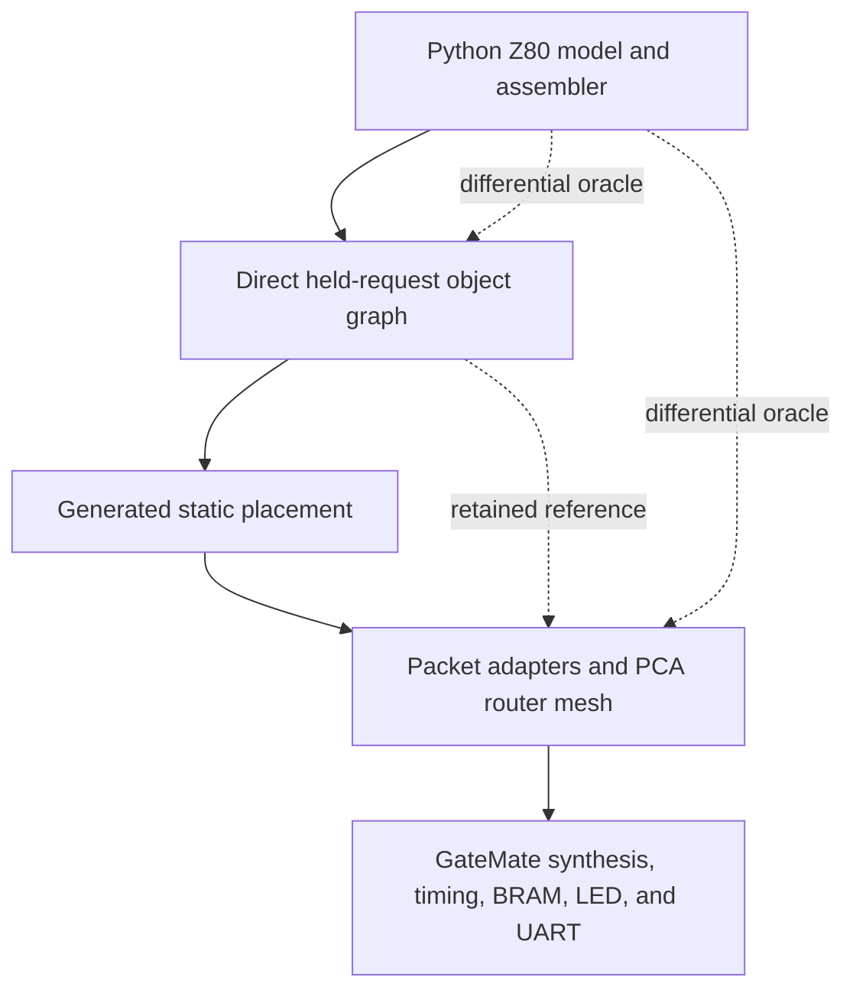

# Architecture Garden — PCA-Z80

PCA-Z80 is an FPGA research project that decomposes a Z80-compatible processor into independently addressed RTL objects and then replaces their proven direct bus with deterministic placement and request/response transport over a static router mesh. The project is useful to the Software Architecture Garden because it exposes design forces that software-only studies often hide: acknowledgement has physical timing, representation width affects routability, generated topology becomes an elaboration contract, and verification must cross model, RTL, synthesized primitives, place-and-route, and board observation.

This directory is a **research seed**, not a finished pattern collection. Its purpose is to give tomorrow's intern researchers a bounded set of expressive pattern studies, a shared evidence protocol, and explicit warnings against turning every coding idiom into a peer-level pattern.

> [!summary]
> - The study begins from six expressive patterns rather than a flat catalog of dozens of RTL details.
> - Supporting mechanisms such as held requests, capture-once state, flattened ports, sticky indicators, and BRAM checks belong under those patterns as tactics, idioms, or evidence checks.
> - Every finished entry must connect repository evidence to primary external research and must distinguish observed failures from theoretical risks.
> - The target writing style is foundational, concrete, diagram-rich, and free of analogies or filler.
> - The pinned code snapshot is `c07e700652732cd7264af6e2473eb1c6e1f20cc9`; researchers must record any later snapshot explicitly rather than silently mixing revisions.

## Snapshot identity

| Field | Value |
|---|---|
| Repository | `/home/manuel/code/wesen/2026-08-28--pca-gatemate` |
| Remote | `git@github.com:wesen/2026-08-28--pca-gatemate.git` |
| Branch | `main` |
| Pinned commit | `c07e700652732cd7264af6e2473eb1c6e1f20cc9` |
| Commit subject | `Docs: record static mesh Obsidian publication` |
| Commit date | `2026-08-29T00:02:20-04:00` |
| Worktree at seed creation | Clean |
| Board | Olimex GateMateA1-EVB, CCGM1A1 |
| Production mesh | 3×2 endpoints, 43-bit packets, 10 MHz |

The pinned commit is the common comparison base. An intern may study a descendant commit, but the entry must state the exact commit and explain why it differs from this seed.

## What the project contains

The project has four architectural layers.



### Reference model and firmware tools

`pca_z80/tools/z80_model.py` supplies the independent execution oracle. `zasm.py` assembles real programs and can emit a complete padded ROM image. This layer lets researchers ask whether a failure belongs to processor semantics before investigating RTL timing or routing.

### Direct object graph

`z80_core.sv` connects one decode master to PC, memory/I/O, register, ALU, and flags objects through a held-request bus. Only the selected object acknowledges. This path is retained as the reference implementation.

### Static mesh path

`placer.py` maps the six objects to generated coordinates. `z80_mesh_adapter.sv` translates bus transactions to packets and back. `pca_router.sv`, `pca_cell.sv`, and `pca_mesh.sv` carry requests and responses through exact XY routing. `z80_mesh_core.sv` composes the generated endpoints and unchanged objects.

### Physical GateMate path

`top.sv` selects direct or mesh elaboration. The Makefile builds firmware, synthesis JSON, primitive netlists, routed configuration, and bitstreams. Post-synthesis tests prove initialized block RAM executes. Physical UART capture proves the mesh-backed processor emits `Hi` through the RP2040 bridge.

## Why the pattern catalog is deliberately small

A useful design pattern describes:

1. a recurring problem;
2. competing forces;
3. a structural solution;
4. invariants that make the solution work;
5. consequences and failure modes;
6. evidence that the structure is more than an attractive name.

A local coding shape does not automatically satisfy that standard. The following are valuable, but they belong below the pattern level:

- holding `req` until `ack` is a protocol idiom;
- using a `captured` bit is an exactly-once tactic;
- flattening packed arrays is a tool-compatibility idiom;
- a sticky LED is an observability tactic;
- checking BRAM `INIT_*` is a verification check.

The Garden should retain these details because they make patterns implementable. It should not present them as thirty independent architectural ideas.

## The six research patterns

### 1. Contract-Preserving Transport Substitution

The project replaces a direct interconnect with packet transport while retaining the decode FSM, object request/response contract, and five slave implementations. The research question is not simply whether an adapter exists. It is which contract remains invariant while transport, latency, addressing, and physical structure change.

Research brief: [[Research/Software Architecture Garden/pca-z80/guidelines/01 - Contract-Preserving Transport Substitution]].

### 2. End-to-End Semantic Completion

Network delivery, object execution, response return, and CPU completion are distinct events. The design works because architectural acknowledgement occurs only after the entire semantic operation completes. This pattern contains held requests, capture-once behavior, request draining, response validation, protocol errors, and conservation counters as supporting tactics.

Research brief: [[Research/Software Architecture Garden/pca-z80/guidelines/02 - End-to-End Semantic Completion]].

### 3. Generated Spatial Architecture

A logical object graph becomes validated placement input, canonical output, generated SystemVerilog constants, and endpoint wiring. The expressive pattern is compilation from architectural graph to deterministic spatial configuration—not merely generating a package.

Research brief: [[Research/Software Architecture Garden/pca-z80/guidelines/03 - Generated Spatial Architecture]].

### 4. Synthesis-Shaped Representation

The representation must satisfy logical semantics and physical tool constraints. Registered complete-depth ROM enables BRAM inference and initialization. Reducing unused endpoints and coordinate width turns a logically correct but unroutable mesh into a physical bitstream. Types, widths, and topology are therefore physical architecture decisions.

Research brief: [[Research/Software Architecture Garden/pca-z80/guidelines/04 - Synthesis-Shaped Representation]].

### 5. Evidence-Ladder Hardware Development

The project proves behavior through progressively more expensive evidence: software model, direct RTL, mesh RTL, generated netlist inspection, primitive simulation, place-and-route, JTAG load, LED, and physical UART capture. Each stage isolates a different failure class. The pattern is the design of an evidence ladder, not any one testbench.

Research brief: [[Research/Software Architecture Garden/pca-z80/guidelines/05 - Evidence-Ladder Hardware Development]].

### 6. Bounded-Concurrency Microarchitecture

The CPU permits one end-to-end transaction in flight. That restriction removes transaction IDs, response reordering, queues, and multi-response arbitration. The project exchanges throughput for a smaller correctness and physical-design surface. The research must explain when such deliberate serialization is an architectural advantage and when it becomes a scaling limit.

Research brief: [[Research/Software Architecture Garden/pca-z80/guidelines/06 - Bounded-Concurrency Microarchitecture]].

## Supporting subentries

All tactics, idioms, checks, and failure studies use one shared guideline:

[[Research/Software Architecture Garden/pca-z80/guidelines/00 - Shared Research and Subentry Guidelines|Shared Research and Subentry Guidelines]].

Likely supporting subentries include:

| Category | Candidate subentries |
|---|---|
| Protocol idioms | Held-request handshake; capture-once slave; setup-or-advance master; request drain before response |
| Interconnect tactics | One-hot ack mux; bus-to-packet envelope; local endpoint port; exact XY route |
| Generation idioms | Canonical placement JSON; generated scalar coordinate package; stale-artifact check |
| Synthesis idioms | Registered inferred ROM; complete physical image; flattened packed vectors; coordinate-width budgeting |
| Observability tactics | Sticky event witness; selectable diagnostic output; protocol-error output; conservation counters |
| Verification checks | Model differential; primitive INIT inspection; post-synthesis execution; dual-CDC physical capture |
| Failure studies | ALU write-like response data; ignored parameter override; 67-bit routing congestion; stale bitstream confusion |

A subentry should be created only when it has enough implementation detail, failure evidence, or cross-project relevance to teach independently. Otherwise it remains a section inside its parent pattern.

## Planned output structure

Tomorrow's research should create entries under a stable hierarchy:

```text
pca-z80/
├── index.md
├── guidelines/
│   ├── 00 - Shared Research and Subentry Guidelines.md
│   ├── 01 - Contract-Preserving Transport Substitution.md
│   ├── 02 - End-to-End Semantic Completion.md
│   ├── 03 - Generated Spatial Architecture.md
│   ├── 04 - Synthesis-Shaped Representation.md
│   ├── 05 - Evidence-Ladder Hardware Development.md
│   └── 06 - Bounded-Concurrency Microarchitecture.md
├── designs/
│   ├── 01 - Contract-Preserving Transport Substitution.md
│   ├── 02 - End-to-End Semantic Completion.md
│   ├── 03 - Generated Spatial Architecture.md
│   ├── 04 - Synthesis-Shaped Representation.md
│   ├── 05 - Evidence-Ladder Hardware Development.md
│   └── 06 - Bounded-Concurrency Microarchitecture.md
├── idioms/
│   └── NN - <Supporting Idiom>.md
├── checks/
│   └── NN - <Verification Check>.md
└── sources/
    ├── SOURCES.md
    └── <archived primary sources when redistribution permits>
```

The `designs/`, `idioms/`, `checks/`, and `sources/` outputs are planned; this seed creates only the index and research guidelines.

## Mandatory research workflow

Every researcher follows the shared guideline, but the project sequence is:

1. Pin the repository commit and record worktree state.
2. Read this index and the assigned pattern brief.
3. Read design-doc 06 and the relevant implementation files completely.
4. Trace at least one concrete transaction, build, or failure from entry to observable outcome.
5. Inspect focused tests before making architectural claims.
6. Search for primary external sources and at least one credible comparison implementation.
7. Archive source provenance in `sources/SOURCES.md`.
8. Run or reproduce one bounded experiment where practical.
9. Draft in textbook style: foundation, problem, concrete path, invariant, failure, reuse boundary.
10. Label maturity conservatively and identify open correctness obligations.
11. Cross-review another pattern for vocabulary collisions and hidden duplication.
12. Validate frontmatter, links, diagrams, commands, source locators, and repository status.

## Required distinctions

Every finished study must preserve these distinctions:

- A bus request is not a packet.
- Packet delivery is not object completion.
- Object completion is not architectural completion until the response returns.
- Static logical placement is not runtime LUT relocation.
- A placement timing estimate is not a routed timing result.
- BRAM allocation is not proof of BRAM contents.
- A configured FPGA is not proof that firmware executed.
- Physical UART output is stronger evidence than a sticky internal event, but it does not prove every Z80 opcode.
- One project can establish a local candidate; ecosystem guidance requires comparison.

## Primary local evidence map

| Topic | Start here |
|---|---|
| Full mesh narrative | `ttmp/.../design-doc/06-pca-z80-static-mesh-architecture-and-gatemate-hardware-validation.md` |
| Normative transport contract | `ttmp/.../design-doc/05-static-placer-and-mesh-transport-contract.md` |
| Hardware BRAM/UART evidence | `ttmp/.../design-doc/03-gatemate-firmware-rom-bram-and-uart-bring-up-intern-guide.md` |
| Chronological failures | `ttmp/.../reference/01-investigation-diary.md`, Steps 29–36 |
| Object bus | `pca_z80/rtl/z80_obj.sv`, `z80_core.sv` |
| Packet and routers | `pca_types.sv`, `pca_router.sv`, `pca_mesh.sv` |
| Adapters | `z80_mesh_adapter.sv` |
| Mesh composition | `z80_mesh_core.sv` |
| Placement | `config/z80_objects.json`, `tools/placer.py`, `sim/test_placer.py` |
| Differential verification | `sim/run_mesh_integ.py`, `sim/test_mesh_integ.py` |
| Board build | `rtl/top.sv`, `Makefile`, `sim/tb_post_synth.sv` |
| Reproducible experiments | ticket scripts 15–20 |

## Maturity at seed creation

| Pattern | Initial maturity | Reason for caution |
|---|---|---|
| Contract-Preserving Transport Substitution | Candidate ecosystem pattern | Strong local implementation; external comparison not yet written |
| End-to-End Semantic Completion | Candidate ecosystem pattern | Strong transaction evidence; malformed/reset paths need deeper directed testing |
| Generated Spatial Architecture | Established locally | Deterministic generation and tests pass; optimizer/general topology scope is narrow |
| Synthesis-Shaped Representation | Established locally | Multiple measured failures and a routed result; device/tool specificity must be separated from general rule |
| Evidence-Ladder Hardware Development | Candidate ecosystem pattern | Strong local ladder; comparison with verification literature and another hardware project is required |
| Bounded-Concurrency Microarchitecture | Established locally | One-in-flight behavior is explicit and tested; broader applicability depends on workload constraints |

These are starting labels for investigation, not conclusions that interns must defend.

## Expected textbook style

Each entry should teach one central idea. It should begin with the engineering problem and why it matters, then introduce the concrete implementation. Prose should develop the argument in complete paragraphs. Code, traces, tables, equations, and diagrams should supply evidence rather than decorate the page.

Do not use analogies. Explain hardware in hardware terms: state, events, fields, clocks, routes, arbitration, latency, side effects, timing, resources, and observations. Do not write “the router acts like a traffic cop.” Show the router state machine and explain which transition owns acknowledgement.

## Related project knowledge

- [[Projects/2026/08/28/ARTICLE - PCA-Z80 - Static Mesh Architecture and GateMate Hardware Validation|PCA-Z80 static mesh deep dive]]
- [[Projects/2026/08/28/ARTICLE - PCA-Z80 - Firmware BRAM and Physical UART on GateMate|PCA-Z80 firmware BRAM and UART deep dive]]
- [[Projects/2026/08/25/PROJ - MATE-16 VM CPU on the GateMateA1-EVB|MATE-16 VM CPU on GateMate]]
- [[Research/Software Architecture Garden/README|Software Architecture Garden]]

## Seed completion state

This seed is complete when the index and seven research briefs exist, validate as Obsidian Markdown, and are committed together. It does not claim that tomorrow's pattern studies have already been researched or written.
