# Architecture Garden — Pinocchio

Pinocchio is an application-level inference orchestration and adaptation layer. It discovers declarative prompt commands, resolves layered application configuration, asks Geppetto to resolve engine settings and execute inference, translates Geppetto observations into chat-specific protobuf events, installs Pinocchio projections over Sessionstream, persists chat materializations and turn snapshots, and exposes CLI, JSONL, TUI, HTTP/WebSocket, React, and Goja surfaces.

The central architectural fact is an authority split rather than a package inventory. Geppetto owns provider-neutral turns, engines, tool-loop/session execution, cancellation propagation/cooperation, generic profile resolution, and the reusable renewable-bearer mechanism. Sessionstream owns command routing, event ordinals, delegated event-log persistence, projection plumbing, hydration, and the snapshot/fanout WebSocket protocol. Pinocchio owns application configuration, runtime overlays, chat vocabulary, observation translation, stop/replacement policy, HTTP route/adapter composition, and application credential binding.

> [!summary]
> - One inference authority feeds several application projections without transferring provider authority to UI or transport code.
> - Typed chat schemas, explicit translation, terminal handling, snapshot/live consumption, and normalized turn persistence are established locally.
> - Active wiring delegates canonical chat-event append/replay to Sessionstream's SQLite store; in-memory mode is process-lifetime, while a file DSN is restartable.
> - Behavior-incomplete commands, unenforced idempotency, missing authorization, incomplete runtime fingerprints, and unresolved profile tools remain open.

## Snapshot identity and evidence

| Field | Value |
|---|---|
| Repository | `/home/manuel/code/wesen/go-go-golems/pinocchio` |
| Remote | `git@github.com:go-go-golems/pinocchio.git` |
| Branch | `main` |
| Commit | `bccccf7d57368be4bde1fef545fb20dce5f24e4e` |
| Commit date | `2026-08-09T17:44:54-04:00` |
| Commit subject | `Merge pull request #191 from go-go-golems/fix/profile-registry-chain-search` |
| Worktree | Clean; committed `HEAD` only |
| Module dependencies | Geppetto `v0.13.7`; Sessionstream `v0.1.0`, resolved with `GOWORK` unset |
| Analysis scope | CLI/RPC/TUI/web/Goja ingress, runtime composition, event translation, projections, cancellation, persistence, browser boundary, CI/release |

Evidence includes `AGENTS.md`, runtime source and tests, protobuf and generated TypeScript boundaries, SQLite stores, frontend consumers, CI/build/release files, and current architecture/tutorial prose. Module-cache Geppetto and Sessionstream source was inspected only to establish imported authority boundaries. No live provider inference, OAuth login, benchmark, or downstream application audit was performed. Stale browser paths and event names in documentation are treated as architecture debt; active source and tests decide current behavior.

Focused validation at this snapshot passed with `GOWORK=off go test ./pkg/chatapp/... ./pkg/inference/runtime ./pkg/cmds/profilebootstrap ./pkg/persistence/chatstore ./cmd/web-chat/internal/appserver ./cmd/web-chat/internal/runtime ./cmd/pinocchio/cmds -count=1`. From the pinned dependency module roots, `GOWORK=off go test ./pkg/sessionstream ./pkg/sessionstream/hydration/sqlite ./pkg/sessionstream/transport/ws -count=1` and `GOWORK=off go test ./pkg/inference/session ./pkg/inference/engine/factory ./pkg/steps/ai/credentials ./pkg/steps/ai/credentials/oauth -count=1` also passed. `python3 .pi/skills/architecture-garden-analysis/scripts/validate_garden_entry.py "Research/Software Architecture Garden/pinocchio/README.md"` reported `26 wikilinks, 0 errors, 0 warnings`; exact-heading resolution and `git diff --check` passed. Frontend Vitest is not included in these completion claims.

## Architecture and runtime path

```mermaid
flowchart LR
    B[Browser prompt and selected profile] --> H[Pinocchio HTTP handler]
    H --> R[Profile and app runtime composer]
    R --> C[Sessionstream typed command]
    C --> P[Pinocchio chat handler]
    P --> G[Geppetto Session and Engine]
    G --> O[Geppetto observations]
    O --> T[Pinocchio protobuf event translator]
    T --> S[Sessionstream projections]
    S --> D[Hydrated timeline]
    S --> L[Live UI event]
    D --> W[Snapshot then live WebSocket]
    L --> W
    W --> X[React adapters and cards]
```

### Browser prompt to provider and back

1. `WebChatProviderShell` configures `@go-go-golems/chat-provider` with session URLs, selected profile, and Pinocchio timeline adapters (`cmd/web-chat/web/src/features/web-chat/WebChatProviderShell/WebChatProviderShell.tsx:15-94`). `POST /api/chat/sessions` creates a UUID session (`cmd/web-chat/internal/appserver/routes_sessions.go:34-49`).
2. `WebChatApp` calls `client.send(prompt)`. `HandleSessionRoutes` dispatches the `messages` action; `handleSubmitMessage` validates the prompt, resolves the requested runtime, and calls `Service.SubmitPromptRequest` (`cmd/web-chat/web/src/features/web-chat/WebChatApp/WebChatApp.tsx:35-69`; `cmd/web-chat/internal/appserver/routes_sessions.go:51-130`).
3. `canonicalRuntimeResolver.Resolve` chooses profile and registry, consumes Geppetto's `ResolvedEngineProfile`, asks Pinocchio's `RequestResolver` for app policy/fingerprint, and invokes `ProfileRuntimeComposer.Compose` (`cmd/web-chat/internal/runtime/canonical_resolver.go:29-77`; `cmd/web-chat/internal/profiles/resolver.go:58-190`). The composer clones settings, resolves middleware, creates the Geppetto engine, applies tool-result reorder and system-prompt middleware, and returns a host-owned `ComposedRuntime` (`cmd/web-chat/internal/runtime/composer.go:54-145`).
4. `SubmitPromptRequest` creates `requestID`, stores the full nonserializable `PromptRequest`—including `*ComposedRuntime` and callbacks—in `Engine.pending`, then submits protobuf `StartInferenceCommand{Prompt, RequestId, IdempotencyKey}` as `ChatStartInference` (`pkg/chatapp/service.go:59-84`; `pkg/chatapp/chat.go:49-61,210-237`). The typed command is therefore not behavior-complete across a crash, retry, or process boundary.
5. `handleStartInference` validates the payload, removes the pending request, publishes `ChatUserMessageAccepted`, cancels and waits for any prior run in the Sessionstream session, creates a cancellable outer run, and starts `runPrompt` (`pkg/chatapp/runtime_inference.go:21-58`). Pinocchio's mutex-protected `active` map owns stop/replacement policy and is the cross-request single-run guard.
6. `runRuntimeInference` publishes `ChatRunStarted`, creates `runtimeEventSink`, creates a Geppetto `Session` using the Sessionstream ID, installs `enginebuilder.Builder`, obtains an initial or latest stored turn, appends the prompt, calls `Session.StartInference`, and waits (`pkg/chatapp/runtime_inference.go:66-149`). Inside `Session.StartInference`, Geppetto creates the execution handle and child cancellation context; it owns turn mutation, inference identity, provider/tool execution, and cooperative cancellation propagation (`geppetto@v0.13.7/pkg/inference/session/session.go:189-239`).
7. `runtimeEventSink.PublishEvent` maps Geppetto provider, text, error, interrupt, reasoning, and tool observations to Pinocchio protobuf events (`pkg/chatapp/runtime_sink.go:30-94`). `Engine.publish` sends each event to Sessionstream (`pkg/chatapp/runtime_inference.go:280-289`). Translation names application observations; it does not transfer provider effect authority.
8. On stop, `Service.Stop` submits `ChatStopInference`, whose handler cancels the active run (`pkg/chatapp/service.go:102-110`; `pkg/chatapp/runtime_inference.go:49-54`). The completion path uses `context.WithoutCancel` so terminal evidence may publish after work cancellation (`pkg/chatapp/runtime_inference.go:145-193`). The sink closes active text once and records terminal state under a mutex (`pkg/chatapp/runtime_sink.go:72-116,184-209`). Protocol and stop tests cover error/interrupt/late-finish combinations (`pkg/chatapp/runtime_sink_protocol_test.go:23-143`; `pkg/chatapp/chat_test.go:355-548,622`).
9. Sessionstream appends each admitted Pinocchio chat event before projection, then invokes Pinocchio UI and timeline projectors registered by `chatapp.Install` (`sessionstream@v0.1.0/pkg/sessionstream/hub.go:483-494`; `pkg/chatapp/chat.go:98-157`). `newHydrationStore` always returns Sessionstream's SQLite `Store`, which implements `EventStore`: its `sessionstream_events` table accepts only identical duplicates at one `(session, ordinal)` and supports ordered replay (`cmd/web-chat/internal/appserver/hydration.go:12-40`; `sessionstream@v0.1.0/pkg/sessionstream/hydration/sqlite/store.go:23-28,357-455`). The default in-memory DSN retains the log only for the process; a file DSN makes event replay and rebuilt timeline materializations restartable. The base timeline fold turns user acceptance and text start/patch/finish/failure into `ChatMessageEntity`; plugins add reasoning, tools, and agent mode (`pkg/chatapp/projections.go:12-137`; `pkg/chatapp/features.go:9-91`).
10. Separately, final Geppetto turns can be transactionally normalized into `turns`, content-addressed `blocks`, and ordered membership rows (`pkg/persistence/chatstore/turn_store_sqlite.go:63-132,228-375`). Timeline hydration and turn storage are distinct persistence families with no shared transaction or cut.
11. `Server.NewServer` composes and mounts Sessionstream's WebSocket snapshot provider and live fanout; Sessionstream implements the snapshot/fanout protocol (`cmd/web-chat/internal/appserver/server.go:30-78`). Integration tests establish snapshot-plus-live behavior at this consumer seam (`cmd/web-chat/internal/appserver/server_test.go:205`). Pinocchio's browser adapters then translate backend values into presentation mutations and cards (`cmd/web-chat/web/src/features/web-chat/extensions/pinocchio-timeline-adapters/pinocchioTimelineAdapters.ts:70-291`; `cmd/web-chat/web/src/features/web-chat/WebChatApp/WebChatApp.tsx:35-182`). Protocol tests cover protobuf-JSON oneof shape, snapshot normalization, dynamic payload unwrapping, and safe ordinal conversion (`cmd/web-chat/web/src/ws/protocol.test.ts:31-105`).

JSONL/stdin RPC and TUI/chat modes converge on the `chatapp` application kernel: those adapters instantiate `chatapp.NewRunner` (`pkg/cmds/cmd.go:850-890,950-974`). Ordinary blocking execution can instead call `runBlocking` directly (`pkg/cmds/cmd.go:580-608`). `pinocchio js` builds a go-go-goja runtime and registers Geppetto/Pinocchio native modules without entering `chatapp` (`cmd/pinocchio/cmds/js.go:142-230,320-360`). These direct paths compose over Geppetto plus Pinocchio bootstrap rather than typed chat events and projections. Stdin RPC cancellation and serialized concurrent JSONL writes have focused tests (`pkg/cmds/cmd_rpc_stdin_test.go:145`; `pkg/chatapp/rpc/jsonl/writer_test.go:61`).

### Profile and Goja authority

`ResolveRuntimePlan` begins with Pinocchio defaults, consumes Geppetto's resolved engine settings and stack lineage, reads the versioned `pinocchio/webchat_runtime@1` extension, and applies ordered app overlays (`pkg/inference/runtime/runtime_plan.go:53-139`; `pkg/inference/runtime/profile_runtime.go:18-53`). Later nonblank prompts replace earlier prompts; middleware merges by `(name,id)`; tools use ordered union or replace. This operation is intentionally order-sensitive.

`pinocchio js` builds a trusted local go-go-goja host, registers generic `geppetto` and narrow `pinocchio` modules, and optionally installs turn storage (`cmd/pinocchio/cmds/js.go:142-239,265-388`). Pinocchio exposes resolved defaults and host-approved overrides; Geppetto owns generic agents, sessions, tools, and engine APIs (`pkg/js/modules/pinocchio/module.go:36-91`). Pinocchio binds the selected OAuth profile, token store, and refresher; Geppetto's `credentials.NewRenewableBearerTokenSource` supplies the reusable renewal mechanism (`pkg/cmds/profilebootstrap/oauth.go:74-111`). The resulting bearer capability stays in Go, and tests assert it is absent from both JS modules (`cmd/pinocchio/cmds/js_test.go:76-135`). Scripts can access process environment and files, so this is a trusted-local-script boundary, not an untrusted sandbox.

## Authority and state map

| Object | Authority owner | Identity/revision | Durable? | Must not be confused with |
|---|---|---|---|---|
| Runtime selection | Pinocchio config/profile bootstrap | Registry/profile/version | Config/store | Composed engine capability |
| Resolved engine settings | Geppetto profile resolver | Stack lineage/version | Derived | App prompt/middleware/tools |
| Composed runtime | Pinocchio host | Runtime key/fingerprint | No | Serializable command or exact identity |
| Start command | Pinocchio/Sessionstream | Session + request ID; optional idempotency key | No command store | Full execution authority |
| Pending request | Pinocchio `Engine.pending` | Request ID | Process-local | Durable replay record |
| Inference turn/run | Geppetto | Turn and inference IDs | Optional turn snapshot | Chat event or timeline entity |
| Chat occurrence event | Pinocchio translator + Sessionstream event store | Session + ordinal | Process-lifetime in memory; restartable with file DSN | Independently Pinocchio-owned event store |
| Timeline materialization | Pinocchio projector + hydration store | Kind/ID + created/last ordinal | Memory/SQLite | Geppetto turn or PBUI mount |
| Turn snapshot | Pinocchio chat store | Conversation/session/turn/phase/time | Optional SQLite | Timeline prefix cut |
| Browser projection | ChatProvider and adapters | Entity kind/ID | Browser lifetime | Backend canonical state |
| Credential capability | Pinocchio binding + Geppetto renewable source | Provider/profile selection | External/local secret store | JS/profile data |

`requestID`, `IdempotencyKey`, Sessionstream ordinal, Geppetto inference ID, run/message ID, profile version, runtime fingerprint, and WebSocket connection ID are different coordinates. A profile registry resolves configuration; it does not authorize profile use, credential use, tool execution, or session access.

## Candidate common vocabulary

| Proposed term | Project-local name | Invariant | Nearby ecosystem names | Difference retained |
|---|---|---|---|---|
| **Runtime selection plan** | resolved profile + `ResolvedRuntimePlan` | Config-derived description before effect capabilities are allocated. | Typed plan/profile stack | Current `ComposedRuntime` is not serializable plan data. |
| **Composed inference capability** | `ComposedRuntime` | Host-owned engine, middleware, registry/executor, and sink wrapper. | Interpreter/runtime | Must not cross wire or stand for profile identity. |
| **Observation translator** | `runtimeEventSink` | Maps library observations into app event vocabulary. | Adapter/event bridge | May lose detail and does not own inference. |
| **Chat occurrence event** | `Chat*` event | Sessionstream appends the typed lifecycle occurrence before projection. | Canonical event | Persistence authority is delegated; in-memory mode is not restart-durable. |
| **Hydrated timeline materialization** | `TimelineEntity` | Query/render state reported with a declared snapshot ordinal. | Projection/read model | The SQLite reads do not prove a transactionally consistent prefix cut; this is not a turn or PBUI mounted occurrence. |
| **Inference turn snapshot** | stored `Turn` | Accumulated provider-neutral state for resume/debug. | Checkpoint/snapshot | No atomic cut with timeline hydration. |
| **Redacted runtime projection** | runtime fingerprint | Diagnostic projection excluding secrets. | Coordinate/digest | Not behavior-complete today. |
| **Host-only credential capability** | `BearerTokenSource` | Renewable credential never becomes JS data. | Capability | Selection data is not the capability itself. |

## Mathematical and computer-science foundations

### 1. Ordered projection fold

For session $s$, let $E_s$ be the set of admitted Pinocchio chat-event values and $T_s$ the set of valid timeline states. Histories are finite words in $E_s^*$, and the session projector has type $\operatorname{fold}_s:T_s\times E_s^*\to T_s$. For $t\in T_s$ and $x,y\in E_s^*$:

$$
\operatorname{fold}_s(t,xy)
=
\operatorname{fold}_s(\operatorname{fold}_s(t,x),y).
$$

Text append patches concatenate while snapshot/replace patches reset content (`pkg/chatapp/projections.go:120-137`). Reversing events can change the message, so the fold is not commutative. Sessionstream's SQLite store retains the ordered event word and supports replay/rebuild; file-backed mode preserves it across restart, while the default in-memory mode does not.

### 2. Scope-indexed state and terminal transitions

Intended global chat state decomposes by Sessionstream ID as $S=\prod_s S_s$. Distinct sessions should modify disjoint components; no authorization conclusion follows. Within one session a run follows

$$Idle\to Running\to Finished+Stopped+Failed.$$

Protocol tests support the safety goal that normal Geppetto behavior yields one terminal event and no open text segment. Liveness is not established against an engine that ignores context, and the sink does not reject every possible late post-terminal plugin event.

### 3. Ordered runtime overlay

Let $\oplus$ denote Pinocchio app-runtime overlay. Later prompts override, middleware replaces by `(name,id)`, and union-mode tools preserve first occurrence while deduplicating. Thus $\oplus$ is not commutative: profile lineage order carries authority (`pkg/inference/runtime/runtime_plan.go:110-139,188-267`). Tool-name union is idempotent for duplicate names, but this does not make tool execution idempotent.

### 4. Fingerprint as a non-injective projection

Let $R$ be the set of complete runtime inputs and $J$ the set of JSON fingerprint values. `BuildRuntimeFingerprintFromSettings` implements a projection $F:R\to J$ over profile version, runtime key, prompt, middleware, tools, and inference metadata (`pkg/inference/runtime/runtime_plan.go:142-170`). Equal full inputs imply equal projections, but

$$F(x)=F(y)\not\Rightarrow x\text{ and }y\text{ execute equivalently}.$$

`InferenceSettings.GetMetadata()` includes API type, model/engine, base URL, max-response tokens, top-p, temperature, and other configured inference metadata (`geppetto@v0.13.7/pkg/steps/ai/settings/settings-inference.go:175-200`). Non-injectivity remains because the fingerprint excludes the host credential capability, engine-factory/provider implementation, middleware implementation versions and build dependencies, plus `ComposedRuntime.Registry`, `ToolExecutor`, and sink wrapper. It is a redacted diagnostic projection, not behavior-complete cache identity or reproducibility proof.

### 5. Two unbound snapshot cuts

A Sessionstream snapshot reports a **declared snapshot ordinal** $n$ and entity rows. The SQLite store reads its cursor and entity rows in separate queries without a read transaction (`sessionstream@v0.1.0/pkg/sessionstream/hydration/sqlite/store.go:192-235`), so a concurrent apply can return rows newer than $n$; a database-consistent event-prefix cut is not proved. Sessionstream's WebSocket ordering still sends that snapshot before buffered/live frames, but transport ordering does not repair the store-level cut. A turn snapshot at `(phase,time)` serializes one accumulated Geppetto turn, and no equation binds it to $n$. Consumers must not treat either family or nearby timestamps as a database-consistent global cut.

## Correlation with the Pattern Zoos

| Pinocchio evidence | Zoo relation | Strength and boundary |
|---|---|---|
| Protobuf start/stop commands handled by host code | [[Transcripts/Research/10 - PBUI-MATHS Pattern Zoo Handbook#Pattern 5 — Command as Data|PBUI 5 — Command as Data]] | **Partial.** Runtime capability remains in a process-local side map. |
| Concrete protobuf registrations, generated Go/TS, schema guard | [[Transcripts/Research/10 - PBUI-MATHS Pattern Zoo Handbook#Pattern 8 — Serializable Semantic Contract|PBUI 8 — Serializable Semantic Contract]] | **Partial.** Concrete payload contracts are strong, but dynamic payloads and hidden runtime keep the end-to-end contract open. |
| Geppetto observations translated into chat events and browser mutations | [[Transcripts/Research/10 - PBUI-MATHS Pattern Zoo Handbook#Pattern 6 — Explicit Translation|PBUI 6 — Explicit Translation]] | **Adjacent.** Named, tested boundary adapters exist, but there is no PBUI semantic-reference graph, direct-membership relation, path provenance, selection, or coherence law. |
| Session ID indexes active run, projection, hydration, and fanout | [[Transcripts/Research/10 - PBUI-MATHS Pattern Zoo Handbook#Pattern 10 — Scoped Runtime and Context|PBUI 10 — Scoped Runtime and Context]] | **Partial.** Runtime scoping is strong, but routes have no principal/tenant guard and scope does not establish security. |
| Runtime plan interpreted into settings, middleware, engine, and fingerprint | [[Transcripts/Research/09 - RAG-MATHS Pattern Zoo#Pattern 4 — Typed Plans and Multiple Interpreters|RAG 4 — Typed Plans and Multiple Interpreters]] | **Partial.** The command does not carry the plan and tool execution is incomplete. |
| Finished/stopped/failed event families and protocol matrix | [[Transcripts/Research/09 - RAG-MATHS Pattern Zoo#Pattern 5 — Explicit Outcomes and Observation Algebra|RAG 5 — Explicit Outcomes and Observation Algebra]] | **Partial.** Observable outcomes exist, but there is no total outcome-return API or combine algebra. |
| Sessionstream-backed append/replay and ordered Pinocchio chat projections | [[Transcripts/Research/09 - RAG-MATHS Pattern Zoo#Pattern 7: Append-Only Events, Pure Reducers, and Observable Idempotence|RAG 7 — Append-Only Events, Pure Reducers, and Observable Idempotence]] | **Partial.** Append, ordered replay, and rebuild exist through delegated Sessionstream storage; stable command-redelivery identity and idempotent admission do not. |
| Open profile/session/WebSocket routes | [[Transcripts/Research/09 - RAG-MATHS Pattern Zoo#Pattern 12 — Authorization Dominates Disclosure|RAG 12 — Authorization Dominates Disclosure]] | **Negative evidence.** The local/example server does not establish authorization domination. |

A `ChatMessageEntity` and browser card are not PBUI semantic/mounted occurrences because no separate mount occurrence identity/lifecycle is modeled. A runtime plan is not an experiment coordinate, and neither snapshot family is an immutable release root.

## Cross-project comparison

| Project | Shared invariant | Grade and retained difference |
|---|---|---|
| [[Research/Software Architecture Garden/geppetto/README|Geppetto]] | Typed turns, sessions, tools, and observations feed application behavior | **Partial.** The dependency boundary is direct, but Geppetto performs inference while Pinocchio chooses app policy and translates outcomes. |
| [[Research/Software Architecture Garden/sessionstream/README|sessionstream]] | Command/event/projection schemas, session ordinals, and snapshot/live consumption | **Strong.** Pinocchio directly reuses the substrate; as a downstream consumer it is not independent proof of substrate concurrency laws. |
| [[Research/Software Architecture Garden/rag-evaluation-system/README|rag-evaluation-system]] | Trusted Go/Goja host interprets inspectable intent | **Partial.** RAG actions are serializable presentation actions; Pinocchio commands trigger inference and hide runtime capability in process. |
| [[Research/Software Architecture Garden/go-go-datadrop/README|go-go-datadrop]] | Generated/structural contracts and React adapter registries | **Partial.** DataDrop verbs are presentation affordances; Pinocchio events are chat occurrences across inference/session boundaries. |
| [[Research/Software Architecture Garden/rag-ttc/README|rag-ttc]] | Provider adapters, policy/mechanism separation, interruption handling | **Adjacent.** rag-ttc coordinates reproducible experiments; Pinocchio coordinates live conversations without exact runtime identity or durable command replay/idempotent admission. |

## Pattern maturity assessment

| Pattern or law | Maturity | Evidence or limitation |
|---|---|---|
| App orchestration around library-owned inference | **Candidate ecosystem pattern** | Reused by CLI/web/TUI/JS; independent host-effect correspondence exists. |
| Geppetto observation to typed chat event translation | **Established** | Named adapter and terminal protocol tests. |
| Live and hydrated chat projections | **Established** | Established locally as a Sessionstream consumer through projection, WebSocket, restart, and browser adapter tests. |
| Profile-first settings/middleware composition | **Established** | Runtime-plan and profile-bootstrap tests. |
| Typed protobuf schema admission | **Established** | Concrete registrations, generated Go/TS, schema guard. |
| Host-only renewable credentials | **Established** | Go-only injection and negative JS-surface tests. |
| Canonical occurrence with purpose-specific projections | **Candidate ecosystem pattern** | Strong implementation stack; needs independent non-Sessionstream confirmation. |
| Behavior-complete command data | **Architecture debt** | `requestID` indexes process-local capability/callback state. |
| Profile tool execution and exact runtime identity | **Open correctness obligation** | Composer retains names/fingerprint but does not populate registry/executor; fingerprint metadata is not behavior-complete. |
| Delegated chat-event append/replay | **Established** | Established locally as a Sessionstream consumer: SQLite append, identical-duplicate checks, ordered replay, and rebuild exist; default memory mode is process-lifetime. |
| Idempotent command admission and authorization | **Open correctness obligation** | No key enforcement or route policy; event-log replay does not make command handling idempotent. |

## Architecture debt and open laws

### Commands crossing retry boundaries must be behavior-complete

Current `StartInferenceCommand` cannot reconstruct `ComposedRuntime`; its `RequestId` indexes `Engine.pending`. A crash, delay, retry, or multi-process router can lose the capability. Either carry a reconstructable versioned `RuntimeSelection` or name the API as same-process immediate submission and reject unsupported delivery modes.

### Idempotency keys need an admission law

`IdempotencyKey` is copied into protobuf and never consulted. For one session and accepted key $k$, duplicate submission must return the same admitted run/outcome or an explicit conflict—not create another run. This requires durable or explicitly process-scoped key ownership and argument binding.

### Cancellation needs bounded liveness and terminal quarantine

Pinocchio owns replacement policy and waits synchronously on `previous.done`; Geppetto owns cancellation propagation and depends on engine/tool cooperation. A non-cooperative engine can therefore block Pinocchio command handling indefinitely. Specify a timeout/abandonment outcome. After one terminal run event, late provider/plugin events should be ignored or quarantined; the current sink tracks terminal state but does not reject all later types.

### Cross-effect outcomes must remain separate

Event publication, hydration, WebSocket fanout, and turn persistence do not share a transaction. A terminal timeline row and final turn may disagree after partial failure. APIs should expose each coordinate/outcome and define reconciliation rather than imply exactly-once completion.

### Runtime identity and profile tools need completed authority

The runtime fingerprint includes inference metadata but omits behavior-relevant authorities and implementation identity. The web composer normalizes declared tool names but does not populate `ComposedRuntime.Registry` or `ToolExecutor` (`cmd/web-chat/internal/runtime/composer.go:54-145`; `pkg/inference/runtime/composer.go:28-43`). Widen/version the fingerprint before using it as identity, and resolve tool names to authorized host capabilities or reject them before inference.

### Authorization must dominate disclosure and effects

`webapp.NewMux` mounts profile, session, mutation, snapshot/export, and WebSocket routes without authentication middleware (`cmd/web-chat/internal/webapp/routes.go:21-38`). Session UUIDs and profile registries are not security boundaries. Production reuse requires principal/tenant policy on every read, mutation, credential, and tool path.

Documentation debt includes obsolete frontend architecture paths, stale event names and `Struct` claims, tutorial path drift, and a README binary link aimed at Geppetto releases. Browser CI runs typecheck/lint but not existing Vitest tests.

## Implications for composable APIs

1. Replace hidden pending runtime coupling with a versioned `RuntimeSelection` reference when work can cross retry/process boundaries.
2. Return a run handle carrying distinct session, request, run, inference, turn, and event coordinates plus cancel/wait operations.
3. Model `Finished | Stopped | Failed | Rejected` explicitly, including turn-persistence and timeline coordinates.
4. Brand identities and ordinals in TypeScript; string interchange currently hides category errors.
5. Generate browser payload decoders by schema name and declare unknown-event policy.
6. Resolve profile tool names into authorized host capabilities before provider advertisement.
7. Name recovery semantics explicitly: `submitLocal`, `snapshotThenLive`, `waitTerminal`, and `resumeFromTurn` promise different laws.

## Candidate ecosystem patterns

1. **Application orchestration around library-owned inference** — product policy and transports vary while one library retains provider/tool/session semantics.
2. **Canonical occurrence, purpose-specific projections** — one admitted occurrence feeds live and hydrated views without either projection becoming effect authority.

The first has independent host-owned-effect support but different object families. The second currently uses Sessionstream and Pinocchio as one implementation stack; promotion needs an independent substrate/consumer pair.

## Recommended next investigations

1. Add idempotency, late-terminal, and non-cooperative cancellation tests.
2. Decide whether profile tool names are executable policy and complete the authority path accordingly.
3. Define behavior-complete runtime identity and reconcile stale browser/API documentation.

## Related studies

- [[Research/Software Architecture Garden/README|Software Architecture Garden]]
- [[Research/Software Architecture Garden/geppetto/README|Geppetto]]
- [[Research/Software Architecture Garden/sessionstream/README|sessionstream]]
- [[Research/Software Architecture Garden/rag-evaluation-system/README|rag-evaluation-system]]
- [[Research/Software Architecture Garden/go-go-datadrop/README|go-go-datadrop]]
- [[Research/Software Architecture Garden/rag-ttc/README|rag-ttc]]
- [[Transcripts/Research/09 - RAG-MATHS Pattern Zoo|RAG-MATHS Pattern Zoo]]
- [[Transcripts/Research/10 - PBUI-MATHS Pattern Zoo Handbook|PBUI-MATHS Pattern Zoo Handbook]]
