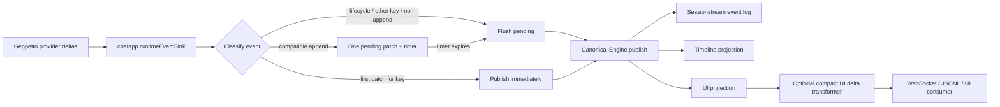

# Immediate-First Ordered Stream Coalescing

Interactive streams have two competing requirements. The first useful output should become visible immediately, but publishing every provider fragment as a canonical event can multiply persistence writes, projection work, WebSocket frames, decoder activity, and browser renders. Pinocchio's chatapp runtime addresses this with an immediate-first, fixed-window coalescer placed before canonical publication.

The reusable design is broader than chat text. It applies when several append-only logical streams share one ordered event channel and lifecycle events must not overtake buffered data. Pinocchio uses it for assistant text, reasoning text, and streamed tool-call arguments.

> [!summary]
> - Publish the first patch for each logical stream immediately, then coalesce compatible append patches inside a fixed time window.
> - Keep one ordered pending slot at the shared publication boundary so independently timed streams cannot reorder globally observed events.
> - Flush before lifecycle events, non-append patches, terminal events, and cross-stream transitions.
> - Preserve the first offset and concatenated payload while adopting the latest sequence and correlation metadata.
> - Treat batching as a trace refinement: patch boundaries may change, but accumulated semantic content and lifecycle order must not.

## Why this note exists

Pinocchio originally batched only `EventTextDelta` values. Reasoning and tool-call argument plugins published one canonical patch for every Geppetto delta. Compact UI payloads reduced bytes per frame but did not reduce event count, canonical timeline writes, or projection frequency.

Commit `43c7e644365f5bcfa289482146629ac575ea3a62` generalized the runtime sink to all three append-only patch classes. Commit `f62433690ddfb222d78cdf9004476baf0ab3baaa` added user-facing documentation. This note extracts the invariant and tradeoffs so the structure can be evaluated independently of Pinocchio's protobuf names.

## Pattern statement

Use **immediate-first ordered stream coalescing** when a producer emits frequent append-only fragments into one ordered event path and consumers need both low first-output latency and fewer downstream events.

For each logical stream:

1. publish its first fragment immediately;
2. retain the next fragment in one bounded time window;
3. merge subsequent compatible fragments in arrival order;
4. publish the pending aggregate when the window expires or an ordering boundary arrives;
5. never let a later stream or lifecycle event overtake an earlier pending aggregate.

The pattern deliberately does not promise one output event per input fragment. It promises semantic accumulation equivalence, bounded batching delay under scheduler assumptions, and preserved publication order at declared flush boundaries.

## Concrete Pinocchio architecture



The placement before `Engine.publish` is essential. If coalescing happened only in the WebSocket adapter, canonical persistence and timeline projection would still process provider-frequency events. If it happened inside each plugin, text, reasoning, and tool streams could run independent timers and publish in timer-expiration order rather than provider-event order.

### Configuration boundary

`StreamPatchBatchConfig` stores one interval on the chatapp `Engine`. `WithStreamPatchBatching(interval)` enables the behavior; a non-positive interval disables it. The older `WithTextPatchBatching` option delegates to the generalized option.

The first-patch guarantee is per logical key, not merely per protobuf type:

| Patch class | Key |
|---|---|
| assistant text | `text:` plus text message ID |
| reasoning | `reasoning:` plus reasoning message ID |
| tool arguments | `tool-arguments:` plus tool-call ID |

A new text segment, reasoning segment, or tool call therefore gets immediate first output even when another stream previously used the batcher.

### Plugin publication boundary

Reasoning and tool-call patches are created by chat plugins. `RuntimeEventContext.Publish` is supplied by the runtime sink rather than pointing directly to `Engine.publish`. This lets plugins retain ownership of domain translation while the host owns publication policy.

The separation is:

```text
plugin:
    Geppetto event -> typed canonical payload

runtime sink:
    typed canonical payload -> immediate, pending, merged, or flushed publication

engine/sessionstream:
    admitted canonical event -> persistence and projections
```

The batcher recognizes only explicit supported payload types. A custom plugin does not become batchable merely because it publishes frequently.

## State machine

The runtime sink contains one ordered pending slot and one timer. A compact abstract state is:

```text
State = {
    firstSent: Set<StreamKey>,
    pending: None | (EventName, StreamKey, Patch),
    timerGeneration: Integer,
    error: None | Error
}
```

For one incoming append patch `(name, key, patch)`:

```text
if interval <= 0 or patch is not append:
    flush pending
    publish patch
else if pending belongs to another key:
    flush pending

if key not in firstSent:
    firstSent.add(key)
    publish patch immediately
else if pending is empty:
    pending = clone-or-owned patch
    arm fixed-window timer
else:
    merge pending with patch
```

For a non-batchable runtime event:

```text
flush pending
publish lifecycle/provider/error event
```

Timer callbacks and provider publication share `publishMu`. The timer also carries a generation number. Detaching or replacing a pending patch increments the generation, so a stale timer callback observes that it no longer owns the pending generation and returns without publication.

## Behavioral contract

### Immediate first output

For every logical stream key $k$, the first admitted patch is published synchronously on its event path. The configured interval does not add first-patch latency.

This is important for interactive systems because time to first visible output often dominates perceived responsiveness even when total generation time is unchanged.

### Fixed, not trailing-edge, window

The second patch starts the timer. Additional compatible patches do not reset it. This is fixed-window batching, not trailing-edge debounce.

Under continuous input, a trailing-edge debounce might never publish until generation pauses. A fixed window bounds how long the pending aggregate waits:

$$
0 \le d_{batch} \lesssim \Delta + d_{scheduler} + d_{publish},
$$

where $\Delta$ is the configured interval. The relation is approximate because Go timers and goroutine scheduling are not real-time guarantees.

### Append-only compatibility

Only append-mode patches coalesce. Snapshot, replace, unspecified, unknown, or type-incompatible values force an ordered flush and direct publication.

The law is conservative: never guess how to merge a patch mode whose algebra has not been declared.

### Merge law

Suppose pending append patch $p$ has offset $o_p$, payload fragment $x$, and sequence $s_p$. A compatible next patch $q$ has fragment $y$ and sequence $s_q$.

The merge is:

$$
p \diamond q
= (o_p, xy, s_q, corr_q).
$$

Pinocchio therefore:

- retains the first pending patch's offset;
- concatenates text or arguments in arrival order;
- stores the latest sequence;
- stores the latest correlation metadata.

Changing the offset to $q$'s offset would be incorrect because the aggregate payload begins where $p$ began.

### Lifecycle fencing

Before a segment finish, tool-call request, provider finish, error, interrupt, or other non-delta event is published, the sink flushes pending data. Therefore consumers cannot observe a lifecycle boundary before all earlier accepted fragments represented by the pending patch.

### Cross-stream ordering

If reasoning patch $r$ is pending and tool argument patch $a$ arrives for another key, publication is:

$$
r < a.
$$

The batcher flushes $r$, then immediately publishes $a$ as the first patch for its key. Independent per-key timers would not supply this global order without an additional sequencer.

### Error propagation

A timer-triggered publication cannot return an error directly to the provider's earlier call. The sink stores the first asynchronous batching error. The next provider event checks and returns that error.

This is a practical compromise, not transactional rollback. A host that needs immediate asynchronous failure notification should add an explicit error channel or supervisor outcome rather than relying only on the next input event.

## Trace refinement model

Let $D^*$ be finite provider-delta histories and $P^*$ be finite canonical patch histories. Define semantic accumulation for append patches:

$$
A(p_1p_2\ldots p_n)=payload(p_1)payload(p_2)\cdots payload(p_n).
$$

The batcher implements a partitioning transformation $B_\Delta:D^*\to P^*$ over adjacent compatible fragments. The primary content law is:

$$
A(B_\Delta(h))=A(h).
$$

Event count may decrease:

$$
|B_\Delta(h)|\le |h|.
$$

For one key, sequence metadata on each aggregate names the last input delta represented by that aggregate. Across keys and lifecycle events, the transformation preserves the declared observable order after pending fragments are expanded.

This is a trace refinement rather than event identity preservation. Input and output histories are not the same word. They are related by an abstraction that forgets internal fragment boundaries while retaining accumulated content and fences.

## One pending slot versus one slot per stream

A single pending slot is a deliberate design choice.

### Advantages

- Preserves one global publication order without a second merge sequencer.
- Makes lifecycle flushing unambiguous.
- Keeps timer ownership and error handling small.
- Bounds pending payload state to one aggregate per runtime sink.

### Cost

Interleaving keys reduces batching efficiency. If a provider alternates reasoning and two tool calls, each key transition flushes the previous pending aggregate. A map of per-key pending buffers could coalesce more aggressively, but then timer callbacks need a global sequence discipline to prevent reordering.

A multi-buffer generalization should assign an admission coordinate to every pending aggregate and publish ready aggregates only when all earlier coordinates are ready or explicitly flushed. Without that law, higher batching throughput trades away observable order.

## Batching versus compact delivery

Pinocchio also supports compact UI-event transformation:

```text
ChatTextPatch          -> ChatTextDelta
ChatReasoningPatch     -> ChatReasoningDelta
ChatToolArgumentsPatch -> ChatToolArgumentsDelta
```

These optimizations operate at different boundaries.

| Optimization | Changes | Does not change |
|---|---|---|
| stream patch batching | canonical patch count and boundaries | accumulated semantic content and lifecycle order |
| compact UI projection | UI payload field set and serialized size | canonical backend payload and timeline entity schema |

Using only compact deltas reduces bytes per frame but leaves provider-frequency canonical writes and frames. Using only batching reduces frame count but retains rich UI payload fields. Applications may use both.

## Failure modes

### Treating batching as debounce

If implementers reset the timer on every fragment, continuous output can be delayed indefinitely. The required behavior is a fixed window after the first pending patch.

### Independent timers reorder events

Per-stream timers can publish a later stream before an earlier pending stream. Use one ordered pending slot or add an explicit global sequence/release algorithm.

### Lifecycle overtakes buffered content

Publishing finish/request/error events directly while a patch is pending produces impossible client states: a segment appears finished and then receives more content. Flush before every non-delta event.

### Incorrect aggregate offset

Updating offset during merge causes clients to apply the full aggregate at the final fragment's position. Preserve the aggregate's starting offset.

### Concatenating non-append modes

Snapshot and replace modes have different algebras. Concatenating them silently corrupts state. Only merge modes with an explicit associative operation.

### Assuming event count is semantic

Metrics, tests, and clients that count one event per provider token break under coalescing. Consumers should validate final accumulated content, sequence coverage, lifecycle order, and latency—not raw patch cardinality.

### Forgetting end-of-run drainage

A timer-owned patch must be flushed by provider finish, segment finish, tool request, terminal event, or an explicit sink close. Otherwise a run can complete with accepted content still waiting in memory.

### Hidden mutable payload ownership

The current sink mutates the pending protobuf message while merging. This assumes ownership transferred to the sink and no concurrent reader retains the same message. A more open API should clone on admission or document ownership transfer explicitly.

## Applicability

Use this pattern when:

- input fragments are append-only or have another explicitly associative merge operation;
- several logical streams share one ordered downstream channel;
- immediate first output matters;
- a small bounded latency increase can reduce event, persistence, transport, or rendering cost;
- lifecycle boundaries must fence prior data;
- downstream consumers care about semantic accumulation rather than fragment identity.

Typical applications include:

- language-model text and reasoning streams;
- incremental tool-call JSON arguments;
- terminal log chunks before status transitions;
- collaborative text operation bundles when operation composition is lawful;
- progress samples where aggregation preserves the intended observation semantics.

## Non-applicability

Do not use this pattern when:

- every fragment is audit evidence requiring independent identity;
- individual fragment timestamps are part of the domain truth;
- the merge operation is not associative or loses required metadata;
- the consumer requires exactly one output per input for flow control;
- the latency budget is below timer/scheduler variability;
- streams may reorder independently and no global ordering law exists;
- correctness requires durable admission before acknowledging the producer, but the pending buffer is only memory-resident.

For financial events, authorization decisions, or irreversible effect receipts, preserve each canonical event and batch only a downstream projection.

## Testing strategy

Pinocchio's protocol tests assert the key laws:

- first text patch is immediate;
- later text patches merge and publish on timer expiry;
- first reasoning patch is immediate;
- reasoning payload, latest sequence, and first offset survive merge;
- tool arguments merge;
- tool request flushes pending arguments;
- a cross-stream transition flushes earlier reasoning before immediate tool output;
- text finish flushes pending text first.

The next validation layer should compare live decoded WebSocket frames against hydrated timeline state. A complete acceptance test should prove:

```text
accumulate(live compact patches) == final timeline content
lifecycle order is valid
no rich patch leaks when compact delivery is configured
frame count decreases under representative provider fragmentation
first-patch latency does not regress materially
```

Concurrency tests should also exercise timer expiry racing with lifecycle flush, publication failure, cancellation, and multiple interleaved tool-call IDs.

## Review checklist

When implementing the pattern elsewhere, ask:

```text
What is the logical stream key?
Which patch modes have a lawful merge operation?
Is the first output immediate per key?
Is the window fixed or accidentally trailing-edge?
Which events are flush fences?
Can timer callbacks reorder globally observed events?
Which metadata comes from the first fragment and which from the last?
Who owns the pending payload memory?
How is asynchronous publication failure surfaced?
What drains pending data at shutdown or terminal completion?
Do tests assert semantic equivalence rather than event cardinality?
```

## Maturity assessment

The pattern is **Documented** rather than Adopted.

Evidence is strong within Pinocchio:

- one implementation covering three stream patch classes;
- focused timer, merge, lifecycle, and cross-stream tests;
- full repository tests and pre-commit validation;
- one downstream CoinVault integration configured at 25 ms;
- explicit consumer documentation.

The pattern is not yet independently validated across another implementation, and live frame-rate/latency measurements remain pending. Promotion to Validated should require operational evidence or an independent second implementation with the same invariants.

## Candidate ecosystem guidance

1. **Optimize event rate at the earliest shared boundary whose semantics permit coalescing.** Later transport batching cannot reduce earlier persistence and projection work.
2. **Separate semantic events from fragment boundaries.** Append fragments may be coalesced only when their accumulation is the preserved meaning.
3. **Make lifecycle events flush fences.** Completion cannot overtake accepted buffered content.
4. **Preserve global order explicitly when streams interleave.** Independent timers are not an ordering mechanism.
5. **Keep first-output latency separate from steady-state event rate.** Immediate-first publication and fixed-window accumulation optimize different parts of the experience.
6. **Document batching and compact payloads as different transformations.** One changes event boundaries; the other changes projection payload shape.

## Evidence and references

### Pinocchio source

- `pkg/chatapp/chat.go:77-96` — generalized configuration and compatibility alias.
- `pkg/chatapp/runtime_sink.go:45-115` — publication serialization, error check, delta classification, and lifecycle flush.
- `pkg/chatapp/runtime_sink.go:117-185` — stream-key routing, immediate-first policy, cross-key flush, pending admission, and merge fallback.
- `pkg/chatapp/runtime_sink.go:187-230` — append-mode admission and payload-specific merge laws.
- `pkg/chatapp/runtime_sink.go:232-280` — timer generation, detach, flush, and canonical publication.
- `pkg/chatapp/features.go:47-61` — plugin publication routed through the host-owned sink.
- `pkg/chatapp/runtime_sink_protocol_test.go:157-260` — executable behavioral evidence.
- `docs/chatapp-stream-patch-batching.md` — integration and consumer documentation.

### Commits

- `43c7e644365f5bcfa289482146629ac575ea3a62` — implementation.
- `f62433690ddfb222d78cdf9004476baf0ab3baaa` — Pinocchio documentation.

### Related Garden material

- [[Research/Software Architecture Garden/pinocchio/README|Architecture Garden — Pinocchio]]
- [[Research/Software Architecture Garden/sessionstream/README|Architecture Garden — sessionstream]]
- [[Research/Software Architecture Garden/sessionstream/designs/02 - Typed Transition Systems and Trace Algebra|Typed Transition Systems and Trace Algebra]]
