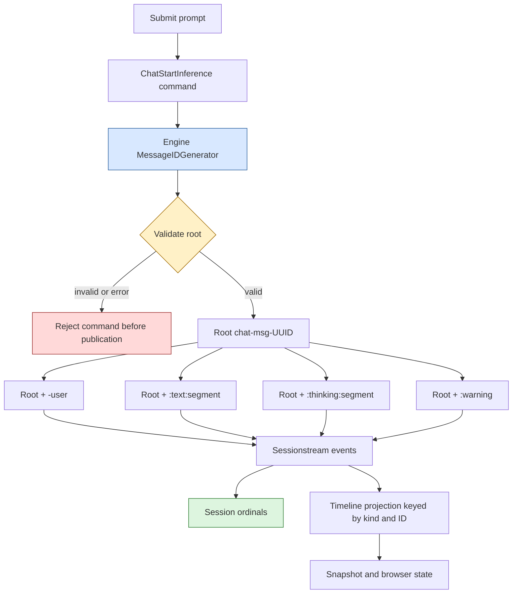
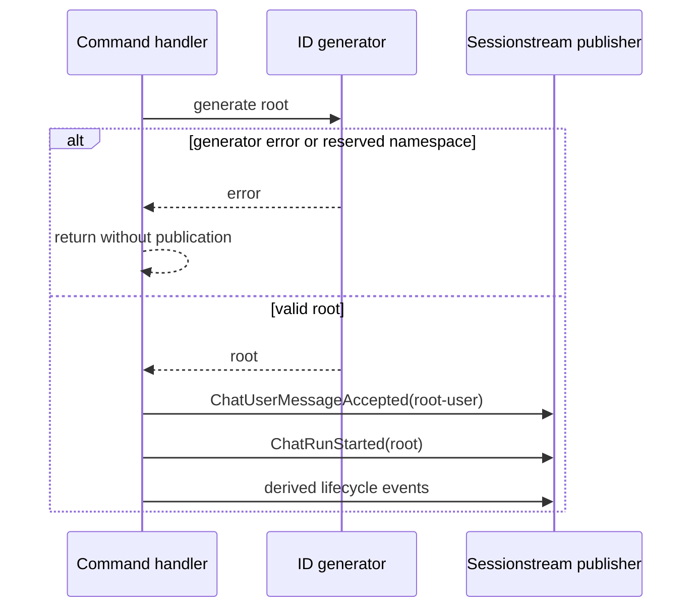

# Restart-Safe Aggregate Identity and Disjoint Derived Namespaces

Persistent event-driven applications must distinguish logical identity from event order. Pinocchio chat messages are logical aggregates assembled from user acceptance, inference lifecycle, assistant text, reasoning, warning, and tool events. Sessionstream ordinals order those events, but they do not by themselves provide a stable aggregate identity that can be allocated before publication and retained across every derived entity.

The implemented design replaces a process-local counter with an engine-scoped generator whose default output is `chat-msg-{uuid-v4}`. It also reserves every structural namespace used to derive child message IDs. The result remains correct when a process restarts, when several replicas submit into the same durable session, and when tests or applications inject a custom identity policy.

> [!summary]
> - Sessionstream ordinals define event order; Pinocchio message IDs define logical aggregate membership.
> - Process-local counters are invalid when persisted state outlives the allocator or several allocators share one store.
> - Random UUID roots remove persistence and replica coordination from allocation.
> - Root uniqueness is not sufficient: roots and deterministically derived child IDs must occupy disjoint namespaces.
> - Generator failure or invalid output is rejected before the first event, preventing partially identified aggregates.

## Why this note exists

Pinocchio previously allocated roots as `chat-msg-1`, `chat-msg-2`, and so on using an integer stored on `chatapp.Engine`. A canonical timeline could persist longer than that engine. After restart, the next engine returned to `chat-msg-1`, while the hydrated timeline still contained entities derived from earlier uses of the same root.

Timeline projections are keyed by entity identity. Reusing a root did not merely create a confusing label: it caused new events to update earlier projected entities. The visible result was that a newly submitted user bubble could disappear and the assistant stream could appear inside the previous response.

The failure is a general architecture problem:

```text
durable state lifetime > allocator lifetime
or
allocator count > 1

therefore
process-local sequence != durable unique identity
```

The initial correction introduced UUID roots and an injectable generator. Review then exposed a second invariant. A custom generator could return unique roots `x` and `x:thinking:1`; the second root would equal a reasoning entity already derived from the first. The final design therefore protects both root uniqueness and root/child namespace separation.

## Identity coordinates

Pinocchio and Sessionstream carry several string or numeric coordinates. They are related, but they answer different questions.

| Coordinate | Question answered | Owner | Ordering semantics |
|---|---|---|---|
| Session ID | Which conversation namespace contains this work? | Application / Sessionstream | None |
| Event ordinal | Where does one admitted event occur in the session history? | Sessionstream | Total order within one session |
| Root message ID | Which logical chat aggregate does this lifecycle belong to? | Pinocchio chatapp | None |
| Derived message ID | Which projected child entity belongs beneath the root? | Pinocchio chatapp/plugins | None |
| Request ID | Which in-process prompt submission carries runtime state? | Pinocchio service | None |
| Idempotency key | Should repeated submission represent one admission? | Application policy | None |
| Provider/segment/tool ID | Which provider-level operation or child stream emitted this event? | Geppetto/provider/tool runtime | Provider-local |

The central working rule is:

> [!important]
> Use ordinals for chronology and opaque IDs for identity. Never infer display order, recency, or causality from UUID text.

## Architecture



Allocation belongs inside the command handler, immediately before the first `ChatUserMessageAccepted` event. It does not belong in the HTTP service because commands may be submitted or replayed without that service instance. It does not belong in the persistence store because aggregate identity does not require a transactional sequence.

The simplified path is:

```go
messageID, err := engine.newMessageID()
if err != nil {
    return err
}

publish(ChatUserMessageAccepted{
    MessageId: messageID + "-user",
})

startInference(messageID)
```

Every subsequent event receives the root or a derived identity. Sessionstream independently assigns ordinals as events are admitted.

## Why ordinals do not replace message IDs

An event ordinal is unique within a session and could theoretically seed a message ID. Doing so would require the store to reserve an ordinal before the logical aggregate is constructed:

```text
ordinal = store.reserve()
root = formatRoot(ordinal)
publish first event at reserved ordinal
```

That design introduces a reservation protocol and couples chat construction to a particular persistence authority. It must define gaps after failed reservations, retry behavior, replica coordination, and whether external command producers may allocate identities before opening a store.

More importantly, one message spans several events. The first event ordinal names one occurrence, while the message ID names the aggregate shared by user, run, text, reasoning, warning, and application projection records.

UUID allocation preserves the authority split:

```text
Pinocchio generator  -> logical aggregate identity
Sessionstream store  -> admitted event order
Projection           -> materialized state keyed by identity
```

## Generator API

The engine exposes a per-instance seam:

```go
type MessageIDGenerator func() (string, error)

func WithMessageIDGenerator(generate MessageIDGenerator) Option
```

The default is deliberately small:

```go
func defaultMessageIDGenerator() (string, error) {
    return "chat-msg-" + uuid.NewString(), nil
}
```

The error-returning signature supports deterministic fault tests and external generators that may fail. `uuid.NewString()` itself has no operational error path, but the interface does not assume that every future policy is an in-process random UUID.

Generator injection is engine-scoped rather than package-global. This provides deterministic tests without cross-test mutation and allows separately configured engines to coexist. A custom generator must be concurrency-safe because one engine can receive commands concurrently.

Tests use a mutex-protected sequence:

```go
func deterministicGenerator() MessageIDGenerator {
    var mu sync.Mutex
    next := 0

    return func() (string, error) {
        mu.Lock()
        defer mu.Unlock()
        next++
        return fmt.Sprintf("chat-msg-%d", next), nil
    }
}
```

This retains readable exact relationship assertions without restoring sequential semantics to production.

## Disjoint derived namespaces

Root IDs are not the only keys in the timeline. Pinocchio deterministically derives message entities:

| Derived entity | Construction | Root restriction |
|---|---|---|
| User message | `root + "-user"` | Root must not end in `-user` |
| Text segment | `root + ":text:" + segment` | Root must not contain `:text:` |
| Reasoning segment | `root + ":thinking:" + segment` | Root must not contain `:thinking:` |
| Warning message | `root + ":warning"` | Root must not end in `:warning` |

Suppose root generator outputs are unique but otherwise unrestricted:

```text
run A root:       x
run A reasoning:  x:thinking:1
run B root:       x:thinking:1
```

Run B's root-keyed failure entity can overwrite run A's reasoning entity. Root uniqueness holds, but entity-key uniqueness does not.

The validator therefore enforces a disjoint language between roots and derived IDs:

```go
func reservedDerivedMessageIDNamespace(id string) string {
    for _, delimiter := range []string{":text:", ":thinking:"} {
        if strings.Contains(id, delimiter) {
            return delimiter
        }
    }
    for _, suffix := range []string{"-user", ":warning"} {
        if strings.HasSuffix(id, suffix) {
            return suffix
        }
    }
    return ""
}
```

Text and reasoning tokens are delimiters and must be rejected anywhere. User and warning tokens produce terminal child IDs, so only suffix matches can collide. An ID such as `chat-msg-user-defined-warning` is safe and remains accepted.

In language terms, let $R$ be the set of valid roots and $D(r)$ the child IDs derived from root $r$. The required invariant is stronger than pairwise root uniqueness:

$$
\forall r_1,r_2\in R,\ r_1\ne r_2:
\quad
r_1\ne r_2
\land
r_1\notin D(r_2)
\land
r_2\notin D(r_1).
$$

For projected entity keys, the desired property is:

$$
\bigl(\{r\}\cup D(r)\bigr)
\cap
\bigl(\{s\}\cup D(s)\bigr)
=\varnothing
\quad\text{for distinct roots }r,s.
$$

The UUID default satisfies this by construction because it contains neither colons nor the reserved terminal suffixes. Validation makes the same law explicit for custom policies.

## Failure atomicity

Identity allocation and validation happen before the first event. This ordering matters because an invalid generator result must not leave a user entity without a valid root or start a run that cannot be correlated.



The implementation test submits through a real hub with a failing generator and then verifies snapshot ordinal zero and no entities. This is stronger than only unit-testing the validator: it proves the command boundary is atomic with respect to identity failure.

## Restart and replica safety

### Restart

Two engines constructed at different times call independent UUID generators. Neither reconstructs allocator state from the timeline, and neither can return to a persisted numeric starting point.

The CoinVault integration regression exercises the actual persistence boundary:

1. construct a canonical server over a SQLite timeline;
2. submit a first turn and wait for completion;
3. close the server;
4. construct another server over the same timeline file;
5. submit a second turn to the same session;
6. require four distinct canonical chat entities while preserving the first two.

The RAG-TTC regression applies the same lifecycle to its canonical server and verifies that a second submission gets a distinct root, Sessionstream ordinals advance, old `ChatMessage` entities remain unchanged, and the latest persisted turn names the second root.

### Multiple replicas

Random UUID generation needs no shared allocator. Two engines may generate concurrently without a database sequence, leader, range reservation, or startup scan. Collision probability is negligible for the application scale, while uniqueness remains independent of session placement and process lifetime.

The property is operationally stronger than the minimum contract. Timeline keys need uniqueness only within one session, but global collision resistance makes imports, diagnostics, cross-session indexing, and future replication safer at negligible complexity.

## Ordering and projection laws

Opaque root IDs deliberately contain no useful chronology. A consumer must order projected entities by `CreatedOrdinal`, not ID text. Updates use `LastEventOrdinal` to represent the latest incorporated event.

For two admitted events $e_i$ and $e_j$ in one session:

$$
i < j \iff ordinal(e_i) < ordinal(e_j).
$$

No corresponding statement is valid for UUID strings:

$$
uuid(e_i) <_{lexical} uuid(e_j)
\centernot\implies
i < j.
$$

This is why UUIDv4 is preferred over a sortable ID for this design. A time-sortable format would offer no required capability and might encourage a second, incorrect ordering authority.

## Rejected alternatives

### Restore the numeric counter from the timeline

A startup scan can find a maximum only for one store snapshot. It does not coordinate concurrent replicas and depends on parsing historical IDs. Making it safe requires a transactional reservation system.

### Use a database sequence

A shared sequence can work, but it couples chat identity allocation to one persistence implementation and adds a coordination point to a path that needs only collision resistance. It also creates failure semantics for reserved-but-unused values.

### Reuse the request ID

The service already generates a UUID request ID, but command execution may occur without the original in-process service path. Request identity and aggregate identity also express different contracts. Keeping a dedicated generator makes ownership explicit.

### Preserve a legacy sequential mode

A compatibility mode would preserve the defect unless backed by shared coordination. Production consumers use string IDs and no numeric parser was found, so the design changes format directly rather than carrying an unsafe adapter.

### Assign UUIDs independently to every child

Independent child UUIDs would remove delimiter collisions but discard useful structural grouping and require explicit parent metadata everywhere. Root-derived child IDs remain efficient and readable once their namespaces are protected.

## Failure modes and review checklist

### Adding a child namespace without updating validation

Every new root-derived entity kind expands $D(r)$. Its delimiter or suffix must be added to `reservedDerivedMessageIDNamespace` and to the validation table in the same commit.

### Treating UUIDs as authorization tokens

Collision resistance does not grant access control. Session authorization must still dominate reads, mutations, exports, WebSocket subscriptions, tools, and credentials.

### Using lexical identity order

Frontend stores, exports, and tests must use Sessionstream ordinals. Sorting UUID roots changes conversation order nondeterministically.

### Injecting a non-concurrency-safe test generator

An engine option may be invoked concurrently. Test sequences need a mutex or atomic counter; package-global mutable hooks introduce cross-test interference.

### Publishing before validation

Moving allocation after user-event publication creates partial aggregates on generator failure. Identity must be accepted before ordinal one of that aggregate is admitted.

### Assuming all projected entities are immutable between turns

Application projections may intentionally reuse stable widget or source keys and update their payloads. Restart regressions should assert preservation of canonical `ChatMessage` entities rather than imposing immutability on every application projection.

## Validation strategy

The design is covered at several layers:

1. **Generator format:** default IDs have the `chat-msg-` prefix and a parseable UUID.
2. **Validation table:** blank output, explicit errors, and every reserved namespace fail; structurally safe words pass.
3. **Engine restart:** separately constructed engines produce different roots.
4. **Failure atomicity:** generator failure produces no event and leaves snapshot ordinal zero.
5. **Pinocchio suite:** chatapp and repository-wide tests preserve projection and protocol behavior.
6. **CoinVault persistence:** canonical HTTP submission survives server reconstruction without entity reuse.
7. **RAG-TTC persistence:** a reopened persistent chat server continues the conversation with a distinct root and preserved canonical messages.

The tests intentionally inject deterministic numeric roots where exact relationship assertions remain useful. This is test policy, not a compatibility promise for production IDs.

## Applicability

Use this pattern when:

- logical aggregates span multiple ordered events;
- persisted state can outlive a process;
- several replicas may allocate concurrently;
- aggregate identity is needed before the first durable append;
- child records derive deterministic IDs from the aggregate root;
- chronology already has a separate authoritative coordinate.

Examples include workflow runs with derived steps, document operations with generated subrecords, job attempts with log/diagnostic children, and agent turns with reasoning/tool/text projections.

## Non-applicability

Use a store-assigned sequence instead when the sequence itself is domain data, strict gapless numbering is required, allocation must serialize with another durable invariant, or callers cannot proceed until a transaction reserves the aggregate record.

Do not derive child IDs from a root when the child set is open-ended and namespace registration cannot be governed. In that case, use independent opaque child IDs plus explicit parent fields.

## Working rules

1. Identity and order are separate coordinates.
2. A durable identity allocator must outlive or ignore process lifetime.
3. Global uniqueness may be an implementation property even when session-local uniqueness is the formal minimum.
4. Root and derived identity languages must be disjoint.
5. Validate identity before the first durable or observable effect.
6. Inject deterministic generators per engine, never through mutable package globals.
7. New derived namespaces require simultaneous validator and test updates.
8. Authorization remains independent of identifier entropy.

## Source material

- Pinocchio issue [#202](https://github.com/go-go-golems/pinocchio/issues/202)
- Pinocchio pull request [#203](https://github.com/go-go-golems/pinocchio/pull/203)
- Ticket design: `ttmp/2026/08/20/PINOCCHIO-202--make-chat-message-identities-restart-safe-and-replica-safe/design-doc/01-restart-safe-chat-message-identity-analysis-design-and-implementation-guide.md`
- Ticket diary: `ttmp/2026/08/20/PINOCCHIO-202--make-chat-message-identities-restart-safe-and-replica-safe/reference/01-investigation-diary.md`
- Pinocchio implementation: `pkg/chatapp/message_id.go`
- CoinVault regression: `internal/webchat/sessionstream/sessionstream_server_test.go` in `/home/manuel/workspaces/2026-08-12/deploy-dev-indexer/coinvault`
- RAG-TTC regression: `internal/admin/chatserver/restart_test.go` in `/home/manuel/workspaces/2026-08-12/deploy-dev-indexer/rag-ttc`
