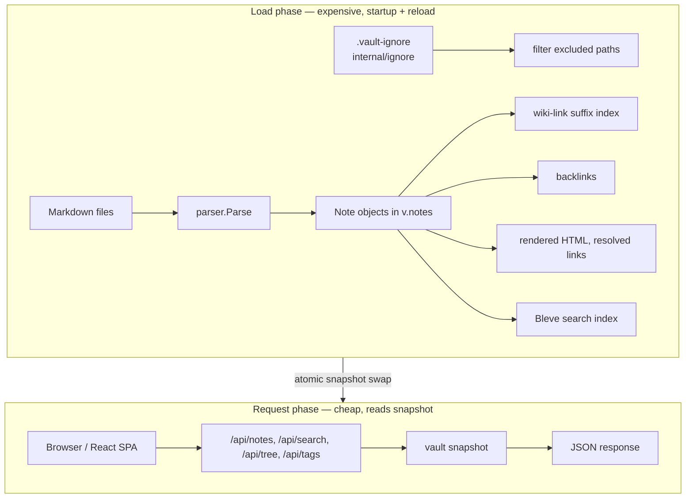
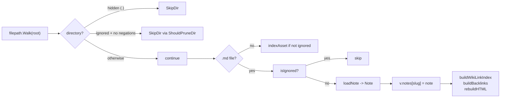
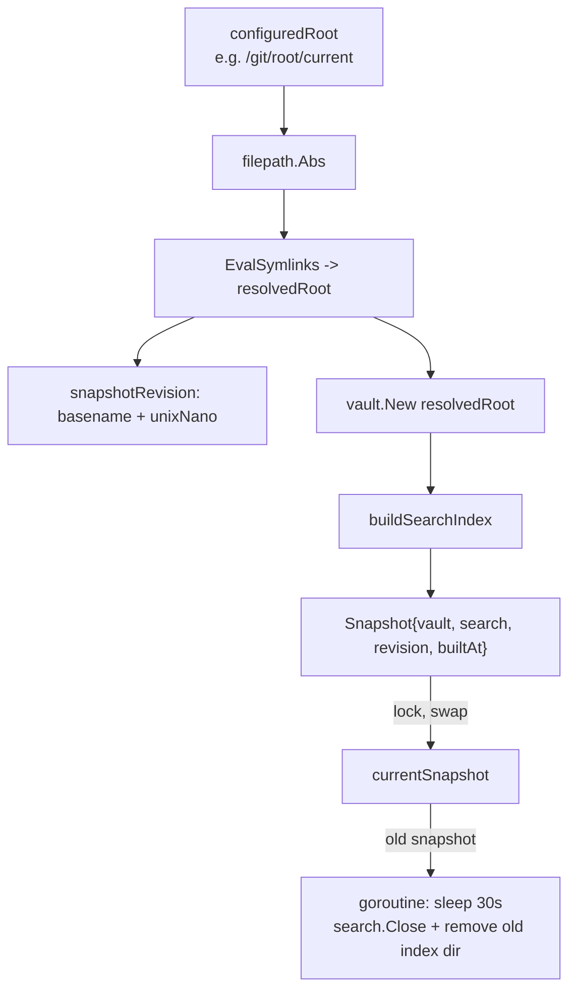

# publish-vault — Project Architecture Overview

The runtime core of Retro Obsidian Publish is one coherent system rather than a collection of subsystems. This document explains how that system works: where the boundaries are, why they exist, and how the parts cooperate. The central claim is that the architecture is coherent because every consumer reads from one in-memory note map, and publication decisions are made once at load time.

## The problem being solved

The application takes a directory of Obsidian Markdown files and derives a website. The directory is read-only content. The application builds an in-memory representation, serves a JSON REST API over that representation, and optionally serves a retro monochrome React frontend from the same process. The constraint that shapes the architecture is that parsing and indexing are expensive, but page loads must be fast. This constraint forces a separation between a load phase and a request phase, and almost every design decision follows from that separation.

## The two-phase execution model

At load time, the application walks the vault directory, parses every Markdown file, extracts frontmatter and wiki links, resolves wiki-link targets to full vault paths, computes backlinks, renders HTML with resolved links, and builds a full-text search index. This work runs once on startup and again on every reload.

At request time, HTTP handlers do only cheap work. They read the prepared in-memory snapshot and return JSON. They do not parse Markdown, they do not walk the filesystem, and they do not build indexes. The expensive work is front-loaded so that page loads are fast.



The consequence for anyone extending the system is direct. A new publication rule must be enforced at load time, not in the HTTP handlers. If the loader excludes a note, that note is absent from the in-memory map, and because every consumer reads from that map, the note is absent from the API list, the file tree, the search index, the backlink graph, and the raw-source endpoint. There is no per-request check to forget.

## The vault loader as the central choke point

The core of the system is the `vault` package at `pkg/vault/vault.go`. A `Vault` struct holds the note index, the wiki-link resolution index, the asset index for image embeds, the vault root path, and the compiled ignore rules.

```go
// pkg/vault/vault.go, commit 560e71d
type Vault struct {                                  // line 68
    mu            sync.RWMutex
    notes         map[string]*Note
    wikiLinkIndex map[string]string
    assetIndex    map[string]string
    root          string
    ignore        *ignore.Ignore                   // line 74
}
```

The loading flow in `LoadAll` (line 102) has three responsibilities that interlock. First, it walks the filesystem and decides which files enter the index. Second, it parses each Markdown file into a `Note`. Third, after all notes are loaded, it builds derived structures: the wiki-link index, the backlink graph, and the final HTML with resolved links.

The walk prunes ignored directories, skips ignored files, parses non-ignored Markdown files, and indexes non-ignored assets. The pruning decision is subtle: ignored directories are pruned only when the ignore file contains no negation patterns. The `ShouldPruneDir` method (line 455) encodes this rule.

This subtlety exists because the ignore matcher uses a last-match-wins semantics rather than strict gitignore semantics. The package documentation states this explicitly: negation cannot re-include a file under an excluded directory the way real git does. Instead, a later `!` simply overrides an earlier exclusion. The `HasNegations` method (line 187 of `internal/ignore/ignore.go`) exists solely so the walker knows when descending is necessary. When negations exist, the walk must descend into an ignored directory and match each file individually, because a `!` could re-include a file beneath it. Pruning the directory would silently drop that file.

The single most important property of this design is that `v.notes` only ever contains notes that passed every exclusion check. Every downstream consumer reads from this map.



## Markdown parsing

The parser lives in `internal/parser/parser.go` and is built on goldmark with extensions for GitHub-flavored Markdown, tables, strikethrough, task lists, footnotes, and YAML frontmatter via `goldmark-meta`. The `Parse` function (line 56) takes raw Markdown bytes and returns a `ParsedNote` containing the rendered HTML, the parsed frontmatter as a normalized `map[string]interface{}`, the extracted wiki links, the tags, the title, and an excerpt.

Wiki links are extracted with a regular expression before goldmark sees the source, then replaced with HTML placeholder anchors so goldmark does not mangle them. This two-phase approach exists because goldmark's Markdown grammar would otherwise treat `[[Target]]` as a combination of link syntax and raw text. The placeholders carry `data-target`, `data-raw`, and `data-alias` attributes that a later resolution pass rewrites with the correct resolved slugs and note titles.

The parser does not model publication policy. It returns frontmatter as a generic map, and the vault layer reads specific keys such as `title` and `tags` from it. This separation is deliberate: any new frontmatter-driven policy belongs in the vault layer, not in the parser, because the parser is a general Markdown engine and publication is an application concern.

## Wiki-link resolution and backlinks

Obsidian wiki links often use short paths. A note may contain `[[Tribal/App-Auth]]` while the actual file lives at `Research/KB/Tribal/App-Auth.md`. The vault builds a suffix-based index so short links resolve to full vault slugs.

For a file at `Research/KB/Tribal/App-Auth.md`, the index registers the full slug and progressively shorter suffixes: `research/kb/tribal/app-auth`, `kb/tribal/app-auth`, `tribal/app-auth`, `app-auth`. The first note to register a suffix wins, so ambiguous short links resolve deterministically. This is documented in the repository README as an intentional approximation of Obsidian behavior.

Backlinks are computed after all notes are loaded, in `buildBacklinks`. The vault iterates every note, follows each note's wiki links through the resolver, and appends the linking note's slug to the target note's backlink list. Because backlinks are derived from the note map, a note excluded at load time cannot appear as a backlink target. The resolver returns "not found" for any slug not in the map, and the backlink is silently dropped. This is the desired behavior, and it is a direct consequence of gating at load time.

## The atomic snapshot model

The `pkg/server/runtime.go` package manages the lifecycle of the vault and search index as a single immutable snapshot. This design supports deployments where an external process updates the vault directory and then asks the running server to reload.

A `Snapshot` bundles a vault, a search index, a revision identifier, the resolved root path, and a build timestamp. The `RuntimeState` holds one current snapshot behind a read-write lock. Request handlers call `Snapshot()` to get the active vault and search index; they never see a partially built state.



The reload flow is the most safety-critical part of this design. When `Reload()` is called, it builds an entirely new snapshot first. If loading or indexing fails, the old snapshot remains active and the failure is returned. Only after the new snapshot is fully built is it swapped in under the lock. The old snapshot is then closed after a 30-second delay in a separate goroutine, so in-flight requests that still hold references to the old vault can complete.

Symlink resolution happens before loading. This matters for git-sync deployments, where a stable path like `/git/root/current` is a symlink that an external process atomically flips to a new checkout. The server resolves the symlink to the concrete directory, so the loaded vault and the reload target are consistent.

## The search index

Full-text search uses Bleve, wrapped in the `pkg/search` package. The search index is built from the notes that the vault loaded, using the Markdown source text converted to plain text. Because the index is built from `v.notes`, it contains only published notes. There is no separate exclusion step for search; it inherits the loader's decisions.

The system supports two index modes. In the default mode, the index lives in memory and is rebuilt on every load. In the persistent mode, enabled with `--search-index-path`, indexes are written to a per-revision directory on disk. The persistent mode exists for deployments where rebuilding a large index on every reload is too expensive. The revision naming scheme, based on the vault directory basename and a timestamp, allows old indexes to be cleaned up after a delay. This is documented in depth in [[ARTICLE - Publish Vault Memory Architecture - Reload-Safe Persistent Search Indexes]].

## The file watcher

When file watching is enabled (the default for local use), the `pkg/watcher/watcher.go` package uses `fsnotify` to monitor the vault directory and debounce rapid events. The watcher watches the vault root and all non-ignored subdirectories. Ignored directories are pruned from the watch set using the same `ShouldPruneDir` logic as the loader, so the watcher and the loader agree on what is excluded.

On a Markdown file change, the watcher calls `ReloadNote`, which re-parses a single file and updates the vault index. `ReloadNote` re-checks the ignore rules, because a file may have been moved into an ignored tree mid-run, and returns a sentinel error `ErrIgnored` if the path is now excluded. The watcher treats this error as a no-op. For non-Markdown files, the watcher marks the asset index dirty and refreshes it on the next debounce tick, so image embeds in subsequently reloaded notes resolve against current attachments.

The watcher's incremental model is consistent with the loader's full-load model because both consult the same ignore rules on every event. There is no separate incremental exclusion path.

## The HTTP API and endpoint-level safety

The API is defined in `pkg/api/api.go` and registers routes on a `gorilla/mux` router. The endpoints are narrow and read-only: list notes, get a single note by slug, get the file tree, search, list tags, and get site config. Every handler obtains the current snapshot from a provider and reads from it.

The asset handler serves non-Markdown files such as images from the `/vault-assets/` path. It re-checks the ignore rules on every request, using the same snapshot for the ignore decision and the file open so a concurrent reload cannot gate bytes from the new root with the old vault's ignore rules. An excluded asset returns a 404 before the handler touches disk.

The raw-source endpoint serves Markdown source for a note. It also re-checks the ignore rules, so the ignore file cannot be bypassed through the raw endpoint. File access uses `os.OpenRoot`, which opens a filesystem root and restricts subsequent file operations to paths under that root, providing path-traversal protection. This is an established-local pattern: ignore rules are re-checked per request, and file access is sandboxed to the vault root.

## The admin reload endpoint

The admin reload endpoint, `POST /api/admin/reload`, is disabled by default. It is enabled either by setting a bearer token through the `RETRO_RELOAD_TOKEN` environment variable, or by allowing unauthenticated reloads from loopback clients with `--reload-allow-loopback`. The `validReloadRequest` function (line 287 of `pkg/server/server.go`) accepts a valid bearer token, or, when loopback is allowed, any request whose remote address resolves to a loopback IP. The loopback option exists for same-host automation such as a git-sync sidecar calling `127.0.0.1`.

## Why it works

The architecture works because each transition has a clear owner and a clear representation. The loader owns the decision of what is published. The snapshot owns the transition from one vault revision to the next. The request handlers own only the translation from in-memory state to JSON. No handler re-derives what is published, because that decision was already made and stored in the note map.

The build-then-swap discipline is what makes hot reload safe. A naive implementation that mutated the vault in place under a lock would block all requests during a reload and could leave the vault in an inconsistent state if the reload failed partway through. Building a complete new snapshot and swapping atomically means a failed reload has no effect, and a successful reload is instantaneous from the perspective of any request handler.

## What goes wrong

The architecture has two known limitations that are not failures but ceilings.

The ignore matcher is a documented subset of gitignore. It does not support `**` or nested ignore files. This is fine for current needs but means common gitignore patterns cannot be expressed. Document 03 records this as a pattern with a known limit.

There is no general vault-scoped configuration file. The `.vault-ignore` file handles exclusion, and the `.publish/` directory handles widget scripts, but there is no single place for vault-scoped settings to live with the vault in version control. This is a gap relative to the needs of operators who want publishing policy to travel with the vault repository, and it is the subject of ticket `RETRO-PUBLISH-009`.

## When another project should reuse this

The two-phase load/read model is applicable to any application that derives a read-heavy view from expensive-to-compute source material. The cost of adopting it is committing to a snapshot abstraction and a reload discipline. The benefit is that request handlers become trivial and reload becomes safe.

The single-choke-point exclusion pattern is applicable wherever multiple consumers read the same derived collection. Enforcing exclusion at the point where the collection is built, rather than at each consumer, eliminates an entire class of consistency bugs. The cost is that exclusion must be total: if any consumer bypasses the collection and reads the source directly, the invariant breaks. The raw and asset endpoints in this codebase respect the invariant by re-checking the ignore rules, which is the correct but easily forgotten discipline.

## Key points

- The runtime is one coherent system organized around a two-phase load/read split. Expensive work happens at load time; request handlers only read the prepared snapshot.
- The vault loader is the single choke point for publication decisions. Because every consumer reads from one note map, exclusion enforced at load time propagates everywhere with no per-consumer logic.
- The atomic snapshot swap with delayed cleanup makes hot reload safe. A failed reload has no effect; a successful reload is instantaneous from a handler's perspective.
- Symlink resolution before load keeps the server consistent with git-sync deployments where a stable path is flipped to a new checkout.
- The file watcher is consistent with the loader because both consult the same ignore rules on every event. There is no separate incremental exclusion path.
- Endpoint-level safety re-checks ignore rules per request and sandboxes file access with `os.OpenRoot`, so the ignore rules cannot be bypassed through the raw or asset endpoints.
