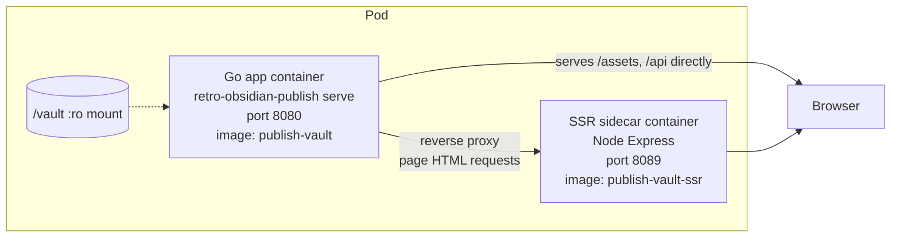
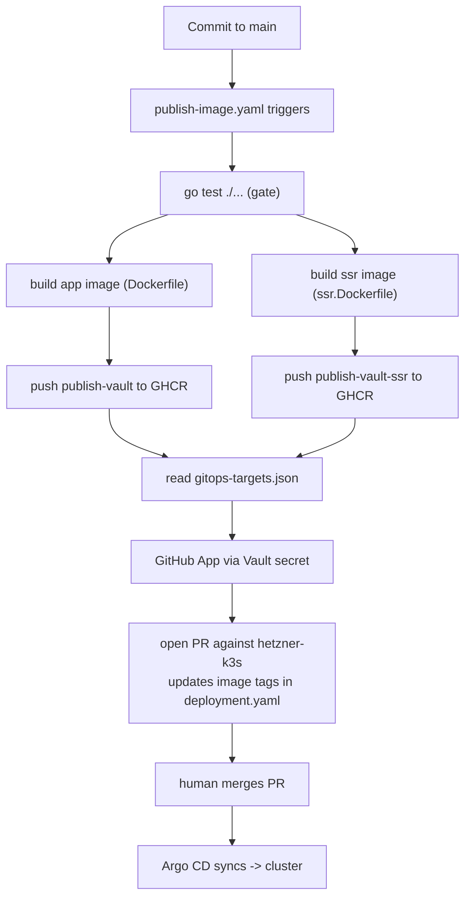

# publish-vault — Deployment and Release Topology

The deployment shape of Retro Obsidian Publish is as much a part of its architecture as the Go runtime. This document studies how the application is packaged, shipped, and operated: the container topology, the release pipeline, the GitOps integration, and the local development setup. These structures recur across the go-go-golems ecosystem, which makes them candidates for ecosystem-wide guidance.

## The problem being solved

A single Go binary that serves both an API and an embedded frontend is a convenient local development artifact, but production operation adds requirements that the binary alone cannot meet. The site needs server-side rendering for performance and for crawlers that do not execute JavaScript. The deployment needs to be reproducible and versioned, so that a cluster runs a known image rather than a locally built binary. The release needs to update the cluster configuration through version control, so that changes are reviewable and auditable, rather than applied by hand. These requirements shape the deployment topology.

## The container topology

The canonical deployment is two containers running together: the Go application and a Node.js server-side rendering sidecar. The `docker-compose.yml` defines this shape, and the Kubernetes deployment mirrors it.



The Go application mounts the vault directory read-only and is configured through environment variables and command flags. It serves the API directly, serves static assets directly, and reverse-proxies page requests to the SSR sidecar. The sidecar runs an Express server that renders React on the server. This split exists because the Go binary is good at serving the API and static assets, but server-side rendering of React requires a JavaScript runtime. Rather than embed a JavaScript runtime in Go, the system runs a dedicated Node container and proxies to it.

The reverse proxy includes a fallback. If the sidecar returns a server error or is unreachable, the handler falls back to serving the SPA's `index.html` directly, so the site stays functional even when the sidecar is unavailable. This is a deliberate resilience choice: the SSR sidecar is an enhancement, not a hard dependency. The site degrades to client-side rendering rather than failing.

## Two Dockerfiles and two images

The repository ships two Dockerfiles, one per container. The main `Dockerfile` is a multi-stage build that produces the Go application image. The `web/ssr.Dockerfile` produces the SSR sidecar image.

The main Dockerfile has three stages. The first stage builds the web frontend with pnpm in a Node image. The second stage builds the Go binary with the `embed` build tag, copying the web build output into `pkg/web/embed/public` so the Go binary embeds it. The third stage is a minimal Alpine image with ca-certificates that runs the binary. This is the embedded-SPA pattern: the frontend is built once, embedded into the Go binary, and served from the same process as the API.

The SSR Dockerfile builds both the client and server bundles with `pnpm build:all`, then prunes to production dependencies. The resulting image keeps production `node_modules` available for the Express server at runtime. This is heavier than the Go image, which carries only the binary, because the SSR server must execute JavaScript at runtime.

Two images are published to the GitHub Container Registry: `ghcr.io/go-go-golems/publish-vault` and `ghcr.io/go-go-golems/publish-vault-ssr`. The GitOps target declaration references both by container name and image name.

## The GitOps target declaration

The `deploy/gitops-targets.json` file is the bridge between the release pipeline and the cluster configuration. It declares, in a machine-readable form, where the application's images should land in the cluster.

```json
{
  "targets": [
    {
      "name": "retro-obsidian-publish",
      "gitops_repo": "wesen/2026-03-27--hetzner-k3s",
      "gitops_branch": "main",
      "manifest_path": "gitops/kustomize/retro-obsidian-publish/deployment.yaml",
      "images": [
        { "container_name": "app", "image_name": "ghcr.io/go-go-golems/publish-vault" },
        { "container_name": "ssr", "image_name": "ghcr.io/go-go-golems/publish-vault-ssr" }
      ]
    }
  ]
}
```

The declaration maps each container in the deployment to its image, names the GitOps repository and branch, and gives the manifest path that should be updated. A separate automation pipeline consumes this file to open a pull request against the cluster configuration repository, updating the image tags. The pull request is the review gate: a new image does not reach the cluster until a human merges the PR.

This declaration pattern is the mechanism that keeps the release pipeline and the cluster configuration in sync without a human copying image tags by hand. It is a candidate ecosystem pattern because the same file shape appears across go-go-golems projects.

## The release workflow

The `.github/workflows/publish-image.yaml` workflow builds and pushes both images. Rather than implement the publishing logic inline, it delegates to a reusable workflow from a shared infrastructure repository.

```yaml
release:
  needs: release-ssr
  uses: go-go-golems/infra-tooling/.github/workflows/publish-ghcr-image.yml@main
  secrets: inherit
  with:
    dockerfile: ./Dockerfile
    build_context: .
    test_command: |
      go test ./...
    go_version_file: go.mod
    gitops_target_config: deploy/gitops-targets.json
    push_image: ${{ github.event_name != 'pull_request' }}
    open_gitops_pr: ${{ github.event_name != 'pull_request' && github.ref == 'refs/heads/main' }}
    gitops_pr_token_source: github_app
    vault_role: retro-obsidian-publish-gitops-pr
    gitops_app_secret_path: kv/data/ci/github/retro-obsidian-publish/gitops-pr-app
```

Several decisions are visible in this invocation. The workflow runs tests before building the image, using `go test ./...` as the gate. It reads the Go version from `go.mod` rather than hardcoding it. It pushes the image only when the event is not a pull request, so pull requests build and test but do not publish. It opens a GitOps pull request only on pushes to `main`, and it authenticates that PR through a GitHub App whose credentials are stored in Vault, not through a long-lived personal access token.

The reusable workflow is the key structure. By delegating to `go-go-golems/infra-tooling/.github/workflows/publish-ghcr-image.yml@main`, publish-vault inherits a release mechanism that is maintained centrally. When the release logic changes, it changes once in `infra-tooling`, and every project that references `@main` picks up the change. The cost is a versioning risk: referencing `@main` means a breaking change in the shared workflow affects all consumers simultaneously. The benefit is that release behavior stays consistent across the ecosystem without per-project copy-paste.

## The build command and the embedded-SPA pattern

The frontend bundle that the Go binary embeds is produced by a separate Cobra command, `build web`. This command can build the frontend either with a local `pnpm` installation or with a Dagger pipeline that runs the build inside a container.

The Dagger path mounts a pnpm cache volume and runs the build in a Node image, then exports the `dist` directory and copies it into `pkg/web/embed/public`. This keeps the Go binary self-contained: after `build web`, a normal `go build -tags embed` produces a single binary that serves both the API and the frontend. The Dagger path matters for CI because it produces a reproducible build that does not depend on the local developer's Node environment.

The embedding itself is controlled by a build tag. When the `embed` tag is set, `pkg/web/embed.go` embeds `pkg/web/embed/public` as an `embed.FS`. When the tag is absent, `pkg/web/embed_none.go` serves the bundle from disk relative to the repository root, which is the development mode. This separation means the same source compiles for both production (embedded) and development (disk-served) without runtime configuration.

## Local development with devctl

Local development uses devctl profiles defined in `.devctl.yaml`. A profile sets environment variables and references a devctl plugin. The file defines two profiles: `example`, which serves the bundled example vault with a hot-reload frontend, and `go-go-parc`, which serves the real go-go-parc Obsidian vault.

```yaml
profiles:
  go-go-parc:
    display_name: go-go-parc Vault
    description: Serve the go-go-parc Obsidian vault with hot-reload frontend
    plugins:
      - retro-obsidian-publish
    env:
      VAULT_DIR: /home/manuel/code/wesen/go-go-golems/go-go-parc
      VAULT_NAME: go-go-parc
      PAGE_TITLE: PARC
```

The plugin is a Python script referenced by path that extends devctl with project-specific commands. The profile-and-plugin split separates environment configuration (which vault, which name) from command extension (what the plugin can do). This pattern is emergent: it is useful, but the boundary between what belongs in a profile and what belongs in a plugin is not yet codified across the ecosystem.

## How the pieces cooperate

The following trace shows how a change reaches production from a commit to a running cluster.



A commit to `main` triggers the workflow. Tests run as a gate. If tests pass, both images build and push to GHCR. The reusable workflow then reads `deploy/gitops-targets.json`, authenticates as a GitHub App whose credentials live in Vault, and opens a pull request against the cluster configuration repository updating the image tags. A human merges the pull request. Argo CD syncs the cluster to the new configuration. The new images run in the cluster.

Every transition is reviewable. The commit is in version control. The images are tagged in GHCR. The cluster change is a pull request. There is no manual `kubectl apply` and no hand-edited image tag in the cluster repository. This is the GitOps discipline, and it is the reason the deployment topology is auditable.

## Why it works

The deployment works because each concern has a single owner. The Go binary owns the API and static assets. The SSR sidecar owns JavaScript rendering. The release workflow owns building and pushing images. The GitOps target declaration owns the mapping from image to cluster manifest. The cluster's Argo CD owns applying the configuration. No layer reaches across its boundary: the release workflow does not apply to the cluster directly, and the cluster configuration does not build images.

The reusable workflow is what makes this scale across the ecosystem. A new go-go-golems project that needs the same release shape references the shared workflow and provides its own Dockerfile, test command, and GitOps target file. The release behavior is inherited, not reimplemented.

## What goes wrong

The main risk is the `@main` reference to the shared workflow. A breaking change in `infra-tooling`'s `publish-ghcr-image.yml` affects every project that references it, simultaneously. There is no per-project pinning, so a regression in the shared workflow is a coordinated outage rather than an isolated one. Mitigating this would require pinning to a tag or a commit hash, which trades the automatic-update benefit for isolation. This tradeoff has not been resolved across the ecosystem.

The SSR sidecar adds operational complexity. Two containers must be built, shipped, and versioned together. A version skew between the app image and the SSR image could produce subtle rendering bugs, because the SSR server renders a React bundle that must match the API contract the app serves. There is no explicit compatibility check between the two images at release time.

## When another project should reuse this

The Go-app-plus-Node-SSR-sidecar shape is applicable to any project that serves a React frontend from Go and needs server-side rendering. The cost is operating two containers and keeping their versions aligned. The benefit is that the Go binary stays focused on the API and static assets, and the JavaScript runtime is isolated in its own container.

The reusable GHCR workflow with a GitOps target declaration is applicable to any go-go-golems project that ships container images to a cluster. The cost is the `@main` versioning risk. The benefit is a consistent, reviewable release path without per-project release logic.

The devctl profile pattern is applicable to any project with multiple local development configurations. It is lighter than a full environment manager and heavier than raw environment variables. It is still emergent, so reuse should be provisional until the profile-plugin boundary is codified.

## Key points

- The canonical deployment is two containers: a Go app serving API and static assets, and a Node SSR sidecar rendering React. The proxy falls back to the SPA when the sidecar is unavailable.
- Two images are built from two Dockerfiles and pushed to GHCR. The main image embeds the frontend via a build tag; the SSR image keeps production `node_modules` for runtime rendering.
- The GitOps target declaration maps images to cluster manifests. A separate pipeline consumes it to open reviewable pull requests against the cluster repository. No image reaches the cluster without a merged PR.
- The release workflow delegates to a reusable workflow in `infra-tooling`, so release behavior is inherited across the ecosystem rather than reimplemented per project.
- The reusable workflow references `@main`, which means a breaking change in the shared workflow affects all consumers simultaneously. This versioning risk is unresolved.
- Local development uses devctl profiles that set environment variables and reference a Python plugin. The profile-plugin boundary is still emergent.
