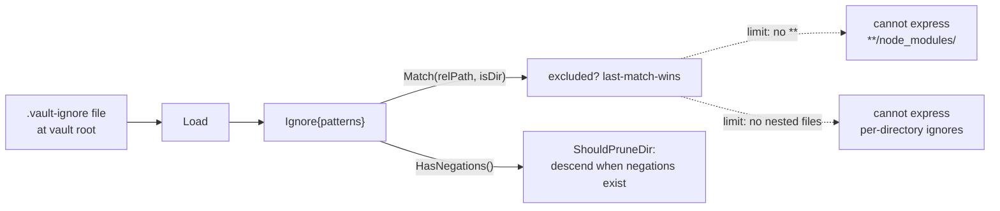

# publish-vault — Patterns, Limits, and Architecture Debt

This document records the structures in publish-vault that work but have known ceilings, and the structures that add cost without commensurate value. In a repository that "hasn't really been all that architected," the most useful debt to record is not duplication of authority but patterns that are correct for current needs and insufficient for plausible future needs. The distinction matters: a pattern with a known limit is not the same as a mistake, and treating it as one would discard working, tested code.

## The problem being solved

A growing vault accumulates exclusion needs that a path-based ignore file expressed as a gitignore subset cannot fully meet, and an application that ships to multiple environments accumulates configuration that has no single home. This document records where the current structures stop working, so that future work can decide whether to extend them or replace them rather than rediscovering the limits.

## The hand-rolled gitignore-subset matcher

The `internal/ignore` package parses a `.vault-ignore` file at the vault root and answers path-exclusion queries. It is a working, tested pattern. It is also a pattern with a documented ceiling.

The package implements a deliberate subset of gitignore. Blank lines and `#` comments are ignored. A leading `!` negates a pattern with last-match-wins semantics. A trailing `/` restricts a pattern to directories. A leading `/` or any internal `/` anchors the pattern to the vault root; otherwise the pattern matches a single path segment at any depth. Globs use the standard library `path.Match` semantics, which means `*` and `?` do not cross `/`.

Two limitations are documented in the package's own doc comment. The `**` glob, which matches across directory boundaries, is not supported. Nested ignore files are not supported; only the single file at the vault root is read.



The matcher also deviates from strict gitignore in its negation semantics. In strict gitignore, a `!` cannot re-include a file under an excluded directory, because git never descends into excluded directories. This package treats `!` as a simple last-match override, which means a `!` can re-include a file even under an excluded directory. To keep the loader consistent with this permissive semantics, the `ShouldPruneDir` method prunes an ignored directory only when no negations exist. When negations exist, the walk descends and matches each file individually. This is correct, but it means the matcher's semantics and the walker's pruning logic are coupled: changing the matcher's negation behavior would require changing the walker too.

This pattern is recorded as both a working pattern and a known limit. It is not architecture debt in the sense of something to delete. It is a structure with an explicit boundary, and the boundary is the debt: any exclusion need that crosses the boundary cannot be met without replacing or augmenting the matcher.

## The absence of a general vault-scoped config file

There is no general configuration file for the vault. The `.vault-ignore` file handles exclusion, and the `.publish/` directory holds widget page scripts. But there is no single place where vault-scoped settings live with the vault in version control. All server behavior is configured through CLI flags and environment variables.

This is a gap relative to the needs of operators who want publishing policy to travel with the vault repository. A vault repository that is pulled onto a server carries its Markdown, its attachments, and its `.vault-ignore`, but it does not carry its site name, its exclusion policy beyond the ignore file, or any future vault-scoped setting. Those settings live in the deployment's environment or command line, which means the same vault served by two deployments can behave differently depending on how each was started.

The gap is the subject of ticket `RETRO-PUBLISH-009`, which proposes a `.publish/config.yaml` file with a gitignore-style blacklist using a library-backed matcher with full `**` support. The ticket is a direct response to the ceiling of the hand-rolled matcher: rather than extend `internal/ignore` and risk its documented contract, the proposal adds a new library-backed matcher in a separate package and keeps `internal/ignore` for backward compatibility. The two matchers compose by exclusion-if-either-matches.

This debt is recorded here because it is the clearest case where a current structure is insufficient for a plausible future need, and the planned resolution preserves the existing structure rather than replacing it.

## Inconsistent repo-root discovery

The repository contains two independent `findRepoRoot` implementations that look for different sentinel files. This is a small but real inconsistency.

The `embed_none.go` implementation, used in development builds without the `embed` tag, walks up from the working directory looking for a directory that contains `backend/go.mod` and `web/package.json`.

```go
// pkg/web/embed_none.go, commit 560e71d
func findRepoRoot() string {
    // ...
    for dir := wd; ; dir = filepath.Dir(dir) {
        if exists(filepath.Join(dir, "backend", "go.mod")) && exists(filepath.Join(dir, "web", "package.json")) {
            return dir
        }
        // ...
    }
}
```

The `build/web.go` implementation, used by the `build web` command, walks up looking for a directory that contains `go.mod` and `web/package.json`.

```go
// cmd/retro-obsidian-publish/commands/build/web.go, commit 560e71d
func findRepoRoot() (string, error) {
    // ...
    for i := 0; i < 12; i++ {
        if exists(filepath.Join(dir, "go.mod")) && exists(filepath.Join(dir, "web", "package.json")) {
            return dir, nil
        }
        // ...
    }
    return "", fmt.Errorf("repo root not found")
}
```

The `embed_none.go` version looks for `backend/go.mod`, which does not match this repository's layout. The repository's `go.mod` is at the root, not under `backend/`. This means the development-mode disk fallback relies on a sentinel path that does not exist in the current repository structure. The function appears to be copied from a project with a `backend/` directory, and the sentinel was not updated when the code was reused.

This is architecture debt in the concrete sense: duplicated logic that has drifted, with one copy pointing at a path that does not exist. It is not currently causing failures because the `embed` build tag is set in production, but it is a latent bug for anyone running the development build. The fix is to unify the two implementations or to correct the sentinel in `embed_none.go` to match the actual repository layout.

## The wiki-link placeholder approach

The parser extracts wiki links with a regular expression before goldmark sees the source, replaces them with HTML placeholder anchors, runs goldmark, then resolves the placeholders in a post-pass. This is an emergent pattern: it works, but it is regex-driven rather than grammar-driven.

The approach exists because goldmark's Markdown grammar would treat `[[Target]]` as a combination of link syntax and raw text. Pre-extracting the links and substituting placeholders avoids the conflict. The placeholders carry `data-target`, `data-raw`, and `data-alias` attributes that the resolution pass rewrites.

The limit is that the regex `(!?)\[\[([^\[\]]+)\]\]` is a structural match, not a parse. It does not respect code blocks, so a wiki link inside a fenced code block would be extracted and replaced. The current implementation accepts this because wiki links in code blocks are rare in practice, but it is a known imprecision of the regex approach. A grammar-based extension to goldmark would handle code-block context correctly but would be substantially more work to implement and maintain.

This is recorded as an emergent pattern with a known imprecision, not as debt to remove. The regex approach is appropriate for the system's current scope.

## The widget DSL sibling-module workaround

The `pkg/widgethost` package executes JavaScript page scripts using the `goja` runtime and serves the resulting widget IR over the same HTTP contract as `rag-evaluation-system`. The `pkg/vaultwidgets` package exposes note-domain widget builders to JavaScript as a native module.

The package documentation for `vaultwidgets` states explicitly that this is a sibling-module workaround. The widget builders reuse the widget IR contract from `rag-evaluation-system`, but they are exposed as a separate `vault.widgets` module rather than as a first-class `widget.vault.*` namespace. The documentation notes that when `rag-evaluation-system` lands a namespace extension API, these builders should graduate to a first-class namespace.

This is a migration in progress, not finished architecture. It is recorded as emergent because the structure works and is used, but its final shape is not yet settled. The cost is that the widget contract has two homes: the original in `rag-evaluation-system` and the reused surface in publish-vault. A change to the contract in one repository must be reflected in the other, and there is no shared module that enforces this.

The deeper pattern worth noting is cross-project contract reuse without a shared library. The widget IR shape is duplicated by reference rather than by import. This is acceptable when the contract is stable and changes rarely, which the documentation implies is the intent. It becomes debt if the contract starts changing frequently, at which point a shared module would reduce the synchronization cost.

## The reload endpoint's authentication model

The admin reload endpoint is disabled by default and can be enabled in two ways: a bearer token from an environment variable, or unauthenticated access from loopback clients. These two modes serve different deployment shapes.

The bearer-token mode is for remote automation that calls the reload endpoint over the network. The loopback mode is for same-host automation, such as a git-sync sidecar calling `127.0.0.1`, where network-level isolation is sufficient and a token would be operational overhead.

This is a working pattern, not debt. It is recorded because the two-mode model is a candidate for ecosystem guidance: the same shape appears wherever a service needs an admin endpoint that is sometimes called locally and sometimes remotely. The decision to make the endpoint disabled by default, rather than enabled with a generated token, is the security-correct default: an operator must consciously enable reload access.

## What should not be repeated

Two structures in this repository should not become ecosystem patterns.

The first is the hand-rolled gitignore-subset matcher. It was a reasonable choice for an initial implementation with no external dependencies, but a library-backed matcher with full gitignore semantics is strictly more capable and carries no meaningful cost. New projects that need path exclusion should use a library from the start. The existing matcher is retained for backward compatibility, not promoted.

The second is the duplicated, drifted `findRepoRoot`. Repo-root discovery should be unified, and if it is copied, the sentinel files must match the target repository's layout. The existence of two implementations with different sentinels is exactly the failure mode that copy-paste without verification produces.

## Key points

- The `.vault-ignore` matcher is a working, tested pattern with a documented ceiling: no `**`, no nested files, and permissive negation semantics coupled to the walker's pruning logic. It is retained for backward compatibility, not promoted as a guideline.
- There is no general vault-scoped config file. Server behavior is configured entirely through flags and environment variables, so publishing policy does not travel with the vault in version control. Ticket `RETRO-PUBLISH-009` proposes a `.publish/config.yaml` with a library-backed matcher to address this.
- Two `findRepoRoot` implementations exist with different sentinel files. The `embed_none.go` version looks for `backend/go.mod`, which does not match the repository's layout. This is concrete, latent debt.
- The wiki-link placeholder approach is regex-driven and does not respect code-block context. It is an emergent pattern with a known imprecision, appropriate for current scope.
- The widget DSL is a sibling-module workaround reusing a contract from `rag-evaluation-system` without a shared library. It is a migration in progress, settled when the upstream namespace extension API lands.
- The reload endpoint's two-mode authentication (bearer token for remote, loopback for local) is a working pattern and a candidate for ecosystem guidance.
