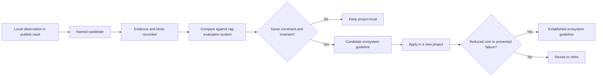

# publish-vault — Candidate Ecosystem Guidelines

This document extracts the patterns from publish-vault that are ready for cross-project comparison. Per the Garden's working rule, a single implementation produces a candidate, and a guideline requires comparison. The comparison target sitting beside this study is `rag-evaluation-system`, and the patterns below are the ones where the same constraint and invariant appear in both repositories. None of these are yet established ecosystem guidelines; they are candidates awaiting confirmation from a second or third project.

## The comparison principle

Two projects may use similar code for different reasons. The invariant matters more than the surface syntax. A pattern becomes a guideline only when the underlying constraint is the same, not merely when the implementation looks alike. The candidates below are framed by the constraint each one solves, so that future comparisons can test the constraint rather than the syntax.

## Candidate 1: Two-phase load-once, read-snapshot execution

**Constraint:** Parsing and indexing are expensive, but reads are frequent and must be fast.

**Pattern:** Front-load expensive work into a load phase that builds a complete in-memory representation. Request handlers read the prepared representation and do no expensive work. A reload rebuilds the whole representation and swaps it atomically.

**In publish-vault:** `vault.LoadAll` builds the note map, wiki-link index, backlinks, HTML, and search index at load time. The API handlers in `pkg/api/api.go` read the snapshot. The atomic snapshot swap in `pkg/server/runtime.go` makes reload safe.

**Comparison target:** `rag-evaluation-system` builds evaluation and retrieval state in a load phase and serves reads from it. The same constraint applies: building derived state is expensive, serving it is cheap.

**What to verify:** Does the other project's read path genuinely avoid expensive work, or does it re-derive state per request? If the latter, the constraint is not actually shared, and the pattern is local.

**Candidate guideline:** Applications that derive a read-heavy view from expensive-to-compute source material should separate a load phase from a request phase and front-load all derivation. Per-request derivation is a design smell that should be flagged in review.

## Candidate 2: Single choke-point collection with load-time gating

**Constraint:** Multiple consumers read the same derived collection, and the collection must respect exclusion rules consistently across all consumers.

**Pattern:** Build one in-memory collection that has already passed every exclusion check. Every consumer reads from that collection. Enforce exclusion at the point where the collection is built, not at each consumer. Consumers that read the source directly must re-check the exclusion rules, because they bypass the collection.

**In publish-vault:** `v.notes` contains only published notes. The API, file tree, search index, backlinks, and raw endpoint all read from it or from indexes built from it. The raw and asset endpoints re-check ignore rules per request because they read the filesystem directly, bypassing the note map.

**Comparison target:** `rag-evaluation-system`'s widget registry serves as the single collection of renderable components; the renderer reads from it rather than discovering components ad hoc.

**What to verify:** Does the other project have consumers that bypass the collection and read the source directly? If so, do they re-check the gating rules? A consumer that bypasses the collection without re-checking is the failure mode this pattern exists to prevent.

**Candidate guideline:** When multiple consumers read a derived collection that must respect exclusion or filtering, build the collection post-filter and have all consumers read from it. Any consumer that reads the source directly must re-apply the filter at the point of read.

## Candidate 3: Atomic snapshot swap with delayed old-snapshot cleanup

**Constraint:** A long-running service must be reloadable without exposing a half-built state to in-flight requests.

**Pattern:** Build the new state fully before swapping. Swap under a lock. Close the old state after a delay in a background goroutine, so in-flight requests holding references to the old state can complete. A failed build leaves the old state active.

**In publish-vault:** `RuntimeState.Reload` builds a new `Snapshot`, swaps it under the lock, and closes the old snapshot after a 30-second delay. The old search index is removed from disk after the delay.

**Comparison target:** `rag-evaluation-system`'s state model. The comparison should test whether the other project uses build-then-swap or in-place mutation under a lock.

**What to verify:** Does the other project's reload path build-then-swap, or does it mutate in place? In-place mutation under a lock blocks all requests during reload and can leave inconsistent state on partial failure. If the other project mutates in place, the constraint is shared but the pattern is not, which is itself a finding worth recording.

**Candidate guideline:** Hot-reloadable state in a long-running service should be rebuilt fully before swapping, never mutated in place under a lock. Old state should be cleaned up after a delay to let in-flight requests complete.

## Candidate 4: Embedded SPA with build-tag-controlled embedding

**Constraint:** A Go binary should serve a frontend in production as a single artifact, but development should serve the frontend from disk for hot reload.

**Pattern:** Use a build tag to select between an `embed.FS` that bundles the built frontend and a disk-based filesystem that serves from the repository. A separate build command produces the bundle that gets embedded. The Go build is decoupled from the frontend build.

**In publish-vault:** `pkg/web/embed.go` (tag `embed`) embeds `pkg/web/embed/public`. `pkg/web/embed_none.go` (tag `!embed`) serves from disk. The `build web` command produces the bundle, optionally via Dagger.

**Comparison target:** `rag-evaluation-system` uses the same embedded-SPA shape, documented in its Garden study as a candidate ecosystem pattern. This is a second independent occurrence.

**What to verify:** Do both projects use the same build-tag convention (`embed` / `!embed`) and the same `embed.FS` sub-filesystem pattern? If the conventions diverge, standardizing the tag name and the directory layout would reduce cross-project cognitive cost.

**Candidate guideline:** Go applications that serve a frontend should embed the built bundle behind an `embed` build tag with a `!embed` disk fallback for development. The frontend build should be a separate command so the Go build does not depend on the frontend toolchain. This pattern now has two implementations and is approaching established status.

## Candidate 5: Go-app plus Node-SSR sidecar, two images, GitOps target declaration

**Constraint:** Server-side rendering of a React frontend requires a JavaScript runtime, but the API and static assets are best served from Go. Releases must be reviewable and auditable through version control.

**Pattern:** Run the Go application and a Node SSR sidecar as two containers. The Go server reverse-proxies page requests to the sidecar and falls back to the SPA if the sidecar is unavailable. Ship two container images. Declare the image-to-cluster-manifest mapping in a GitOps target file. A reusable release workflow builds, tests, and pushes the images and opens a pull request against the cluster repository.

**In publish-vault:** `docker-compose.yml` defines the two-container shape. `Dockerfile` and `web/ssr.Dockerfile` build the two images. `deploy/gitops-targets.json` declares the GitOps targets. `publish-image.yaml` delegates to a reusable workflow in `infra-tooling`.

**Comparison target:** The same GitOps target declaration shape and the same reusable workflow appear across go-go-golems projects. This is the strongest candidate for an established ecosystem guideline, because the shared workflow means the pattern is already de facto standardized.

**What to verify:** Do the other projects that use the reusable workflow also use the two-container SSR sidecar shape, or do some serve a single image? The GitOps target declaration and the reusable workflow may be established independently of the sidecar topology. The sidecar is a candidate only when SSR is needed.

**Candidate guideline:** Projects that ship container images to a cluster should declare their GitOps targets in a `deploy/gitops-targets.json` file and release through the shared `infra-tooling` reusable workflow. Projects that need server-side rendering should run the SSR runtime as a sidecar container with a proxy fallback, shipped as a second image.

## Candidate 6: Reload endpoint with two-mode authentication

**Constraint:** An admin reload endpoint is sometimes called locally by a same-host sidecar and sometimes remotely by automation. The endpoint must be secure by default.

**Pattern:** Disable the endpoint by default. Enable it with a bearer token from an environment variable for remote callers, or with a loopback-only mode for local callers. The loopback mode checks that the remote address is a loopback IP.

**In publish-vault:** `validReloadRequest` in `pkg/server/server.go` accepts a valid bearer token or, when loopback is allowed, any request from a loopback IP.

**Comparison target:** This pattern may be local to publish-vault. The comparison should look for other go-go-golems services with admin endpoints and test whether they use the same two-mode model.

**What to verify:** Is the same need present in other services? If other services have admin endpoints, do they default to disabled and offer token-or-loopback? If they default to enabled, the security stance is weaker and the pattern is not shared.

**Candidate guideline:** Admin endpoints in long-running services should be disabled by default and enable through explicit configuration. A two-mode authentication model (bearer token for remote, loopback for local) covers both deployment shapes without forcing a token on same-host automation.

## What is not yet a candidate

The hand-rolled gitignore-subset matcher is explicitly not a candidate. The documented limits make it a pattern to retain for backward compatibility, not to promote. New projects that need path exclusion should use a library-backed matcher with full gitignore semantics.

The wiki-link placeholder approach is not a candidate because it is specific to Markdown parsing with goldmark and serves a narrow need. It is recorded as emergent in document 03, not promoted here.

The devctl profile pattern is not yet a candidate because the profile-plugin boundary is not codified. It is emergent and should be compared across projects that use devctl before any guideline is proposed.

## How these candidates become guidelines

Each candidate above is a local observation with one comparison target identified. The path to a guideline is to apply the candidate in a new project and observe whether it reduced cost or prevented a failure. The Garden's comparison step prevents accidental standardization: two projects may use similar code for different reasons, and only the shared constraint justifies a guideline.

The strongest candidate in this set is the GitOps target declaration plus reusable release workflow, because the shared workflow means the pattern is already standardized in practice. The next strongest is the embedded-SPA pattern, which now has two independent implementations. The others are genuine candidates awaiting their second or third occurrence.

## Key points

- Six candidates are extracted from publish-vault: two-phase load/read, single choke-point collection, atomic snapshot swap, embedded SPA, Go-plus-SSR-sidecar with GitOps declaration, and two-mode reload authentication.
- The comparison principle is constraint-first: similar code for different reasons does not justify a guideline. Each candidate is framed by the constraint it solves.
- The GitOps target declaration plus reusable release workflow is the strongest candidate because the shared `infra-tooling` workflow already standardizes the release path in practice across the ecosystem.
- The embedded-SPA pattern is the second strongest, with a second independent implementation in `rag-evaluation-system`.
- The hand-rolled ignore matcher, the wiki-link placeholder approach, and the devctl profile pattern are explicitly not candidates, for the reasons recorded in document 03.
- No candidate here is an established guideline yet. Each awaits confirmation from application in a new project or a third occurrence.
