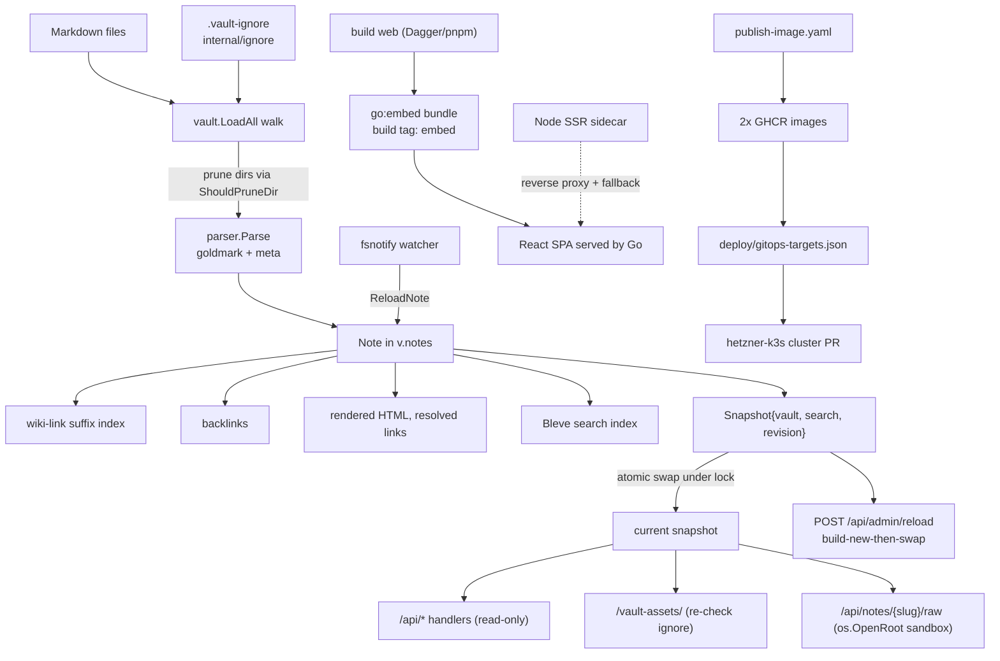

# Architecture Garden — publish-vault

This project study examines the architecture of Retro Obsidian Publish, the application that turns an Obsidian vault directory into a self-hosted website. The repository was not designed from a master plan. It accumulated a Markdown parser, an in-memory note index, a gitignore-subset exclusion engine, an atomic snapshot model, a file watcher, an embedded React frontend, a server-side rendering sidecar, a server-driven widget subsystem, and a GitOps release pipeline. The value of studying it is that several of these structures are clean enough to become ecosystem guidance even though no one architected them as a system.

> [!summary]
> - The strongest structure is the two-phase execution model (load once, read snapshot) combined with a single choke-point note map that makes publication decisions propagate everywhere.
> - The atomic snapshot swap with delayed cleanup is a correct hot-reload pattern worth comparing across the ecosystem.
> - The deployment shape — Go binary plus Node SSR sidecar, two GHCR images, a GitOps target declaration, and a reusable release workflow — recurs across go-go-golems projects and is a candidate ecosystem guideline.
> - Architecture debt is concentrated in the absence of a general vault-scoped config file, the documented-subset limits of the ignore matcher, and inconsistent repo-root discovery.

## Snapshot identity

This study is tied to a precise source snapshot.

| Field | Value |
|---|---|
| Repository | `/home/manuel/workspaces/2026-06-22/goja-publish-vault/publish-vault` |
| Remote | `git@github.com:go-go-golems/publish-vault` |
| Code snapshot | `560e71d2eb8d0999585ad8f48bb3f17e9c21fcdd` |
| Snapshot date | 2026-07-26 |
| Go module | `github.com/go-go-golems/publish-vault` |
| Binary | `retro-obsidian-publish` |
| Size at snapshot | ~8,545 lines of Go (pkg+cmd+internal), ~7,938 lines TypeScript/React (web/src), 55 Go files, 269 commits |

The code snapshot is the last product commit inspected by the analysis. Future reviews should compare their source commit against this hash before treating a conclusion as current. The repository's first commit is dated 2026-05-13, so the system is roughly two and a half months old at the time of analysis; its structures are emergent rather than mature.

## Scope and reading path

This study covers the full repository because publish-vault is a single coherent application rather than a collection of distinct subsystems. It is intentionally lighter than the sibling `rag-evaluation-system` study, which had several genuinely separable subsystems (Widget IR, React package, xgoja provider, frontend release, golden contracts). Publish-vault's runtime is one system, so it gets one overview document rather than five.

1. [[Research/Software Architecture Garden/publish-vault/01 - Project Architecture Overview|Project Architecture Overview]] explains the runtime core: the two-phase load/read model, the vault loader as exclusion choke point, the atomic snapshot swap, wiki-link resolution, backlinks, and the search index.
2. [[Research/Software Architecture Garden/publish-vault/02 - Deployment and Release Topology|Deployment and Release Topology]] covers the Go-app plus Node-SSR sidecar shape, the two container images, the GitOps target declaration, the reusable GHCR workflow, and devctl-based local development.
3. [[Research/Software Architecture Garden/publish-vault/03 - Patterns Limits and Architecture Debt|Patterns, Limits, and Architecture Debt]] records the working-but-limited structures: the hand-rolled gitignore-subset matcher, the absence of a vault-scoped config file, inconsistent repo-root discovery, and the sibling-module widget workaround.
4. [[Research/Software Architecture Garden/publish-vault/04 - Candidate Ecosystem Guidelines|Candidate Ecosystem Guidelines]] extracts the rules ready for cross-project comparison against `rag-evaluation-system` and other go-go-golems applications.

## Pattern map

The diagram contains the central claim of this study: the system is coherent because every consumer reads from one note map, and publication decisions are made once at load time. Complexity lives at the deployment boundary (two images, a sidecar, a GitOps pipeline) rather than inside the runtime.

## Pattern maturity summary

| Pattern | Maturity | Assessment |
|---|---|---|
| Two-phase load-once / read-snapshot execution | Candidate ecosystem pattern | Organizing principle of the whole runtime; front-loads expensive work. |
| Single choke-point note map with load-time exclusion | Candidate ecosystem pattern | One source of truth; exclusion propagates everywhere with no per-consumer logic. |
| Atomic snapshot swap with delayed old-snapshot cleanup | Candidate ecosystem pattern | Correct hot-reload; never exposes half-built state. |
| Symlink-resolved vault root for git-sync | Established locally | `EvalSymlinks` before load keeps reload consistent. |
| Embedded SPA with build-tag-controlled embedding | Candidate ecosystem pattern | Single binary in prod, disk fallback in dev; shared with rag-evaluation-system. |
| SSR reverse proxy with SPA fallback | Emergent | Resilient design; sidecar is enhancement, not hard dependency. |
| Documented-subset gitignore matcher | Emergent | Works and is tested; no `**`, no nested files; a known ceiling. |
| Goldmark + pre-extracted wiki-link placeholders | Emergent | Correct two-phase parsing; regex-driven, not grammar-driven. |
| Reload-safe persistent search index (revision dirs) | Candidate ecosystem pattern | Atomic index swap; already documented in a dedicated vault ARTICLE. |
| Widget DSL reuse via goja sibling module | Emergent | Migration in progress; not yet a first-class namespace. |
| `os.OpenRoot` sandboxing for raw/asset endpoints | Established locally | Re-checks ignore per request; confines file access to vault root. |
| Go-app + Node-SSR sidecar, two images, GitOps target | Candidate ecosystem pattern | Recurs across go-go-golems deployments. |
| Reusable GHCR publish workflow from infra-tooling | Candidate ecosystem pattern | Shared release mechanism across the ecosystem. |
| devctl profile-based local dev | Emergent | Useful; profile/plugin split still settling. |
| No general vault-scoped config file | Architecture debt | Vault settings do not travel with the vault in git. |
| Inconsistent repo-root discovery | Architecture debt | Two `findRepoRoot` impls look for different sentinel files. |

## What is solid

The runtime has three especially valuable structures.

First, the two-phase execution model front-loads expensive parsing and indexing, so request handlers do only cheap reads. Any future feature that does expensive work per request is a design smell; the work belongs at load time or in a background rebuild.

Second, the vault loader is a single choke point for publication decisions. Because every consumer reads from one in-memory map of notes, exclusion rules enforced at load time propagate to the API, the file tree, the search index, the backlink graph, and the raw endpoint without per-consumer logic. This invariant is what makes the ignore file, and any future per-note or config-driven exclusion, simple to reason about.

Third, the atomic snapshot model allows reloads in deployments where an external process updates the vault, without ever exposing a half-built state to request handlers. The build-then-swap discipline, with delayed cleanup of the old snapshot, is the correct pattern for hot-reloadable state.

## What is emergent

Several patterns have the right shape but lack an explicit contract or are still settling.

The deployment shape is solid but the cross-project comparison has not been done formally. The GitOps target declaration and the reusable GHCR workflow appear in multiple go-go-golems repositories, but the shared invariant has not been named as a guideline.

The ignore matcher is a working, tested pattern with a documented ceiling. It is correct for current needs but cannot express patterns common in real gitignore files. It sits between "solid pattern" and "architecture debt," and is recorded as both in document 03.

The widget DSL subsystem is a sibling-module workaround that reuses a contract from another repository. It works, but it has not graduated to a first-class namespace, and the migration path is documented but incomplete.

## Relationship to the existing knowledge base

This study complements existing vault notes rather than replacing them:

- [[ARTICLE - Deep Dive - Retro Obsidian Publish - Vault-Driven Publishing Architecture]] is the prose deep-dive on the same snapshot; this Garden study extracts the patterns and debt from that analysis.
- [[ARTICLE - Publish Vault Memory Architecture - Reload-Safe Persistent Search Indexes]] covers the persistent search index in depth; document 01 references it rather than duplicating it.
- [[PROJ - Publish Vault Widget DSL - Server-Driven Pages from an Embedded JavaScript Runtime]] is the project note for the widget subsystem; document 03 records its migration status.

## Related studies

- [[Research/Software Architecture Garden/publish-vault/Index of Design Patterns|Index of Design Patterns]] — back-of-the-book index of this study's patterns, failures, operations, and vocabulary, with a companion [[Research/Software Architecture Garden/publish-vault/Index of Design Patterns - Rationale|rationale]].
- [[Research/Software Architecture Garden/README|Software Architecture Garden]] — maturity vocabulary, evidence hierarchy, and comparison rules.

## Source

- Repository: `/home/manuel/workspaces/2026-06-22/goja-publish-vault/publish-vault`
- Commit: `560e71d2eb8d0999585ad8f48bb3f17e9c21fcdd` (2026-07-26)
- Deep-dive article: [[ARTICLE - Deep Dive - Retro Obsidian Publish - Vault-Driven Publishing Architecture]]
- Sibling study: [[Research/Software Architecture Garden/rag-evaluation-system/README|rag-evaluation-system]]
