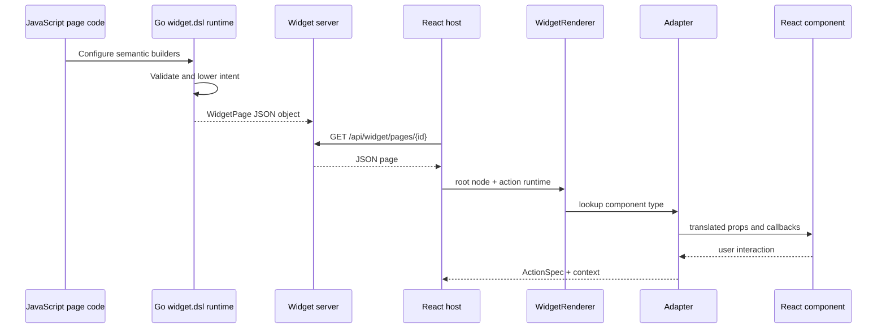
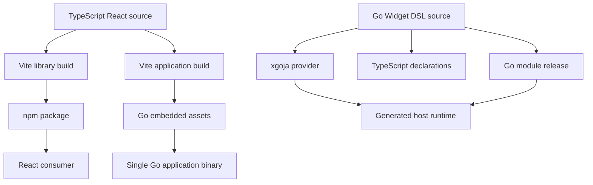

# rag-evaluation-system — Widget Subsystem Architecture Overview

The Widget portion of `rag-evaluation-system` is a server-driven user-interface system built across Go, JavaScript, JSON, and React. Its architecture is easiest to understand as a sequence of ownership boundaries. JavaScript authors describe application intent. Go-backed builders validate and lower that intent. HTTP transports a JSON page. React interprets that page through a registry. The browser host owns effects that cannot be represented as static data.

> [!summary]
> - The architecture is a pipeline of representations, not one framework object shared across processes.
> - The strongest design decisions assign one owner to authoring, transport, rendering, and effects.
> - Most architecture debt comes from preserving multiple ways to cross the same boundary.

## The five systems inside the repository

A new reader can mistake the repository for one application with many directories. The relevant code actually contains five cooperating systems.

### 1. The presentational React system

`packages/rag-evaluation-site/src/components` contains foundation primitives, atoms, layouts, molecules, and organisms. These components accept data and callbacks. They do not own backend APIs, application stores, or route state. This restriction is what makes them reusable in Storybook, the default host, and direct React consumers.

### 2. The Widget browser runtime

`packages/rag-evaluation-site/src/widgets` defines Widget IR, adapters, the registry, the renderer, action resolution, and selected domain presets. It translates serialized data into React component calls.

### 3. The default application host

`packages/rag-evaluation-site/src/app/App.tsx` fetches pages, interprets URL state, chooses a shell, binds shortcuts, sends server actions, refreshes pages, and displays global feedback. It is an opinionated application built around the reusable renderer.

### 4. The Goja authoring language

`pkg/widgetdsl` installs `widget.dsl` into a JavaScript runtime. JavaScript code calls fluent builders rather than constructing every JSON object manually. Go methods enforce selected invariants and lower results into Widget IR.

### 5. The generated-host and delivery system

`pkg/xgoja/providers/widgetsite` packages the module, TypeScript declarations, and help for xgoja-generated binaries. The frontend is also released as npm library artifacts and as an application build that Go binaries can embed.

## Runtime data flow



The representation changes at every major boundary:

| Boundary | Input | Output | Owner |
|---|---|---|---|
| Authoring | JavaScript calls | Builder state | `pkg/widgetdsl` |
| Lowering | Typed or mutable specs | JSON-compatible maps | DSL/spec layer |
| Transport | Page object | HTTP JSON | Widget server |
| Rendering | Widget nodes | React elements | WidgetRenderer and adapters |
| Interaction | Browser event | ActionSpec plus context | Adapter and action executor |
| Effect | Action intent | HTTP/navigation/copy/etc. | Host runtime |

This table is more useful than a package dependency graph because it states which representation is valid at each stage.

## Build and release topology

Runtime flow is only half of the architecture. The project also has a build-time composition.



The npm and Go releases are independent but semantically coupled. A Go builder can emit a prop that an older React package does not understand. Conversely, a React adapter can support behavior no installed Go provider can author. The DataTable multi-selection change exposed this directly: the Go provider tag and npm package required coordinated upgrades.

## The central invariant

The system remains understandable when every process boundary carries data and every side effect has one runtime owner.

The browser cannot execute a Goja callback captured during server page construction. It can execute an action specification because that specification is data. The Go builder cannot depend on a React hook. It can emit props that an adapter interprets. A component should not know the server action URL. It should invoke a callback produced by its adapter.

This invariant explains both successes and failures:

- Serialized actions are successful because they preserve intent as data.
- Inert slot callbacks fail because function behavior does not cross JSON.
- Presentational components remain reusable because effects are injected.
- Raw component names weaken the model because they bypass semantic authoring and fail only at registry lookup.

## Where the architecture is strongest

### Presentational boundaries

The package guidelines prohibit application services inside reusable components. This is an effective rule. The rule creates direct Storybook rendering, smaller props contracts, and a clean adapter seam.

### Semantic authoring

The domain namespaces—`data`, `crm`, `cms`, `course`, `context`, `schedule`, and `time`—allow authors to describe meaningful structures rather than renderer internals. This is the right direction even though older low-level APIs remain.

### Generated provider packaging

A provider packages module registration, declarations, and help as one selected capability. Generated hosts can consume the same module surface without each reconstructing it.

### Clean-consumer verification

The npm package is installed into a fresh temporary project and typechecked/built there. That tests the artifact users receive rather than only source aliases inside the monorepo.

## Where architecture is missing

The project lacks one enforced page protocol. Producers emit several version labels, while the browser casts JSON without checking the label. The result is version vocabulary without version behavior.

The project also lacks one component catalog authority. Types, adapters, registries, YAML manifests, Go builders, descriptors, declarations, stories, and goldens overlap without a single generation path. Each layer can be individually useful, but repeating the inventory across all of them creates maintenance rather than safety.

Finally, migrations lack an end state. The project moved from split modules to `widget.dsl`, but old modules remained implemented and globally registered. It moved toward typed shells, but legacy shell normalization remained. It introduced `--rag-*` tokens, but the old token namespace remained broadly used.

## A useful decomposition for future projects

A future project using this architecture should start with six explicit interfaces:

```text
AuthoringAPI
PageLowerer
WidgetPageV1
WidgetContractMap
WidgetRegistry
WidgetActionRuntime
```

Their responsibilities are:

```pseudo
AuthoringAPI builds semantic intent
PageLowerer validates intent and emits WidgetPageV1
WidgetPageV1 is the only network protocol
WidgetContractMap correlates component names with props
WidgetRegistry supplies render adapters
WidgetActionRuntime owns browser and server effects
```

If a new abstraction does not fit one of these responsibilities, its need should be demonstrated before it is introduced.

## What goes wrong

The current system demonstrates three recurring failure modes.

1. **Parallel generations remain executable.** Old and new APIs coexist, so maintainers must understand both and tests preserve both.
2. **Catalogs test agreement instead of behavior.** Multiple lists can contain the same method name while the method itself emits unusable data.
3. **Compatibility branches lack deletion conditions.** A “temporary” path becomes part of the permanent architecture because no task says when it is safe to remove.

These failures are developed in [[Research/Software Architecture Garden/rag-evaluation-system/08 - Architecture Debt and Patterns Not to Repeat]].

## Key points

- Architecture is the sequence of representations and owners, not only the directory hierarchy.
- JSON is a real process boundary and must contain data rather than deferred server behavior.
- The default host and reusable renderer are separate products and should remain separate.
- Dual Go/npm delivery requires an explicit compatibility matrix.
- A migration is incomplete until the old runtime path and its tests are deleted.

## Related studies

- [[Research/Software Architecture Garden/rag-evaluation-system/02 - Semantic DSL to Widget IR Pipeline]]
- [[Research/Software Architecture Garden/rag-evaluation-system/03 - React Components Adapters and Rendering]]
- [[Research/Software Architecture Garden/rag-evaluation-system/04 - Serializable Actions and Host Owned Effects]]
- [[Research/Software Architecture Garden/rag-evaluation-system/05 - XGoja Provider and Runtime Packaging]]
- [[Research/Software Architecture Garden/rag-evaluation-system/06 - Frontend Packaging Embedding and Release]]
