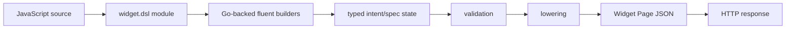

# Semantic DSL to Widget IR Pipeline

A server-driven interface needs two representations. Authors need an API that expresses application intent without forcing them to assemble every transport object. The browser needs plain data that can cross an HTTP boundary and be interpreted without executing server code. The semantic DSL and Widget IR satisfy these different requirements.

> [!summary]
> - The DSL is an authoring language; Widget IR is a transport protocol.
> - Typed intent objects are valuable when they enforce invariants before lowering.
> - The pattern fails when raw maps, deferred callbacks, and old builder generations bypass or duplicate the pipeline.

## The problem this pattern solves

Directly authoring nested JSON is simple at the beginning:

```js
const page = {
  id: "jobs",
  root: {
    kind: "component",
    type: "DataTable",
    props: {
      rows,
      columns: [/* many transport details */]
    }
  }
};
```

This form is serializable, but it exposes the browser contract to every author. Validation happens late. Repeated structures are copied. A column can reference a missing field. An action can use the wrong context path. A shell can be structurally incomplete.

The DSL introduces an authoring representation:

```js
const fields = widget.data.fields("jobs", f => f
  .key("jobId", { label: "ID" })
  .primary("title", { label: "Job" })
  .status("status", { label: "Status" }));

const table = widget.data.collection(rows, c => c
  .id("jobs")
  .schema(fields.build())
  .table(t => t.rowSelect(openJob)));
```

The author manipulates concepts—fields, collections, selection, tables, and actions. The runtime lowers those concepts into the browser's node and props shapes.

## Pipeline stages



### Stage 1: module installation

`pkg/widgetdsl/module.go` installs a root object into a Goja CommonJS module. The supported root groups page construction, actions, bindings, application shells, generic UI, data, and domain-specific builders.

The module boundary matters because it gives JavaScript authors one import and gives generated hosts one provider capability to select.

### Stage 2: fluent configuration

Most builders allocate mutable Go state, expose methods through a Goja object, invoke a JavaScript configuration callback, and eventually lower the state.

```pseudo
function collection(rows, configure):
    spec = new CollectionSpec(rows)
    builder = exposeMethods(spec)
    configure(builder)
    validate(spec)
    return lowerCollection(spec)
```

The builder object is not part of the transport. It exists only while JavaScript runs.

### Stage 3: typed intent

`pkg/widgetdsl/spec` defines typed structures for pages, shells, fields, collections, actions, shortcuts, and validation issues. A typed intent object can state constraints that an arbitrary map cannot.

For example, a selection spec can require a key field. A page shell can distinguish `none`, `root-owned`, and `app`. A field set can preserve stable field identity and display role separately.

Typed intent is valuable when it answers three questions:

- What does the author mean?
- Which combinations are valid?
- How does valid intent map to transport?

It is not valuable merely because a Go struct exists. If the struct accepts every value and lowering copies fields without validation, it is another transport type rather than an intent model.

### Stage 4: validation

Validation should run before JSON leaves the server. Browser errors are too late for structural authoring mistakes.

A useful validation result identifies:

```text
code: collection.key_field.missing
path: page.sections[0].collection.selection
message: Multi-selection requires a stable row key.
remediation: Define a key field in the collection schema.
```

The current project has meaningful validation in selected specs, but coverage is uneven. Some builders still construct maps directly.

### Stage 5: lowering

Lowering converts semantic state into the exact JSON-compatible contract consumed by React.

```pseudo
function lowerPage(spec):
    assert spec is valid
    return {
        schemaVersion: PAGE_SCHEMA_VERSION,
        id: spec.id,
        title: spec.title,
        shell: lowerShell(spec.shell),
        shortcuts: lowerShortcuts(spec.shortcuts),
        root: lowerNode(spec.root)
    }
```

Lowering is the correct place to translate author-facing names, omit defaults, normalize arrays, and emit stable protocol fields. It should be deterministic and free of browser effects.

## Why this pattern works

The pattern separates change rates.

- Authoring APIs can become more ergonomic without forcing the browser to understand builder objects.
- Browser adapters can evolve visually without teaching Goja about React internals.
- Validation can become stricter without moving logic into every application script.
- JSON output can be snapshot-tested independently of rendering.
- Another renderer could consume the same protocol if its semantics match.

The crucial property is not “there is a DSL.” It is that the DSL and IR serve different audiences and are connected through explicit lowering.

## Bindings are late-bound data

Actions often need values that exist only when the user interacts with a row or field. The DSL represents these values as accessors rather than closures:

```js
widget.act.server("archive", {
  payload: {
    jobId: widget.bind.context("rowKey")
  }
});
```

The server constructs the accessor. The browser later resolves it against interaction context. This is a small compiler pattern:

```text
source expression → accessor IR → runtime evaluation against context
```

It works because the evaluator is part of the browser protocol. No JavaScript closure crosses the boundary.

## Where the current implementation leaks

### Mixed typed and map-based lowering

`v3.go` contains both typed specs and direct `map[string]any` construction. This weakens the claim that validation precedes transport. A future cleanup should identify which structures need typed invariants and route those through one lowering path.

### v3 depends on v2 handles

Current v3 field and collection builders retain `v2Ref` machinery. The public v2 API is obsolete, but the implementation is still structurally coupled to it. The correct migration is to extract neutral current concepts such as `schemaHandle`, then delete v2 constructors and names.

### Inert callback slots

Several domain builders accept callbacks and serialize only a marker indicating that a slot was registered. The callback output does not appear in the JSON, and React does not consume the marker.

This violates the pipeline's central rule. A callback must execute during authoring and produce serializable Widget nodes, or the API must be deleted.

### Raw component construction

`widget.raw.component(name, props)` bypasses semantic builders and admits arbitrary registry names. It weakens validation and component inventory guarantees. With few consumers, known uses should be migrated and the escape removed.

### Conflicting page versions

Different lowerers emit different version labels while the browser ignores all of them. A protocol version should be a constant selected by the implementation, not an author option.

## A stricter target

```go
const PageSchemaVersion = "widget.page/v1"

type PageSpec struct {
    ID        string
    Title     string
    Shell     PageShellSpec
    Shortcuts []PageShortcutSpec
    Root      NodeSpec
}

func (p PageSpec) Lower() (WidgetPageV1, error) {
    if issues := ValidatePage(p); len(issues) > 0 {
        return WidgetPageV1{}, ValidationError{Issues: issues}
    }
    return WidgetPageV1{
        SchemaVersion: PageSchemaVersion,
        ID: p.ID,
        Title: p.Title,
        Shell: lowerShell(p.Shell),
        Root: lowerNode(p.Root),
    }, nil
}
```

JavaScript should never set `SchemaVersion`. A builder should never return an invalid page and expect React to diagnose authoring errors.

## What goes wrong when this pattern is copied superficially

A DSL can increase complexity without improving correctness. Warning signs include:

- builders that merely rename JSON keys;
- a second type system manually synchronized with transport types;
- generated help that lists methods but does not test behavior;
- escape hatches used for normal application work;
- multiple active DSL generations;
- callbacks whose results cannot cross the chosen transport;
- protocol versions that consumers do not validate.

The presence of fluent methods is not evidence of semantic abstraction. The question is whether the authoring model enforces meaning before transport.

## When to use this pattern

Use semantic authoring plus IR when:

- interface definitions are produced outside the browser;
- multiple applications should share a renderer and design system;
- actions can be represented as data;
- server-side validation is valuable;
- generated hosts need a stable scripting API;
- pages should be inspectable and testable as artifacts.

Do not introduce it for a small React application whose pages are entirely local and whose components can be composed directly. A DSL and transport protocol are justified by a real process, language, or ownership boundary.

## Candidate ecosystem rules

- Model intent before transport only where meaningful invariants exist.
- Execute callbacks before serialization; never serialize “registered callback” markers.
- Make protocol versions implementation constants and validate them at consumers.
- Treat raw component construction as migration tooling, not a permanent authoring API.
- Delete an old DSL generation after all known consumers migrate.
- Test semantic output and runtime behavior, not only method inventory parity.

## Related notes

- [[Research/Software Architecture Garden/rag-evaluation-system/01 - Project Architecture Overview]]
- [[Research/Software Architecture Garden/rag-evaluation-system/04 - Serializable Actions and Host Owned Effects]]
- [[Research/Software Architecture Garden/rag-evaluation-system/05 - XGoja Provider and Runtime Packaging]]
- [[Research/KB/Projects/widget-dsl]]
