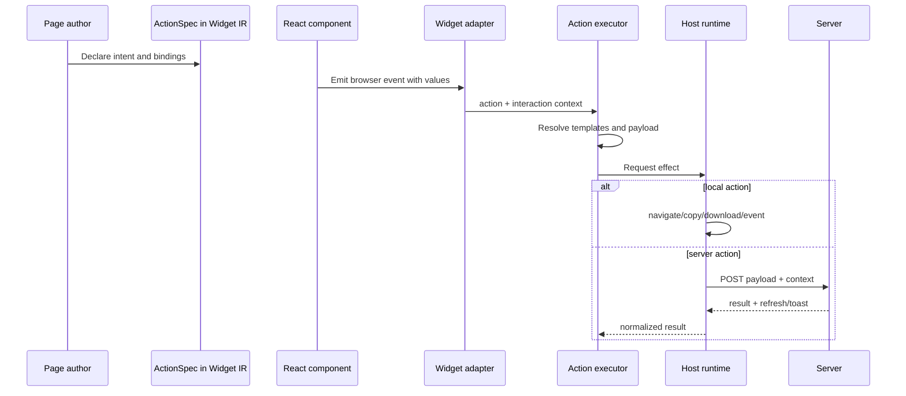

# Serializable Actions and Host-Owned Effects

A server-generated page can describe a button, table, or dialog, but it cannot send a live browser callback through JSON. The project solves this by representing interaction intent as an `ActionSpec`. Components produce context when an event occurs. The browser resolves bindings and gives the resulting intent to a runtime that owns navigation, clipboard access, downloads, browser events, printing, fullscreen state, and server requests.

> [!summary]
> - Actions are data; effects belong to the runtime that can perform them.
> - Interaction context supplies values that were unavailable when the page was authored.
> - One action executor should own confirmation, payload resolution, transport, notification, and refresh.

## The boundary

At page-construction time, a server knows that selecting a job should open its details. It does not know which row the user will select. At interaction time, the browser knows the row and row key.

The action contract joins these two moments:

```js
const openJob = widget.act.navigate("/pages/jobs", {
  query: {
    selected: widget.bind.context("rowKey")
  }
});
```

When the row is clicked, the adapter supplies:

```json
{
  "row": {
    "jobId": "upwork:123",
    "title": "Implement a Go service"
  },
  "rowKey": "upwork:123",
  "componentType": "DataTable"
}
```

The action executor resolves `rowKey`, constructs the navigation target, and updates browser history.

## Action flow



The component does not need to know whether the action came from Goja. It invokes a callback. The adapter creates context. The executor interprets the action. The runtime performs effects.

## Action kinds

The current runtime supports several categories:

| Kind | Effect owner | Typical use |
|---|---|---|
| `navigate` | Browser history runtime | Open a page or update query selection. |
| `copy` | Clipboard runtime | Copy IDs, context, or generated guidance. |
| `download` | Browser document runtime | Download a generated resource. |
| `event` | Browser runtime | Print, fullscreen, or custom application events. |
| `openOverlay` / `closeOverlay` | Overlay host | Dialog lifecycle. |
| `server` | HTTP host | Mutate local state, persist a form, or run an operation. |

This list is a protocol vocabulary. Adding a kind creates responsibilities in authoring declarations, browser execution, tests, and documentation.

## Context and bindings

Bindings preserve values symbolically until an event provides context.

```text
bind.field("status")
bind.path("customer.owner.id")
bind.context("rowKey")
bind.template("Archive ${row.title}?")
bind.const("archived")
```

The distinction between row-relative and interaction-context paths must be explicit. A row field resolves inside `context.row`; a context binding resolves against the complete event context.

Payload resolution can be described as:

```pseudo
function resolve(value, context):
    if value is constant:
        return value.value
    if value is field accessor:
        return lookup(context.row, value.field)
    if value is context accessor:
        return lookup(context, value.path)
    if value is template:
        return interpolate(value.template, context)
    if value is object:
        return map each property through resolve
    if value is array:
        return map each item through resolve
    return value
```

The evaluator must produce JSON-compatible output. `undefined` becomes `null` or triggers validation; functions and browser objects cannot appear.

## Confirmation belongs to execution

An action may carry a confirmation template:

```js
widget.act.server("archive-job", {
  confirm: "Archive ${row.title}?",
  payload: { jobId: widget.bind.context("rowKey") }
});
```

Confirmation must happen exactly once, immediately before the effect. The current default host confirms an action and then sends non-server actions to a generic dispatcher that confirms again. This is a correctness defect produced by two execution paths.

The target architecture centralizes execution:

```ts
interface WidgetActionRuntime {
  confirm(message: string): boolean;
  navigate(target: string, replace: boolean, state?: object): void;
  copy(text: string): Promise<void>;
  download(target: string): void;
  emit(name: string, detail: unknown): void;
  postServer(name: string, request: ServerActionRequest): Promise<ServerActionResult>;
  notify(result: ServerActionResult): void;
  refresh(): void;
}

async function executeWidgetAction(action, context, runtime) {
  const confirmation = renderConfirmation(action, context);
  if (confirmation && !runtime.confirm(confirmation)) return;

  const resolved = resolveAction(action, context);
  const result = await perform(resolved, runtime);
  if (result) runtime.notify(result);
  if (result?.refresh) runtime.refresh();
}
```

An application host supplies the runtime. Tests supply a recording runtime. Adapters depend only on the executor interface.

## Server actions

A server action request has two separate fields:

```json
{
  "payload": {
    "status": "archived"
  },
  "context": {
    "selectedRowKeys": ["job-1", "job-2"],
    "bulkActionId": "archive-selected",
    "componentType": "DataTable"
  }
}
```

`payload` is declared application intent. `context` is browser-generated interaction evidence. A handler should validate both and should not assume arbitrary context fields are trusted.

The Upwork Tracker multi-selection integration demonstrates the pattern well:

- the bulk action payload names the target status;
- DataTable context supplies selected row keys;
- the server deduplicates and bounds the selection;
- the server verifies every job exists;
- the mutation clears selection and requests refresh.

The Widget protocol is not a substitute for a stable automation API. Browser action handlers can evolve with the UI. External agents should use a dedicated service interface when long-term machine compatibility is required.

## Host-owned refresh

A server response may request page refresh. The host already owns page fetching, so it should execute refresh directly. Dispatching a synthetic `popstate` event to trigger another path is an indirect substitute for a callback the host can provide.

The target result flow is:

```text
server result
    → action executor
        → notification runtime
        → refresh callback
```

This keeps browser location changes separate from data refresh.

## Why this pattern works

Serializable actions create an inspectable application protocol. Tests can assert the exact action and context without running a browser effect. Goja authors can produce actions without importing React. Components remain normal React components. Alternative hosts can provide different effect runtimes.

The pattern also gives security review a concrete surface. A server handler receives a named action, resolved payload, and context. Validation and authorization can be performed at that boundary.

## What goes wrong

### Two executors diverge

The default host and generic dispatcher can implement confirmation, server requests, errors, toasts, and refresh differently. A behavior fix in one path does not fix the other.

### Functions leak into transport design

A builder that stores a callback marker without materializing output violates the action/data model. The browser cannot invoke the original function.

### Context becomes unbounded ambient state

An index signature permits arbitrary context fields. Without conventions and tests, adapters can invent incompatible names. Each component interaction should document its context shape.

### Server handlers trust context

Row keys and selected IDs originate in the browser. They must be validated and authorized like any request input.

### UI action APIs become automation APIs accidentally

A server action route optimized for one widget may not provide stable idempotency, versioning, or audit semantics. Agents should use explicit application APIs.

## When to use this pattern

Use serialized actions when pages or components are authored outside the browser process and interactions can be expressed as bounded intents. Do not serialize arbitrary code or attempt to reproduce a full browser programming language in JSON.

## Candidate ecosystem rules

- Effects belong to the runtime that can perform them.
- Confirm an action once, at execution time.
- Keep declared payload and interaction context separate.
- Document context shapes per component interaction.
- Validate browser context at every server boundary.
- Inject action runtimes so behavior is testable without global browser state.
- Keep UI action routes distinct from stable external automation APIs.

## Related notes

- [[Research/Software Architecture Garden/rag-evaluation-system/02 - Semantic DSL to Widget IR Pipeline]]
- [[Research/Software Architecture Garden/rag-evaluation-system/03 - React Components Adapters and Rendering]]
- [[Research/Software Architecture Garden/rag-evaluation-system/08 - Architecture Debt and Patterns Not to Repeat]]
