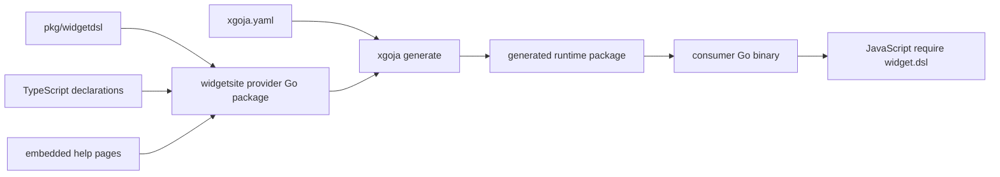

# xgoja Provider and Runtime Packaging

A Goja module is useful only when host applications can install it consistently. The Widget system packages module registration, TypeScript declarations, and help as an xgoja provider. Generated binaries select that provider in configuration and receive the same `widget.dsl` surface without hand-written module wiring in every repository.

> [!summary]
> - Provider packaging turns a Go-backed JavaScript API into a reusable host capability.
> - Registration, declarations, documentation, and dependency selection must describe one module surface.
> - Global `init()` registration undermines explicit provider selection and should be removed.

## The host problem

Without provider packaging, every binary embedding Goja must repeat several operations:

```pseudo
create CommonJS registry
construct Widget DSL module loader
register module name
attach registry to runtime
expose TypeScript declarations
expose help documentation
ensure required Go packages are linked
```

This duplication creates subtle differences. One host can register an old module alias. Another can omit declarations. A third can construct a loader with different options. The provider bundles the capability.

## Provider shape

The provider in `pkg/xgoja/providers/widgetsite/provider.go` supplies:

- a stable provider identifier;
- a module factory for `widget.dsl`;
- TypeScript declaration text;
- embedded help content;
- registration into the xgoja provider registry.

A host selects it in `xgoja.yaml`:

```yaml
providers:
  - id: rag-widget-site
    import: github.com/go-go-golems/rag-evaluation-system/pkg/xgoja/providers/widgetsite
    register: Register
    module:
      version: v0.1.8
```

Generation resolves the Go dependency and produces a runtime package embedded in the consumer binary.

## Build-time flow



The generated runtime is a build artifact with source-controlled configuration. A consumer does not depend on a globally installed plugin or runtime discovery at deployment time.

## Why this pattern works

### It makes capabilities explicit

A generated host's configuration states which JavaScript APIs exist. That is easier to review than import side effects distributed across `init()` functions.

### It aligns documentation with the installed module

The provider can expose help and declarations for exactly the selected module version. An author should not see declarations for a module the runtime cannot load.

### It supports reproducible dependency resolution

A module version in consumer configuration participates in Go module resolution and generated source. Consumers can upgrade deliberately and regenerate artifacts.

### It reduces per-host boilerplate

Application repositories focus on their own JavaScript verbs and server logic rather than rebuilding module installation.

## Explicit registration versus global registration

The architecture intends explicit provider selection, but `pkg/widgetdsl/module.go` also registers every historical module through `init()` in a global native-module registry. That creates two capability models:

```text
Explicit provider registry:
    widget.dsl only

Global native-module registry after package import:
    ui.dsl
    data.dsl
    data.v2.dsl
    widget.dsl
    context_window.dsl
    course.dsl
    cms.dsl
```

This is not only dead code. A runtime using the global registry can observe modules the provider claims were removed.

The target is explicit registration:

```go
const ModuleName = "widget.dsl"

func Register(reg *require.Registry) {
    if reg == nil {
        return
    }
    reg.RegisterNativeModule(ModuleName, newModule().Loader)
}
```

Importing the package should not mutate a global catalog of obsolete modules.

## Runtime ownership

A `goja.Runtime` is not a shared global object. Module loaders create values within a specific runtime. Builders hold references to that runtime while JavaScript executes. Provider packaging must therefore expose factories, not preconstructed Goja objects.

The lifecycle is:

```pseudo
for each JavaScript runtime:
    create runtime
    create module registry
    install provider module loaders
    execute source
    discard runtime according to host policy
```

Any cache must distinguish Go metadata that is safe to share from runtime-bound objects that are not.

## Declarations as a compatibility surface

TypeScript declarations are part of the provider contract. They provide author feedback for namespace members, builder methods, action shapes, and callbacks. A runtime method absent from declarations is difficult to discover. A declaration absent from runtime creates compile-success/runtime-failure behavior.

The current repository maintains runtime code, declaration strings, and a broad descriptor inventory. Descriptor tests compare names across these representations. The tests do not prove method behavior, as inert slot methods demonstrate.

A simpler policy is:

- keep generated declarations because authors need them;
- test representative declaration fixtures by compiling JavaScript/TypeScript usage;
- test runtime behavior directly;
- delete redundant method-list catalogs and generated inventory documentation.

## Provider help

Embedded help should explain concepts and show executable examples. A generated list of every builder method is less valuable than:

- one page lifecycle example;
- one action and binding example;
- one collection/table example;
- one domain-semantic example;
- clear removed-API migration guidance.

The `.d.ts` file remains the detailed machine-readable inventory.

## Generated artifacts and consumer upgrades

A provider upgrade is incomplete until consumer runtime packages are regenerated. The source configuration can name `v0.1.8` while checked-in generated code still reflects an earlier dependency.

A safe upgrade sequence is:

```text
1. Update provider version in xgoja.yaml.
2. Run xgoja generation.
3. Review generated plan and source changes.
4. Compile JavaScript declaration fixtures.
5. Run host unit and browser smoke tests.
6. Commit configuration and generated artifacts together.
```

This pattern applies to Upwork Tracker and other generated hosts.

## What goes wrong

### Registration occurs through imports

A global `init()` makes capabilities depend on transitive package imports. Hosts cannot reason about the selected surface from configuration alone.

### Old modules remain linkable for tests

Tests that execute retired modules require production packages to retain their implementation. Historical behavior should live in Git history; tests should prove the old names are absent.

### Generated declarations become stale

A host can carry declaration files for modules its runtime no longer selects. Generation and validation must be part of upgrades.

### Multiple preview commands recreate runtime setup

The repository has more than one command constructing a runtime, installing modules, evaluating source, and exporting a page. Duplicate evaluators can drift from the generated host path. One canonical evaluator should serve examples and previews.

### Provider version and frontend version drift

The provider emits IR consumed by an npm package. Go module reproducibility alone does not guarantee browser compatibility.

## When to use this pattern

Use provider packaging when several Go binaries embed the same Go-backed JavaScript API and need consistent declarations, help, and registration. For one small internal script host, direct registration may be simpler.

## Candidate ecosystem rules

- Generated hosts select capabilities explicitly; imports must not register hidden modules.
- Providers package runtime factories, declarations, and conceptual help together.
- Runtime-bound objects are created per Goja runtime.
- Consumer upgrades regenerate checked-in runtime artifacts.
- Removed modules receive negative resolution tests, not executable archaeology tests.
- Cross-language providers declare compatibility with their browser or protocol consumers.

## Related notes

- [[Research/Software Architecture Garden/rag-evaluation-system/02 - Semantic DSL to Widget IR Pipeline]]
- [[Research/Software Architecture Garden/rag-evaluation-system/06 - Frontend Packaging Embedding and Release]]
- [[Research/KB/Projects/go-go-goja]]
- [[Research/KB/Projects/widget-dsl]]
