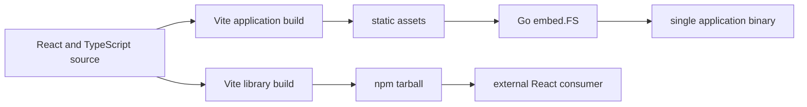

# Frontend Packaging, Embedding, and Release

The same React source serves two delivery models. Library consumers install `@go-go-golems/rag-evaluation-site` from npm and compose its components or default host. Go applications build the frontend as a static SPA and embed the assets into a binary. The Widget DSL is released separately as a Go module, so browser and authoring compatibility spans two package ecosystems.

> [!summary]
> - A reusable library and an embedded application can share source when their entrypoints and ownership are explicit.
> - Clean-consumer installation tests the published artifact more effectively than monorepo aliases alone.
> - Go and npm releases need an explicit protocol compatibility matrix.

## Two frontend products

The package build has library entrypoints such as root, IR, app, scheduling, and presets. A separate Vite configuration builds an application. These outputs answer different questions.

### Library output

The library build produces JavaScript, declarations, and CSS for another React project:

```text
@go-go-golems/rag-evaluation-site
@go-go-golems/rag-evaluation-site/ir
@go-go-golems/rag-evaluation-site/app
@go-go-golems/rag-evaluation-site/styles.css
```

Consumers provide React and React DOM as peer dependencies.

### Application output

The app build produces HTML, JavaScript chunks, CSS, and assets suitable for static serving. A Go application can embed these files and serve them alongside Widget page and action endpoints.



Sharing source is useful because direct npm consumers and embedded hosts render the same Widget protocol. It is safe only when library internals do not assume the default application's URL or server topology.

## Explicit package entrypoints

The current root barrel exports components, hooks, fixtures, palettes, actions, registries, and presets, and imports global CSS. This is convenient inside the monorepo but creates accidental public API.

A stronger export map should identify products rather than source directories:

```json
{
  "exports": {
    "./components": {
      "types": "./components.d.ts",
      "import": "./components.js"
    },
    "./widget": {
      "types": "./widget.d.ts",
      "import": "./widget.js"
    },
    "./app": {
      "types": "./app/index.d.ts",
      "import": "./app/index.js"
    },
    "./styles.css": "./styles.css",
    "./theme.css": "./theme.css"
  }
}
```

Fixtures and Storybook palettes should remain source/test artifacts. Importing the library should not apply global styles implicitly; applications opt in with a CSS import.

## Clean-consumer smoke testing

The package's `consumer-smoke.mjs` builds the actual distribution, packs it, creates a temporary project, installs the tarball, imports supported entrypoints, typechecks, and builds with Vite.

```pseudo
build package distribution
pack distribution to tarball
create empty React+Vite project
install tarball from filesystem
write imports that model a real consumer
run TypeScript typecheck
run Vite production build
```

This catches failures hidden by monorepo source aliases:

- missing declaration files;
- incorrect export maps;
- files omitted from the tarball;
- accidental dependencies on workspace-only packages;
- CSS paths that do not exist in the distribution;
- peer dependency mistakes.

The smoke should test every supported entrypoint and stop testing entrypoints intentionally removed in a major release.

## Embedded application delivery

An embedded SPA deployment has three runtime route classes:

```text
/api/widget/pages/...     Widget Page JSON
/api/widget/actions/...   action requests
/assets/...               immutable frontend assets
/pages/...                SPA route, served through index.html fallback
```

The Go server owns API and static delivery. React owns browser route interpretation. Unknown non-API routes normally return the SPA entrypoint so browser refresh works.

This pattern is developed generally in [[Research/KB/On-Ramp/go-cli-with-embedded-spa]]. The RAG package adds a reusable npm library and server-driven Widget protocol to that deployment shape.

## Dual release compatibility

The browser package and Go module are semantically coupled:

| Go side | Browser side |
|---|---|
| DSL builder method | Adapter and prop support |
| Lowered action/context shape | Action executor support |
| Page envelope version | Boundary parser support |
| Component type emitted | Registry adapter installed |
| New field or selection behavior | React component implementation |

A compatibility matrix should accompany releases. The following is a **proposed target format**, not a description of the inspected `v0.1.8` behavior:

```text
future rag-evaluation-system Go release
    emits Widget Page protocol widget.page/v1
    requires a declared compatible rag-evaluation-site npm range
```

At snapshot `7164b02`, producers emit `0.1.0` or `0.2.0`, the browser validates neither value, and no authoritative Go/npm compatibility range exists. The exact future policy may use major versions or protocol declarations, but the dependency must be visible. Independent semantic version numbers do not communicate cross-ecosystem compatibility automatically.

## Trusted npm publishing

The project publishes through GitHub Actions Trusted Publishing rather than a local npm token. The release sequence is:

```text
1. Bump package version in source.
2. Build, typecheck, and run consumer smoke locally.
3. Commit and push the immutable version.
4. Trigger the publish workflow.
5. Workflow builds from the pushed commit.
6. npm records provenance and updates the requested tag.
7. Verify version and gitHead.
```

A failed or behaviorally incomplete release is corrected with a new version. Published package contents are not rewritten.

## Coordinated consumer upgrade

A consumer such as Upwork Tracker needs both sides aligned:

```text
1. Upgrade Go module provider tag.
2. Upgrade npm renderer package.
3. Update xgoja provider version in configuration.
4. Regenerate xgoja runtime source.
5. Rebuild embedded frontend assets.
6. Run unit and browser smoke tests.
7. Commit dependency files and generated artifacts together.
```

The DataTable multi-selection release required npm `0.1.20`, then `0.1.21` to preserve active-row behavior, while the Go provider used `v0.1.8`. The sequence demonstrates why immutable releases and consumer smoke tests matter.

## Why this pattern works

The library/app split avoids copying the design system into every Go application. Embedded delivery removes Node and a separate static server from runtime. Trusted publishing reduces credential handling. Clean-consumer testing checks the artifact boundary. Coordinated upgrades make protocol change explicit.

## What goes wrong

### Root barrels become accidental stability promises

Every exported fixture or internal helper becomes importable. Removing it then appears as a package break even though it was never intended as product API.

### CSS has hidden global effects

A root import that automatically loads styles can affect applications that wanted only types or utility logic. Explicit CSS imports make ownership visible.

### Source aliases hide packaging defects

The repository app can compile directly against `src/index.ts` while the npm tarball lacks a required file. Only a clean consumer detects the difference.

### Go and npm versions drift

A new builder emits props unsupported by the installed renderer. Compilation succeeds because the two ecosystems do not resolve one another.

### Build-time tooling leaks into runtime

The final Go binary should not require pnpm or Vite. Node is a build dependency, not a deployment dependency.

### Application and library configurations drift

Two Vite configurations can develop different aliases, CSS processing, or asset assumptions. Shared configuration should contain common behavior; product-specific entrypoints remain explicit.

## When to use this pattern

Use the shared library plus embedded SPA shape when multiple Go applications need the same browser runtime or design system and deployment should remain a single binary. A one-off internal page may not need a public npm package.

## Candidate ecosystem rules

- Publish product entrypoints, not source barrels.
- Make stylesheet loading explicit in libraries.
- Test packed artifacts in a clean consumer.
- Treat Node/Vite as build dependencies for embedded applications.
- Declare compatibility between Go producers and npm renderers.
- Regenerate runtime and assets during consumer upgrades.
- Use immutable published versions and provenance-backed workflows.

## Related notes

- [[Research/Software Architecture Garden/rag-evaluation-system/05 - XGoja Provider and Runtime Packaging]]
- [[Research/Software Architecture Garden/rag-evaluation-system/07 - Storybook Tests and Golden Contracts]]
- [[Research/KB/On-Ramp/go-cli-with-embedded-spa]]
