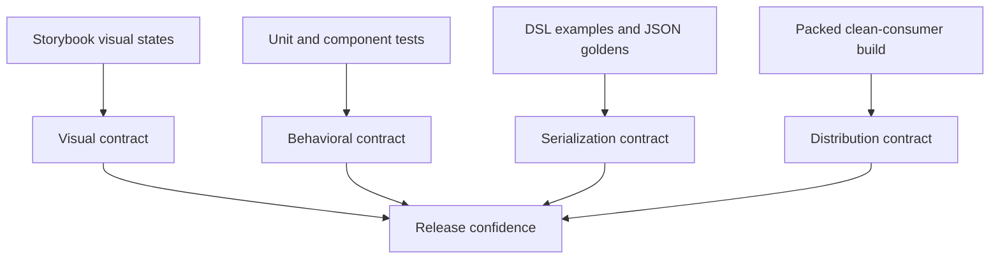

# Storybook, Tests, and Golden Contracts

The Widget system has four distinct correctness surfaces: visual component states, frontend behavior, serialized protocol output, and installed consumer artifacts. Each requires a different test form. The project contains pieces of all four, but their coverage is unbalanced: Storybook and DSL goldens are broad, while action execution, host behavior, page parsing, dialog behavior, and representative adapters lack direct automated tests.

> [!summary]
> - Storybook reviews visual states; it does not prove interaction or transport behavior by itself.
> - Goldens protect serialized protocols when examples are orthogonal and reviewed deliberately.
> - Behavioral tests and clean-consumer smoke complete the contract.

## Four validation layers



No one layer subsumes the others.

## Storybook as a visual contract

The package has extensive stories across foundation, atoms, layout, molecules, organisms, and WidgetRenderer integration. Useful states include:

- populated and empty;
- selected and active;
- dense and overflow;
- disabled;
- warning and error;
- alternate layout direction;
- controlled state transitions.

A Storybook story answers:

- Does the component render the intended anatomy?
- Are states visible and distinguishable?
- Does the theme apply coherently?
- Can a reviewer inspect responsive or dense behavior?
- Does a new component follow the design-system hierarchy?

The DataTable active-row plus multi-selection story is a good example. It demonstrates that one row can drive the detail pane while several rows remain checked for bulk actions. This is a state relationship that a static screenshot of the default table would miss.

Storybook does not automatically assert:

- that confirmation occurs once;
- that the selected keys in action context are correct;
- that server refresh is invoked;
- that malformed pages are rejected;
- that focus moves correctly after a dialog opens;
- that package exports exist in a tarball.

Stories can support interaction tests, but visual presence alone is not a behavioral assertion.

## Behavioral tests

The package's current focused checks cover calendar packing, month-grid cells, style lookup, and shortcut matching. These are useful pure-function tests. The missing suite is at component and host boundaries.

A minimum architecture suite should include:

```text
WidgetRenderer.test.tsx
widgetActionExecutor.test.ts
parseWidgetPage.test.ts
RagEvaluationSiteApp.test.tsx
FormDialog.test.tsx
DataTable.widget.test.tsx
representativeDomainAdapters.test.tsx
```

### Renderer tests

```pseudo
render a text node → text appears
render an element node → tag and children appear
render a known component → adapter receives correlated props
render an unknown component → explicit boundary error appears
nested children → stable recursive output
```

### Action tests

A recording runtime makes effects deterministic:

```ts
const runtime = new RecordingActionRuntime();
await executeWidgetAction(action, context, runtime);
expect(runtime.confirmations).toEqual(["Archive Job A?"]);
expect(runtime.serverRequests).toEqual([{ name: "archive", payload: { jobId: "a" } }]);
expect(runtime.refreshCount).toBe(1);
```

### Host tests

Host tests verify page fetch, version rejection, shell selection, navigation, loading state, refresh, and global notification behavior. They should not re-test every component.

### Adapter tests

Select representative adapters by interaction class:

- row/context action;
- form serialization;
- controlled selection;
- upload/file conversion;
- nested renderable values;
- overlay lifecycle.

Testing all 90 adapters identically would reproduce catalog maintenance. Test distinct behavior and add component-specific cases where risk justifies them.

## Golden protocol tests

The DSL keeps JavaScript examples and expected JSON. A golden is valuable when the serialized shape is itself a compatibility contract.

The test flow is:

```text
example JavaScript
    → Goja runtime
    → widget.dsl builders
    → exported page
    → normalized JSON
    → compare with checked-in golden
```

Goldens reveal changes in:

- page envelopes;
- component names;
- props and defaults;
- action and binding structures;
- ordering where ordering is contractual;
- semantic lowering.

They become harmful when dozens of nearly identical files change and maintainers regenerate them without reviewing meaning.

## Choosing orthogonal examples

A compact golden suite should cover distinct semantics:

1. Minimal page and shell.
2. Collection with schema, selection, sorting, and actions.
3. Form and server action.
4. One context or transcript workspace.
5. One scheduling/time composition.
6. One CRM or CMS semantic composition.
7. Action bindings and confirmation.
8. Validation failure diagnostics where output is contractual.

Examples that differ only in component inventory belong in Storybook or declaration fixtures, not separate end-to-end goldens.

## TypeScript declaration fixtures

JavaScript authors need declarations to match runtime methods. Compile representative TypeScript fixtures:

```ts
import widget = require("widget.dsl");

widget.data.collection(rows, c => c
  .id("jobs")
  .table(t => t.rowSelect(widget.act.navigate("/jobs"))));

// @ts-expect-error removed split-module or alias behavior
widget.style.legacyColor("red");
```

Declaration fixtures catch missing members and unwanted legacy APIs. They do not prove emitted JSON; runtime tests and goldens do that.

## Clean-consumer package smoke

A monorepo can compile while its package is broken. The clean-consumer smoke installs the packed artifact in a temporary Vite project, imports supported APIs and CSS, typechecks, and builds.

This test protects:

- export maps;
- declaration locations;
- peer dependency declarations;
- package file inclusion;
- CSS distribution;
- independence from workspace aliases.

It should be part of every npm release workflow.

## Cross-repository tests

A Go module or npm package can pass all repository tests and still break a known host. Breaking releases should validate:

- `rag-evaluation-system` itself;
- Upwork Tracker;
- `go-go-course`;
- generated xgoja example hosts.

Cross-repository validation is especially important while the Go producer and npm renderer have independent versions.

## What goes wrong

### Stories are counted as tests

A story demonstrates a state to a human. Without interaction assertions or visual snapshot infrastructure, it does not fail when action context or focus behavior breaks.

### Golden success hides false APIs

An inert slot marker can match its golden perfectly. The test proves serialization consistency, not that the browser renders the callback's intended output.

### Inventory parity replaces behavior

Tests can compare method lists across runtime, descriptors, and declarations while none calls the method meaningfully. Representative execution is stronger.

### Massive golden regeneration conceals protocol changes

When many snapshots change, reviewers stop reading them. Keep examples orthogonal and treat protocol changes as explicit migrations.

### Source build substitutes for package build

Path aliases resolve source files unavailable to npm consumers. Pack and install the artifact.

### Old behavior remains executable for archaeology

Tests that require retired modules prevent deletion. Replace them with negative tests that prove old names do not resolve.

## Recommended validation matrix

| Change | Storybook | Behavior tests | Goldens | Consumer smoke | Cross-repo smoke |
|---|---:|---:|---:|---:|---:|
| Visual component styling | Required | Focused | No | Build | Usually no |
| Adapter context change | Useful | Required | If IR changes | Required | Named consumers |
| DSL builder change | Example | Focused | Required | Declarations | Required |
| Page protocol change | Integration story | Parser/host | Required | Required | Required |
| Package export change | No | Type fixture | No | Required | Required |
| Token namespace cutover | Required visual review | Selected | No | Required | Embedded apps |

## Candidate ecosystem rules

- Match test form to contract type: visual, behavioral, protocol, or distribution.
- Keep golden examples orthogonal and review changes semantically.
- Compile declarations and execute runtime behavior separately.
- Pack and build a clean consumer before publishing npm packages.
- Run known consumer smokes for cross-ecosystem protocol changes.
- Replace archaeology tests with absence tests after hard cutovers.
- A story is evidence of intended state, not proof of behavioral correctness.

## Related notes

- [[Research/Software Architecture Garden/rag-evaluation-system/03 - React Components Adapters and Rendering]]
- [[Research/Software Architecture Garden/rag-evaluation-system/06 - Frontend Packaging Embedding and Release]]
- [[Research/Software Architecture Garden/rag-evaluation-system/08 - Architecture Debt and Patterns Not to Repeat]]
