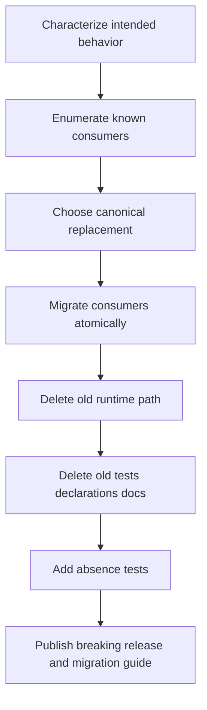

# Architecture Debt and Patterns Not to Repeat

Architecture debt is not code that looks untidy. It is a structure that makes the system support more models, authorities, or compatibility promises than its current users require. The RAG Widget system contains several forms of this debt because migrations introduced better paths without deleting the replaced mechanisms.

> [!summary]
> - A migration is incomplete while the old implementation remains callable and tested.
> - Duplicate catalogs create synchronization work without necessarily improving behavior.
> - Compatibility bridges need owners, consumers, and deletion criteria when introduced.

## 1. Parallel generations remain executable

The project moved from split modules—`ui.dsl`, `data.dsl`, `context_window.dsl`, `course.dsl`, and `cms.dsl`—through a typed `data.v2.dsl` experiment to one `widget.dsl` namespace. Provider registration now presents the unified module as current.

The old modules remain in `pkg/widgetdsl/module.go`. Helper maps, recipes, grammar paths, builders, declaration branches, and tests keep them operational. An `init()` function registers all module specs in a global registry.

The resulting system has two truths:

```text
Documented and explicit provider surface:
    widget.dsl

Globally registered implementation surface:
    ui.dsl
    data.dsl
    data.v2.dsl
    widget.dsl
    context_window.dsl
    course.dsl
    cms.dsl
```

This debt is expensive because every refactor must consider whether old modules still depend on a helper. Tests make deletion look like regression even when removal is the intended architecture.

### Rule not to repeat

When a hard cutover is chosen:

```text
migrate known consumers
add tests for the new path
remove old registration
remove old implementation
remove old declarations and docs
replace compatibility tests with absence tests
```

Git history preserves the retired implementation. Production source should not retain obsolete implementations solely as historical records.

## 2. Duplicate catalogs without generation

A Widget-capable component can appear in:

- React props;
- a Widget adapter;
- the registry;
- `RagWidgetType`;
- `WidgetProps`;
- a YAML manifest;
- a Go helper or builder;
- a v3 descriptor;
- TypeScript declaration strings;
- generated help;
- a Storybook story;
- a JavaScript example;
- a JSON golden.

Some duplication is justified because runtime code, declarations, examples, and tests have different responsibilities. The YAML manifest layer is not justified by generation. `widget-codegen` lists and checks manifests; it does not generate adapters, registries, types, or builders. Validation itself warns that slot/action schema validation is not implemented.

Five adapters have no manifest, demonstrating that the catalog is already incomplete.

### Rule not to repeat

Every metadata catalog must satisfy at least one condition:

1. It generates executable artifacts.
2. It validates a property that executable type systems cannot validate.
3. It supports a named runtime or operational consumer.

If it only repeats names and paths, delete it or make it authoritative through generation. Do not call a checker “codegen” when it generates nothing.

## 3. False serializable APIs

Several DSL slot methods accept callbacks and emit only a marker such as:

```json
{
  "kind": "slot",
  "registered": true
}
```

The callback output is absent. Browser prop contracts and adapters do not consume the marker. The API passes method-inventory and golden tests because the same inert marker is emitted consistently.

### Rule not to repeat

Before exposing a callback in a server-side DSL, answer:

```text
When is the callback executed?
What serializable value does it produce?
Which browser contract consumes that value?
Which test proves visible behavior?
```

If these questions have no answer, the callback does not belong in the public API.

## 4. Raw escape hatches defeat typed layers

`widget.raw.component` accepts arbitrary component names and props. The frontend's component type also permits any string. This bypasses semantic builders, validation, component inventories, and declaration guidance.

Escape hatches are often introduced to unblock migration. They become architecture debt when first-party code continues to depend on them and no removal issue exists.

### Rule not to repeat

A migration escape hatch must be:

- clearly named as temporary;
- blocked from new first-party use by lint or review;
- counted across known consumers;
- assigned a removal condition;
- deleted after the final consumer migrates.

If arbitrary HTML remains a real requirement, expose a constrained semantic-HTML API rather than a generic component bypass.

## 5. Informational protocol versions

The project emits multiple page version values, but `useWidgetPage` casts response JSON directly and does not inspect a version. The version does not choose a parser or reject incompatible data.

A version field without enforcement increases apparent rigor while providing no compatibility protection.

### Rule not to repeat

A protocol version must participate in behavior:

```pseudo
if response.schemaVersion != SUPPORTED_VERSION:
    reject response with explicit compatibility error
```

If no consumer branches or rejects based on version, remove the field until a real protocol boundary exists.

## 6. Compatibility branches without retirement criteria

`App.tsx` supports typed shells, legacy metadata, implicit default navigation, and a special root `CourseStudioShell` path. Theme documentation describes `--mac-*` tokens as a bridge while many CSS files still use them. Migration checkers remain in the repository without being wired as temporary release gates.

These paths may have been correct during migration. They became debt because no condition says when they disappear.

### A compatibility record should contain

```yaml
compatibility_path: legacy-course-root-shell
introduced: 2026-06-04
known_consumers:
  - go-go-course
replacement: page.shell kind root-owned
removal_condition: all page producers emit typed shell
removal_release: next major
owner: frontend maintainers
```

The exact format can vary. The information cannot be absent.

## 7. Extension abstractions without extension users

The registry exposes partial registries, entries, merging, and constant per-adapter module metadata. The repository uses these abstractions to construct one default registry. No named host composes independent registries as a supported product capability.

Generalization introduces vocabulary and compatibility obligations. It should follow a demonstrated second use, not precede it by default.

### Rule not to repeat

Start with the smallest interface that serves current consumers. Extract extension mechanisms when a second implementation reveals the actual variation point.

## 8. Broad package barrels become accidental APIs

The npm root star-exports components, hooks, fixtures, palettes, actions, registries, and presets and applies CSS as a side effect. The repository app imports from this root because aliases make it convenient. External users can then depend on any exported symbol.

This changes internal reorganization into a semver event.

### Rule not to repeat

Publish intentional product entrypoints:

```text
/components
/widget
/app
/styles.css
```

Keep fixtures, stories, palettes, and internal utilities out of public barrels. Public API review should occur at the export map, not emerge from directory star exports.

## 9. Story coverage is mistaken for behavioral protection

The package has many visual stories and few direct tests for renderer traversal, actions, page parsing, host refresh, dialogs, uploads, or adapters. This matters because a mass deletion plan can preserve visual examples while breaking behavior.

### Rule not to repeat

Match evidence to contract:

- Storybook for visual states.
- Component/unit tests for behavior.
- Goldens for serialized protocols.
- Clean-consumer smoke for packaging.
- Cross-repository smoke for integrated compatibility.

## 10. Duplicate runtime evaluators drift

Multiple commands independently create Goja runtimes, register modules, execute JavaScript, and export pages. One preview path also emits legacy shell metadata.

### Rule not to repeat

One canonical evaluator should power examples, previews, and smoke tests. Additional commands may provide different I/O, but they should call the same evaluator package.

## 11. Version alignment is implicit across ecosystems

Go module `v0.1.8` and npm package `0.1.21` participate in one Widget protocol. Neither package manager knows this relationship.

### Rule not to repeat

Cross-ecosystem protocols require a compatibility matrix in release documentation and consumer tests. A Go release that emits new props is not complete until the corresponding renderer exists and a consumer exercises both.

## Debt-removal sequence



The order matters. Deleting before characterization risks removing intended behavior. Retaining old runtime paths after consumer migration recreates the current debt.

## How to recognize this debt in another project

Ask these questions:

- How many ways can the same capability be invoked?
- Which file is authoritative for a component or command inventory?
- Does changing one API require editing several hand-maintained lists?
- Are “temporary” or “legacy” names present without removal tasks?
- Do tests execute behavior that product documentation says is removed?
- Does a protocol version change parsing behavior?
- Does an extension abstraction have more than one consumer?
- Does the package root export test fixtures or internal helpers?

Repeated “yes” answers indicate architecture debt rather than normal implementation detail.

## Related notes

- [[Research/Software Architecture Garden/rag-evaluation-system/02 - Semantic DSL to Widget IR Pipeline]]
- [[Research/Software Architecture Garden/rag-evaluation-system/07 - Storybook Tests and Golden Contracts]]
- [[Research/Software Architecture Garden/rag-evaluation-system/09 - Candidate Ecosystem Guidelines]]
