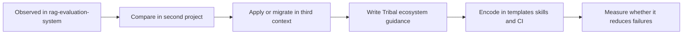

# Candidate Ecosystem Guidelines

This document extracts reusable rules from the `rag-evaluation-system` study. They are candidates, not established ecosystem standards. Each rule requires comparison with other projects before promotion into a Tribal note, template, or repository convention.

> [!summary]
> - Standardize boundaries and validation responsibilities, not the incidental syntax of one implementation.
> - Delay extensibility until a second consumer reveals the real variation point.
> - Treat migration deletion, package verification, and cross-ecosystem compatibility as architecture work.

## How to use these candidates

For each future project analysis, record whether the repository:

- implements the same constraint and invariant;
- uses a different but equally effective structure;
- lacks the constraint entirely;
- provides evidence that the candidate should be revised.

A rule should become ecosystem guidance only after it survives at least one comparison and one new implementation or migration.

## Candidate 1: Represent cross-process behavior as data

**Rule:** When one process authors behavior for another process, send typed intent and context rather than callbacks or executable source.

**Evidence in this project:** Widget actions cross the server/browser boundary successfully as `ActionSpec` plus interaction context. Deferred slot callbacks fail because their output is not serialized.

**Compare against:** Upwork Tracker Widget actions, go-go-course pages, streamed chat overlays, CLI-to-browser command descriptions.

**Promotion test:** The representation supports inspection, validation, testing, and at least two effect runtimes without adding arbitrary code execution.

## Candidate 2: Separate semantic authoring from transport lowering

**Rule:** Use an intent model before transport only when the model enforces meaningful invariants or removes repeated authoring detail.

**Evidence:** Collection, field, shell, and action specs provide useful semantic structure. Builders that merely copy maps add less value.

**Compare against:** Glazed command schemas, DMETA compiler stages, protobuf exchange, workflow definitions.

**Promotion test:** The intent layer catches errors earlier or supports multiple targets; it is not a second manually synchronized transport schema.

## Candidate 3: Keep reusable components free of application services

**Rule:** Published presentational components receive data and callbacks; routing, stores, network clients, and backend services remain in hosts or containers.

**Evidence:** The component hierarchy is reusable in Storybook, direct React usage, and Widget adapters. Stateful behavior hidden inside `FormDialog.widget.tsx` is harder to test and reuse.

**Compare against:** go-go-os rich widgets, embedded help browsers, course frontend packages.

**Promotion test:** Components can render in Storybook and a clean consumer without application providers unless the provider is part of the explicit component contract.

## Candidate 4: Distinguish visual components from remote protocol components

**Rule:** A reusable React component does not automatically receive a serialized adapter and long-term remote props contract.

**Evidence:** The project registers approximately 90 adapters, including low-level components not emitted by typed semantic authoring. This expands compatibility obligations.

**Compare against:** PBUI widget registries, chat overlay widgets, DMETA component catalogs.

**Promotion test:** Every remote component has a named authoring use, JSON-compatible semantics, context documentation, and behavioral coverage.

## Candidate 5: Generated hosts select capabilities explicitly

**Rule:** A generated JavaScript host declares providers in configuration; importing a Go package must not register hidden modules globally.

**Evidence:** xgoja provider selection is clear, while legacy `init()` registration exposes modules absent from the selected provider surface.

**Compare against:** go-go-goja native modules, geppetto/pinocchio hosts, text/search modules.

**Promotion test:** The generated plan completely describes module availability, declarations, and help.

## Candidate 6: One protocol version must correspond to one parser

**Rule:** A version field is useful only when the consumer validates it or chooses behavior from it.

**Evidence:** Multiple Widget page version labels coexist while the browser casts JSON without checking them.

**Compare against:** protobuf JSON exchange, devctl protocols, plugin NDJSON handshakes, stored event schemas.

**Promotion test:** Unsupported versions fail with an explicit compatibility error before application logic runs.

## Candidate 7: Every catalog must generate, validate, or serve a named consumer

**Rule:** Delete metadata inventories that only repeat executable source.

**Evidence:** YAML Widget manifests repeat adapter facts and are only listed/checked; they generate no runtime artifacts and remain incomplete.

**Compare against:** Glazed help metadata, logcopter catalogs, docmgr vocabulary, xgoja provider descriptors.

**Promotion test:** Removing the catalog would remove a concrete generated artifact, validation invariant, or operational feature.

## Candidate 8: Extensibility follows the second implementation

**Rule:** Start with the smallest interface that serves current consumers. Extract plugin, registry-composition, or multi-backend abstractions after a real second implementation reveals the variation.

**Evidence:** Partial Widget registries and constant module metadata serve one default registry.

**Compare against:** storage backends, output processors, provider registries, devctl plugins.

**Promotion test:** The abstraction can name at least two independently maintained implementations and the behavior they vary.

## Candidate 9: Migrations include deletion criteria

**Rule:** Every compatibility path records known consumers, replacement, owner, and removal condition when introduced.

**Evidence:** Split modules, legacy shell behavior, raw component escape, token bridges, and migration scanners survived their intended cutovers.

**Compare against:** CLI flag renames, database schema migrations, API versions, config compatibility, module aliases.

**Promotion test:** A maintainer can determine from repository evidence whether the compatibility path is still needed and when it should disappear.

## Candidate 10: Historical behavior belongs in Git, not executable tests

**Rule:** After a hard cutover, remove old implementations and tests that keep them operational; add negative tests proving they are absent.

**Evidence:** Legacy module tests require production code to retain old loaders and grammar.

**Compare against:** deprecated CLI commands, old REST endpoints, schema versions, browser compatibility adapters.

**Promotion test:** The replacement has positive tests, old entrypoints fail explicitly, and migration documentation points to the last supporting release.

## Candidate 11: Match validation method to contract type

**Rule:** Use visual review for visual contracts, behavior tests for interaction, goldens for serialized protocol, package smoke for distribution, and cross-repository smoke for integrated compatibility.

**Evidence:** Storybook and goldens are broad, but action and host behavior remain under-tested. Clean-consumer smoke catches artifact defects aliases cannot.

**Compare against:** embedded SPAs, CLI output formats, generated SDKs, protobuf payloads.

**Promotion test:** Release checklists identify which contract changed and invoke the matching validation layer.

## Candidate 12: Published packages expose product entrypoints

**Rule:** Export stable products such as components, renderer, host, and styles; do not star-export fixtures, story data, or internal helpers.

**Evidence:** The package root exposes many more runtime symbols than active consumers use and loads CSS as a side effect.

**Compare against:** go-go-os frontend packages, Glazed web packages, reusable rich widgets.

**Promotion test:** The export map can be reviewed as a concise public API and a clean consumer imports every supported entrypoint.

## Candidate 13: Cross-ecosystem protocols publish compatibility matrices

**Rule:** When a Go producer and npm renderer share a protocol, document and test which versions work together.

**Evidence:** Widget DSL `v0.1.8` and React package `0.1.21` jointly implement DataTable multi-selection; package managers do not encode their relationship.

**Compare against:** Go/protobuf/TypeScript packages, WASM host and browser glue, firmware and desktop control clients.

**Promotion test:** Release notes state protocol version and compatible package ranges, and at least one integrated consumer is tested.

## Candidate 14: Embedded SPAs keep Node at build time

**Rule:** Build frontend assets reproducibly, embed or package them, and ensure runtime deployment does not require Node or local `node_modules`.

**Evidence:** The package builds an application artifact for Go embedding while npm remains a separate reusable product.

**Compare against:** Glazed help browser, Codebase Browser, Upwork Tracker, local documentation tools.

**Promotion test:** A clean release artifact runs with only the Go binary or static directory and serves API/static/SPA routes correctly.

## Candidate 15: Compatibility token bridges have a fixed end state

**Rule:** When renaming a theme or configuration vocabulary, choose the canonical namespace, publish a mechanical mapping, and remove the bridge in a planned release.

**Evidence:** `--mac-*` is described as a bridge but is used broadly enough to behave as a second canonical vocabulary.

**Compare against:** CSS token migrations in go-go-os, configuration key migrations, log field renames.

**Promotion test:** New source cannot introduce old names, all consumers have a migration path, and the removal release is known.

## Comparison worksheet for the next project

```markdown
### Candidate: <name>

- Constraint in this project:
- Concrete implementation:
- Same invariant as rag-evaluation-system? yes/no/partial
- Important differences:
- Failure evidence:
- Recommendation:
  - keep project-local
  - revise candidate
  - promote toward Tribal guidance
  - retire candidate
```

## Likely next comparison projects

| Project | Why compare it |
|---|---|
| Upwork Tracker | Active consumer of Widget DSL, embedded SPA, SQLite, action handlers, and coordinated Go/npm upgrades. |
| go-go-course | Known compatibility facade and raw component consumer; useful migration study. |
| go-go-goja | Provider packaging and generated-host authority. |
| go-go-os frontend | Component libraries, widget registries, theming, and Storybook packaging. |
| Glazed help browser | Embedded SPA delivery and structured semantic models. |
| DMETA | Multi-stage semantic IR and generation tradeoffs. |

## Promotion path



The final step matters. A guideline should remain only if it makes implementation or review easier and prevents a failure we have actually observed.

## Related notes

- [[Research/Software Architecture Garden/README]]
- [[Research/Software Architecture Garden/rag-evaluation-system/08 - Architecture Debt and Patterns Not to Repeat]]
- [[Research/KB/Projects/rag-evaluation-system]]
- [[Research/KB/Projects/widget-dsl]]
