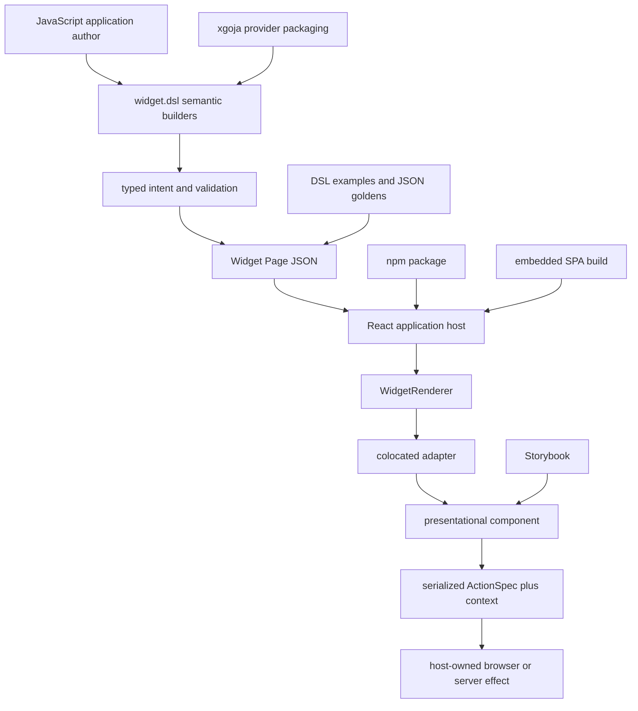

# Architecture Garden — rag-evaluation-system

This project study examines the architecture that emerged around the RAG Evaluation System's Widget platform. The repository was not designed from one comprehensive architecture. It accumulated a retrieval application, a reusable React package, a server-driven Widget IR, Go-backed JavaScript builders, generated xgoja hosts, Storybook review surfaces, and two release ecosystems. That history makes it valuable: strong boundaries and architecture debt are visible in the same codebase.

> [!summary]
> - The strongest pattern is the path from semantic JavaScript authoring through typed Go lowering and versioned data toward adapter-based React rendering.
> - The component hierarchy, JSON process boundary, serialized actions, and generated provider packaging are reusable ecosystem candidates.
> - Parallel DSL generations, duplicate catalogs, raw escape hatches, and compatibility paths without retirement criteria are patterns not to repeat.

## Snapshot identity

This study is tied to a precise source snapshot.

| Field | Value |
|---|---|
| Repository | `/home/manuel/code/wesen/go-go-golems/rag-evaluation-system` |
| Code snapshot | `7164b02ce8fedb21697e6d4079e785984007b0b7` |
| Analysis commit | `42aef1f6aafa5a2029bcebef3d227ce92fd63787` |
| Analysis date | 2026-07-26 |
| Source ticket | `RAG-WIDGET-SYSTEM-SIMPLIFICATION-2026-07-26` |

The code snapshot is the last product commit inspected by the analysis. The analysis commit adds the ticket and does not change runtime behavior. Future reviews should compare their source commit against these hashes before treating a conclusion as current.

## Scope of this first study

This directory studies the **Widget, React package, generated-host, and frontend delivery subsystem** inside `rag-evaluation-system`. It does not yet analyze the repository's ingestion, database, retrieval, workflow, evaluation, or backend service architecture. Those areas should become additional project studies under this same directory rather than being implied by the Widget analysis.

The limited scope is intentional. The first Garden entry establishes the method using the subsystem covered by the July 26 simplification ticket. The project-level directory remains the correct home because later backend and retrieval studies can be added beside it and connected through a revised project overview.

## Reading path

1. [[Research/Software Architecture Garden/rag-evaluation-system/01 - Project Architecture Overview|Project Architecture Overview]] explains the complete Widget-subsystem runtime and build topology.
2. [[Research/Software Architecture Garden/rag-evaluation-system/02 - Semantic DSL to Widget IR Pipeline|Semantic DSL to Widget IR Pipeline]] studies authoring, typed intent, lowering, and transport.
3. [[Research/Software Architecture Garden/rag-evaluation-system/03 - React Components Adapters and Rendering|React Components, Adapters, and Rendering]] explains the frontend layers and adapter boundary.
4. [[Research/Software Architecture Garden/rag-evaluation-system/04 - Serializable Actions and Host Owned Effects|Serializable Actions and Host-Owned Effects]] studies interaction across the JSON boundary.
5. [[Research/Software Architecture Garden/rag-evaluation-system/05 - XGoja Provider and Runtime Packaging|xgoja Provider and Runtime Packaging]] covers module installation and generated hosts.
6. [[Research/Software Architecture Garden/rag-evaluation-system/06 - Frontend Packaging Embedding and Release|Frontend Packaging, Embedding, and Release]] covers npm, Go embedding, build outputs, and release alignment.
7. [[Research/Software Architecture Garden/rag-evaluation-system/07 - Storybook Tests and Golden Contracts|Storybook, Tests, and Golden Contracts]] separates visual, behavioral, protocol, and consumer validation.
8. [[Research/Software Architecture Garden/rag-evaluation-system/08 - Architecture Debt and Patterns Not to Repeat|Architecture Debt and Patterns Not to Repeat]] records what should be deleted rather than standardized.
9. [[Research/Software Architecture Garden/rag-evaluation-system/09 - Candidate Ecosystem Guidelines|Candidate Ecosystem Guidelines]] extracts rules to compare against other projects.

## Pattern map

The diagram contains the central architectural claim of this study: the system works when each transition has a clear representation and owner. Complexity grows when two generations implement the same transition or when an escape hatch bypasses it.

## Pattern maturity summary

| Pattern | Maturity | Assessment |
|---|---|---|
| Semantic DSL → typed intent → Widget IR | Candidate ecosystem pattern | Strong boundary, but implementation still mixes typed specs and raw maps. |
| Presentational React component + transport adapter | Established | Clear separation in many components; catalog is too broad. |
| Serialized action intent + host-owned effects | Candidate ecosystem pattern | Highly reusable; current implementation duplicates execution. |
| Generated xgoja provider packaging | Established | Active hosts use it; module registration still carries legacy globals. |
| Reusable npm package + embedded SPA | Candidate ecosystem pattern | Useful deployment shape with release coordination costs. |
| Storybook + behavioral tests + protocol goldens + consumer smoke | Emergent | All pieces exist, but behavioral coverage is incomplete. |
| Split DSL modules and raw component authoring | Retired in intent | Still executable and must be removed. |
| YAML Widget manifest catalog | Architecture debt | Repeats facts without generating runtime code. |
| Legacy shell and token compatibility bridges | Architecture debt | No explicit retirement condition. |

## What is solid

The project has four especially valuable boundaries.

First, the JSON Widget Page is a real process and network boundary. JavaScript runs in Goja on the server; React runs in the browser. Data can cross that boundary, functions cannot. This constraint explains why action specifications work and inert callback slots do not.

Second, the React package distinguishes presentational components from backend-connected application behavior. Package components receive data and callbacks rather than importing stores, routers, or services. That makes Storybook and direct reuse possible.

Third, xgoja provider packaging gives generated binaries a repeatable JavaScript module surface. Host projects select a provider instead of reconstructing module registration manually.

Fourth, release validation includes clean-consumer packaging rather than only monorepo typechecking. That catches missing files and export-map errors that source aliases hide.

## What remains emergent

Several patterns have the correct pieces but lack one explicit contract:

- The page protocol has version fields in producers but no enforced browser parser.
- Typed specs exist but do not own all lowering.
- Adapters provide useful isolation, but every React component was treated as a potential transport component.
- Storybook is extensive, but action and host behavior lack direct tests.
- Compatibility migrations happened, but their old implementations were not deleted.

These are not arguments against the patterns. They identify the work required before promoting them as defaults.

## Source and related notes

- [[Research/KB/Projects/rag-evaluation-system]] — project capability map.
- [[Research/KB/Projects/widget-dsl]] — Widget DSL knowledge map.
- [[Research/KB/On-Ramp/go-cli-with-embedded-spa]] — reusable embedded SPA delivery model.
- [[Research/KB/Fundamentals/rendering-pipeline-fundamentals]] — broader rendering-pipeline concepts.
- Source report: `/home/manuel/code/wesen/go-go-golems/rag-evaluation-system/ttmp/2026/07/26/RAG-WIDGET-SYSTEM-SIMPLIFICATION-2026-07-26--simplify-rag-evaluation-site-package-and-widget-dsl/design-doc/01-rag-evaluation-site-and-widget-dsl-simplification-analysis-and-hard-cutover-guide.md`
