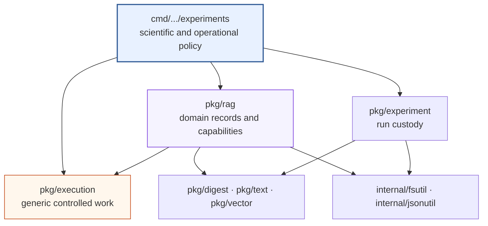

# Explicit Experiments and Layered Composition

An experiment contains decisions that should remain easy to inspect: which
inputs are selected, which alternatives are compared, which resources may be
used, and which measurements define success. `rag-ttc` keeps these decisions
in ordinary Go control flow. Shared packages provide reusable mechanisms and
RAG capabilities, but no package converts the experiment into a generic
workflow graph.

This chapter explains why that boundary matters, how the repository enforces
it, and how a new project can reuse the pattern without copying the
repository's domain-specific choices.

> [!summary]
> - Generic mechanisms control execution without understanding RAG.
> - Domain packages define the meaning of chunks, embeddings, retrieval, and
>   generated answers.
> - Experiment commands select hypotheses, alternatives, resource ceilings,
>   and result formats.
> - Configuration determines the required capability graph before providers
>   and indexes are constructed.

## 1. Three kinds of code

The first step is to classify a responsibility by what it must know.

### Generic mechanism

A generic mechanism has a contract that can be stated without reference to
documents, models, retrieval, or answers. Examples include:

- execute typed work with at most `N` workers;
- admit at most `K` resource units;
- load and store a typed value under a semantic key;
- publish a file atomically;
- compute a deterministic digest;
- validate that a numerical vector contains finite values.

These mechanisms live in packages such as `pkg/execution`, `pkg/digest`,
`pkg/text`, and `pkg/vector`.

### Domain capability

A domain capability uses RAG concepts and enforces their semantics. Examples
include:

- chunk a document while preserving source ranges;
- embed a batch and require one finite vector of the expected dimension per
  input;
- retrieve ranked representation hits;
- hydrate a ranked hit back to source evidence;
- generate a grounded answer with valid citations.

These contracts live in `pkg/rag` and its subpackages. A generic cache cannot
decide whether an embedding dimension is correct. The embedding adapter must
make that decision.

### Experiment policy

Experiment policy chooses what a particular run means. Examples include:

- compare BM25, vector, RRF, and reranked RRF;
- use the first ten evaluation queries;
- request five pieces of evidence;
- benchmark summary concurrency values `1`, `2`, `4`, and `8`;
- export a particular CSV schema;
- fail the entire campaign unless the declared budget covers every planned
  item.

This code remains under `cmd/rag-ttc/cmds/experiments`. It is shared only when
a second concrete experiment demonstrates an identical invariant.

## 2. The dependency rule

The repository uses semantic dependency to decide package ownership:

```text
Does the public contract require RAG types or RAG invariants?
    yes -> RAG package
    no  -> focused generic package candidate

Does the behavior select an experimental alternative, prompt, metric,
artifact, or failure policy?
    yes -> experiment command

Does more than one current consumer require the same mechanism?
    no  -> keep it local until another consumer exists
```

This produces the following direction:



At the analyzed commit, `pkg/execution`, `pkg/digest`, `pkg/text`, and
`pkg/vector` do not import `pkg/rag`, experiment commands, or one another in a
cycle. Experiment implementations do not import other experiment
implementations.

## 3. The experiment command as composition root

A composition root is the code location that selects concrete implementations
and connects them. In `rag-ttc`, each Glazed command is a composition root.
It reads settings, resolves providers, creates indexes and decorators, and
calls explicit experiment functions.

A simplified answer-quality sequence is:

```text
decode and validate settings
load corpus and evaluation set
select queries and retrieval arms
derive capability requirements
derive resource ceilings
validate budgets and cost ceiling
resolve only required provider roles
create run directory
chunk corpus and build raw representations
construct only required indexes
for each query and selected arm:
    retrieve source evidence
    generate and validate an answer
    append completed query-arm record
derive reports from completed records
mark run complete
```

There is no `Runner` interface shared across backend, answer, and summary
experiments. Their sequences overlap, but their meanings differ. A backend
bakeoff produces one result per search implementation. An answer study produces
one result per query and retrieval arm. A summary benchmark produces one result
per execution variant. A common stage graph would have to encode those
differences as configuration and callbacks, moving readable policy out of the
experiment.

## 4. Why explicit orchestration is useful

Direct Go control flow provides several practical properties.

First, the experiment is reviewable. A reader can follow selection,
preparation, execution, and measurement in the same language used to
implement the components.

Second, normal language features express variation. Loops define a benchmark
matrix. Conditional statements define optional arms. Typed functions define
boundaries. Context cancellation and errors use standard Go behavior.

Third, the system does not need a second representation of the experiment. A
workflow schema would require parsing, validation, lowering, versioning, and
debugging before it could invoke the same functions.

Fourth, extraction remains evidence-driven. If two experiments later require
the same substantial sequence under the same invariants, that sequence can be
extracted then. The repository does not predict a generalized workflow in
advance.

## 5. Capability-driven dependency planning

Explicit orchestration does not justify unconditional setup. The selected
experiment alternatives must determine which capabilities exist.

The answer experiment supports four retrieval arms:

| Arm | Lexical search | Embeddings | Vector search | Reranking | Generation |
| --- | ---: | ---: | ---: | ---: | ---: |
| BM25 | required | no | no | no | required |
| Vector | no | required | required | no | required |
| RRF | required | required | required | no | required |
| RRF reranked | required | required | required | required | required |

This table defines more than provider construction. It also determines:

- call ceilings;
- budget plans;
- rate limiters;
- corpus and query preparation;
- index construction;
- persisted manifests;
- cleanup responsibilities.

The command computes these requirements before acquiring resources:

```text
needs_vector =
    selected arms contain vector, RRF, or reranked RRF

needs_reranker =
    selected arms contain reranked RRF

embedding_ceiling =
    if needs_vector then representation_count + query_count else 0

generation_ceiling =
    query_count * selected_arm_count

reranking_ceiling =
    if needs_reranker then query_count else 0
```

The command then requests only the corresponding provider roles.

## 6. The BM25-only defect

Before commit `0f30fad`, a BM25-only answer run still resolved the embedding
provider, embedded 1,982 corpus representations, embedded the query, and built
a SQLite vector index. The selected arm never read any of those values.

This defect had four consequences:

1. A lexical experiment required embedding credentials.
2. Preflight declared 1,983 irrelevant embedding items.
3. The run consumed time and potentially money unrelated to its result.
4. The run directory implied that vector retrieval participated in the
   experiment.

The correction did not add a generalized dependency-injection framework. It
made the existing experiment policy explicit and used it consistently.

A focused regression test constructs a BM25-only run with a nil embedder and
zero embedding budget. The run completes, produces an answer, creates only a
Bleve index, and emits no vector manifest.

The broader rule is:

> Select the capability graph before constructing providers, calculating
> budgets, or emitting artifacts.

## 7. Focused generic packages

The refactor applied the same dependency rule to small mechanisms.

| Package | Responsibility | Why it is not RAG-specific |
| --- | --- | --- |
| `pkg/digest` | Deterministic byte, text, JSON, and truncated identities | Hashing does not require RAG records |
| `pkg/text` | One Unicode letter-and-number term policy | Term splitting is used by several local baselines |
| `pkg/vector` | Finite checks, dimensions, normalization, and cosine | Numerical slices do not require retrieval hits |
| `internal/fsutil` | Atomic files, containment, directory sync and size | Persistence mechanics do not define artifact meaning |
| `internal/jsonutil` | Strict single-value decoding and fence removal | Parsing does not define model-output semantics |

The packages are focused rather than collected under `util`. Each has a
coherent vocabulary and multiple current consumers. Private helpers remain
under `internal` because the repository has no evidence that they should
become public ecosystem APIs.

The migration deleted the old helpers instead of leaving forwarding aliases.
This keeps one owner for each contract.

## 8. What remains project-local

The following choices belong to current experiments:

- retrieval arm names;
- BM25 and RRF parameters;
- summary packing strategies;
- concurrency matrices;
- prompt text;
- answer and summary schemas;
- review scoring;
- TTC query selection;
- CSV columns and result filenames.

They may be well designed, but one implementation does not make them general.
Promoting them would require independent consumers with the same meaning.

## 9. When to reuse this pattern

Use explicit composition when:

- experiments change more often than the underlying capabilities;
- a developer should be able to read the procedure directly;
- one process owns execution;
- the workload does not require distributed scheduling;
- normal Go control flow can express the variants;
- durable results can be recorded independently of orchestration.

A workflow engine may be justified when independent scheduling, remote
workers, operator-driven retries, cross-process coordination, or a stable
user-authored workflow language is a requirement. The decision should follow
from those constraints, not from the existence of more than one step.

## 10. Review questions for another project

When applying this pattern elsewhere, ask:

```text
Which code defines the scientific or product policy?
Which operations have stable domain contracts?
Which mechanisms can be described without the domain?
Does each proposed shared package have more than one consumer?
Does configuration select dependencies before resources are acquired?
Could a developer understand the experiment without interpreting a second DSL?
Would a workflow representation provide a required capability that direct code
cannot provide?
```

The reusable result is not a fixed directory tree. It is a responsibility
boundary: generic mechanisms below domain capabilities, domain capabilities
below explicit application policy, and dependency selection before resource
acquisition.
