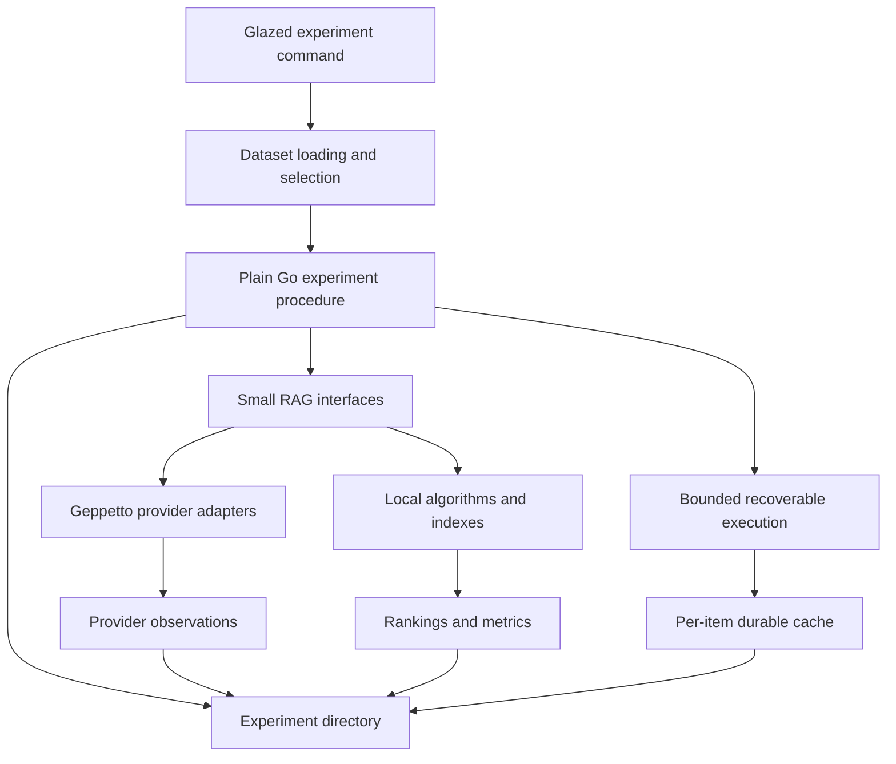

# Project Architecture Overview

The architecture of `rag-ttc` follows one governing decision: an experiment is a Go program, not a workflow description. The program selects data, constructs components, invokes them in scientific order, measures the result, and writes artifacts. Shared packages own bounded mechanisms and stable domain contracts, but they do not own the experiment sequence.

## The five architectural regions

The repository has five regions with distinct responsibilities.

| Region | Responsibility | Examples |
|---|---|---|
| Experiment commands | Scientific procedure and CLI policy | backend bakeoff, answer quality, summary performance |
| RAG domain | Records and component interfaces | `Document`, `Chunk`, `Embedder`, `Searcher`, `Generator` |
| Capability packages | Concrete algorithms and adapters | chunking, BM25, Bleve, SQLite FTS, exact vectors, reranking |
| Execution control | Safe execution of expensive work | workers, rate limits, budgets, caches |
| Experiment custody | Durable records of a run | config, inputs, observations, results, status |

The runtime topology is:



No package in this graph needs to know the entire sequence. The command is the only place where the hypothesis becomes a control flow.

## Stable domain records

`pkg/rag/types.go` uses explicit records rather than passing unstructured maps between stages. A source document becomes one or more chunks. A chunk may have one or more representations. A representation may have a vector. Search returns hits that retain representation, chunk, document, channel, score, and rank identities.

The lineage path is:

```text
Document
  -> Chunk
      -> Representation
          -> Vector
              -> Hit
                  -> FusedHit
                      -> Evidence
```

This lineage makes evaluation target selection possible. A judgment can refer to a representation, chunk, document, or evaluation unit. Retrieval code may change rankings without discarding the identifiers needed to evaluate those rankings.

## Small interfaces as substitution points

`pkg/rag/components.go` defines narrow interfaces:

```go
type Embedder interface {
    Embed(context.Context, EmbeddingRequest) (EmbeddingResult, error)
}

type Searcher interface {
    Search(context.Context, Query, int) ([]Hit, error)
}

type Generator interface {
    Generate(context.Context, GenerationRequest) (GenerationResult, error)
}
```

These interfaces allow deterministic local components and live provider-backed components to occupy the same experiment position. The hash embedder can replace an OpenAI embedding provider. In-memory BM25 can be compared with Bleve or SQLite FTS. Exact in-memory vectors can be compared with a persistent SQLite vector index.

The interfaces are deliberately less expressive than the command. They do not encode stage graphs, retries, artifacts, or evaluation policy.

## The end-to-end path

The end-to-end example makes the composition visible:

```text
load documents
chunk documents
create raw representations
embed representations
construct lexical and vector searchers
run query through each searcher
fuse rankings
hydrate evidence
generate or evaluate output
write observations and results
complete run
```

Every step is an ordinary function call. The important architecture is not a hidden engine but the boundary between each call's domain contract and the command's policy.

## How the patterns are woven together

The package boundaries reinforce one another:

1. Stable records preserve identity across algorithms.
2. Small interfaces allow local and provider implementations to substitute.
3. Execution decorators add cache, worker, rate, and budget behavior without changing the interfaces.
4. The command composes the decorated components according to the experiment.
5. The run directory records configuration, observations, and results independently of any component implementation.

Removing any one boundary weakens the others. Without stable identity, cache keys and evaluation targets become ambiguous. Without small interfaces, execution decorators must know provider details. Without run custody, successful cache recovery does not produce auditable experimental evidence.

## Pattern assessment

The overall composition is **established**. It is exercised by examples, sample tests, persistent backend tests, and live provider experiments. The exact package organization is being refined, but the responsibility graph is stable.

## Related documents

- [[README|Architecture Garden — rag-ttc]]
- [[02 - Plain Go Experiments and the Mechanism Policy Boundary]]
- [[03 - Recoverable Bounded Execution for Expensive Work]]
- [[04 - Experiment Directories as Result Custody]]
- [[05 - Typed RAG Contracts and Backend Adapters]]
