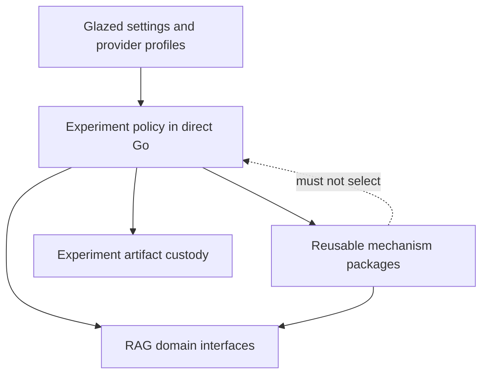

# Plain Go Experiments and the Mechanism–Policy Boundary

An experiment answers a question by making choices. It selects a workload, chooses variants, defines prompts and schemas, establishes budgets, orders operations, and decides which measurements count as results. Hiding those choices behind a generic stage engine makes the experiment shorter but makes its meaning harder to inspect.

`rag-ttc` therefore keeps experiment policy in direct Go control flow.

## Defining mechanism and policy

A mechanism explains how an operation is performed safely and consistently. Policy explains which operation the experiment performs and why.

| Mechanism | Policy |
|---|---|
| Run at most four calls concurrently | Compare concurrency values 1, 2, 4, and 8 |
| Charge a finite generation budget | Authorize 22 generation calls for this campaign |
| Cache each successful summary | Summarize each chunk, each batch, or each whole document |
| Strictly decode one JSON value | Require exactly the requested chunk identifiers |
| Append a completed result record | Choose result columns and arm names |

Mechanisms are reusable because their invariants remain the same across experiments. Policies remain local because changing them changes the experimental question.

## Direct orchestration

A readable experiment runner should resemble:

```go
func run(ctx context.Context, cfg Settings) error {
    workload := prepare(ctx, cfg)
    providers := resolveProviders(ctx, cfg)
    indexes := buildIndexes(ctx, workload, providers)

    for _, variant := range variants(cfg) {
        output := runVariant(ctx, variant, indexes, workload)
        report := evaluate(output, workload.Judgments)
        appendCompletedResult(report)
    }

    return completeRun()
}
```

The runner names the scientific stages. The functions implement cohesive operations. There is no generic `Stage`, `Node`, `ArmExecutor`, or registry required to understand the order.

## Why the boundary matters

The backend bakeoff, answer-quality experiment, and summary-performance experiment all use embedding, caching, budgets, observations, and artifacts. They do not use those mechanisms for the same purpose.

The summary-performance experiment varies concurrency, batching, whole-document packing, and multi-turn generation. The answer-quality experiment varies retrieval and reranking arms, then validates grounded-answer contracts and optionally constructs blinded review data. A shared workflow abstraction would either expose a large option surface or force the experiments into an artificial common sequence.

Shared functions provide the correct reuse unit:

```text
experiment A ─┐
experiment B ─┼─> small reusable operation
experiment C ─┘
```

They do not require:

```text
experiment configuration -> generic workflow interpreter -> callbacks -> artifacts
```

## Glazed commands at the boundary

The commands use Glazed for CLI schemas, settings, help, and structured output. Glazed owns the operational command surface, but it does not own the experiment algorithm. Parsed settings become typed configuration; the runner then executes normal Go.

This separation gives the project both:

- ecosystem-consistent CLI behavior;
- direct, testable experimental control flow.

## The pattern, stated precisely

The pattern has three layers. The distinction between them is more important than the number of functions or packages.

```text
Layer 1: command boundary
    Parse user-controlled settings.
    Resolve profiles and credentials.
    Validate authorization limits.
    Select output fields.

Layer 2: experiment policy
    Select the workload.
    Define the variants.
    Choose prompts and schemas.
    Order the operations.
    Decide what is measured.

Layer 3: reusable mechanisms
    Execute bounded work.
    Cache completed items.
    Build an index.
    Resolve a provider adapter.
    Append an artifact.
```

The command boundary is operational policy. Experiment policy is scientific policy. Reusable mechanisms implement stable technical contracts. The runner may call all three layers, but a shared package must not depend upward on the policy layers.



The dotted dependency is forbidden. A cache mechanism cannot choose which arms exist. An embedding helper cannot decide how many queries belong in the experiment. An artifact writer cannot decide which columns constitute success.

## A concrete summary-performance example

The summary-performance experiment asks how several execution strategies affect elapsed time and provider usage. Its policy includes:

- concurrency arms with one, two, four, and eight concurrent requests;
- fixed batches of four and eight chunks;
- one whole-document request containing marked chunks;
- a second generation turn after the first summary.

A mechanism package should not know those names. It should receive groups and execution options.

```go
type GenerationArm struct {
    Name        string
    Workers     int
    BatchSize   int
    WholeDoc    bool
    Turns       int
}

func runArm(ctx context.Context, arm GenerationArm, items []SummaryItem) (Result, error) {
    groups := packAccordingToArm(items, arm) // experiment policy

    summaries, cacheReport, err := execution.MapCachedGroups(
        ctx,
        groups,
        execution.CachedGroupOptions[SummaryItem]{
            Workers: arm.Workers,
            Cache:   summaryCache,
            Limiter: generationLimiter,
            Key:     summaryCacheKey,
        },
        summarizeGroup, // provider mechanism behind rag.Generator
    )
    if err != nil {
        return Result{}, err
    }

    return measureArm(arm, summaries, cacheReport), nil
}
```

The distinction can be read directly from the code:

- `packAccordingToArm` remains in the experiment because it defines the comparison.
- `MapCachedGroups` belongs in generic execution because it only knows groups, keys, limits, and results.
- `summarizeGroup` uses the RAG generator contract because it knows generation requests and responses.
- `measureArm` remains in the experiment because it defines the reported evidence.

## A concrete answer-quality example

The answer-quality experiment follows a different sequence:

```text
prepare corpus
  -> build lexical and vector indexes
  -> run selected retrieval arms
  -> evaluate retrieval
  -> construct bounded evidence context
  -> generate grounded answers
  -> validate answer contracts
  -> optionally prepare blinded human review
```

Trying to force this sequence and the summary-performance sequence into one runner interface would produce options that are meaningless for one side. A summary concurrency arm has no human-review phase. A retrieval arm has no whole-document summary packing.

The direct runner instead names cohesive functions:

```go
func runAnswerQuality(ctx context.Context, cfg Settings) error {
    workload, err := prepareWorkload(ctx, cfg)
    if err != nil {
        return err
    }

    indexes, err := buildIndexes(ctx, workload, cfg)
    if err != nil {
        return err
    }

    retrieval, err := runRetrievalVariants(ctx, indexes, workload, cfg.Arms)
    if err != nil {
        return err
    }

    answers, err := generateGroundedAnswers(ctx, retrieval, cfg)
    if err != nil {
        return err
    }

    return writeResults(ctx, retrieval, answers)
}
```

This code is longer than a declarative pipeline literal. It is also more explicit. The reader sees which values move between stages, where failure stops the run, and which decisions are specific to answer quality.

## How to decide whether to extract a function

Use four questions.

### Does changing the function change the experiment's question?

If yes, it is policy. Changing `Workers` from four to eight may be the independent variable, so the matrix that selects those values remains local. The worker scheduler itself remains reusable.

### Can the function's contract be explained without arm names or TTC concepts?

If yes, it is a candidate mechanism. “Execute groups with bounded concurrency and item-level caching” is generic. “Execute the `whole-document` arm” is not.

### Are the invariants shared by at least two consumers?

Usage aggregation, target resolution, cached embedding, and provider construction all have multiple consumers. A one-off report renderer does not become a library merely because it could be parameterized.

### Would extraction hide the order that a reviewer needs to inspect?

If yes, keep orchestration direct. A generic lifecycle callback such as `BeforeStage`, `AfterStage`, or `OnArtifact` makes the procedure harder to read unless lifecycle extension is itself a requirement.

## Testing this architecture

The mechanism and policy layers need different tests.

Mechanism tests assert stable invariants:

```text
Map preserves input order.
Map never exceeds the worker limit.
Cache hits consume no budget.
Completed items survive later failures.
Strict JSON rejects unknown fields.
Atomic artifacts never expose partial JSON.
```

Experiment tests assert scientific structure:

```text
The matrix is staged rather than factorial.
The whole-document arm never mixes documents.
Every requested chunk ID appears exactly once.
The answer-quality arm list produces the expected result keys.
The selected query split contains only approved queries.
```

This test division is part of the pattern. A package test proves the mechanism once. A command test proves that the experiment chose and assembled the mechanisms correctly.

## Failure modes

The pattern fails when direct Go becomes an excuse for copying mechanisms. Three runners should not contain three cache schedulers. It also fails when package extraction removes visible policy. A generic `ExperimentRunner` that accepts a registry of stages would restore the abstraction this design is avoiding.

The correct balance is:

```text
direct orchestration
    + shared cohesive operations
    + small domain interfaces
    - generic workflow interpretation
    - copied operational machinery
```

## Implementation checklist for another project

1. Write one end-to-end procedure as direct code.
2. Name the scientific or product decisions in that code.
3. Identify repeated mechanisms only after a second procedure exists.
4. Extract functions whose invariants are independent of both procedures.
5. Keep configuration parsing at the command boundary.
6. Keep domain adapters free of CLI parsing and environment reads.
7. Test mechanisms and policy assembly separately.
8. Reject registries and stage graphs unless serialized or distributed orchestration is a real requirement.

## Signs that policy has leaked into a package

A proposed shared API should be rejected or narrowed when it begins to contain:

- experiment arm names;
- prompt templates;
- workload selection rules;
- report column definitions;
- a registry of steps;
- conditional stage dependencies;
- TTC-specific evaluation target assumptions;
- human-review policy.

These are not inherently bad concepts. They are bad shared-package concepts because another experiment cannot reuse them without inheriting the first experiment's question.

## Signs that mechanism remains trapped in a command

Command code should be extracted when it repeatedly implements:

- cache lookup and durable item storage;
- bounded worker scheduling;
- rate and budget admission;
- provider usage aggregation;
- provider observation;
- target identity resolution;
- atomic artifact writing.

The simplification ticket uses this test to decide what moves into packages.

## Applicability

Reuse this pattern when:

- experiments change frequently;
- the scientific procedure must remain reviewable;
- shared operations have narrow contracts;
- there is no external need to serialize and remotely schedule the workflow.

Do not use it as a rejection of all workflow systems. A durable multi-process scheduler is appropriate when orchestration itself is a product requirement. `rag-ttc` does not have that requirement.

## Candidate ecosystem rule

> Share mechanisms with stable invariants. Keep experimental and product policy in direct application code until at least two consumers demonstrate the same policy contract.

## Related documents

- [[01 - Project Architecture Overview]]
- [[03 - Recoverable Bounded Execution for Expensive Work]]
- [[07 - Architecture Debt and Patterns Not to Repeat]]
- [[08 - Candidate Ecosystem Guidelines]]
