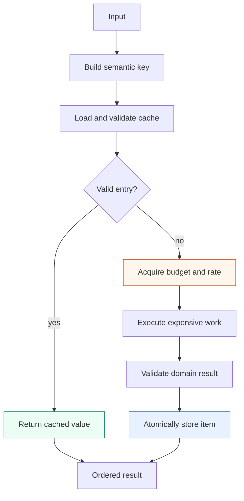

# Recoverable and Resource-Bounded Execution

Embedding, generation, and reranking can consume money, provider quota, local
memory, network connections, and substantial wall-clock time. They also fail
after partial progress. An execution subsystem for reproducible research must
therefore answer four separate questions:

1. How many operations may execute concurrently?
2. How quickly may work begin?
3. How much total work is authorized?
4. Which completed results can be reused after interruption?

`rag-ttc` answers these questions with composable generic mechanisms in
`pkg/execution`. RAG adapters add domain validation and semantic cache
identity. Experiment commands define the resource plans.

> [!summary]
> - Worker limits, rates, finite budgets, and monetary ceilings represent
>   different constraints and remain separate.
> - Cache hits are resolved before resource admission, allowing replay without
>   authority to call a provider.
> - Providers may process batches, but every successful item is committed
>   independently.
> - Invalid cache presence fails closed; it is not converted into an
>   authorization to recompute.

## 1. Define the units before writing the scheduler

Concurrent benchmarks contain several units that are easy to conflate.

| Concern | Unit in a typical embedding campaign |
| --- | --- |
| Input | One text or representation |
| Provider request | One batch of texts |
| Worker occupancy | One active provider request |
| Budget | Number of embedded texts |
| Rate | Requests or items admitted per interval |
| Recovery | One semantic input result |
| Experiment result | One benchmark variant or query |

A batch size of 100 does not mean the budget should charge one unit. The
provider performs one request, but it returns 100 purchased results. Likewise,
one failed request should not discard earlier results from other batches.

The implementation records both item counts and work-call counts. This makes
it possible to distinguish batching efficiency from total authorized work.

## 2. Bounded ordered parallel work

`execution.Map` is the base primitive. It accepts typed inputs, a worker count,
an optional limiter, an optional item-cost function, and a context-aware
callback:

```go
results, err := execution.Map(
    ctx,
    inputs,
    execution.MapOptions[Input]{
        Workers: 4,
        Limiter: limiter,
        Cost:    func(Input) int { return 1 },
    },
    work,
)
```

The implementation gives each job its original index. Workers may finish in
any order, but values are written to their corresponding result positions.
The returned slice therefore has deterministic input order.

The simplified algorithm is:

```text
validate worker count and options
allocate results with len(inputs)
create errgroup and derived cancellation context

producer:
    send indexed jobs until input is exhausted or context is canceled

fixed worker set:
    receive job
    calculate positive resource cost
    wait for limiter admission
    call work function with group context
    store value at original index

wait for producer and workers
return ordered results or first annotated error
```

`errgroup` propagates the first failure and cancels pending work. Every public
operation accepts `context.Context`, allowing caller cancellation to reach
rate waits and provider calls.

## 3. Three independent controls

### Worker bound

The worker count limits simultaneously active callbacks. It protects memory,
connections, CPU, and provider concurrency limits. Capacity becomes available
when a callback finishes.

### Rate limiter

The rate limiter controls admission over time. A token bucket can allow a
burst and then replenish at a configured rate. It answers how quickly work may
start, not how much may run in total.

### Finite budget

The budget authorizes a maximum number of resource units for the entire run.
It does not replenish. A budget snapshot records limit, spent, and remaining
units.

The limiter chain is ordered:

```text
finite budget -> temporal rate -> callback
```

Budget admission occurs first so unauthorized work fails immediately rather
than waiting for rate capacity.

## 4. Resource plans and monetary preflight

An experiment declares a plan for each named resource:

```go
type ResourcePlan struct {
    Name    string
    Ceiling int
    Budget  int
    UnitUSD *float64
}
```

`Ceiling` is the conservative maximum work implied by the selected
configuration. `Budget` is the operator-authorized amount. `UnitUSD` is
optional because profiles may not contain pricing.

Preflight validates:

- resource names are non-empty and unique;
- ceilings and budgets are non-negative;
- complete-run policy has enough budget to cover the ceiling;
- prices, when present, are non-negative;
- missing prices require explicit authorization;
- conservative estimated cost does not exceed the monetary limit.

Absence remains distinct from zero. If provider pricing is unavailable,
preflight records the missing resource name. The system does not assign an
estimated cost of zero.

## 5. Cache lookup before resource admission

The strongest execution invariant is the order of cache and limiter
operations.



A cache hit does not consume budget or rate capacity. This permits a completed
campaign to be replayed with a budget of zero. If semantic identity is
complete, every operation is a hit. If any identity is missing or changed, the
first miss reaches budget admission and fails before an external call.

Putting budget admission before cache lookup would make replay require new
authority even though no new work is necessary. It would also make budget
spending an artifact of invocation order rather than actual computation.

## 6. Semantic keys and domain adapters

The generic cache defines persistence and key structure. It cannot decide
which fields make two RAG operations equivalent.

A cache key identifies:

- operation namespace;
- semantic version;
- provider and model identity;
- effective request configuration;
- input identity;
- any prompt, evidence, or output-contract identity that affects the result.

RAG-specific decorators construct these keys:

- `pkg/rag/embedding` wraps an embedder;
- `pkg/rag/generation` wraps a generator;
- `pkg/rag/reranking` wraps a reranker.

They also validate cached and newly returned values according to domain
semantics. An embedding adapter verifies count, dimension, and finite
components. A generation consumer verifies the declared answer or summary
schema. The cache mechanism remains generic because it delegates meaning to
the caller.

## 7. Batch efficiency with item-level durability

`MapCachedBatches` separates the provider request unit from the durable commit
unit.

Its four phases are:

### Phase 1: derive and group keys

```text
for each input position:
    derive key
    validate key and compute key digest
    add position to the group for this digest
```

Duplicate identities form one group. The expensive operation will execute
once, and the result will populate every original position.

### Phase 2: load unique entries

```text
for each unique key:
    load cache
    if hit:
        populate all input positions
    if absent:
        add group to misses
    if corrupt:
        stop with error
```

If every group is a hit, the function returns without building work batches.

### Phase 3: batch and execute misses

```text
partition unique misses by configured batch size
for each batch under bounded workers:
    charge the sum of item costs
    increment work-call count
    call provider once
    require result count == batch item count
```

### Phase 4: commit individual items

```text
for each valid result in the completed batch:
    store result under its individual semantic key
    mark corresponding input positions stored

after all batches:
    reconstruct original input order
```

The cache store uses `context.WithoutCancel` after successful expensive work.
If the caller is canceled immediately after the provider returns, the system
still attempts to preserve the completed result.

## 8. Why individual commits matter

Consider 2,000 document embeddings in batches of 100. Nineteen batches
complete and the twentieth fails.

A campaign-level cache retains nothing until all 2,000 items succeed. A
batch-level cache retains 1,900 items but may force all 100 members of a partly
processed batch to repeat. An item-level cache preserves every result that was
validated and published.

The key rule is:

```text
provider efficiency unit = batch
durable recovery unit    = semantic item
```

The two units should coincide only when the external operation is genuinely
atomic as a batch.

## 9. Fail-closed cache behavior

An absent entry permits work. An invalid existing entry does not.

The file cache rejects:

- malformed JSON;
- trailing JSON values;
- identity disagreement;
- unsupported cache format;
- invalid domain result discovered by the adapter.

Treating corruption as a miss would conceal storage damage and could spend
money to replace evidence without an explicit operator decision. The
implementation returns an error so that the cache can be inspected or removed
deliberately.

Atomic publication reduces partial writes:

```text
create temporary sibling
write complete bytes
sync temporary file
rename to destination
sync parent directory
```

The implementation is shared through `internal/fsutil`, but its architectural
purpose belongs here: successful costly work becomes a complete durable item
or does not become visible at all.

## 10. Operational evidence

### Real TTC late-failure recovery

A local backend run processed 1,982 TTC corpus representations plus ten query
embeddings. The first invocation had a 1,000-item budget and stopped at item
1,000. Those 1,000 completed cache entries survived.

The resumed run reported:

- 1,000 corpus cache hits;
- 982 new corpus embeddings;
- 10 new query embeddings.

A later zero-budget replay reported:

- 1,982 corpus hits;
- 10 query hits;
- zero writes;
- zero corpus or query work calls;
- identical retrieval metrics.

### Live summary failure and recovery

One real TTC document produced eleven chunks. The first OpenAI campaign
generated one valid summary, then received a response with an unsupported
field. Strict decoding failed the run. The valid first item remained cached.

The identical retry loaded one hit, generated ten remaining summaries, and
embedded all eleven in two batches. An admitted replay later loaded eleven
generation hits and eleven embedding hits with zero provider calls.

### Literal-zero answer replay

A BM25-only answer run made one `gpt-5-nano` request. The identical replay set
embedding, generation, and reranking budgets to zero. It returned the cached
answer, made no provider calls, reported no provider usage, and completed.

These cases exercise different parts of the contract: partial recovery,
strict failure, batching, complete replay, and absence of hidden provider work.

## 11. Current policy boundary

The summary benchmark uses complete-campaign preflight. It requires admitted
budgets to cover the declared ceiling before executing cache lookup.
Consequently, a literal-zero summary replay stops during preflight even if all
items are cached. A replay with admitted ceilings proves zero provider calls,
but not literal-zero authority.

This limitation belongs to command policy, not the generic cache. The answer
experiment's explicit partial-run policy independently proves literal-zero
replay. Future work should decide whether complete-campaign preflight should
reason about cache state or whether an explicit replay mode should bypass
ceiling coverage while preserving zero budgets.

## 12. Reuse criteria

This execution pattern is appropriate when:

- work items have deterministic semantic identity;
- results can be validated independently;
- items may be committed independently;
- failures after partial progress are expected;
- external calls have concurrency, rate, or spending limits;
- replay must distinguish reuse from recomputation.

It is not sufficient when one operation changes several items atomically, when
results depend on hidden mutable provider state that cannot be identified, or
when distributed workers require a shared lease and coordination protocol.

For another project, answer these questions before implementation:

```text
What is the provider request unit?
What is the durable recovery unit?
What is the budget unit?
Which fields define semantic equivalence?
Can the result be validated before publication?
Can duplicate inputs execute once?
Can replay run with external authority disabled?
How is corrupt presence distinguished from absence?
```

The reusable pattern is the composition of these answers. A cache by itself
does not provide recoverability, and a worker pool by itself does not provide
resource control.
