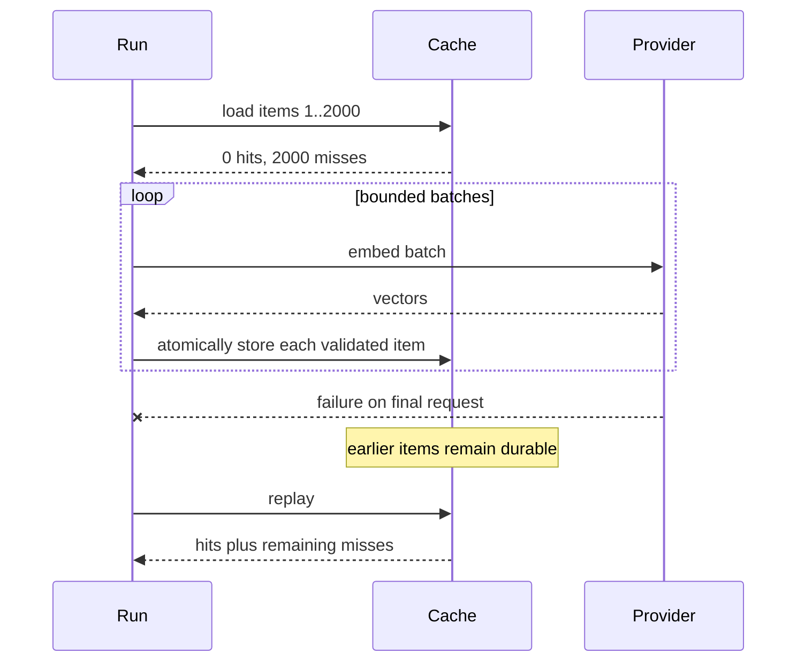

# Recoverable Bounded Execution for Expensive Work

Embedding and generation calls have three independent constraints: they consume money, providers limit request rates, and local memory or connection capacity limits concurrency. They also fail after partial progress. A useful execution model must represent all four facts without forcing every experiment to implement its own scheduler.

`rag-ttc` composes worker bounds, admission limiters, and per-item durable caching.

## The execution contract

The generic map operation accepts:

- an ordered list of input items;
- a worker limit;
- an optional limiter;
- a cost function;
- a context-aware work function.

Its output order matches input order even when work completes out of order. Goroutines are bounded. Context cancellation propagates through the operation.

```go
results, err := execution.Map(
    ctx,
    inputs,
    execution.MapOptions[Input]{
        Workers: 4,
        Limiter: execution.Chain(budget, rate),
        Cost: func(Input) int { return 1 },
    },
    work,
)
```

## Three controls, three meanings

Concurrency, rate, and budget are not interchangeable.

| Control | Question answered | Replenishes? |
|---|---|---|
| Worker limit | How many operations may be active now? | Yes, when work completes |
| Token bucket | How quickly may units begin? | Yes, with time |
| Budget | How many total units may this run spend? | No |

Combining them gives a complete admission policy:

```text
cache miss
  -> finite budget admission
  -> provider rate admission
  -> worker executes call
```

## Cache before admission

The strongest invariant in the system is that a cache hit consumes neither provider budget nor provider rate capacity.

```text
for each item:
    key = deterministic identity(item, model, prompt, version)
    if cache contains valid result:
        return cached result
    admit miss through budget and rate limiter
    execute provider call
    validate result
    store item atomically
    return result
```

This ordering enables zero-budget replay. A completed campaign can be rerun with all provider budgets set to zero. If every semantic identity matches, the experiment reconstructs results entirely from the cache. A cache miss then fails immediately rather than silently spending money.

## Per-item durability

Batching improves throughput, but the cache stores each successful item independently. Consider 2,000 embeddings divided into batches. If the final provider request fails, earlier successful vectors already have durable entries. The next run computes only the missing items.

The recovery unit is therefore the item, not the campaign and not necessarily the provider request.



## Fail-closed corruption

An existing cache entry that cannot be decoded or whose digest does not match is not treated as a miss. Treating corruption as a miss would repeat expensive work and hide storage damage. The cache returns `ErrCorruptCache`, and the run fails with evidence.

This is a general pattern:

> Absence permits computation. Invalid presence requires investigation.

## Stable ordering and duplicate keys

Concurrent execution must not change result order. Cached maps therefore reconstruct outputs according to original input positions. Duplicate cache keys execute once and populate all corresponding positions.

This matters for scientific reproducibility. If output order changed with scheduling, later report generation could associate the wrong vector or summary with an item.

## The core API

The generic execution API begins with one small admission interface:

```go
type Limiter interface {
    Wait(context.Context, int) error
}
```

The integer is a resource-unit count. A generation request may cost one call. An embedding batch may cost the number of texts. A future operation could charge bytes or records without changing the scheduler.

`MapOptions` then combines worker and resource control:

```go
type MapOptions[T any] struct {
    Workers int
    Limiter Limiter
    Cost    func(T) int
}

func Map[T, R any](
    ctx context.Context,
    items []T,
    options MapOptions[T],
    work func(context.Context, T) (R, error),
) ([]R, error)
```

The scheduler creates a fixed number of workers, sends indexed jobs through a channel, and writes each result into its original index.

```text
allocate results[len(items)]
workers = clamp(options.Workers, 1, len(items))
create errgroup with derived context

producer:
    for index, item:
        stop if group context is canceled
        send {index, item}

each worker:
    for job:
        cost = Cost(job.item), default 1
        reject non-positive cost
        Limiter.Wait(group context, cost)
        value = work(group context, job.item)
        results[job.index] = value

wait for producer and workers
return results in input order
```

The derived errgroup context cancels pending work after the first error. The function annotates errors with the input index, which makes a failed campaign diagnosable without changing `T`.

## Budget, rate, and chain APIs

A finite budget records total authorized units:

```go
budget, err := execution.NewBudget(2_000)
snapshot := budget.Snapshot()

// snapshot.Limit
// snapshot.Spent
// snapshot.Remaining
```

A token bucket records replenishing admission:

```go
rate, err := execution.NewTokenBucket(execution.Rate{
    Units:  60,
    Per:    time.Minute,
    Burst:  8,
})
defer rate.Close()
```

`Chain` executes multiple limiters in order:

```go
limiter := execution.Chain(budget, rate)
```

The order is observable. Putting the budget first rejects unauthorized work immediately. Putting the rate first could wait before learning that no budget remains.

The cache adds one more ordering requirement: cache lookup occurs before the chain.

```text
cache lookup
  -> budget authorization
  -> rate admission
  -> bounded worker call
```

## The cached-map API

`MapCached` adds deterministic identity and durable storage:

```go
type CachedMapOptions[T any] struct {
    Map   MapOptions[T]
    Cache Cache
    Key   func(T) (Key, error)
}

func MapCached[T, R any](
    ctx context.Context,
    items []T,
    options CachedMapOptions[T],
    work func(context.Context, T) (R, error),
    onResult ...func(index int, value R, outcome CacheOutcome) error,
) ([]R, CacheReport, error)
```

`CacheReport` makes execution behavior observable:

```go
type CacheReport struct {
    Hits      int
    Misses    int
    Writes    int
    WorkCalls int
    Outcomes  []CacheOutcome
}
```

The distinction between `Misses` and `WorkCalls` matters when duplicate inputs share a key. Ten input positions may contain two duplicate identities. The report records ten misses but only eight provider calls.

## The complete cached execution algorithm

The implementation has four phases.

### Phase 1: Construct and group identities

```text
for each input position:
    key = Key(item)
    digest = validate and hash key
    outcomes[position] = pending(digest)
    append position to group[digest]
```

Grouping occurs before loading. Duplicate keys are represented by one work item with several output positions.

### Phase 2: Load all groups

```text
for each unique key group:
    found, value = cache.Load(key)
    if corrupt:
        fail immediately
    if found:
        place value in every original position
        mark every position hit
        notify observer
    else:
        append group to misses
```

If every group is a hit, the function returns before constructing worker work. A zero budget is therefore valid for a complete replay.

### Phase 3: Execute misses

The miss groups pass into `Map`. Worker, rate, and budget behavior is reused rather than reimplemented.

```text
for each admitted miss group:
    increment WorkCalls
    value = work(group.item)
    cache.Store(key, value)
    increment Writes
    mark all group positions stored
    notify observer for each input position
```

The store uses `context.WithoutCancel(ctx)` after expensive work succeeds. This is a subtle but important choice. If a sibling worker fails immediately after the provider returns, errgroup cancellation should not discard the successful result before its local atomic commit.

Cancellation is removed only for the short cache commit. It is not removed from the provider call.

### Phase 4: Reconstruct ordered output

Each completed group writes its value into every original position. The final slice has exactly the same positional meaning as the input slice.

## A 2,000-document failure trace

Suppose 2,000 documents are embedded with batches of 100 and four workers. The final provider batch fails after 1,900 values have been stored.

First invocation:

```text
inputs        2,000
cache hits        0
cache misses  2,000
stored        1,900
pending         100
run status    failed
```

Second invocation:

```text
inputs        2,000
cache hits    1,900
cache misses    100
provider work   100 items
stored          100
run status    complete
```

Third invocation with budget zero:

```text
inputs        2,000
cache hits    2,000
cache misses      0
provider calls    0
run status    complete
```

The third invocation proves that recovery is complete. It also measures cache reconstruction independently of provider latency.

## Batch execution without batch recovery loss

Provider batching and recovery granularity are separate decisions. `MapCachedBatches` loads and deduplicates item keys first, groups only the remaining misses into provider batches, validates that the provider returned the expected number of values, and stores every returned item separately.

```text
load item keys
  -> retain misses only
  -> partition misses into provider batches
  -> execute batches with bounded workers
  -> validate batch result count
  -> atomically store each item result
```

A batch is the request unit. An item is the recovery unit.

## Error and cancellation semantics

The pattern makes several choices explicit:

| Event | Behavior |
|---|---|
| Context canceled before work | Pending workers stop |
| Limiter rejects units | Item fails before provider call |
| Provider call fails | Sibling work is canceled |
| Provider succeeds, sibling fails | Successful value still commits locally |
| Cache store fails | Operation fails; value is not reported as durable |
| Cache entry is corrupt | Operation fails closed |
| Result callback fails | Operation fails after reporting the callback error |

These semantics should be part of the API documentation. Without them, “supports caching” does not specify enough behavior for expensive experiments.

## Rebuilding the pattern

Implement it in this order:

1. Build an ordered bounded map and test its worker maximum.
2. Add a context-aware limiter interface.
3. Implement finite budget and replenishing rate limiters separately.
4. Add deterministic cache keys and an atomic file cache.
5. Load and group cache entries before invoking the bounded map.
6. Commit each successful result immediately.
7. Add batch execution while retaining item-level storage.
8. Add zero-budget replay tests.
9. Add corrupt-entry and late-failure tests.
10. Expose a report that distinguishes input positions, unique work calls, and writes.

## How execution integrates with RAG

The generic mechanics do not need to know what an embedding is. RAG-aware decorators supply:

- cache key policy;
- provider request construction;
- response validation;
- usage aggregation;
- model and prompt identity.

The current code places both layers under `pkg/rag/execution`. The accepted reorganization separates generic execution into `pkg/execution` and moves RAG adapters beside embedding, generation, and reranking.

## Pattern assessment

The runtime behavior is **established**. Tests cover worker bounds, cancellation, budgets, rate behavior, cache corruption, duplicate keys, late failure recovery, and zero-budget replay. The package ownership is **emergent** and is being corrected.

## Candidate ecosystem rules

- Resolve cache hits before charging budget or waiting for provider rate.
- Persist successful expensive items independently of overall campaign success.
- Treat corrupt cache entries as errors, not misses.
- Preserve input order explicitly when concurrent work feeds scientific results.
- Separate total budgets from replenishing rate limits and active worker bounds.

## Related documents

- [[01 - Project Architecture Overview]]
- [[04 - Experiment Directories as Result Custody]]
- [[06 - Semantic Identity Versioning and Validation]]
- [[08 - Candidate Ecosystem Guidelines]]
