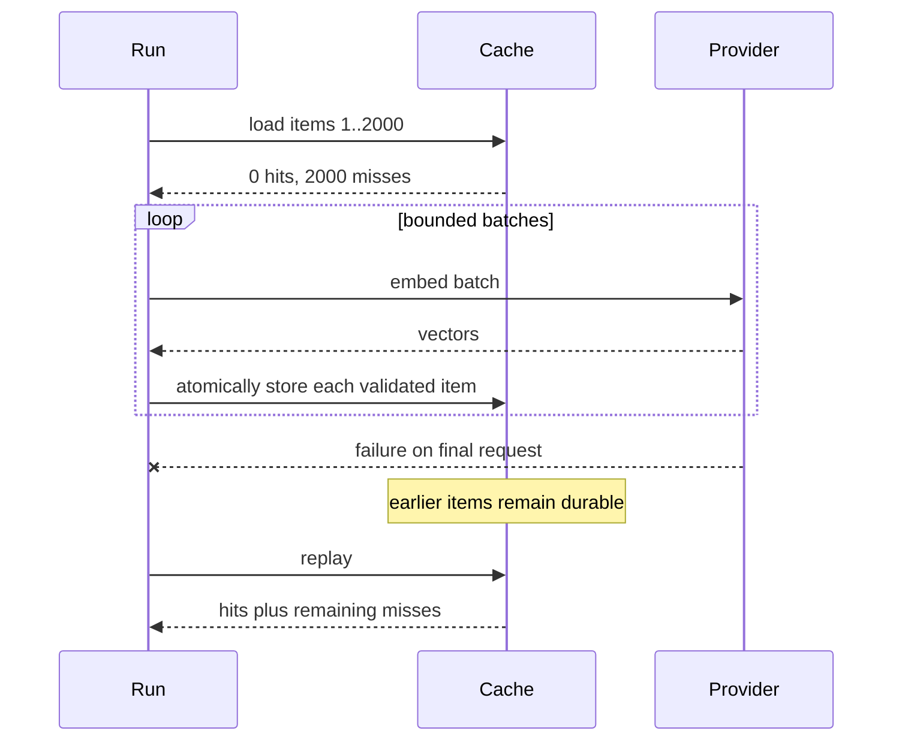

# Recoverable Bounded Execution for Expensive Work

Embedding and generation calls have three independent constraints: they consume money, providers limit request rates, and local memory or connection capacity limits concurrency. They also fail after partial progress. A useful execution model must represent all four facts without forcing every experiment to implement its own scheduler.

`rag-ttc` composes worker bounds, admission limiters, and per-item durable caching.

## The execution contract

The generic map operation accepts:

- an ordered list of input items;
- a worker limit;
- an optional limiter;
- a cost function;
- a context-aware work function.

Its output order matches input order even when work completes out of order. Goroutines are bounded. Context cancellation propagates through the operation.

```go
results, err := execution.Map(
    ctx,
    inputs,
    execution.MapOptions[Input]{
        Workers: 4,
        Limiter: execution.Chain(budget, rate),
        Cost: func(Input) int { return 1 },
    },
    work,
)
```

## Three controls, three meanings

Concurrency, rate, and budget are not interchangeable.

| Control | Question answered | Replenishes? |
|---|---|---|
| Worker limit | How many operations may be active now? | Yes, when work completes |
| Token bucket | How quickly may units begin? | Yes, with time |
| Budget | How many total units may this run spend? | No |

Combining them gives a complete admission policy:

```text
cache miss
  -> finite budget admission
  -> provider rate admission
  -> worker executes call
```

## Cache before admission

The strongest invariant in the system is that a cache hit consumes neither provider budget nor provider rate capacity.

```text
for each item:
    key = deterministic identity(item, model, prompt, version)
    if cache contains valid result:
        return cached result
    admit miss through budget and rate limiter
    execute provider call
    validate result
    store item atomically
    return result
```

This ordering enables zero-budget replay. A completed campaign can be rerun with all provider budgets set to zero. If every semantic identity matches, the experiment reconstructs results entirely from the cache. A cache miss then fails immediately rather than silently spending money.

## Per-item durability

Batching improves throughput, but the cache stores each successful item independently. Consider 2,000 embeddings divided into batches. If the final provider request fails, earlier successful vectors already have durable entries. The next run computes only the missing items.

The recovery unit is therefore the item, not the campaign and not necessarily the provider request.



## Fail-closed corruption

An existing cache entry that cannot be decoded or whose digest does not match is not treated as a miss. Treating corruption as a miss would repeat expensive work and hide storage damage. The cache returns `ErrCorruptCache`, and the run fails with evidence.

This is a general pattern:

> Absence permits computation. Invalid presence requires investigation.

## Stable ordering and duplicate keys

Concurrent execution must not change result order. Cached maps therefore reconstruct outputs according to original input positions. Duplicate cache keys execute once and populate all corresponding positions.

This matters for scientific reproducibility. If output order changed with scheduling, later report generation could associate the wrong vector or summary with an item.

## How execution integrates with RAG

The generic mechanics do not need to know what an embedding is. RAG-aware decorators supply:

- cache key policy;
- provider request construction;
- response validation;
- usage aggregation;
- model and prompt identity.

The current code places both layers under `pkg/rag/execution`. The accepted reorganization separates generic execution into `pkg/execution` and moves RAG adapters beside embedding, generation, and reranking.

## Pattern assessment

The runtime behavior is **established**. Tests cover worker bounds, cancellation, budgets, rate behavior, cache corruption, duplicate keys, late failure recovery, and zero-budget replay. The package ownership is **emergent** and is being corrected.

## Candidate ecosystem rules

- Resolve cache hits before charging budget or waiting for provider rate.
- Persist successful expensive items independently of overall campaign success.
- Treat corrupt cache entries as errors, not misses.
- Preserve input order explicitly when concurrent work feeds scientific results.
- Separate total budgets from replenishing rate limits and active worker bounds.

## Related documents

- [[01 - Project Architecture Overview]]
- [[04 - Experiment Directories as Result Custody]]
- [[06 - Semantic Identity Versioning and Validation]]
- [[08 - Candidate Ecosystem Guidelines]]
