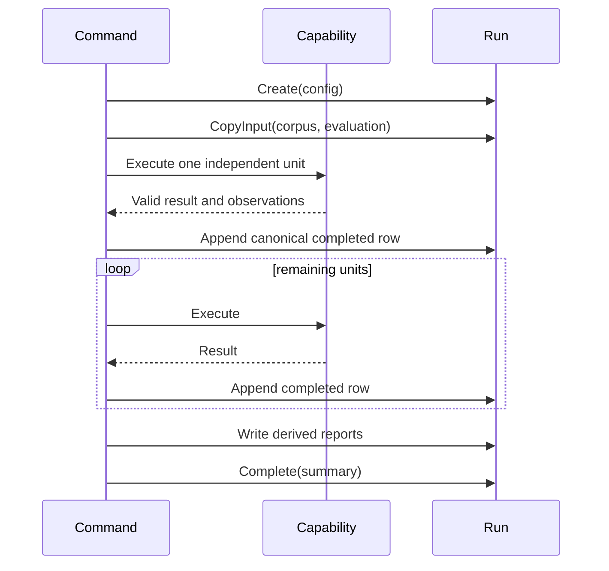

# Reproducible Experiment Custody and Semantic Identity

An experiment is not adequately recorded by its final average metric. A
future reader must be able to identify the inputs, configuration, completed
work, failures, provider usage, and transformation identities that produced
the metric. A failed run must retain valid completed units, and a successful
replay must demonstrate that it reconstructed the same semantic operations.

`rag-ttc` addresses these requirements with two cooperating systems:

- semantic identity defines when two inputs or operations are equivalent;
- an experiment directory retains the evidence associated with one execution.

These systems are separate. A reusable cache may serve many runs. A run
directory records what one run observed and concluded.

> [!summary]
> - Content, operation, configuration, and review identities serve different
>   purposes and are stored explicitly.
> - Each experiment appends independently completed units to one canonical
>   JSON Lines stream before computing aggregates.
> - Run directories retain immutable inputs, preparation, observations,
>   results, and terminal status without controlling execution.
> - Golden fixtures, command-schema hashes, real runs, and zero-work replay
>   protect different aspects of reproducibility.

## 1. Reproducibility begins with identity

Two values may refer to the same source record while containing different
content. Two provider requests may contain the same text while selecting
different models or prompts. A robust system represents these distinctions
rather than relying on filenames or insertion order.

The repository uses several identity categories.

| Identity | Example | Question answered |
| --- | --- | --- |
| Source identity | document ID or source URI | Which logical source record is this? |
| Content identity | SHA-256 digest of document or chunk text | Which exact content revision is this? |
| Structural identity | chunk ID including chunker configuration | Which derived source segment is this? |
| Representation identity | kind, text digest, source chunk, model lineage | Which searchable form is this? |
| Operation identity | cache namespace, version, request, provider | Which expensive computation is this? |
| Run identity | timestamped run ID and configuration digest | Which execution produced these artifacts? |
| Review identity | blinded query-answer cell digest | Which human-review item is this without revealing the arm? |

These identities should not be collapsed into one global hash. Each exists at
a different boundary.

## 2. Deterministic digest mechanisms

`pkg/digest` provides domain-neutral SHA-256 helpers for bytes, text, JSON, and
truncated display identities. The package does not decide which fields belong
in an identity. That decision remains with the domain or experiment.

For an operation key, the conceptual procedure is:

```text
canonical_request = {
    namespace,
    semantic_version,
    provider_identity,
    model_identity,
    effective_configuration,
    input_identity
}

key_digest = SHA256(JSON(canonical_request))
cache_path = first_two_hex_digits + "/" + key_digest + ".json"
```

The semantic version is explicit because a prompt or adapter rule may change
without changing the Go binary version. The effective configuration must
include defaulted values, not only fields the operator typed.

## 3. The run directory

`pkg/experiment` creates one directory per execution:

```text
<run-root>/<run-id>/
├── config.json
├── manifest.json
├── status.json
├── inputs/
├── preparation/
├── indexes/
├── observations/
├── results/
└── summary.md
```

The top-level records have distinct authority:

- `config.json` contains the decoded effective settings and safe provider
  metadata.
- `manifest.json` records run identity, configuration digest, start time, and
  environment facts.
- `status.json` records running, completed, or failed terminal state.
- `inputs/` contains copied immutable inputs and their digests.

The remaining directories are owned by the concrete experiment. The run
package can write and append values, but it does not know what a chunk,
retrieval arm, or summary variant means.

## 4. Custody is not scheduling

The experiment package has no stage registry and no general pipeline runner.
It provides operations such as:

```go
func Create(context.Context, RunOptions, any) (*Run, error)
func (r *Run) CopyInput(context.Context, string, string) error
func (r *Run) Observe(context.Context, StageObservation) error
func (r *Run) AppendJSONL(context.Context, string, any) error
func (r *Run) Complete(context.Context, Summary) error
func (r *Run) Fail(context.Context, error) error
```

The concrete command decides when to invoke them.



If an operation fails, the command calls `Fail`. Previously appended records
remain present. The status records that the aggregate run did not complete.

## 5. Canonical completed streams

Each experiment family declares one authoritative stream of independently
completed units:

| Experiment | Canonical stream | Row meaning |
| --- | --- | --- |
| Backend bakeoff | `results/variants.jsonl` | One completed backend evaluation |
| Answer quality | `results/per-query.jsonl` | One terminal query-arm cell |
| Summary performance | `results/variants.jsonl` | One completed execution variant |

The stream is appended and synchronized immediately after a unit completes.
Aggregate JSON, CSV, Markdown, and summary files are derived later.

This ordering is essential:

```text
perform unit
validate result
append canonical row
sync row
then continue to next unit
```

If the next variant fails, completed earlier variants remain authoritative.
An export command reads the explicit stream instead of searching for files
whose names happen to look complete.

## 6. Artifact authority

The refactor classified every artifact by its role.

### Canonical

A canonical artifact is required for recovery or downstream computation.
Examples include copied inputs, chunks, representations, persistent indexes,
completed result streams, review queues, review keys, and optional
annotations.

### Aggregate

An aggregate is derived for convenient analysis. Examples include retrieval
summaries, answer-contract summaries, CSV exports, Markdown tables, and the
terminal summary.

### Observation

An observation explains execution but is not itself the scientific result.
Examples include cache reports, stage timings, provider usage, budget
snapshots, raw generation responses, index sizes, and failure streams.

### Manifest

A manifest records identity, count, dimensions, model, or storage metadata
without duplicating a large value.

### Redundant

A redundant artifact duplicates an authoritative source without serving a
consumer. The refactor removed:

- per-backend hit and metric files already represented in variant rows;
- full vector dumps already contained in the persistent vector index;
- per-arm retrieval files already contained in `per-query.jsonl`;
- per-variant summary files already represented by result rows and request
  observations.

Artifact reduction matters because multiple representations of the same result
create ambiguous authority. A future reader should not have to determine which
of two files is current.

## 7. Durable publication

Experiment artifacts and cache entries share a repository-private publication
mechanism in `internal/fsutil`:

```text
validate destination containment
create parent directory
create temporary sibling
set permissions
write complete bytes
sync file
close file
rename temporary path to destination
sync parent directory
```

Readers observe the old complete file or the new complete file. They do not
observe a partially written JSON document.

JSON Lines streams require append semantics rather than replacement.
`pkg/experiment` centralizes the append implementation and synchronizes
records. `Run.Observe` and `Run.AppendJSONL` retain different public meanings
while sharing the private mechanics.

## 8. Strict parsing preserves evidence

`internal/jsonutil` decodes exactly one JSON value and rejects trailing
content. Callers may disallow unknown fields. The helper defines parsing
mechanics, while the domain defines meaning.

This separation is visible in summary generation:

```text
raw provider text
  -> remove a complete Markdown fence if present
  -> strict JSON decode
  -> reject unknown fields
  -> verify chunk identity and summary fields
  -> accept typed summary
```

The live provider returned a valid-looking summary plus an unsupported
`notes` field. The parser rejected it. The run recorded the failure and
retained the previous valid cached summary. It did not drop the field silently
or rewrite the response.

Permissive repair would change the experiment's model-contract failure rate.
Strict parsing makes that behavior measurable.

## 9. Golden contracts during refactoring

A structural refactor can compile and pass broad tests while changing
persisted identities. `rag-ttc` therefore locks specific values:

- cache input digest;
- cache key digest and relative path;
- sample corpus and document digests;
- experiment configuration digest;
- exact hash-embedding components;
- chunk ID and content digest;
- representation ID;
- summary CSV header;
- blinded review IDs;
- four Glazed command schemas.

The four command schemas were byte-identical before and after the refactor.
No compatibility wrapper was added; the implementation moved while the
external contract remained the same.

Golden values should be used selectively. They are appropriate for persisted
identities and public interchange formats. They are inappropriate for values
that are intentionally stochastic or not promised as stable.

## 10. Replay as an identity test

A successful first run proves that the code can execute. A replay with zero
provider work tests something stronger:

```text
effective configuration is reconstructed
semantic keys resolve to the same identities
cached values pass current validation
downstream ordering remains stable
derived metrics remain unchanged
no hidden external operation occurs
```

The real TTC backend replay used a literal zero embedding budget and reproduced
the same metrics from 1,992 cache hits. The live answer replay set every
provider budget to zero and returned a cached grounded answer without provider
usage.

Zero-work replay is therefore both an operational feature and a reproducibility
test.

## 11. What a run directory does not prove

A complete directory does not automatically establish:

- that the selected metric measures the intended research question;
- that the corpus and judgments are unbiased;
- that provider behavior is deterministic;
- that missing usage fields imply zero usage;
- that a derived report has no implementation defect;
- that two runs used semantically equivalent prompts unless prompt identity is
  recorded.

Custody preserves evidence. It does not replace experimental design or
statistical interpretation.

## 12. Reuse criteria

Use this pattern when a process produces evidence that must survive beyond the
process and when partial completion has independent value. It is particularly
useful for:

- model benchmarks;
- retrieval evaluations;
- batch inference;
- data migrations;
- crawls and ingestion campaigns;
- multi-target builds or releases;
- code-generation matrices.

Before adoption, define:

```text
What is the independently completed unit?
Which file is authoritative for those units?
Which inputs must be copied or content-addressed?
Which observations explain cost and failure?
Which aggregates can be regenerated?
What marks terminal completion?
Which fields define operation identity?
Which changes require an explicit semantic version?
```

The reusable design is the combination of semantic identity, immediate
completed records, explicit artifact authority, durable publication, and
terminal state. A directory without these contracts is only a collection of
files.
