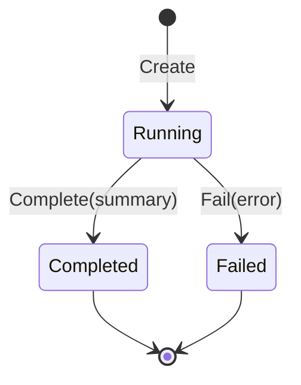

# Experiment Directories as Result Custody

An experiment result is not only its final metric. A future reader needs the configuration, exact inputs, provider observations, intermediate preparation, completed partial results, and terminal state. `pkg/experiment` assigns those records to one run directory and enforces their lifecycle.

## Directory contract

A run begins with a stable structure:

```text
<run-id>/
├── config.json
├── manifest.json
├── status.json
├── inputs/
├── preparation/
├── indexes/
├── observations/
└── results/
```

The manifest records run identity, timestamps, host properties, Go build information, tags, and a config digest. Inputs can be copied into the directory rather than referenced only by an unstable external path.

## Lifecycle states

The run has a simple state machine:



After a terminal transition, normal writes are rejected. Observation streams are synchronized and closed during completion or failure.

This gives the directory a meaningful contract. A `completed` status means the run deliberately reached completion, not merely that a process stopped writing files.

## Atomic artifacts

JSON and byte artifacts use temporary-file publication:

```text
marshal value
write temporary sibling
fsync temporary file
close temporary file
rename to destination
fsync parent directory
```

Readers therefore see either the previous complete artifact or the new complete artifact. They do not see half-written JSON.

## Append-only observations

Provider calls and stage measurements are naturally streams. JSONL allows each record to become durable without rewriting an ever-growing array.

```json
{"name":"embedding","duration":650000000,"item_count":1982}
{"name":"retrieval","duration":42000000,"item_count":30}
```

Each append is synchronized. If a later stage fails, earlier observations remain available.

## Completed results before campaign summaries

The simplification design strengthens custody by making each completed variant row a primary artifact:

```text
variant completes
  -> append stable result record
  -> begin next variant
  -> later failure cannot erase completed record
```

Combined JSON, CSV, Markdown, and Glazed output then become derived views. This is better than scanning filenames after failure and guessing which outputs represent completed variants.

## Separation from the cache

The experiment directory and execution cache solve different problems.

| Store | Identity | Lifetime | Meaning |
|---|---|---|---|
| Execution cache | semantic item key | across runs | reusable completed computation |
| Experiment directory | run ID and artifact path | one run | evidence and results of one procedure |

A cache entry can serve many runs. A run records whether it used a hit or performed work. Combining these stores would make reuse and experimental custody harder to distinguish.

## How custody is woven into execution

The command creates the run before expensive work. It copies or records inputs, writes preparation manifests, passes observers into provider operations, appends completed results, then commits one terminal state.

```go
run := experiment.Create(ctx, options, config)
defer failIfNeeded(run)

run.CopyInput(ctx, "corpus", cfg.Corpus)
output := executeExperiment(ctx, run, cfg)
run.AppendJSONL(ctx, "results/variants.jsonl", output)
run.Complete(ctx, summary(output))
```

The run object does not decide which artifacts the experiment needs. It provides safe custody operations.

## Pattern assessment

The run lifecycle and atomic artifact behavior are **established**. Immediate completed-result streams are an **accepted proposed refinement** in `RAG-TTC-SIMPLIFY-001`.

## Candidate ecosystem rules

- Give every experiment a directory with configuration, immutable input evidence, observations, results, and terminal state.
- Make terminal state explicit and reject writes afterward.
- Persist completed units before beginning later units.
- Keep reusable caches separate from per-run evidence.
- Treat combined reports as derived views of stable primary records.

## Related documents

- [[01 - Project Architecture Overview]]
- [[03 - Recoverable Bounded Execution for Expensive Work]]
- [[06 - Semantic Identity Versioning and Validation]]
- [[08 - Candidate Ecosystem Guidelines]]
