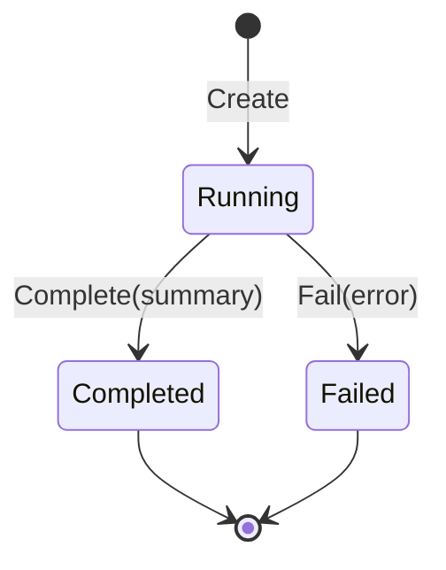

# Experiment Directories as Result Custody

An experiment result is not only its final metric. A future reader needs the configuration, exact inputs, provider observations, intermediate preparation, completed partial results, and terminal state. `pkg/experiment` assigns those records to one run directory and enforces their lifecycle.

## Directory contract

A run begins with a stable structure:

```text
<run-id>/
├── config.json
├── manifest.json
├── status.json
├── inputs/
├── preparation/
├── indexes/
├── observations/
└── results/
```

The manifest records run identity, timestamps, host properties, Go build information, tags, and a config digest. Inputs can be copied into the directory rather than referenced only by an unstable external path.

## Lifecycle states

The run has a simple state machine:



After a terminal transition, normal writes are rejected. Observation streams are synchronized and closed during completion or failure.

This gives the directory a meaningful contract. A `completed` status means the run deliberately reached completion, not merely that a process stopped writing files.

## Atomic artifacts

JSON and byte artifacts use temporary-file publication:

```text
marshal value
write temporary sibling
fsync temporary file
close temporary file
rename to destination
fsync parent directory
```

Readers therefore see either the previous complete artifact or the new complete artifact. They do not see half-written JSON.

## Append-only observations

Provider calls and stage measurements are naturally streams. JSONL allows each record to become durable without rewriting an ever-growing array.

```json
{"name":"embedding","duration":650000000,"item_count":1982}
{"name":"retrieval","duration":42000000,"item_count":30}
```

Each append is synchronized. If a later stage fails, earlier observations remain available.

## Completed results before campaign summaries

The simplification design strengthens custody by making each completed variant row a primary artifact:

```text
variant completes
  -> append stable result record
  -> begin next variant
  -> later failure cannot erase completed record
```

Combined JSON, CSV, Markdown, and Glazed output then become derived views. This is better than scanning filenames after failure and guessing which outputs represent completed variants.

## Separation from the cache

The experiment directory and execution cache solve different problems.

| Store | Identity | Lifetime | Meaning |
|---|---|---|---|
| Execution cache | semantic item key | across runs | reusable completed computation |
| Experiment directory | run ID and artifact path | one run | evidence and results of one procedure |

A cache entry can serve many runs. A run records whether it used a hit or performed work. Combining these stores would make reuse and experimental custody harder to distinguish.

## The public API

The run begins with explicit options:

```go
type Options struct {
    Root        string
    Name        string
    Description string
    Tags        map[string]string
}

func Create(ctx context.Context, options Options, config any) (*Run, error)
```

Creation performs more than `os.MkdirAll`. It establishes the run identity and writes the first three authoritative records:

```text
config.json    exact typed configuration serialized for this run
manifest.json  run identity, host, Go build, tags, config digest
status.json    state=running and start time
```

The remaining API is deliberately small:

```go
func (r *Run) Dir() string
func (r *Run) Path(relative string) (string, error)
func (r *Run) CopyInput(ctx context.Context, role, source string) (InputRef, error)
func (r *Run) WriteJSON(ctx context.Context, relative string, value any) error
func (r *Run) WriteBytes(ctx context.Context, relative string, data []byte) error
func (r *Run) AppendJSONL(ctx context.Context, relative string, value any) error
func (r *Run) Observe(ctx context.Context, stream string, value any) error
func (r *Run) Complete(ctx context.Context, summary Summary) error
func (r *Run) Fail(ctx context.Context, cause error) error
```

There is no `RunStage`, `Pipeline`, or `ArtifactRegistry`. The experiment chooses names and content. `Run` enforces containment, serialization, durability, concurrency, and terminal state.

## What the manifest proves

The manifest contains:

```go
type Manifest struct {
    SchemaVersion string
    RunID         string
    Name          string
    Description   string
    StartedAt     time.Time
    GoVersion     string
    ModulePath    string
    ModuleVersion string
    Host          Host
    ConfigDigest  string
    Tags          map[string]string
}
```

These fields answer different future questions.

| Field | Question |
|---|---|
| `SchemaVersion` | How should the artifact be decoded? |
| `RunID` | Which execution produced this directory? |
| `StartedAt` | When did it run? |
| `GoVersion` | Which runtime semantics applied? |
| `ModulePath` and `ModuleVersion` | Which built program produced it? |
| `Host` | Which OS, architecture, and CPU environment ran it? |
| `ConfigDigest` | Has configuration changed even if filenames did not? |
| `Tags` | Which campaign or purpose grouped this run? |

The manifest does not claim to capture every source-control detail. Commands may add repository commits or dataset identities in configuration and preparation manifests.

## Input custody

`CopyInput` gives an external file a role, copies it into the run, and records:

```go
type InputRef struct {
    Role         string
    OriginalPath string
    CopiedPath   string
    Digest       string
    SizeBytes    int64
}
```

The original path is useful for operator context. The copied path and digest are the durable evidence. If the source dataset is later edited in place, the run still contains the exact bytes it used.

Pseudocode:

```text
CopyInput(role, source):
    validate role as a safe name
    open source
    stream bytes into inputs/<role>-<basename>
    calculate digest and size while copying
    fsync destination
    append InputRef to manifest
    atomically rewrite manifest
```

## Artifact path containment

`Run.Path` accepts a relative artifact path and rejects absolute paths and `..` traversal. This prevents accidental writes outside the run directory.

```text
Path("results/metrics.json") -> accepted
Path("../shared/cache.json") -> rejected
Path("/tmp/result.json")     -> rejected
Path(".")                    -> rejected
```

This is lexical containment, not a hostile symlink sandbox. The run directory is created with restrictive permissions, so callers are expected to control its contents.

## Atomic overwrite versus append-only stream

Two artifact operations serve different data shapes.

### Atomic overwrite

Use `WriteJSON` when the artifact has one current complete value:

```text
config
manifest
status
summary
index manifest
```

The temporary-file and rename sequence prevents partial replacement.

### Synchronized append

Use `AppendJSONL` when each record is independently meaningful:

```text
provider call observation
stage observation
completed query result
completed experiment variant
annotation
```

Each line is valid independently. A later process failure can truncate only future records, not already synchronized lines.

## Terminal-state algorithm

Completion and failure share one private transition:

```text
finish(state, error, summary):
    reject nil run
    reject canceled context
    lock run
    reject already terminal

    if complete:
        atomically write results/summary.json

    for every retained observation stream:
        fsync stream
        close stream

    update status:
        State = complete or failed
        FinishedAt = now
        Error = cause text for failed run

    atomically write status.json
    set in-memory terminal flag
```

The terminal flag is set only after the status file succeeds. If status publication fails, the caller receives an error rather than an in-memory claim that cannot be verified on disk.

## A failure trace

Consider a campaign with four variants. The first three complete and the fourth fails.

```text
T0  Create run; status=running
T1  Append variant A result
T2  Append variant B result
T3  Append variant C result
T4  Provider error in variant D
T5  Fail(error); synchronize streams; status=failed
```

The directory can truthfully report both facts:

- the campaign failed;
- variants A, B, and C completed.

This is why terminal state and completed result records must be separate.

## Result stream API proposed by the simplification

A typed facade can standardize immediate records without owning result policy:

```go
type ResultRecord[T any] struct {
    Key         string    `json:"key"`
    CompletedAt time.Time `json:"completed_at"`
    Value       T         `json:"value"`
}

func AppendResult[T any](
    ctx context.Context,
    run *Run,
    stream string,
    key string,
    value T,
) error
```

The caller owns duplicate-key policy when loading records. A generic loader must not silently decide whether the first or last record wins.

## Rebuilding the pattern

1. Define a run manifest and a separate status record.
2. Create the directory and initial records before substantive work.
3. Copy or content-address every mutable external input.
4. Provide safe relative artifact paths.
5. Implement atomic replacement for whole artifacts.
6. Implement synchronized JSONL for independently meaningful records.
7. Serialize concurrent writes with a run-owned mutex.
8. Implement one terminal transition that closes streams and writes status.
9. Reject writes after terminal state.
10. Test forced failure after several completed records.

## How custody is woven into execution

The command creates the run before expensive work. It copies or records inputs, writes preparation manifests, passes observers into provider operations, appends completed results, then commits one terminal state.

```go
run := experiment.Create(ctx, options, config)
defer failIfNeeded(run)

run.CopyInput(ctx, "corpus", cfg.Corpus)
output := executeExperiment(ctx, run, cfg)
run.AppendJSONL(ctx, "results/variants.jsonl", output)
run.Complete(ctx, summary(output))
```

The run object does not decide which artifacts the experiment needs. It provides safe custody operations.

## Pattern assessment

The run lifecycle and atomic artifact behavior are **established**. Immediate completed-result streams are an **accepted proposed refinement** in `RAG-TTC-SIMPLIFY-001`.

## Candidate ecosystem rules

- Give every experiment a directory with configuration, immutable input evidence, observations, results, and terminal state.
- Make terminal state explicit and reject writes afterward.
- Persist completed units before beginning later units.
- Keep reusable caches separate from per-run evidence.
- Treat combined reports as derived views of stable primary records.

## Related documents

- [[01 - Project Architecture Overview]]
- [[03 - Recoverable Bounded Execution for Expensive Work]]
- [[06 - Semantic Identity Versioning and Validation]]
- [[08 - Candidate Ecosystem Guidelines]]
