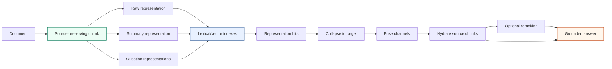

# Representation-Centered Retrieval Architecture

A retrieval system may search text that differs from the source material it
eventually cites. Raw chunks, summaries, generated questions, and other
derived text can expose different query terms and semantic signals. Treating
all of these values as interchangeable creates a provenance problem: a
generated summary may improve retrieval, but it is not authoritative source
evidence.

`rag-ttc` resolves this problem by separating source chunks from searchable
representations. Indexes retrieve representations. The retrieval layer then
collapses and hydrates those hits back to source chunks before generation.

> [!summary]
> - Chunks retain exact document lineage and source byte ranges.
> - Representations contain searchable text derived from a chunk, with kind
>   and model lineage.
> - Retrieval hits preserve representation, chunk, document, channel, rank,
>   and score identity.
> - Fusion and reranking select candidates, but grounded answers cite hydrated
>   source chunks.

## 1. Four different records

The architecture becomes easier to understand when its main records are
defined separately.

### Document

A document is an input source:

```go
type Document struct {
    ID            string
    SourceURI     string
    Title         string
    Text          string
    ContentDigest string
    Metadata      map[string]string
}
```

`ID` identifies the logical source record. `ContentDigest` identifies the
exact text revision. A stable document ID can therefore refer to updated
content without claiming that both revisions are identical.

### Chunk

A chunk is an exact source segment:

```go
type Chunk struct {
    ID            string
    DocumentID    string
    Ordinal       int
    Range         Range
    Text          string
    ContentDigest string
    Chunker       string
}
```

The range uses half-open byte offsets. Chunkers may choose boundaries in runes
to avoid splitting Unicode code points, but the stored range addresses the Go
source string:

```text
document.Text[chunk.Range.Start:chunk.Range.End] == chunk.Text
```

The chunker identity participates in stable chunk identity. A different
window, overlap, or boundary strategy creates a different derived dataset.

### Representation

A representation is searchable text associated with a source chunk. It may be:

- the raw chunk text;
- a generated chunk summary;
- one or more generated questions;
- another derived retrieval surface.

Representation identity records source chunk, representation kind, content
digest, and optional model or prompt lineage.

### Evidence

Evidence is a source chunk selected for answer generation. It includes final
rank, retrieval score, and optional reranker score. It is not merely the
searchable representation text.

## 2. The complete retrieval path



The separation allows retrieval innovation without weakening citation
lineage. A summary may match a query more effectively than the raw chunk, but
the answer receives the chunk from which the summary was derived.

## 3. Source-preserving chunking

The repository provides fixed and Markdown-aware chunkers. Both must satisfy
the same invariants:

- every emitted text is an exact source slice;
- byte ranges are valid and non-empty;
- ordinal order follows source order;
- content digests match emitted text;
- IDs are stable for the same document, source content, and chunker
  configuration.

A fixed overlapping chunker can be described as:

```text
convert valid rune boundaries to byte offsets
start at rune 0
while start < rune_count:
    end = min(start + window, rune_count)
    emit exact byte slice for [start, end)
    if end == rune_count:
        stop
    start = end - overlap
```

The Markdown-aware strategy may prefer structural boundaries, but it cannot
rewrite or normalize the source text. This makes every citation traceable.

## 4. Why a summary is a representation

A chunk summary is derived text intended to expose the chunk's meaning in a
compact form. When used for retrieval, it has the same architectural role as
raw chunk text: it is indexed and produces hits.

It differs in provenance:

| Field | Raw representation | Summary representation |
| --- | --- | --- |
| Text origin | Exact chunk text | Model-generated text |
| Authoritative source | Yes, through the chunk | No |
| Model identity | None | Required |
| Prompt identity | None | Required |
| Searchable | Yes | Yes |
| Directly cited | No; hydrate chunk | No; hydrate chunk |

Calling a summary a representation does not claim that all representations
have equal reliability. It provides a common retrieval record while retaining
kind and lineage.

## 5. Search interfaces and hit identity

The search interface is intentionally small:

```go
type Searcher interface {
    Search(context.Context, Query, int) ([]Hit, error)
}
```

`Hit` retains:

- representation ID;
- chunk ID;
- document ID;
- retrieval channel;
- rank;
- score.

This record is sufficient to compare lexical and vector channels without
discarding the source relationship. An implementation may use in-memory BM25,
Bleve, SQLite FTS5, in-memory exact cosine, or SQLite exact vectors.

Backend manifests record implementation type, version, representation count,
model, vector dimension, and relevant configuration. Persistent builders write
to temporary destinations and publish complete indexes atomically.

## 6. Collapse defines the evaluation level

Several representations may refer to the same chunk or document. A top-k list
of representation hits can therefore contain duplicates at the level being
evaluated.

Collapse maps hits to an explicit target:

- representation;
- chunk;
- document;
- evaluation unit.

It retains the highest-ranked hit for each target identity while preserving
rank order. This operation is required before comparing retrieval with
judgments at that level.

The target is part of metric meaning. A document-level relevant judgment
cannot be compared directly with representation IDs and still be called
document recall.

## 7. Multiple retrieval channels

The answer experiment contains four arms:

### BM25

BM25 searches raw textual representations and hydrates the highest-ranked
chunks.

### Vector

The query is embedded with the same model identity used for corpus
representations. Exact cosine search returns ranked representation hits, which
are collapsed and hydrated.

### Reciprocal-rank fusion

RRF combines rank positions rather than raw scores:

```text
for each channel:
    for each hit at rank r:
        fused_score[target] += weight[channel] / (constant + r)
```

Rank-based fusion avoids assuming that BM25 and cosine scores share a numerical
scale.

### RRF with reranking

RRF first selects a wider candidate set. A reranker receives the query and
hydrated evidence, produces a new ordering, and returns the requested evidence
count.

These arms are experiment policy. The reusable retrieval package provides
collapse, fusion, conversion, and hydration mechanisms.

## 8. Grounded answer generation

The answer generator receives:

- the user query;
- ordered source evidence;
- an explicit output schema;
- model and prompt configuration.

The validated answer contains answer text, citations, and abstention state.
Citations must refer to provided evidence. A malformed provider response is
converted into a recorded contract failure or safe abstention according to the
experiment's declared behavior.

The key evidence rule is:

```text
search representation -> select source chunk -> generate from source chunk
```

Generated representations affect selection but do not become the source of
truth.

## 9. Evaluation records

Queries and graded judgments have stable IDs. Retrieval evaluation computes
metrics such as:

- reciprocal rank;
- recall at `k`;
- precision at `k`;
- hit rate at `k`;
- normalized discounted cumulative gain.

Per-query results remain beside aggregates. An aggregate such as mean
reciprocal rank is insufficient for diagnosing which queries improved or
regressed.

Answer evaluation records separate concerns:

- retrieval metrics measure evidence selection;
- answer-contract metrics measure schema and citation validity;
- human-review metrics measure judged answer quality;
- operational metrics measure latency, cache, usage, and budget behavior.

Combining these into one score would obscure whether a change improved
retrieval, generation, or execution.

## 10. Stable concepts and local choices

The architecture contains both reusable invariants and configurable research
choices.

| Reusable invariant | Project-local choice |
| --- | --- |
| Chunks preserve source lineage | Chunk window and overlap |
| Representations record provenance | Which representation kinds to generate |
| Hits retain source relationships | Backend score tuning |
| Collapse names the target level | Judgment level selected for a study |
| Fusion retains channel contributions | RRF constant and weights |
| Answers use hydrated source evidence | Evidence count and prompt wording |
| Metrics retain per-query records | Primary metric used for a decision |

The right side should remain experiment configuration until repeated studies
establish a standard.

## 11. Common failure modes

### Indexing derived text without provenance

If a summary loses its source chunk ID, a hit cannot be converted back to
authoritative evidence.

### Citing generated retrieval text

A fluent summary may omit qualifications or introduce unsupported claims.
It should help select source material, not replace it.

### Evaluating at the wrong identity level

Comparing document judgments with raw representation IDs undercounts relevant
results and makes metric labels inaccurate.

### Fusing raw scores from unrelated backends

BM25 and cosine scores do not have a shared calibrated range. Direct addition
can make one channel dominate for numerical reasons unrelated to relevance.

### Embedding with inconsistent model identity

Corpus and query vectors must occupy the same vector space. Model and
dimension checks belong at adapter and index boundaries.

## 12. Reuse criteria

Use representation-centered retrieval when:

- several searchable forms may refer to the same source;
- derived text may improve retrieval;
- citations must remain grounded in original material;
- evaluation occurs at multiple identity levels;
- lexical and semantic channels need a shared hit contract.

Before implementing it elsewhere, define:

```text
What is the authoritative source record?
How is an exact source segment identified?
Which derived representations may be indexed?
Which model and prompt lineage must be retained?
At what identity level are judgments expressed?
How are multiple representations collapsed?
How are selected hits hydrated to source evidence?
Which values may appear in citations?
```

The core pattern is a provenance-preserving transformation from sources to
searchable representations and back to sources. Retrieval flexibility and
grounded generation depend on both directions.
