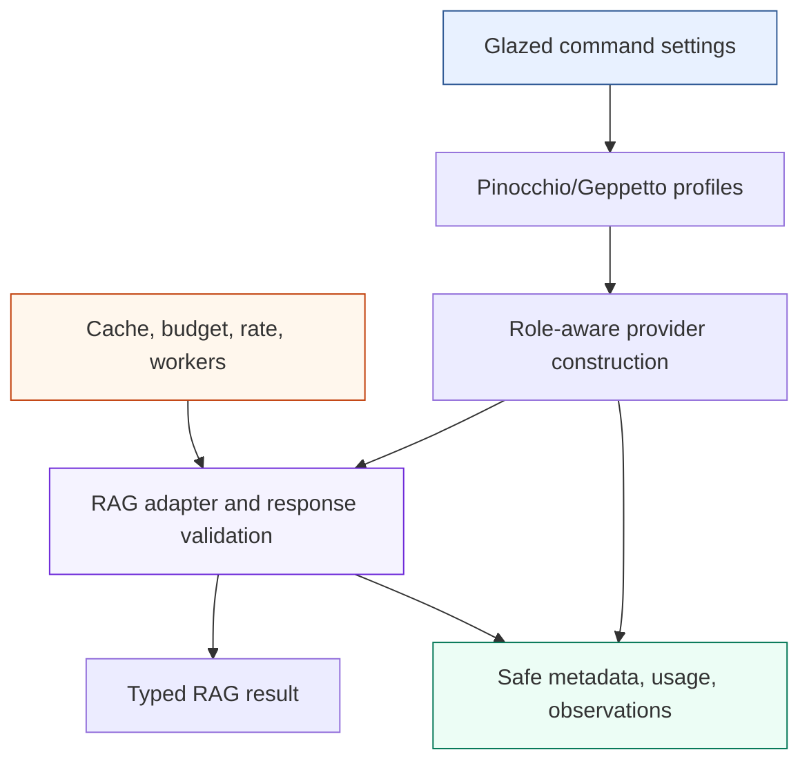

# Provider Integration, Validation, and Ecosystem Lessons

External model providers introduce credentials, network failure, changing SDK
contracts, usage reporting, model-specific validation, and financial risk.
These concerns should enter the system at explicit boundaries. They should not
spread through retrieval algorithms or cause library packages to read process
environment variables implicitly.

`rag-ttc` integrates generation, embedding, and reranking through Glazed
commands, Pinocchio and Geppetto profiles, validated adapters, execution
decorators, and layered verification. This chapter explains that boundary and
extracts candidate rules for the wider go-go-golems ecosystem.

> [!summary]
> - Glazed commands own configuration, profile selection, logging, provider
>   construction, safe metadata projection, and cleanup.
> - Geppetto adapters translate external results into narrow RAG contracts and
>   validate them before publication.
> - Unknown usage or pricing remains unknown; it is not reported as zero.
> - Unit tests, golden contracts, race tests, real datasets, live providers,
>   controlled failure, and zero-work replay establish different facts.

## 1. The external-provider boundary

The provider path has four layers:



Each layer has a specific responsibility.

## 2. Glazed commands own application configuration

Every executable operation is a Glazed command. Settings are declared as
fields and sections rather than read ad hoc from the process environment.

The command layer owns:

- corpus, evaluation, and run paths;
- query and arm selection;
- worker, rate, budget, and monetary limits;
- provider registry paths and profile names;
- log level;
- output format;
- explicit permission for unpriced providers or partial runs.

This makes configuration visible in command schemas and effective run
configuration. `glazed-lint` checks command conventions and direct environment
access. The completion audit found no `os.Getenv` or `os.LookupEnv` in Go
source.

The restriction does not imply that credentials cannot originate from the
environment. It means application code uses the established profile and
middleware system rather than reading secret values throughout the package
graph.

## 3. Profile composition

Pinocchio and Geppetto profiles define provider configuration for different
roles. A composite experiment profile can select:

```text
generation -> provider type and generation model
embedding  -> provider type, embedding model, and dimension
reranking  -> provider type and reranking model
```

The analyzed live profile resolved:

```text
generation: openai-responses / gpt-5-nano
embedding:  openai / text-embedding-3-small / 1536 dimensions
```

Profile resolution required both the user's default registry and the
repository registry. The project profile referred to generation and embedding
profiles stored across those registries.

This illustrates an important operational rule: profile identity includes
registry composition, not only the final profile name. A self-contained run
should record safe resolved provider metadata, while secrets remain outside
artifacts.

## 4. Role-aware construction

The command determines required roles from selected capabilities before
provider construction.

```text
selected retrieval arms
  -> required generation role
  -> optional embedding role
  -> optional reranking role
```

A BM25-only answer run requests generation only. This reduces credential
requirements and ensures that an unavailable embedding profile cannot block an
experiment that does not use embeddings.

The provider bundle owns cleanup. Domain packages receive narrow interfaces,
not the composite profile registry or SDK clients.

## 5. Narrow domain interfaces

The core provider-facing interfaces remain small:

```go
type Embedder interface {
    Embed(context.Context, EmbeddingRequest) (EmbeddingResult, error)
}

type Generator interface {
    Generate(context.Context, GenerationRequest) (GenerationResult, error)
}

type Reranker interface {
    Rerank(context.Context, RerankRequest) (RerankResult, error)
}
```

These interfaces:

- accept `context.Context`;
- use repository-owned request and result records;
- avoid exposing provider SDK types;
- permit local deterministic implementations;
- permit decorators for caching and observation;
- support compile-time interface assertions.

Construction remains outside the interface because profiles and cleanup differ
across providers.

## 6. Adapter validation

An adapter does more than convert field names. It prevents malformed external
data from entering the domain.

### Embedding validation

The Geppetto embedding adapter verifies:

- request model and resolved model agree;
- the input batch is non-empty where required;
- output count equals input count;
- every vector has the expected dimension;
- every component is finite;
- available usage is preserved.

The vector index also validates dimensions and finite values. Validation at
both boundaries protects against malformed provider output and invalid local
index construction.

### Generation validation

The generation adapter returns provider text, finish reason, citations, and
available usage. The experiment-specific consumer then applies its schema:

```text
provider response
  -> adapter result
  -> strict JSON decode
  -> answer or summary semantic validation
  -> typed experiment result
```

The adapter should not know every experiment schema. The experiment should not
know the provider SDK.

### Reranking validation

The reranker translates a query and evidence candidates, validates the
returned ordering and scores, and returns repository-owned evidence records.
Its cache decorator includes request and model identity.

## 7. Usage and cost are observations

Provider usage may include:

- input tokens;
- output tokens;
- embedding tokens;
- reported monetary cost;
- finish reason;
- provider latency.

Each field may be unavailable. Go records optional cost through a pointer
rather than substituting zero. The summary live run reported generation token
usage but the embedding adapter did not report embedding tokens. The final
report states that the value was unavailable.

The same rule applies to profile prices. Conservative cost preflight can use
configured unit prices. If none are present, the operator must explicitly
allow an unpriced provider. A missing price is not evidence of a free call.

## 8. Strict contracts expose provider behavior

The one-document summary campaign produced eleven chunks. The first invocation
received one valid summary and then a response containing an unsupported
`notes` field. Strict parsing rejected the second response.

This failure was useful evidence:

- the provider was reachable;
- the model could produce a valid result;
- the model could also depart from the declared schema;
- per-item caching preserved valid earlier work;
- the retry recovered rather than restarting;
- raw provider observations made the failure inspectable.

Silently discarding unknown fields would have changed the measured contract
failure rate. The system instead treats the output contract as part of the
experiment.

## 9. Layered validation

No single test proves the architecture. The repository uses layers that answer
different questions.

| Evidence | What it establishes | What it does not establish |
| --- | --- | --- |
| Unit tests | Local algorithms, validation, and error behavior | Dataset-scale operation |
| Golden fixtures | Stable persisted identities and formats | Retrieval quality |
| Race tests | Concurrency safety on exercised paths | All possible schedules |
| Executable examples | Public composition without credentials | Live-provider behavior |
| Full build and lint | Repository-wide source integrity | Scientific validity |
| Glazed schema hashes | Stable command interface | Provider correctness |
| Real TTC local run | Dataset-scale execution, recovery, and metrics | Semantic embedding quality when using hash vectors |
| Bounded live run | Credentials, profiles, adapters, strict contracts | Broad model quality |
| Zero-work replay | Complete identity, cache reconstruction, no hidden calls | Determinism of a fresh provider response |

This table is important for generalists. A green unit-test suite does not prove
that profile composition works. A successful live call does not prove
recoverability. A deterministic hash vector run proves vector plumbing but not
semantic relevance.

## 10. Repository quality gates

The completed refactor passed:

```text
go fmt ./...
go test ./... -count=1
go test -race <execution, experiment, adapters, and experiment runners>
go build -buildvcs=false ./...
go generate ./...
make lint
go tool glazed-lint ./...
git diff --check
```

The four Glazed command schemas remained byte-identical to the pre-refactor
baseline. All six examples ran. Focused tests covered malformed answers,
provider failure persistence, cache replay, summary late-variant recovery, and
canonical-stream export.

## 11. Live evidence

### Summary and embedding

One TTC document generated eleven summaries using `gpt-5-nano`. After the
strict-contract failure and retry, ten new generation calls completed in
40.997 seconds and reported 5,186 input and 4,116 output tokens. Eleven
summaries were embedded in two `text-embedding-3-small` calls in 0.685
seconds.

Across the failed and successful attempts, generation made twelve calls and
reported 6,277 input and 5,232 output tokens. Eleven valid summaries and eleven
embeddings became cache entries.

### Grounded answer

The answer smoke retrieved five BM25 evidence chunks for query
`ttc-expand-001` and made one `gpt-5-nano` call:

| Measurement | Value |
| --- | ---: |
| Input tokens | 824 |
| Output tokens | 179 |
| Generation duration | 2.316 seconds |
| Generation calls | 1 |
| Embedding and reranking calls | 0 |

The answer passed the schema, cited evidence, and did not abstain. A
literal-zero replay made no provider call.

These are bounded integration proofs, not broad quality claims.

## 12. Candidate ecosystem guidelines

The following rules are supported strongly enough to compare across other
projects.

### Package by semantic dependency

Place a mechanism in a generic package only when its API and invariants can be
described without the current domain and multiple consumers need it.

### Keep policy explicit

Prompts, benchmark matrices, arm names, artifact schemas, and failure policy
belong in the application until repeated consumers establish a common
contract.

### Derive dependencies from selected capabilities

Resolve providers, indexes, budgets, and artifacts after configuration selects
the actual capability graph.

### Resolve cache hits before external authority

Cached work should not require budget, rate capacity, or provider access.

### Use batches for efficiency and items for durability

The provider request unit and recovery unit should be modeled separately.

### Validate at external boundaries

Adapters should reject count, dimension, identity, finite-value, and schema
violations before returning domain values.

### Preserve unknown measurements

Missing usage and pricing should remain absent in types and reports.

### Persist completed units before aggregates

Append authoritative rows immediately and derive reports afterward.

### Test zero-authority replay

Run resumable systems with external work disabled. An unexpected miss should
fail rather than silently recompute.

### Use multiple evidence layers

Architecture promotion should cite source, tests, real data, controlled
failure, and operational behavior appropriate to the claim.

## 13. Promotion criteria

These rules remain candidates until another repository demonstrates the same
constraint and benefit. Promotion should require:

1. At least two independent implementations under comparable constraints.
2. A named failure or maintenance cost prevented by the rule.
3. Tests or operational evidence protecting the invariant.
4. A new use that benefits without importing project-specific policy.
5. A clear statement of when the rule does not apply.

The Software Architecture Garden exists to perform this comparison. A pattern
becomes ecosystem guidance through repeated evidence, not through the quality
of one implementation.

## 14. Review worksheet for a new provider-backed project

```text
Configuration
  Are commands declared through Glazed?
  Where are profiles and credentials resolved?
  Does any library package read environment variables directly?
  Which safe provider metadata is persisted?

Capabilities
  Which provider roles are required by the selected configuration?
  Can unused roles remain unconstructed?
  Do SDK types escape the adapter?

Validation
  Are result counts, dimensions, finite values, and identities checked?
  Is model output decoded strictly?
  Are raw failures observable without exposing credentials?

Cost and recovery
  What are the budget and rate units?
  Are missing prices explicit?
  Are cache hits resolved before provider admission?
  Can completed items survive a later failure?

Evidence
  Which deterministic tests protect contracts?
  Has the real dataset been exercised?
  Has a bounded live call been authorized and recorded?
  Can the workload replay with provider work disabled?
```

Answering these questions produces a provider integration that can be
inspected and compared. It also exposes which decisions remain application
policy rather than reusable infrastructure.
