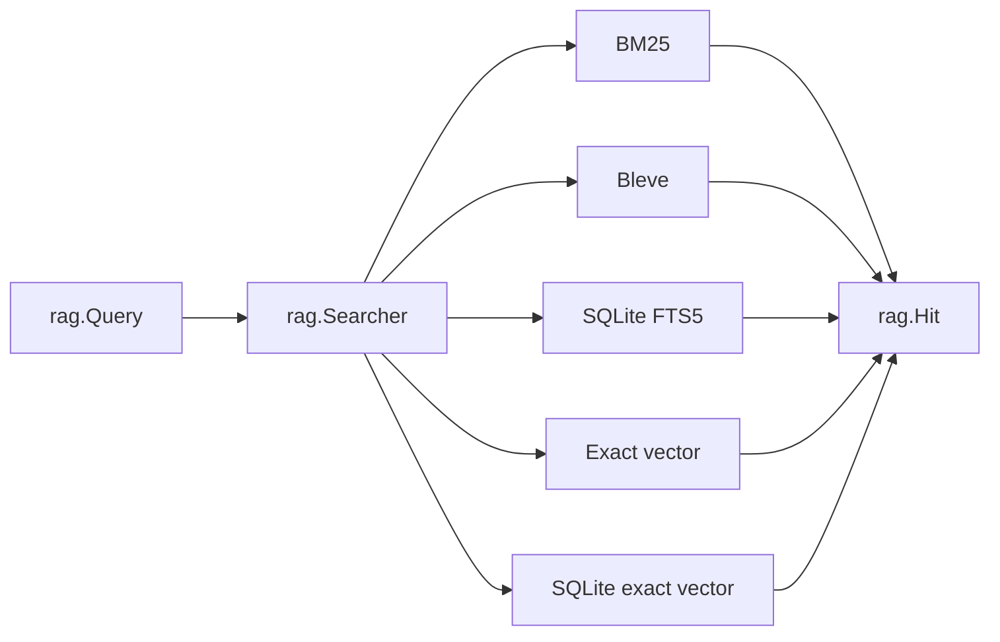

# Typed RAG Contracts and Backend Adapters

The RAG toolbox separates domain meaning from backend technology. Experiments operate on `rag.Embedder`, `rag.Searcher`, `rag.Generator`, and `rag.Reranker`. Concrete packages translate those contracts into in-memory algorithms, SQLite indexes, Bleve indexes, and Geppetto provider calls.

## Records before algorithms

The records define what must survive algorithm substitution:

- `Document` retains source text and metadata.
- `Chunk` retains document identity and source range.
- `Representation` retains chunk and document identity plus representation kind.
- `Vector` retains representation identity and embedding model.
- `Hit` retains representation, chunk, document, channel, score, and rank.
- `Evidence` carries hydrated chunk content and retrieval/reranking scores.

These types prevent a backend from returning only an opaque score and losing the lineage required by later stages.

## One search contract, several backends

The lexical family includes:

- deterministic in-memory BM25;
- persistent Bleve;
- persistent SQLite FTS5.

The vector family includes:

- in-memory exact cosine search;
- persistent SQLite exact cosine search.

All satisfy the same `Searcher` or `Index` boundary. Backend bakeoff can measure construction time, query time, index size, rankings, and evaluation metrics without redefining query semantics for each implementation.



The diagram represents substitution, not simultaneous dispatch. The experiment chooses which concrete searchers to construct.

## Provider adapters

Geppetto exposes provider and engine APIs that are not identical to the repository's domain interfaces. Adapter packages perform the translation.

The embedding adapter:

1. validates request model and text;
2. calls batch embedding;
3. validates result count, dimensions, and finite values;
4. returns `rag.EmbeddingResult`.

The generation adapter:

1. renders a domain generation request into a Geppetto turn;
2. invokes the engine;
3. extracts the final assistant text;
4. returns finish and usage metadata.

The reranking adapter:

1. maps evidence into provider documents with stable IDs;
2. calls the provider;
3. validates score finiteness and complete identity coverage;
4. reconstructs ranked `rag.Evidence`.

## Profile configuration remains at the command boundary

Credentials and provider selection use Pinocchio and Geppetto profile resolution exposed through Glazed command sections. Commands parse and resolve configuration; provider constructors receive resolved settings or concrete provider objects.

This preserves two separations:

- domain packages do not read environment variables;
- generic provider adapters do not parse CLI values.

The proposed role-selective bundle makes commands state whether they need embedding, generation, or reranking. It avoids constructing unused providers while sharing metadata and cleanup.

## Compile-time interface assertions

Concrete implementations use assertions such as:

```go
var _ rag.Embedder = (*Embedder)(nil)
var _ rag.Reranker = (*Reranker)(nil)
var _ rag.Index = (*Exact)(nil)
```

These assertions make adapter drift a compile-time failure. They are especially valuable when interfaces are deliberately small and many backends implement them.

## Why this pattern works

The interface boundary succeeds because it is semantic rather than technological. `Searcher.Search` means “rank hits for a query,” not “execute a Bleve query” or “run this SQL.” Provider-specific concepts remain behind adapters.

The records carry enough identity to support fusion, hydration, reranking, and evaluation after substitution.

## Pattern assessment

The typed contracts and backend adapters are **established**. Provider bundle ownership and role-selective construction are **proposed refinements**.

## Candidate ecosystem rules

- Define domain interfaces in terms of stable records, not provider SDK types.
- Put SDK translation and response validation in narrow adapter packages.
- Resolve CLI profiles before constructing domain adapters.
- Require concrete implementations to assert interface satisfaction.
- Preserve semantic identity through every backend result.

## Related documents

- [[01 - Project Architecture Overview]]
- [[03 - Recoverable Bounded Execution for Expensive Work]]
- [[06 - Semantic Identity Versioning and Validation]]
- [[08 - Candidate Ecosystem Guidelines]]
