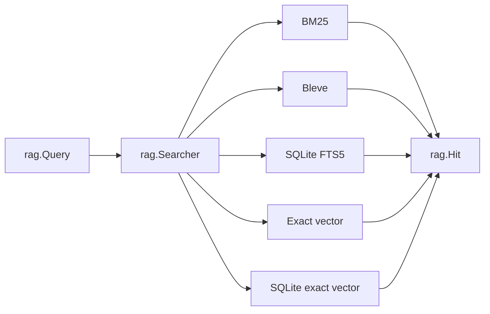
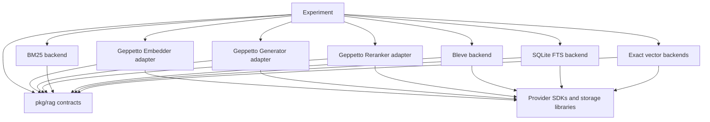
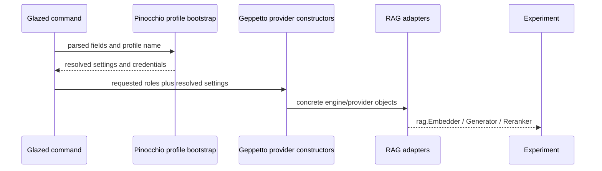

# Typed RAG Contracts and Backend Adapters

The RAG toolbox separates domain meaning from backend technology. Experiments operate on `rag.Embedder`, `rag.Searcher`, `rag.Generator`, and `rag.Reranker`. Concrete packages translate those contracts into in-memory algorithms, SQLite indexes, Bleve indexes, and Geppetto provider calls.

## Records before algorithms

The records define what must survive algorithm substitution:

- `Document` retains source text and metadata.
- `Chunk` retains document identity and source range.
- `Representation` retains chunk and document identity plus representation kind.
- `Vector` retains representation identity and embedding model.
- `Hit` retains representation, chunk, document, channel, score, and rank.
- `Evidence` carries hydrated chunk content and retrieval/reranking scores.

These types prevent a backend from returning only an opaque score and losing the lineage required by later stages.

## One search contract, several backends

The lexical family includes:

- deterministic in-memory BM25;
- persistent Bleve;
- persistent SQLite FTS5.

The vector family includes:

- in-memory exact cosine search;
- persistent SQLite exact cosine search.

All satisfy the same `Searcher` or `Index` boundary. Backend bakeoff can measure construction time, query time, index size, rankings, and evaluation metrics without redefining query semantics for each implementation.



The diagram represents substitution, not simultaneous dispatch. The experiment chooses which concrete searchers to construct.

## Provider adapters

Geppetto exposes provider and engine APIs that are not identical to the repository's domain interfaces. Adapter packages perform the translation.

The embedding adapter:

1. validates request model and text;
2. calls batch embedding;
3. validates result count, dimensions, and finite values;
4. returns `rag.EmbeddingResult`.

The generation adapter:

1. renders a domain generation request into a Geppetto turn;
2. invokes the engine;
3. extracts the final assistant text;
4. returns finish and usage metadata.

The reranking adapter:

1. maps evidence into provider documents with stable IDs;
2. calls the provider;
3. validates score finiteness and complete identity coverage;
4. reconstructs ranked `rag.Evidence`.

## Profile configuration remains at the command boundary

Credentials and provider selection use Pinocchio and Geppetto profile resolution exposed through Glazed command sections. Commands parse and resolve configuration; provider constructors receive resolved settings or concrete provider objects.

This preserves two separations:

- domain packages do not read environment variables;
- generic provider adapters do not parse CLI values.

The proposed role-selective bundle makes commands state whether they need embedding, generation, or reranking. It avoids constructing unused providers while sharing metadata and cleanup.

## Compile-time interface assertions

Concrete implementations use assertions such as:

```go
var _ rag.Embedder = (*Embedder)(nil)
var _ rag.Reranker = (*Reranker)(nil)
var _ rag.Index = (*Exact)(nil)
```

These assertions make adapter drift a compile-time failure. They are especially valuable when interfaces are deliberately small and many backends implement them.

## The contract stack

The pattern is easier to understand as a stack of contracts.

```text
Experiment contract
    Which queries, variants, prompts, and measurements are selected?

RAG domain contract
    What is a query, hit, vector, generation request, or rerank result?

Adapter contract
    How does one external SDK or storage engine satisfy the domain contract?

Backend contract
    How are values persisted, queried, scored, and closed?
```

Dependencies point downward. An adapter imports the domain. The domain does not import Geppetto, Bleve, or SQLite. An experiment imports both domain contracts and chosen implementations.



## Why the records contain redundant-looking identifiers

A `Hit` contains representation, chunk, and document IDs:

```go
type Hit struct {
    RepresentationID string
    ChunkID          string
    DocumentID       string
    Channel          string
    Score            float64
    Rank             int
}
```

At first glance, the representation ID could be enough because a lookup table can recover the chunk and document. The explicit fields protect two downstream operations.

First, fusion combines hits from several channels. It needs an explicit collapse target. A representation-level result may need to collapse to a chunk or document before reciprocal-rank fusion.

Second, evaluation judgments may target different lineage levels. The evaluator can map a hit to the requested identity without reopening a backend-specific record.

The redundancy is therefore semantic denormalization. It keeps results self-describing across backend boundaries.

## Adapter design by example: embedding

The domain request is:

```go
type EmbeddingRequest struct {
    Model string
    Texts []string
}

type EmbeddingResult struct {
    Vectors [][]float32
    Usage   Usage
}
```

The Geppetto adapter wraps an `embeddings.Provider`:

```go
type Embedder struct {
    provider embeddings.Provider
    model    embeddings.EmbeddingModel
}

var _ rag.Embedder = (*Embedder)(nil)
```

Its algorithm is:

```text
Embed(request):
    require at least one text
    verify requested model matches configured model
    vectors = provider.GenerateBatchEmbeddings(texts)
    require len(vectors) == len(texts)
    for each vector:
        require len(vector) == model dimensions
        require every component is finite
    return domain EmbeddingResult
```

The adapter does not cache, retry, rate-limit, or choose batch sizes. Those are execution and experiment responsibilities. It translates and validates one provider call.

## Adapter design by example: generation

The domain generation request contains fields the experiment can reason about:

```go
type GenerationRequest struct {
    Kind         string
    Model        string
    Prompt       string
    Text         string
    Evidence     []Evidence
    OutputSchema string
}
```

The Geppetto engine expects a turn. The adapter renders the request into provider input, runs inference, and extracts the final assistant text.

```text
Generate(request):
    validate configured model
    prompt = render prompt + text + ordered evidence + output schema
    turn = create Geppetto turn with user block
    completed = engine.RunInference(turn)
    text = find last assistant text block
    usage = translate provider metadata if present
    return GenerationResult{text, finishReason, usage}
```

Prompt rendering at this boundary is transport rendering. The experiment still owns the substantive prompt and schema. The adapter decides how a `GenerationRequest` becomes a Geppetto turn.

## Adapter design by example: reranking

Reranking is more identity-sensitive than generation. The provider returns document IDs and scores. The adapter must prove that those IDs refer to the candidates sent.

```text
Rerank(request):
    require Results is positive and within candidate count
    assign each candidate a stable provider document ID
    send query and documents
    validate each returned score is finite
    reject unknown document IDs
    reject duplicate document IDs
    ensure required coverage
    reconstruct Evidence in provider order
    attach reranker scores and ranks
```

Returning SDK response objects directly would leak provider identity semantics into every experiment. Reconstruction produces one domain result regardless of provider.

## Backend lifecycle: `Searcher` versus `Index`

`Searcher` expresses query behavior:

```go
type Searcher interface {
    Search(context.Context, Query, int) ([]Hit, error)
}
```

`Index` adds cleanup:

```go
type Index interface {
    Searcher
    io.Closer
}
```

An in-memory index can implement `Close` as a no-op. SQLite and Bleve close file handles. Experiments can own an `Index` uniformly without forcing all searchers to be persistent.

## Constructing and comparing backends

A backend bakeoff can depend on a small constructor shape:

```go
type Backend struct {
    Name     string
    Build    func(context.Context, Workload) (rag.Index, Manifest, error)
}

for _, backend := range backends {
    started := time.Now()
    index, manifest, err := backend.Build(ctx, workload)
    buildDuration := time.Since(started)
    if err != nil {
        return err
    }

    rankings := queryAll(ctx, index, workload.Queries)
    report := evaluation.EvaluateRankings(rankings, workload.Judgments)
    appendResult(backend.Name, buildDuration, manifest, report)
    index.Close()
}
```

The constructor is experiment-local because the compared backend list is policy. The resulting indexes share the domain interface.

## Profile and credential flow

Provider configuration follows this direction:



No adapter calls `os.Getenv`. No domain package imports Glazed. The command is the authorized integration point between operator configuration and domain capabilities.

## Testing adapters

Adapter tests should use fake SDK providers and assert boundary behavior:

```text
wrong result count is rejected
wrong dimensions are rejected
NaN and infinity are rejected
unknown reranking IDs are rejected
duplicate reranking IDs are rejected
assistant text is extracted from the correct turn block
interface assertion compiles
```

Experiment tests do not need to repeat these checks. They can use fake `rag.Embedder` or `rag.Generator` implementations and focus on orchestration.

## When not to use a shared interface

Do not force two backends behind one interface if their semantic operations differ. A backend that supports hybrid filters, transactions, or approximate-search tuning may require a richer operation than `Search(Query, limit)`. The correct response is a new domain capability or an experiment-local concrete dependency, not an `any` options map.

## Rebuilding the pattern

1. Define stable domain input and output records.
2. Include the identities required by every downstream stage.
3. Define the smallest operation interface around those records.
4. Implement deterministic local components first.
5. Add SDK adapters that translate and validate.
6. Assert interface satisfaction at compile time.
7. Keep profile resolution and credentials at the command boundary.
8. Keep caching, budgeting, and retries outside single-call adapters.
9. Test malformed external responses at the adapter.
10. Compare implementations through the domain interface, not SDK types.

## Why this pattern works

The interface boundary succeeds because it is semantic rather than technological. `Searcher.Search` means “rank hits for a query,” not “execute a Bleve query” or “run this SQL.” Provider-specific concepts remain behind adapters.

The records carry enough identity to support fusion, hydration, reranking, and evaluation after substitution.

## Pattern assessment

The typed contracts and backend adapters are **established**. Provider bundle ownership and role-selective construction are **proposed refinements**.

## Candidate ecosystem rules

- Define domain interfaces in terms of stable records, not provider SDK types.
- Put SDK translation and response validation in narrow adapter packages.
- Resolve CLI profiles before constructing domain adapters.
- Require concrete implementations to assert interface satisfaction.
- Preserve semantic identity through every backend result.

## Related documents

- [[01 - Project Architecture Overview]]
- [[03 - Recoverable Bounded Execution for Expensive Work]]
- [[06 - Semantic Identity Versioning and Validation]]
- [[08 - Candidate Ecosystem Guidelines]]
