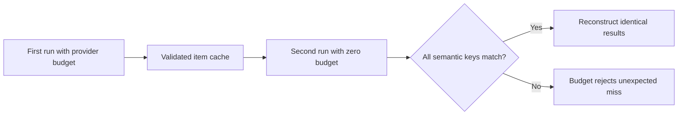

# Semantic Identity, Versioning, and Validation

Recovery is correct only when a cache hit means the same computation. A digest of input text is insufficient if model, prompt, output schema, context policy, or adapter behavior can change the result. `rag-ttc` treats identity construction and result validation as part of execution correctness.

## Identity layers

The repository uses several identities:

| Identity | Covered facts |
|---|---|
| Content digest | Exact source or representation bytes |
| Entity ID | Stable document, chunk, representation, or query name |
| Cache key | Step, semantic version, and digest of all effective inputs |
| Run ID | Time, experiment name, and random suffix |
| Review ID | Query, evidence context, answer, and review schema |

These identities have different lifetimes. Content identity survives runs. A cache key changes when computation semantics change. A run ID distinguishes executions even with identical configuration.

## Versioned cache keys

A generic cache key contains:

```go
type Key struct {
    Step        string
    Version     string
    InputDigest string
}
```

The caller constructs the input digest. Generation cache identity includes model, request kind, query text, ordered evidence identities, prompt digest, output-schema digest, adapter version, and context policy.

```text
cache identity =
    operation name
    + semantic version
    + model identity
    + exact effective input
    + prompt/schema identity
    + adapter policy identity
```

The version is not a software release number. It marks the meaning of the step's output.

## Validation before storage

Provider output is validated before it becomes a durable reusable result.

Embedding validation checks:

- response count;
- dimensions;
- finite values;
- consistent ordering.

Structured generation validation has two layers:

1. strict syntax rejects unknown fields and malformed or trailing JSON;
2. semantic validation requires exact requested identifiers, non-empty summaries, valid citations, and coherent abstention fields.

Only validated results enter the per-item cache.

## Missing usage is not zero

Provider usage fields are pointers. A missing field means the provider did not report a value. A pointer to zero means the provider explicitly reported zero.

```text
missing + missing -> missing
missing + reported zero -> reported zero
reported 5 + missing -> reported 5
reported 5 + reported 7 -> reported 12
```

This distinction prevents reports from converting unknown cost into a claim of no cost.

## Replay as an identity test

Zero-budget replay tests more than cache persistence. It verifies that the complete semantic identity is stable across executions.



An unexpected miss is useful evidence. It reveals identity drift instead of silently hiding it behind another provider call.

The answer-quality work exposed a stronger requirement: identical generation-cache hits do not automatically prove identical review identity if evidence selection or serialization changes elsewhere. The complete path from retrieval evidence through answer and review queue must be versioned coherently.

## Proposed generic extraction

The simplification design moves SHA-256 helpers into `pkg/digest`, strict JSON mechanics into `internal/jsonutil`, and finite vector validation into `pkg/vector`. Semantic validation remains with RAG and experiments.

This follows a precise boundary:

- generic package: calculate digest or reject malformed syntax;
- domain package: decide which fields define meaning;
- experiment: decide which meaning is required for the hypothesis.

## Pattern assessment

Versioned cache identities and pre-storage validation are **established**. End-to-end semantic identity across retrieval, generation, and blinded review is **emergent** because live replay exposed an unresolved instability.

## Candidate ecosystem rules

- Include every effective semantic input in a cache identity.
- Version semantics explicitly instead of relying on package or binary versions.
- Validate provider output before durable storage.
- Preserve unknown metering values as unknown.
- Use zero-budget replay to detect identity drift.
- Treat downstream artifact identity as part of replay correctness.

## Related documents

- [[03 - Recoverable Bounded Execution for Expensive Work]]
- [[04 - Experiment Directories as Result Custody]]
- [[07 - Architecture Debt and Patterns Not to Repeat]]
- [[08 - Candidate Ecosystem Guidelines]]
