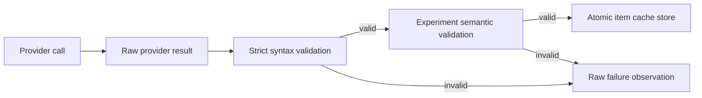

# Semantic Identity, Versioning, and Validation

Recovery is correct only when a cache hit means the same computation. A digest of input text is insufficient if model, prompt, output schema, context policy, or adapter behavior can change the result. `rag-ttc` treats identity construction and result validation as part of execution correctness.

## Identity layers

The repository uses several identities:

| Identity | Covered facts |
|---|---|
| Content digest | Exact source or representation bytes |
| Entity ID | Stable document, chunk, representation, or query name |
| Cache key | Step, semantic version, and digest of all effective inputs |
| Run ID | Time, experiment name, and random suffix |
| Review ID | Query, evidence context, answer, and review schema |

These identities have different lifetimes. Content identity survives runs. A cache key changes when computation semantics change. A run ID distinguishes executions even with identical configuration.

## Versioned cache keys

A generic cache key contains:

```go
type Key struct {
    Step        string
    Version     string
    InputDigest string
}
```

The caller constructs the input digest. Generation cache identity includes model, request kind, query text, ordered evidence identities, prompt digest, output-schema digest, adapter version, and context policy.

```text
cache identity =
    operation name
    + semantic version
    + model identity
    + exact effective input
    + prompt/schema identity
    + adapter policy identity
```

The version is not a software release number. It marks the meaning of the step's output.

## Validation before storage

Provider output is validated before it becomes a durable reusable result.

Embedding validation checks:

- response count;
- dimensions;
- finite values;
- consistent ordering.

Structured generation validation has two layers:

1. strict syntax rejects unknown fields and malformed or trailing JSON;
2. semantic validation requires exact requested identifiers, non-empty summaries, valid citations, and coherent abstention fields.

Only validated results enter the per-item cache.

## Missing usage is not zero

Provider usage fields are pointers. A missing field means the provider did not report a value. A pointer to zero means the provider explicitly reported zero.

```text
missing + missing -> missing
missing + reported zero -> reported zero
reported 5 + missing -> reported 5
reported 5 + reported 7 -> reported 12
```

This distinction prevents reports from converting unknown cost into a claim of no cost.

## The digest API and its limits

At the analyzed commit, generic digest helpers live in `pkg/rag/identity.go`:

```go
func DigestBytes(data []byte) string
func DigestText(text string) string
func DigestJSON(value any) (string, error)
```

They calculate lowercase SHA-256 hexadecimal digests. `DigestText` hashes exact UTF-8 bytes. `DigestJSON` hashes the output of `encoding/json.Marshal`.

A digest answers one question:

> Are these serialized bytes identical?

It does not answer whether the serialized fields are sufficient to describe the computation. That is the caller's responsibility.

For example:

```go
// Insufficient: model changes can change the vector.
key := execution.NewKey("embedding", "v1", text)

// Sufficient for this adapter contract:
key := execution.NewKey("embedding", "v1", struct {
    Model string `json:"model"`
    Text  string `json:"text"`
}{
    Model: request.Model,
    Text:  text,
})
```

The digest algorithm can be correct while the cache identity is semantically incomplete.

## Cache key structure

The generic key separates three concerns:

```go
type Key struct {
    Step        string `json:"step"`
    Version     string `json:"version"`
    InputDigest string `json:"input_digest"`
}
```

`Step` prevents two operations with identical inputs from colliding. `Version` marks semantic behavior. `InputDigest` covers the concrete effective input.

The cache then hashes the complete key again to produce a filesystem path:

```text
input object
  -> deterministic JSON
  -> SHA-256 InputDigest
  -> {Step, Version, InputDigest}
  -> deterministic JSON
  -> SHA-256 entry digest
  -> <cache>/<first-two-hex>/<entry-digest>.json
```

The shard prefix prevents one directory from containing every cache entry.

## Constructing a generation identity

Generation depends on more than query text. A complete identity must cover:

```go
type GenerationCacheKeyInput struct {
    Model          string
    Kind           string
    QueryDigest    string
    Evidence       []EvidenceCacheIdentity
    PromptDigest   string
    SchemaDigest   string
    AdapterVersion string
    ContextPolicy  string
}
```

Evidence order belongs in the identity because prompt order can change the answer. Each evidence identity should include the stable chunk ID and content digest, not only rank or an array index.

Pseudocode:

```text
NewGenerationCacheKey(request, adapterVersion, contextPolicy):
    evidenceIdentities = []
    for evidence in request.Evidence in exact order:
        require chunk ID
        digest = chunk.ContentDigest
        if digest absent:
            digest = hash exact chunk text
        append {chunk ID, digest, rank}

    input = {
        model,
        request kind,
        hash request text,
        evidence identities,
        hash prompt,
        hash output schema,
        adapter version,
        context policy,
    }

    return NewKey("generation", cacheSchemaVersion, input)
```

Changing any field invalidates the old result intentionally.

## Cache envelopes protect storage integrity

The file cache does not write a raw result alone. It stores:

```go
type cacheEnvelope struct {
    SchemaVersion string
    Key           Key
    ValueDigest   string
    Value         json.RawMessage
}
```

Loading validates four layers:

1. the envelope JSON decodes strictly;
2. the schema version is recognized;
3. the stored key equals the requested key;
4. the digest of `Value` matches `ValueDigest`;
5. the value decodes strictly into the requested result type.

If any validation fails, `Load` returns `ErrCorruptCache`.

```text
file absent
    -> miss
file present and valid
    -> hit
file present but malformed, mismatched, or corrupt
    -> error
```

This three-state model is required for reliable recovery. A two-state hit/miss model cannot distinguish absence from damaged presence.

## Syntactic and semantic validation

Structured model output passes through two independent validators.

### Syntactic validation

Strict JSON decoding checks:

- valid JSON syntax;
- no unknown object fields;
- exactly one JSON value;
- no trailing content.

The proposed API is:

```go
func DecodeStrict[T any](data []byte) (T, error)
func StripCompleteFence(text, language string) (string, bool)
```

Fence removal is separate because only model output permits a Markdown wrapper. Cache and annotation inputs must not inherit model-output normalization.

### Semantic validation

The summary experiment then checks:

```text
every returned chunk_id was requested
no chunk_id appears twice
every summary is non-empty
every requested chunk_id appears exactly once
```

Answer quality checks:

```text
answer, citation_chunk_ids, and abstained fields are present
citations refer only to supplied evidence
non-abstaining answers contain required evidence
abstention fields are coherent
```

The generic decoder cannot perform these checks because they depend on the experiment's requested items and policy.

## Validation before cache commit

The order is:



Invalid results remain observable but never become reusable cache hits.

## Usage aggregation API

The simplification design adds:

```go
func (u *Usage) Add(other Usage)
func SumUsage(values ...Usage) Usage

type UsageAccumulator struct {
    // private mutex and value
}

func (a *UsageAccumulator) Add(value Usage)
func (a *UsageAccumulator) Snapshot() Usage
```

Pointer fields preserve the missing-versus-zero distinction. A snapshot must not expose pointers that alias mutable accumulator storage.

Pseudocode for one field:

```text
addOptional(total **int64, value *int64):
    if value is nil:
        return
    if total is nil:
        allocate zero
    *total += *value
```

## End-to-end replay identity

An answer-quality replay has several identity boundaries:

```text
corpus identity
  -> chunk identity
  -> representation identity
  -> embedding key
  -> retrieval ranking
  -> selected evidence identity
  -> generation key
  -> answer identity
  -> blinded review identity
```

A stable generation key is not sufficient if retrieval ties change evidence order. A stable answer is not sufficient if review serialization changes. End-to-end replay must compare the final evidence, answer, queue, and private key artifacts.

The live replay issue found in the project is therefore architecturally valuable. It demonstrates that semantic identity is a path property, not only a cache property.

## A replay verification procedure

```text
run A:
    authorize provider budget
    execute workload
    record cache reports and result digests

run B:
    set every provider budget to zero
    execute identical workload
    require WorkCalls == 0
    compare:
        selected evidence IDs and order
        generated answers
        result records
        review queue
        private review key

run C:
    repeat independently
    require the same comparisons
```

Two independent replays detect accidental reliance on transient process state.

## Rebuilding the pattern

1. Define canonical content digests.
2. Define explicit entity IDs separately from content.
3. Give each cached operation a step name and semantic version.
4. Hash every effective input in deterministic order.
5. Store the full key and a value digest in the cache envelope.
6. Treat corrupt presence as an error.
7. Validate syntax and domain semantics before storage.
8. Preserve raw invalid provider output as an observation.
9. Preserve missing measurements as missing.
10. Prove the complete identity path with zero-authority replay.

## Replay as an identity test

Zero-budget replay tests more than cache persistence. It verifies that the complete semantic identity is stable across executions.


An unexpected miss is useful evidence. It reveals identity drift instead of silently hiding it behind another provider call.

The answer-quality work exposed a stronger requirement: identical generation-cache hits do not automatically prove identical review identity if evidence selection or serialization changes elsewhere. The complete path from retrieval evidence through answer and review queue must be versioned coherently.

## Proposed generic extraction

The simplification design moves SHA-256 helpers into `pkg/digest`, strict JSON mechanics into `internal/jsonutil`, and finite vector validation into `pkg/vector`. Semantic validation remains with RAG and experiments.

This follows a precise boundary:

- generic package: calculate digest or reject malformed syntax;
- domain package: decide which fields define meaning;
- experiment: decide which meaning is required for the hypothesis.

## Pattern assessment

Versioned cache identities and pre-storage validation are **established**. End-to-end semantic identity across retrieval, generation, and blinded review is **emergent** because live replay exposed an unresolved instability.

## Candidate ecosystem rules

- Include every effective semantic input in a cache identity.
- Version semantics explicitly instead of relying on package or binary versions.
- Validate provider output before durable storage.
- Preserve unknown metering values as unknown.
- Use zero-budget replay to detect identity drift.
- Treat downstream artifact identity as part of replay correctness.

## Related documents

- [[03 - Recoverable Bounded Execution for Expensive Work]]
- [[04 - Experiment Directories as Result Custody]]
- [[07 - Architecture Debt and Patterns Not to Repeat]]
- [[08 - Candidate Ecosystem Guidelines]]
