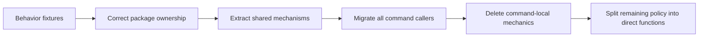

# Architecture Debt and Patterns Not to Repeat

The repository's strongest mechanisms should not obscure its current structural debt. The clean-slate approach prevented a workflow framework from returning, but experiment runners still copied infrastructure and one package mixed generic execution with RAG adapters. These are correctable ownership problems, not evidence that the overall approach failed.

## Mixed generic and domain code

`pkg/rag/execution` contains domain-neutral maps, budgets, rate limiters, caches, and cached batch maps. It also contains `CachedEmbedder` and cached generation/reranking functions that import RAG types.

The package name incorrectly classifies most of its code by first use rather than semantic dependency.

The accepted correction is:

```text
pkg/execution
  map, budget, rate, chain, cache, cached maps

pkg/rag/embedding
  cached Embedder decorator

pkg/rag/generation
  cached Generator operations

pkg/rag/reranking
  cached Reranker operations
```

No forwarding package should remain. Internal callers can migrate atomically.

## Cross-experiment implementation imports

Summary performance imports `answerquality.ProviderBundle`. Experiment packages should be siblings. Reusing an implementation from another experiment makes the second experiment inherit provider roles and lifecycle decisions that were not designed as a stable package contract.

Provider construction belongs under `pkg/rag/providers/geppetto`; Glazed profile resolution remains in commands.

## Large multi-responsibility runners

The answer-quality runner owns preparation, embedding, index construction, variant retrieval, evaluation, grounded generation, contract validation, human review, artifacts, usage, provider setup, and path measurement.

Large runners are not automatically wrong. The problem is that reusable mechanics obscure the scientific sequence. The correct simplification order is:

1. extract and test shared mechanics;
2. migrate callers;
3. delete command-local copies;
4. split the remaining runner into direct functions named for scientific operations.

Splitting first would create new local abstractions around duplicated mechanics.

## Command-local scheduler duplication

Summary generation implements cache hit detection, miss grouping, parallel calls, observations, parsing, per-item stores, usage aggregation, and output reconstruction. The fixed-batch cache primitive cannot represent whole-document groups, so the command created a second scheduler.

The missing reusable concept is a generic cached variable-group map. The scheduler should move; prompt construction, group packing, and exact summary-ID validation should remain local.

## Heuristic partial-result reconstruction

Summary export infers completed arms from multiple file layouts after failure. This is an artifact-custody defect. Completed result rows should be appended as primary records. Export should consume explicit records rather than interpret filenames as state.

## Redundant artifacts

Timing experiments can write per-arm files, combined JSON, CSV, Glazed rows, observations, and full vector arrays. Not every representation is primary evidence. Large vector values should be stored once when required for downstream retrieval; timing-only variants need manifests containing count, dimensions, model, and content identity.

## Overbuilt human-review analysis

Pairwise statistics, bootstrap intervals, reviewer overlap, and disagreement reporting are useful but have one consumer. They should remain an optional command-local module until another project demonstrates the same contract. Moving them into `pkg` merely because they are mathematically generic would create an unsupported public abstraction.

## Diagnosing ownership debt

The simplification audit uses dependency evidence rather than file size alone. A file is in the wrong package when its API and imports contradict the package's stated domain.

For `pkg/rag/execution`, the classification is:

| Files | Uses RAG types? | Correct target |
|---|---:|---|
| `map.go`, `budget.go`, `rate.go`, `chain.go` | No | `pkg/execution` |
| `cache.go`, `cached_map.go`, `cached_batch_map.go` | No | `pkg/execution` |
| `cached_embedder.go` | Yes | `pkg/rag/embedding` |
| `cached_generation.go` generation half | Yes | `pkg/rag/generation` |
| `cached_generation.go` reranking half | Yes | `pkg/rag/reranking` |

The test is not “could another program use this?” Almost any function can be generalized. The test is “does the public contract already express a domain-independent invariant?”

## Why forwarding packages would preserve the debt

An internal package move can update every caller atomically. Leaving aliases such as:

```go
package execution

type Budget = genericexecution.Budget
var Map = genericexecution.Map
```

would preserve two import paths and make migration completion ambiguous. New code could continue importing the old path. Documentation would need to explain both names.

The project has no external compatibility requirement for these internal packages, so the design deletes the old package after caller migration.

## Why runner splitting comes last

Suppose the answer-quality runner is split before shared mechanics move:

```text
runner.go
  -> preparation.go
  -> embedding_stage.go
  -> retrieval_stage.go
  -> generation_stage.go
  -> artifact_stage.go
```

The file count improves, but command-local embedding scheduling, usage merging, provider setup, and artifact inference remain. The same responsibilities have only moved horizontally.

The accepted order is:



After deletion, the remaining runner functions correspond to scientific operations rather than infrastructure fragments.

## A target runner before and after

The current summary generation operation locally performs:

```text
build keys
load cache
group misses
schedule provider calls
observe requests
parse responses
validate IDs
store each item
merge usage
reconstruct order
measure arm
write artifacts
```

The target command-local operation performs:

```go
func runSummaryVariant(ctx context.Context, arm Arm, items []Item) (ResultRow, error) {
    groups := pack(items, arm) // experiment policy

    summaries, cacheReport, err := execution.MapCachedGroups(
        ctx,
        groups,
        arm.ExecutionOptions(),
        func(ctx context.Context, group execution.Group[Item]) ([]Summary, error) {
            request := buildSummaryRequest(group, arm) // experiment prompt policy
            result, err := generator.Generate(ctx, request)
            if err != nil {
                return nil, err
            }
            return parseAndValidateSummaries(result.Text, group.Items)
        },
    )
    if err != nil {
        return ResultRow{}, err
    }

    return measure(arm, summaries, cacheReport), nil
}
```

The target remains explicit about packing, prompts, and contracts. It delegates cache and scheduling mechanics.

## Artifact debt as an authority problem

Multiple formats are not automatically redundant. JSON, CSV, and Markdown can be useful views. Debt appears when several files can each be interpreted as the authoritative set of completed results.

The correct authority chain is:

```text
completed variant JSONL records  primary
    -> combined JSON             derived
    -> CSV                       derived
    -> Markdown                  derived
    -> Glazed rows               derived
```

An exporter should never infer scientific completion from the presence of `concurrency-4.json`.

## What should remain local even after cleanup

The cleanup is not trying to make commands tiny. These concerns remain local:

- summary arm matrices and packing policy;
- answer prompts and structured schemas;
- evidence context limits;
- query and split selection;
- result columns and human-readable report structure;
- blinded review score definitions;
- human-review statistics until a second consumer exists.

A successful refactor leaves substantial command code because experiments contain substantial policy.

## Refactor verification

The refactor is incomplete unless searches show:

```text
no import of pkg/rag/execution
no experiment importing another experiment
no duplicate usage aggregation
no duplicate retrieval target switches
no command-local cache storage
no filename-based completed-result inference
no compatibility forwarding package
```

Behavior verification then compares command schemas, cache identities, rankings, metrics, result keys, missing usage fields, failure recovery, and zero-budget replay.

## Review rule

> Extraction is complete only when the old implementation is deleted and the remaining command code describes policy rather than relocated mechanics.

## Patterns not to repeat

- Do not place generic code under a domain package because the first caller is domain-specific.
- Do not import one experiment implementation from another.
- Do not respond to a large runner by creating a generic workflow interface.
- Do not reconstruct completed state from filename conventions.
- Do not persist large duplicate artifacts without a named consumer.
- Do not promote single-consumer statistical policy into a shared package.
- Do not keep compatibility aliases for internal package moves.

## Pattern assessment

These items are **architecture debt** with accepted remediation designs. The debt is bounded and visible in `RAG-TTC-SIMPLIFY-001`.

## Related documents

- [[02 - Plain Go Experiments and the Mechanism Policy Boundary]]
- [[03 - Recoverable Bounded Execution for Expensive Work]]
- [[06 - Semantic Identity Versioning and Validation]]
- [[08 - Candidate Ecosystem Guidelines]]
