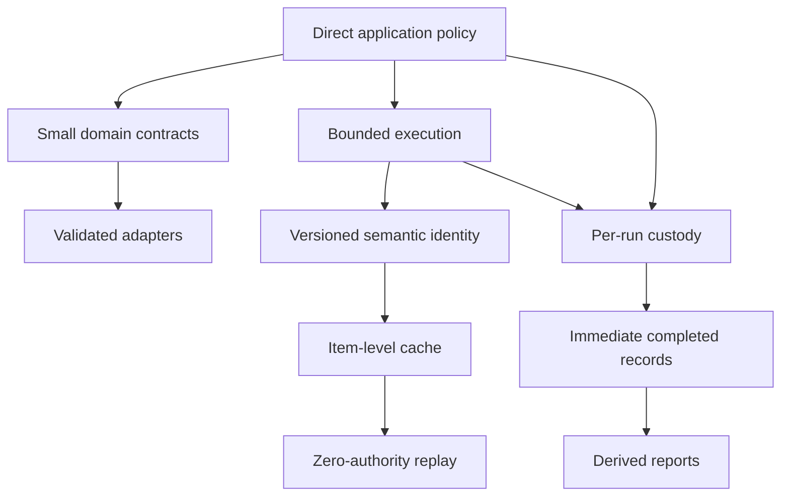

# Candidate Ecosystem Guidelines

This document extracts rules from `rag-ttc` for comparison with other go-go-golems projects. They remain candidates until independent projects demonstrate the same constraints and benefits.

## 1. Package by semantic dependency

If an API does not mention domain types and its invariants remain meaningful outside the domain, place it in a focused generic package.

Evidence in `rag-ttc`:

- maps, budgets, rate limiters, and caches do not require RAG;
- embedding, generation, and reranking cache decorators do;
- digest, Unicode term analysis, and vector arithmetic are broader than RAG;
- filesystem and strict JSON helpers are reusable internally but need not be public.

Candidate rule:

> Package ownership follows semantic inputs and invariants, not the first feature that used the code.

## 2. Keep application policy in direct code

Shared packages should not own experiment arm names, prompts, workload selection, result columns, or stage graphs.

Candidate rule:

> Prefer direct application functions over a workflow abstraction when orchestration is policy and does not require independent persistence, distribution, or remote scheduling.

## 3. Treat expensive work as independently recoverable items

The execution model resolves hits before admission, bounds active workers, separates rate from total budget, validates output, and stores each successful item.

Candidate rule:

> Expensive batch operations should expose item-level durable recovery even when providers execute batches.

Likely comparison targets include scraper workflows, researchctl operations, bulk LLM commands, and asset-generation pipelines.

## 4. Use zero-authority replay

Zero-budget replay permits no new provider work. It proves that cache identity and reconstruction are complete.

Candidate rule:

> Test resumable systems by replaying with external authority or budget disabled; an unexpected miss should fail rather than silently repeat work.

The analogous constraint in other systems may be disabled network access, read-only credentials, or a mock that rejects every outbound call.

## 5. Separate reusable cache state from run evidence

Cache state answers whether a semantic computation already exists. Run evidence answers what a particular execution did.

Candidate rule:

> Keep reusable computation caches separate from per-run manifests, observations, results, and terminal state.

## 6. Persist completed units before aggregate completion

A long campaign can fail after useful results exist.

Candidate rule:

> Append a stable record immediately after each independently meaningful unit completes; derive aggregate reports from those records.

This rule is applicable to migrations, crawls, benchmark matrices, code generation, and multi-target releases.

## 7. Preserve unknown values as unknown

Missing provider usage is not zero cost.

Candidate rule:

> When an external system omits a measurement, preserve absence in the type and report instead of substituting a neutral-looking numeric value.

## 8. Validate at adapter boundaries

Provider adapters verify count, dimensions, identity coverage, finite scores, and response shape before returning domain results.

Candidate rule:

> An adapter is responsible for converting and validating an external contract; callers should not repeatedly defend against malformed SDK values.

## 9. Make semantic versioning part of cache identity

Binary versions are not sufficient because a prompt, context policy, or adapter behavior may change independently.

Candidate rule:

> Cache keys should contain an explicit semantic step version and a digest of every effective input.

## 10. Let tests protect architectural invariants

The execution tests assert ordering, worker bounds, corrupt-cache behavior, zero-budget replay, and late-failure recovery. These are architectural contracts, not only implementation details.

Candidate rule:

> Write tests for dependency-sensitive runtime invariants: order, authority, persistence, cancellation, identity, and terminal state.

## Pattern interaction

The candidates form one coherent system:



The value is cumulative. A cache without semantic identity can replay the wrong work. A cache without zero-authority replay can hide misses. Execution recovery without per-run custody preserves computation but loses experimental evidence. Run custody without immediate records still loses partial progress.

## Reference architecture

The candidates can be assembled into a small project architecture:

```text
cmd/<application>/
    parse Glazed settings
    resolve profiles and credentials
    select product or experiment policy
    compose concrete capabilities

pkg/<domain>/
    stable records
    small semantic interfaces
    domain validation

pkg/execution/
    bounded map
    finite budget
    replenishing rate
    durable item cache

pkg/experiment/ or pkg/run/
    manifest
    inputs
    observations
    completed records
    terminal status

pkg/<domain>/providers/<provider>/
    SDK translation
    external response validation
```

This is not a mandatory directory template. It is a responsibility template. A web application may call the run package `operation` or `job`; a bulk migration may use records rather than RAG results. The invariant is the direction of ownership.

## Example API set

A minimal ecosystem-quality implementation might expose:

```go
// Generic execution.
type Limiter interface {
    Wait(context.Context, int) error
}

func Map[T, R any](
    context.Context,
    []T,
    MapOptions[T],
    func(context.Context, T) (R, error),
) ([]R, error)

func MapCached[T, R any](
    context.Context,
    []T,
    CachedMapOptions[T],
    func(context.Context, T) (R, error),
) ([]R, CacheReport, error)

// Per-run custody.
func Create(context.Context, RunOptions, any) (*Run, error)
func (r *Run) AppendJSONL(context.Context, string, any) error
func (r *Run) Complete(context.Context, Summary) error
func (r *Run) Fail(context.Context, error) error

// One domain capability.
type Embedder interface {
    Embed(context.Context, EmbeddingRequest) (EmbeddingResult, error)
}
```

After the accepted execution-package reorganization, an application can compose them as follows:

```go
cached := embedding.NewCachedEmbedder(
    providerAdapter,
    embedding.CachedOptions{
        Cache:   itemCache,
        Limiter: execution.Chain(budget, rate),
        Workers: 4,
    },
)

run := experiment.Create(ctx, runOptions, config)
result := executePolicy(ctx, cached, workload)
run.AppendJSONL(ctx, "results/completed.jsonl", result)
run.Complete(ctx, summarize(result))
```

The interfaces remain small because each package has one responsibility.

## A guideline evaluation worksheet

Before promoting a candidate, analyze at least two repositories with the same questions.

### Semantic dependency

```text
What domain types appear in the API?
Could the invariant be stated without the current domain?
Does moving the code reduce an incorrect dependency?
Would the new package have at least two current consumers?
```

### Expensive execution

```text
What is the provider request unit?
What is the recovery unit?
What limits active concurrency?
What limits start rate?
What limits total authorized spend?
Are cache hits resolved before admission?
What happens after a late failure?
```

### Result custody

```text
Where is exact configuration stored?
Are mutable inputs copied or content-addressed?
Which record is authoritative for completed units?
Can a failed run retain successful partial results?
Is terminal state explicit?
Are combined reports primary or derived?
```

### Adapter validation

```text
Which external values are accepted?
Which response invariants are checked at the adapter?
Can SDK types escape into domain code?
Where are profiles and credentials resolved?
Does any library read environment variables directly?
```

### Identity and replay

```text
Which fields define semantic identity?
Where is semantic version recorded?
Can a replay run with external authority disabled?
Does replay compare downstream artifacts or only cache hits?
How is corrupted presence distinguished from absence?
```

## Detailed promotion criteria

A candidate can become an established ecosystem guideline when:

1. Two repositories implement the same invariant under comparable constraints.
2. At least one repository has tests that directly protect the invariant.
3. A failure or maintenance cost explains why the invariant matters.
4. The guideline states non-applicable cases.
5. A third project applies the guideline with less implementation or debugging cost.

Surface similarity is insufficient. Two projects may both use JSONL while only one requires immediate crash recovery. The comparison must name the shared property.

## Non-applicable cases

These guidelines have limits.

Do not use plain direct orchestration when:

- work must survive process restarts through a distributed scheduler;
- operators must modify a serialized workflow without recompiling;
- stages run on different machines with independent leases;
- orchestration history is itself a product feature.

Do not use per-item file caching when:

- results are tiny and computation is cheaper than storage lookup;
- identity cannot be made deterministic;
- results contain secrets that cannot be safely persisted;
- a transactional database already provides the required recovery semantics.

Do not create a run directory for every request when:

- requests are high-volume online traffic rather than research or bulk operations;
- existing tracing and database records already provide complete custody;
- per-request filesystem durability would dominate runtime cost.

## Implementation sequence for a new project

```text
Phase 1: write direct application policy
    Make the procedure readable and testable.

Phase 2: define stable domain records
    Preserve identities required downstream.

Phase 3: add narrow adapters
    Translate SDK values and validate responses.

Phase 4: bound execution
    Separate workers, rate, and total budget.

Phase 5: add semantic item caching
    Resolve hits before admission and store successes immediately.

Phase 6: add run custody
    Record config, inputs, observations, completed results, and status.

Phase 7: prove replay
    Disable external authority and require zero new work.

Phase 8: extract only demonstrated shared mechanisms
    Delete replaced implementations in the same change.
```

This order produces evidence before abstraction. It also gives each package a real caller and a concrete failure mode.

## Candidate cross-project comparisons

| `rag-ttc` candidate | Comparison target | Question |
|---|---|---|
| Item-level recovery | scraper workflows | Does a successful unit commit independently before campaign completion? |
| Zero-authority replay | researchctl and provider-backed CLIs | Can replay prove no external calls occur? |
| Immediate completed records | go-go-datadrop | Are append-only records primary state or only export? |
| Adapter validation | Geppetto consumers | Where are malformed provider responses rejected? |
| Package by semantic dependency | go-go-goja modules | Do generic runtime mechanics sit under a first-use domain? |
| Run custody | benchmark and migration tools | Are config, inputs, observations, results, and status co-located? |

The Garden should link concrete findings in both directions when these comparisons are performed.

## Compact working rules

- A package name should describe the concepts in its API.
- A cache hit should require no external authority.
- A successful expensive item should survive failure elsewhere.
- A failed run may contain valid completed results.
- An adapter should return validated domain values.
- A missing measurement should remain absent.
- A report should derive from explicit completed records.
- An orchestration abstraction should require an orchestration problem.

## Comparison agenda

Future Garden analyses should record whether a repository:

- distinguishes mechanism from application policy;
- packages by semantic dependency;
- represents concurrency, rate, and total budget separately;
- persists expensive work at the smallest useful recovery unit;
- supports replay with external authority disabled;
- separates cache state from run evidence;
- validates external values at adapters;
- appends completed units before campaign completion;
- preserves missing measurements;
- tests architectural invariants directly.

## Promotion status

These guidelines are candidates derived from one focused repository. Some have comparison evidence elsewhere:

- adapter validation and host-owned configuration appear throughout go-go-golems;
- durable item recovery can be compared with scraper and researchctl;
- append-only completed records can be compared with go-go-datadrop;
- structural invariant tests can be compared with the go-go-datadrop Garden study.

Promotion should occur only after those comparisons inspect actual contracts rather than similar names.

## Related documents

- [[Research/Software Architecture Garden/README|Software Architecture Garden]]
- [[01 - Project Architecture Overview]]
- [[02 - Plain Go Experiments and the Mechanism Policy Boundary]]
- [[03 - Recoverable Bounded Execution for Expensive Work]]
- [[04 - Experiment Directories as Result Custody]]
- [[05 - Typed RAG Contracts and Backend Adapters]]
- [[06 - Semantic Identity Versioning and Validation]]
- [[07 - Architecture Debt and Patterns Not to Repeat]]
