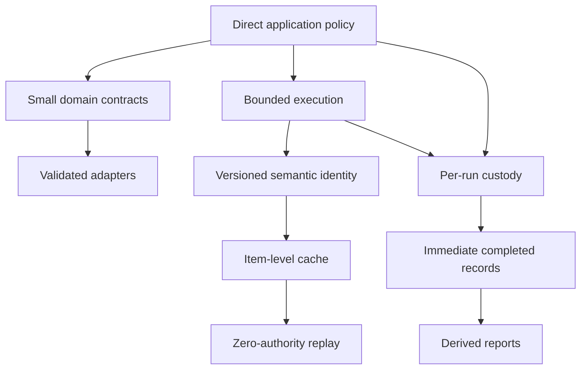

# Candidate Ecosystem Guidelines

This document extracts rules from `rag-ttc` for comparison with other go-go-golems projects. They remain candidates until independent projects demonstrate the same constraints and benefits.

## 1. Package by semantic dependency

If an API does not mention domain types and its invariants remain meaningful outside the domain, place it in a focused generic package.

Evidence in `rag-ttc`:

- maps, budgets, rate limiters, and caches do not require RAG;
- embedding, generation, and reranking cache decorators do;
- digest, Unicode term analysis, and vector arithmetic are broader than RAG;
- filesystem and strict JSON helpers are reusable internally but need not be public.

Candidate rule:

> Package ownership follows semantic inputs and invariants, not the first feature that used the code.

## 2. Keep application policy in direct code

Shared packages should not own experiment arm names, prompts, workload selection, result columns, or stage graphs.

Candidate rule:

> Prefer direct application functions over a workflow abstraction when orchestration is policy and does not require independent persistence, distribution, or remote scheduling.

## 3. Treat expensive work as independently recoverable items

The execution model resolves hits before admission, bounds active workers, separates rate from total budget, validates output, and stores each successful item.

Candidate rule:

> Expensive batch operations should expose item-level durable recovery even when providers execute batches.

Likely comparison targets include scraper workflows, researchctl operations, bulk LLM commands, and asset-generation pipelines.

## 4. Use zero-authority replay

Zero-budget replay permits no new provider work. It proves that cache identity and reconstruction are complete.

Candidate rule:

> Test resumable systems by replaying with external authority or budget disabled; an unexpected miss should fail rather than silently repeat work.

The analogous constraint in other systems may be disabled network access, read-only credentials, or a mock that rejects every outbound call.

## 5. Separate reusable cache state from run evidence

Cache state answers whether a semantic computation already exists. Run evidence answers what a particular execution did.

Candidate rule:

> Keep reusable computation caches separate from per-run manifests, observations, results, and terminal state.

## 6. Persist completed units before aggregate completion

A long campaign can fail after useful results exist.

Candidate rule:

> Append a stable record immediately after each independently meaningful unit completes; derive aggregate reports from those records.

This rule is applicable to migrations, crawls, benchmark matrices, code generation, and multi-target releases.

## 7. Preserve unknown values as unknown

Missing provider usage is not zero cost.

Candidate rule:

> When an external system omits a measurement, preserve absence in the type and report instead of substituting a neutral-looking numeric value.

## 8. Validate at adapter boundaries

Provider adapters verify count, dimensions, identity coverage, finite scores, and response shape before returning domain results.

Candidate rule:

> An adapter is responsible for converting and validating an external contract; callers should not repeatedly defend against malformed SDK values.

## 9. Make semantic versioning part of cache identity

Binary versions are not sufficient because a prompt, context policy, or adapter behavior may change independently.

Candidate rule:

> Cache keys should contain an explicit semantic step version and a digest of every effective input.

## 10. Let tests protect architectural invariants

The execution tests assert ordering, worker bounds, corrupt-cache behavior, zero-budget replay, and late-failure recovery. These are architectural contracts, not only implementation details.

Candidate rule:

> Write tests for dependency-sensitive runtime invariants: order, authority, persistence, cancellation, identity, and terminal state.

## Pattern interaction

The candidates form one coherent system:

The value is cumulative. A cache without semantic identity can replay the wrong work. A cache without zero-authority replay can hide misses. Execution recovery without per-run custody preserves computation but loses experimental evidence. Run custody without immediate records still loses partial progress.

## Comparison agenda

Future Garden analyses should record whether a repository:

- distinguishes mechanism from application policy;
- packages by semantic dependency;
- represents concurrency, rate, and total budget separately;
- persists expensive work at the smallest useful recovery unit;
- supports replay with external authority disabled;
- separates cache state from run evidence;
- validates external values at adapters;
- appends completed units before campaign completion;
- preserves missing measurements;
- tests architectural invariants directly.

## Promotion status

These guidelines are candidates derived from one focused repository. Some have comparison evidence elsewhere:

- adapter validation and host-owned configuration appear throughout go-go-golems;
- durable item recovery can be compared with scraper and researchctl;
- append-only completed records can be compared with go-go-datadrop;
- structural invariant tests can be compared with the go-go-datadrop Garden study.

Promotion should occur only after those comparisons inspect actual contracts rather than similar names.

## Related documents

- [[Research/Software Architecture Garden/README|Software Architecture Garden]]
- [[01 - Project Architecture Overview]]
- [[02 - Plain Go Experiments and the Mechanism Policy Boundary]]
- [[03 - Recoverable Bounded Execution for Expensive Work]]
- [[04 - Experiment Directories as Result Custody]]
- [[05 - Typed RAG Contracts and Backend Adapters]]
- [[06 - Semantic Identity Versioning and Validation]]
- [[07 - Architecture Debt and Patterns Not to Repeat]]
