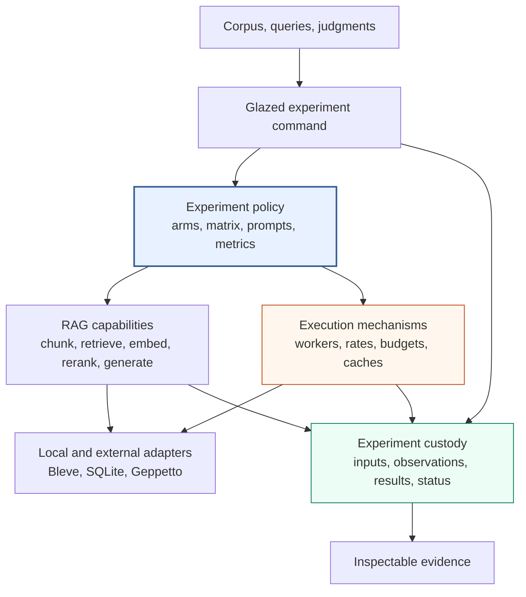

# Architecture Garden — rag-ttc

`rag-ttc` is a Go codebase for constructing and measuring
retrieval-augmented generation experiments. It provides shared components for
chunking, representation generation, lexical and vector search, embedding,
reranking, answer generation, bounded execution, recovery, and durable result
custody. Individual experiments remain explicit Go programs.

This study explains the larger architectural patterns that make those
components useful together. It is written for developers who understand Go
but do not know this repository, the TTC dataset, or the systems that preceded
it. The objective is not to prescribe `rag-ttc`'s directory structure to every
project. The objective is to identify reusable invariants that can guide
future information-retrieval systems, LLM benchmarks, and reproducible
research tools.

The analysis is pinned to commit
`ca5bffcfc094776eeb24a0d60be7a6220e07898b`, the committed completion point
of `RAG-TTC-SIMPLIFY-001`. The worktree also contained later uncommitted
answer-review work when this analysis was written. Claims in these chapters
refer to committed source and recorded validation evidence at the pinned
commit unless explicitly stated otherwise.

> [!summary]
> - Experiment policy remains explicit while reusable mechanisms and domain
>   capabilities have narrow, testable contracts.
> - Expensive work composes bounded concurrency, rate admission, finite
>   budgets, semantic caching, per-item durability, and zero-work replay.
> - Every run produces durable evidence: immutable inputs, configuration,
>   observations, canonical completed records, derived reports, and terminal
>   state.
> - Retrieval operates on derived representations but returns to source chunks
>   before answer generation and citation.
> - External providers enter through Glazed configuration and validated
>   Geppetto adapters; layered tests and bounded live runs establish different
>   classes of evidence.

## What this project is measuring

Retrieval-augmented generation has two distinct operations. Retrieval selects
source material that is relevant to a query. Generation uses that material to
produce an answer. An experiment may vary chunk size, searchable
representation, embedding model, lexical index, fusion rule, reranker, prompt,
or concurrency configuration. A useful experiment system must make those
choices visible, restrict expensive provider work, survive interruption, and
retain enough evidence to explain the result.

`rag-ttc` evaluates these choices against a fixed corpus and query judgments
from The Tree Center. The exact subject matter is less important to the
architectural study than the workload shape:

```text
documents
  -> source-preserving chunks
  -> searchable representations
  -> lexical and vector indexes
  -> ranked evidence for each query
  -> optional reranking
  -> grounded answer generation
  -> retrieval, answer, cost, and latency measurements
```

The repository also benchmarks summary generation and embedding execution.
These workloads create many independent, costly items and therefore expose
failure recovery, batching, rate, and budget behavior clearly.

## The system in one diagram



The diagram shows three different responsibilities:

- The experiment program decides what is being tested.
- Reusable packages implement domain capabilities and safe execution.
- The run directory records what happened.

The architecture does not introduce a generic workflow graph between them.

## Documents in this study

| Document | Central question | Maturity |
| --- | --- | --- |
| [[01 - Explicit Experiments and Layered Composition]] | Which decisions belong in generic mechanisms, domain packages, and experiment programs? | Established locally; candidate ecosystem pattern |
| [[02 - Recoverable and Resource-Bounded Execution]] | How can costly concurrent work be bounded, resumed, and replayed without hidden provider calls? | Operationally validated |
| [[03 - Reproducible Experiment Custody and Semantic Identity]] | What evidence and identity are required to trust, resume, and compare an experiment? | Operationally validated |
| [[04 - Representation-Centered Retrieval Architecture]] | How can derived searchable text improve retrieval without becoming authoritative answer evidence? | Established RAG pattern |
| [[05 - Provider Integration Validation and Ecosystem Lessons]] | How do external models enter safely, and what evidence is required before promoting a pattern? | Operationally validated with candidate guidelines |

The documents are intentionally consolidated. Small helpers such as atomic
file publication, strict JSON decoding, cosine similarity, and digest
construction appear inside the larger architectural system they support.

## Recommended reading paths

A developer implementing a costly benchmark should read documents 01, 02, and
03. Together they explain composition, resource control, recovery, and
evidence custody.

A developer implementing retrieval should read documents 01 and 04. They
explain the distinction between source chunks, searchable representations,
ranked hits, and grounded evidence.

A maintainer integrating an LLM or embedding provider should read documents
02, 03, and 05. They cover authorization, semantic cache identity, adapter
validation, usage reporting, and live verification.

## Pattern maturity used in this study

| Label | Meaning |
| --- | --- |
| **Established locally** | Source and tests protect the pattern in important repository paths. |
| **Operationally validated** | Real TTC data or a bounded live provider execution exercised the pattern. |
| **Candidate ecosystem pattern** | The invariant is sufficiently general to compare with other repositories. |
| **Project-local policy** | The choice defines one experiment and should not be standardized yet. |
| **Open question** | Current evidence is insufficient to establish the best general rule. |

One implementation can establish a local pattern. Ecosystem guidance requires
comparison with independent projects under comparable constraints.

## Evidence sources

The primary implementation areas are:

| Concern | Source |
| --- | --- |
| Generic bounded execution and recovery | `pkg/execution` |
| Experiment run custody | `pkg/experiment` |
| Domain records and capabilities | `pkg/rag` |
| Generic deterministic mechanisms | `pkg/digest`, `pkg/text`, `pkg/vector` |
| Private persistence and parsing | `internal/fsutil`, `internal/jsonutil` |
| Concrete experiments | `cmd/rag-ttc/cmds/experiments` |
| Executable introductions | `examples/01_chunking` through `examples/06_end_to_end_experiment` |
| Refactor design and proof | `ttmp/2026/07/26/RAG-TTC-SIMPLIFY-001--simplify-and-refactor-the-ttc-rag-experiment-codebase` |

The validation ticket records deterministic examples, golden identity
fixtures, command-schema hashes, full Go and lint gates, a real 200-document
TTC backend run, an interrupted embedding campaign, an OpenAI summary and
embedding run, and an OpenAI grounded-answer replay.

## Historical edition

The first `rag-ttc` Garden study was written on 2026-07-26 at commit
`3583bc92cd738fe5175b2369e546794f850c7fae`, while the simplification was
still in progress. It is preserved at
[[Research/Software Architecture Garden/rag-ttc/archive/2026-07-26-pre-refactor/README|the pre-refactor edition]].
The current edition consolidates its eight smaller topics into five larger
patterns and updates all implementation paths and conclusions to the completed
refactor.

## Related studies

- [[Research/Software Architecture Garden/README|Software Architecture Garden]]
- [[Research/Software Architecture Garden/rag-evaluation-system/README|rag-evaluation-system architecture study]]
- [[Research/KB/Projects/rag-ttc|rag-ttc project MOC]]
- [[PROJECT REPORT - rag-ttc - Clean-Slate RAG Experiments in Plain Go]]
- [[PROJECT REPORT - rag-ttc - From Clean-Slate Toolbox to Live TTC Answer Quality Evaluation]]
- [[PROJECT REPORT - rag-ttc - Simplifying a Recoverable and Measurable RAG Experiment System]]
