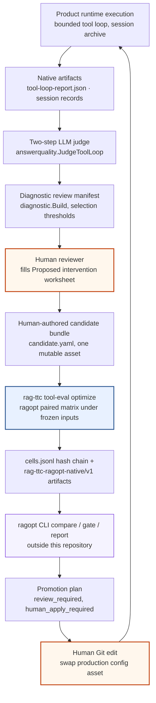
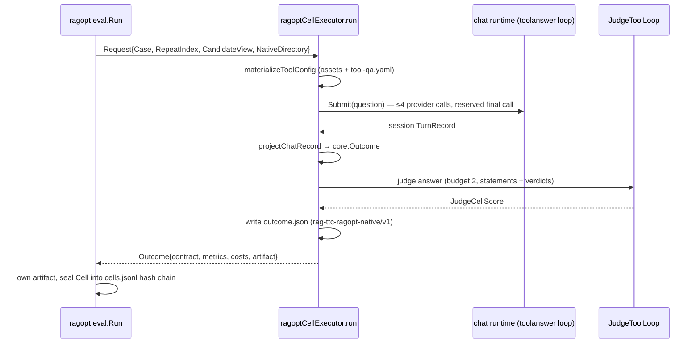

# Optimization, Judging, and Improvement Loops — Overview

This document explains how `rag-ttc` evaluates, judges, and improves its RAG answer system: what generates candidate changes, what executes them, what judges the results, what gates acceptance, and what a human must do at every point where behavior could change. The analytical lens is the family of reflective prompt-evolution frameworks (GEPA, DSPy-style optimizers) with their evaluate → reflect → mutate → re-evaluate cycles; the central finding is that `rag-ttc` implements the evaluate and re-evaluate arcs with unusual rigor while deliberately keeping reflection and mutation in human hands. The loop is closed by evidence and opened by authority.

This study extends the consolidated [[Research/Software Architecture Garden/rag-ttc/README|rag-ttc Garden study]], which is pinned to commit `ca5bffc` (2026-07-27). The repository has since grown an entire judging and optimization layer — the tool-eval commands, the Ragopt integration, five judging subsystems, and feedback capture — none of which exists at that earlier pin. This document is pinned separately to commit `0b0e420` (2026-08-13, clean linked worktree) and should be read as a sixth chapter analyzing that later boundary.

> [!summary]
> - One live optimization loop exists: `rag-ttc tool-eval optimize` executes a frozen human-authored incumbent/challenger candidate through the real product tool-loop runtime under [[Research/Software Architecture Garden/ragopt/README|Ragopt]] custody, judging every cell with a two-step LLM judge.
> - Reflection is human. The GEPA-inspired autonomous reflector designed in ticket RAG-TTC-GEPA-OPT-001 (`pkg/optimizer`, transcript warehouse, Luna reflector) was never implemented; the repository instead extracted the evaluation kernel into the standalone `ragopt` module and kept candidate proposal as `proposer: {kind: human}`.
> - Five distinct judging subsystems coexist — a two-step statement/verdict LLM judge, blinded human review, deterministic AdminOps gates with a gated language heuristic, a six-dimension customer-quality judge with a parallel human calibration workbook, and diagnostic failure-review manifests — and every one terminates in an artifact a human reads rather than an action the system takes.
> - Judged signal flows backward only through three human-mediated channels: diagnostic selection of cases to review, a proposal-only judgment store that can mint a new digest-named golden set, and the judge's own `recommended_change` prose.
> - Acceptance is lexicographic and constraint-first (identity, hard gates, target, regressions, then informational cost tie-breakers), not Pareto-front selection; promotion is always an ordinary reviewed Git edit.

## 1. Ticket lineage: how the loop got this shape

The judging layer was designed in an explicit sequence of tickets, and the sequence explains the architecture better than any single file does.

| Ticket | Date | Contribution |
| --- | --- | --- |
| `RAG-TTC-JUDGE-001` | 07-31 | The two-step LLM judge: decomposed faithfulness and relevance scoring, "judge is a witness" doctrine. |
| `RAG-TTC-TOOLLOOP-001` | 08-02 | The observable bounded tool loop (`ttc_search`, evidence ledger, session archive) that produces judgeable trajectories. |
| `RAG-TTC-GEPA-001` / `RAG-TTC-GEPA-OPT-001` | 08-02 | Design for a GEPA-inspired self-optimization loop: SQLite transcript warehouse, reflection packets, a Luna reflector proposing one component change, frozen gates, staged promotion. |
| `RAG-TTC-DIAG-001` | 08-02 | Diagnostic review manifests: deterministic failure attribution from saved artifacts, human facet annotation. |
| `RAG-TTC-FEEDBACK-001` | 08-02 | Feedback capture: tags, comments, graded judgment proposals, blind review. |
| `RAGOPT-001` (ragopt repo) | 08-06 | Extraction of the generic incumbent/challenger kernel into `github.com/go-go-golems/ragopt`; `rag-ttc` becomes its first consumer. |

The decisive fork is between the GEPA-OPT design and what shipped. The design document (`ttmp/2026/08/02/RAG-TTC-GEPA-OPT-001.../design-doc/01-intern-guide-to-a-pragmatic-gepa-inspired-self-optimization-loop.md`) specifies `pkg/optimizer/`, `pkg/transcriptwarehouse/`, `rag-ttc optimize reflect`, and a `Reflector` interface returning a structured `{diagnosis, hypothesis, changed_component, replacement}` proposal. None of that exists in the repository: there is no `pkg/optimizer`, no `pkg/transcriptwarehouse`, no `optimize reflect` command, and no `analysis/transcripts/` recipe directory. What was implemented instead is the design's Phase 1 — candidate bundles, one-component mutation, frozen evaluation, hard gates, human promotion — with the generic mechanics extracted into Ragopt and the reflective Phase 2 left as a human activity. The commit history records the cutover directly: `8accb5f90 refactor(ragopt): remove local tool evaluation loop` and `fe90ab2a1 test(ragopt): gate retired tool evaluator imports` (the boundary test `cmd/rag-ttc/boundary_test.go:109` still forbids importing the retired `pkg/mixedttc/tooleval`).

## 2. The loop in one diagram

The cycle is complete — failures become review packets, review packets become candidates, candidates become paired evidence, evidence becomes a gate decision, and an accepted decision becomes a production change. But the two orange nodes are load-bearing: no arrow crosses either of them automatically. Removing either human node is precisely what the repository's own documentation forbids (`assets/configs/ragopt/README.md`: "Do not add a generic subprocess protocol, automatically apply the candidate, or let the candidate change the evaluator, judge, suites, model, corpus, index, schema, or safety ceilings").

## 3. The five judging subsystems

`rag-ttc` does not have one judge; it has five, each with a different epistemic role, and the architecture keeps them from substituting for one another.

| Subsystem | Location | Instrument | Output | Consumed by |
| --- | --- | --- | --- | --- |
| Two-step LLM judge | `cmd/rag-ttc/cmds/experiments/answerquality/judge.go` | Statement extraction + evidence verdicts (`gpt-5.6-luna-codex`) | `JudgeCellScore` with `faithfulness`, `answer_relevance` | Ragopt cells, diagnostic manifests, `tool-eval judge` |
| Blinded human review | `pkg/ttc/review/projection.go` over `ragopt/pkg/review` | Human annotators, structurally blinded queue | Five-dimension annotations, paired aggregation | Answer-quality summaries (`measure.go`) |
| AdminOps deterministic gates | `internal/admin/eval/run.go` | Oracle SQL, exact row equality, no provider | Six boolean gates per case, `SuiteReport` | `rag-ttc admin-eval` |
| AdminOps language gate | `internal/admin/eval/language.go` | Local heuristic (not an LLM despite the name) | `LanguageGrade.GroundedPass` | Same command, only after all deterministic cases pass |
| Customer-quality judge | `benchmarks/customer/behavior/*.py` + `assets/configs/customer-chat/customer-quality-judge-v1.md` | Luna via trusted subprocess; parallel human workbook | Six 0–2 scores, failure labels, `recommended_change` | Human calibration; no Go consumer |

Three structural rules govern their composition.

**Deterministic gates dominate language judgment.** The AdminOps language gate refuses to run at all while any deterministic case fails: `if report.Failed != 0 { return nil, fmt.Errorf("language judge is gated until deterministic cases pass: %d failed", ...) }` (`internal/admin/eval/language.go:19-21`). The rubric contract (`benchmarks/admin/judges/adminops-language-v1.md`) states the same law in prose: "It must not repair a denied, unsupported, stale, or semantically wrong result." Grading of recorded assistant decisions never substitutes the oracle's answer — `RunAttempts` "never fills a capability, outcome, or SQL from the oracle case: missing or wrong decisions fail the appropriate gate" (`internal/admin/eval/run.go:20-23`).

**The LLM judge is a witness, not a gate.** The doctrine is a code comment with the force of an architectural law (`judge.go:19-21`): "The judge is a witness, not a gate: it scores completed grounded answers and never changes what an arm produced." Contract validity and abstention are decided deterministically before any judge call; contract-invalid and abstained answers are partitioned out and never sent to a model (`judge.go:399-416`).

**Human and machine judges share one rubric where calibration matters.** The customer-quality packet compiler emits `judge-packets.jsonl` for the model and `human-labels.template.jsonl` with the identical six score dimensions set to null for a person (`ttc_customer_quality_packets.py:138-154`), and the workbook renderer instructs reviewers to score only customer-visible outcomes: "Do not infer quality from hidden reasoning" (`ttc_customer_quality_workbook.py:58`). This is the repository's only judge-validation design — agreement between the two label streams is the calibration instrument — though no code yet computes that agreement.

## 4. Anatomy of the two-step judge

The judge decomposes answer quality into two model calls whose information boundaries are the design.

1. **Statement extraction** (`PromptJudgeStatements`, `judge.go:41-44`) sees the question and the answer only — never the evidence — so the extracted claims cannot be biased toward what happens to be supported. Output: `{"statements": [...]}`.
2. **Verdicts** (`PromptJudgeVerdicts`, `judge.go:49-58`) sees the question, the numbered evidence verbatim in admission order, and the numbered statements. Output: per-statement `{supported, evidence, reason}` plus an anchored `addresses_question` relevance value in `{0, 0.5, 1}`.

Faithfulness is never requested from the model. It is computed in Go as `supported / judged` over in-range, deduplicated verdicts (`scoreJudgedCell`, `judge.go:315-370`), and a relevance value outside `[0,1]` is refused rather than clamped ("addresses_question outside [0,1]; relevance discarded"). The status vocabulary is closed — `judged | partial | unjudged | abstained | invalid` — and each degraded status carries an explanatory note instead of a synthetic score. Two denominator laws protect the aggregates (`summarizeJudgeArms`, `judge.go:604-649`):

- Abstained answers receive `faithfulness = 1.0` as a recorded convention, but the value is excluded from arm means "so arms cannot buy faithfulness by abstaining" (`judge.go:627-629`).
- A metric mean divides only by the cells that produced the metric; a zero count leaves the mean pointer nil rather than reporting 0.

Judge identity is experiment identity. The prompts are Go constants with the rule "a changed prompt is a new judge arm, never an update" (`judge.go:39-40`), kind strings are versioned (`ttc-judge-statements-v1`, `ttc-judge-verdicts-v1`, adapter `ttc-judge-adapter-v1`, context policy `answer-evidence-v1`), request bytes are deterministic so a re-judge of an unchanged run is a pure cache replay (`judge.go:379-381`), and the judge configuration — including a `SameFamilyVerdicts` self-preference flag computed by `sameModelFamily` (`judge.go:191-207`) — is recorded in the run config before any answer is generated. The budget is fail-closed: judging refuses to start unless `JudgeBudget` covers two calls per judgeable answer (`judge.go:425-431`), and the retry policy (`Attempts: 6`, exponential backoff, `judge.go:438-445`) is transport retry only — an unjudgeable output is "recorded, never guessed, never retried beyond the transport retry."

This judge is exposed to the tool-loop evaluator through one reuse hook, `JudgeToolLoop` (`judge.go:149-174`), so the Ragopt loop and the answer-quality experiments score with byte-identical prompts, caches, and policy. There is exactly one judge implementation.

### The blinded human-review companion

The LLM judge has a human counterpart wired into the same answer-quality runs. `pkg/ttc/review/projection.go` projects TTC grounded answers into Ragopt's structurally blinded review protocol: schema `ttc-answer-review/v3` with five dimensions — `correctness`, `groundedness`, `completeness`, and `citation_correctness` on 0–3, `appropriate_abstention` on 0–2 (`projection.go:16-22`). The queue payload is `{query, evidence, answer}` with retrieval scores and ranks intentionally omitted (`projection.go:24-31`), so a reviewer cannot infer arm identity from ranking artifacts; the variant lives only in the separate unblinding key, which is Ragopt's structural-blinding contract. The experiment runner writes `review-queue.jsonl`, `review-key.json`, and — only when a human supplies an annotations file through `--annotations` — `human-review-summary.json` and `arm-comparison.json` into the run directory (`answerquality/runner.go:604-655`), and the Markdown summary renders inter-reviewer disagreement counts per overlapping item (`measure.go:87-123`). Annotations are strictly an input file; nothing in the repository generates them. The LLM judge and the blinded review therefore measure the same answers through deliberately different instruments — decomposed claim verification versus holistic human scoring — and neither is wired into any gate.

## 5. Loop A: the Ragopt incumbent/challenger proof cycle

The only closed optimization loop is `rag-ttc tool-eval optimize` (`cmd/rag-ttc/cmds/tooleval/ragopt.go`, registered at `cmd/rag-ttc/main.go:54-64`). It is one narrow, heavily frozen seam between the product and the [[Research/Software Architecture Garden/ragopt/README|Ragopt]] kernel.

### Candidate generation is human and singleton

The checked-in candidate bundle `assets/configs/ragopt/i5-combined-comparison-v1/` declares `proposer: {kind: human, identity: rag-ttc-toolloop-i5}` and mutates exactly one asset — the `ttc_search` tool description — with a written hypothesis, an expected-improvement coordinate (`metric: answer_relevance, groups: [comparison]`), three declared regression risks, and the diagnostic case IDs that motivated it (`candidate.yaml`, `evidence.selected_case_ids: [ttc-y-005, ttc-y-007, ttc-expand-056]`). The parent and child snapshots each carry eight locked assets by digest and one mutable asset; the actual intervention is three instruction lines and two examples in a YAML tool description. This is Ragopt's locked-singleton-intervention contract exercised exactly as designed, and the `evidence.selected_case_ids` field is the concrete bridge from the diagnostic subsystem's output to the candidate's input.

### The environment freezes itself, including its own source code

Before any cell runs, `validateI5Environment` (`ragopt.go:147-202`) compares the child snapshot's `dimensions` against runtime reality: answer and embedding model identity, evaluator version, suite split, tool-safety ceiling string, the selected provider-profile composite digest, the index-bundle manifest digest, the corpus digest — and the SHA-256 of five source files, including the judge, both adapters, and the native runner types (`ragopt.go:164-178`). The evaluator digests its own code: editing `judge.go`, `adapter.go`, `ragopt.go`, `types.go`, or the golden evaluation set invalidates the frozen candidate until snapshots are regenerated. Budgets are hard-locked in code (`"I5 proof budgets are locked to embedding=3, generation=4, judge=2 per cell"`, `ragopt.go:94-96`), the provider is locked to `ttc-live-luna-low`/`gpt-5.6-luna` (`ragopt.go:111-113`), and the split is locked to `feedback` (3 cases × 1 repeat) or `validation` (7 cases × 2 repeats) with disjoint membership (`lockedSplit`, `ragopt.go:250-259`).

### Arm difference is carried entirely by injected identity

Both arms share one executor function: `Incumbent: &ragoptArm{name: "incumbent", execute: executor.run}, Challenger: &ragoptArm{name: "challenger", execute: executor.run}` (`ragopt.go:129-134`). The product never branches on arm name; the difference is the `CandidateView` Ragopt binds — parent snapshot for the incumbent, child for the challenger. Per cell, `materializeToolConfig` (`ragopt.go:415-446`) writes the view's assets plus a hard-coded `tool-qa.yaml` runtime lock into the Ragopt-assigned native directory, and the real chat runtime is constructed with `RepositoryRoot` pointed at that directory so the materialized assets are the only ones reachable (`ragopt.go:318-322`). The test `TestMaterializeToolConfigBindsOnlyTheSelectedSearchDescription` (`ragopt_test.go:122`) proves arm separation by byte-comparing the bound description under both views, and `internal/ragoptassets/assets_test.go:29` proves the bundle cannot drift from production assets — including the assertion that the incumbent and candidate production configs differ in exactly one field.

### Execution, judgment, and projection per cell

The inner loop is the bounded tool-answer service (`pkg/ttc/toolanswer/service.go:73-193`): strict structured output, `ToolErrorContinue` with no tool retry, compiled safety ceilings that YAML cannot raise (`toolconfig/types.go:18-31`), and a reserved final provider call that strips tool definitions and forces the grounded answer (`service.go:245-267`). The projection back to Ragopt deliberately excludes evaluation overhead: "Judge calls and tokens are evaluation overhead retained in the native artifact; counting them would reward invalid answers that the judge correctly skips" (`comparisonOutcome`, `ragopt.go:360-376`). Only `faithfulness` and `answer_relevance` cross into `Metrics`, pointer-guarded so an unjudged cell exports no metric rather than a zero. Scheduling is strictly sequential (case → repeat → incumbent → challenger), per-cell provider concurrency is one, and Ragopt supplies custody: immutable input binding, per-arm evidence guards, hash-chained `cells.jsonl`, artifact ownership, and exact-coordinate resume keyed on `suiteDigest ∥ policyDigest ∥ candidateID ∥ snapshotDigest ∥ caseID ∥ repeat ∥ arm` — all documented in the [[Research/Software Architecture Garden/ragopt/README|Ragopt study]] and consumed here without modification.

### Gating and promotion happen outside the repository

The command's entire surfaced result is six accounting fields — run directory, run ID, expected/completed/failed cells, resumed flag (`ragopt.go:144`). Nothing in `rag-ttc` imports `ragopt/pkg/gate`, `pkg/compare`, or `pkg/report`; comparison and gate evaluation run in the external `ragopt` CLI. The product-authored policy (`shared/gate-policy.yaml`) is lexicographic: hard gates (`require_all_cells`, `require_contract_valid`, `max_failure_rate: 0`, faithfulness floor 0.80), then a target (`answer_relevance` mean delta ≥ 0 on the `comparison` group), then per-case and per-mean regression bounds, then informational cost tie-breakers. The promotion artifact already exists as a checked-in config (`assets/configs/tool-qa/production-product-fact-i5-combined-comparison-v1.yaml`, differing from production in one `description_file` line) that is referenced only by tests — no serving path loads it. Promotion is a human editing which config the product uses and committing through ordinary review, exactly as Ragopt's `human_apply_required=true` plan demands.

## 6. Loop B: judging saved reports and attributing failures

The second loop is retrospective. `rag-ttc tool-eval judge` (`cmd/rag-ttc/cmds/tooleval/judge.go`) reads a saved `tool-loop-report.json` (`tooleval.Report`, `pkg/ttc/tooleval/types.go:59-64`), reconstructs each `answering.Result` from persisted artifacts (`adapter.go:120-165`), runs the same two-step judge, and writes `tool-loop-judge.json` beside the report. Then `rag-ttc review build` (`cmd/rag-ttc/cmds/diagnosticreview/command.go:51-101`) fuses four immutable inputs — evaluation set, report, judge file, native artifact directory — into a `ttc-diagnostic-review-candidates/v1` manifest.

The build is strict and deterministic. Every input is SHA-256'd on load (`load.go:67`), and `ValidateSources` (`validate.go:14-135`) enforces count equality across report/judge/artifacts, arm agreement, judge-status/contract coherence, and an `E1..En` evidence-label bijection. Selection is threshold-driven (`selected`, `build.go:99-115`): contract-invalid, abstained, partial, and unjudged cells are always candidates; judged cells enter only below `answer_relevance < 1` or `faithfulness < 0.9` (`DefaultSelectionPolicy`, `types.go:128-133`). Each selected case receives one of four automatic signals — `CONTRACT_FAILURE`, `ANSWERABILITY_REVIEW`, `GROUNDING_REVIEW`, `COMPLETENESS_REVIEW` (`automaticSignal`, `build.go:179-190`) — plus the retrieval trace, golden relevance labels, judge verdicts, and unsupported claims. The pipeline's terminal output is honest about its authority: `rag-ttc review render` produces a Markdown workbook whose last section per case is a blank reviewer worksheet ending in `Proposed intervention:` (`render.go:169-170`), and the only defined review status is `unreviewed` (`types.go:46`). The command "makes no provider calls" (`command.go:84-87`). Failure attribution selects what a human looks at; it never selects what the system changes.

## 7. Feedback into ground truth: the proposal ledger

The most carefully argued backward channel is the graded-judgment store (`internal/admin/feedback/judgment/`). Its package comment states the law that shapes it: an evaluation set is an input to every experiment, so appending to it in place "does not add data — it silently changes what every future run measures." A grade recorded from the admin UI therefore lands in an append-only proposal log (`rag-ttc-judgment-proposal/v1`, one fsynced line per proposal, later proposals superseding by `(query, target, targetID)` key), and nothing measures anything differently until `Commit` (`commit.go:66`) folds pending proposals into a **new** evaluation set with a new digest and a lineage ID `baseID+"+"+applied`, refusing to overwrite the base file. `Grade` is a pointer on purpose: nil proposes unjudging, zero means explicitly irrelevant. At this snapshot the package is imported only by its own tests — a complete, tested library not yet wired to the TUI (its sibling `annotation` store is wired). The retrieval-audit views (`internal/admin/tui/hits.go:76-106`, `queries.go`) consume the existing golden judgments read-only, marking judged-relevant ranks and naming judged units that retrieval missed, with the honest empty state "This query has no judgments. No metric can score it."

## 8. The GEPA correspondence, stated precisely

GEPA-style frameworks close a loop of trajectory collection → reflective diagnosis → component mutation → evaluation → Pareto-aware candidate selection. Mapping that vocabulary onto `rag-ttc` yields genuine correspondences and deliberate divergences; forcing the analogy further than this table would misdescribe the system.

| GEPA/DSPy element | rag-ttc realization | Correspondence |
| --- | --- | --- |
| Execution trajectories as optimization substrate | Session archive, evidence ledger, native `outcome.json` artifacts with full judge verdicts | Strong: the trajectories exist and are content-identified |
| Textual feedback per example | Judge verdict `reason` strings, `unsupported_claims`, customer judge `recommended_change` | Strong as evidence; consumed by humans, not by a reflector model |
| Reflective proposer (LLM reads failures, proposes revision) | Designed in RAG-TTC-GEPA-OPT-001 (`Reflector` interface, reflection packets); **not implemented** — `proposer.kind: human` | Absent by decision, not by omission |
| Component mutation | Exactly one mutable asset per candidate (search description); one-changed-component validated by Ragopt admission | Strong, stricter than GEPA (singleton, digest-proven) |
| Feedback/validation split | `feedback-suite.json` (3×1) vs `validation-suite.json` (7×2), disjoint, membership tested | Strong; the design's third `audit` split does not exist |
| Evaluation under frozen conditions | `validateI5Environment` self-digesting drift gate, locked budgets/models/split | Stronger than the framework norm |
| Candidate selection | Lexicographic constraint-first gate (identity → hard → target → regressions → cost) | Divergent: no Pareto front, no per-instance dominance, no population |
| Population / multi-candidate search | None; one incumbent, one challenger, one hypothesis at a time | Divergent by design (GEPA-OPT §3.2 non-goals) |
| Automatic adoption of winners | None; `human_apply_required=true`, promotion is a Git edit | Divergent by design |

Two divergences deserve emphasis because they are principled rather than incidental. First, the acceptance rule is *constraint domination*, not *Pareto selection*: a cost improvement cannot rescue a faithfulness floor violation, and `stopAfter` semantics in Ragopt's gate prevent later phases from rescuing a failed invariant. GEPA's instance-level Pareto retention answers a different question (which diverse candidates to keep searching from); `rag-ttc` is not searching, it is proving one intervention at a time. Second, the measurement instrument is deliberately outside the mutable set: the judge prompts, evaluator source, suites, models, and safety ceilings are all locked snapshot dimensions, which is the GEPA-OPT design's rule 18.4 ("if the optimizer can weaken SQL limits, change judge prompts, or change the data it is judged on, a passing score no longer demonstrates an answer-system improvement") enforced by digests rather than by convention.

## 9. Authority and identity map

| Object | Owner / authority | Identity coordinate | Must not be confused with |
| --- | --- | --- | --- |
| Golden evaluation set | Humans; `judgment.Commit` mints successors | File digest (`datasets/ttc/evaluation.json`, sha256 `fe8ca22e…`) | The mutable proposal ledger |
| Judgment proposal | Grader via append-only store | `(query, target, targetID)` + op sequence | An applied judgment; nothing changes until Commit |
| Candidate | Human proposer | Ragopt candidate digest; one mutable asset | A model proposal, a patch, an applied change |
| Suite / split | Product; disjointness tested | `ragopt-suite/v1` semantic digest; locked split names | The golden set it copies from (byte-verified verbatim) |
| Judge | `judge.go` constants + profiles | Kind strings `-v1`, adapter version, prompt bytes, profile digest | A gate; a tunable component |
| Cell evidence | Ragopt runner | Run config + `(case, repeat, arm)` + hash chain | Product truth; the native artifact remains authoritative |
| Gate decision | Ragopt pure evaluator, product-authored policy | Policy byte digest + comparison identities | Promotion authority or scientific proof |
| Promotion | Human via Git | Reviewed commit swapping one config line | Anything a command can perform |
| Diagnostic case | `diagnostic.Build` selection | Source digests + query ID + selection policy | A candidate; its `Review` block starts `unreviewed` |
| Customer judge verdict | Python runner + Markdown rubric | Rubric file sha256 in `assets-v1.yaml:29`, result schema `…judge_result.v1` | A deployment instruction (`recommended_change` "must not instruct an autonomous deployment") |

## 10. Foundations: the score and selection algebra

Three small formal structures carry most of the correctness weight, and stating them precisely shows why the implementation details above are not incidental.

**Faithfulness is a ratio over an explicit verdict set.** For one judged cell, let $S$ be the extracted statements and $V \subseteq \{1..|S|\} \times \{\text{supported}, \text{unsupported}\}$ the in-range, deduplicated verdicts. The judge computes

$$
\text{faithfulness} = \frac{|\{v \in V : v \text{ supported}\}|}{|V|}, \qquad \text{status} = \begin{cases}\text{judged} & |V| = |S| \\ \text{partial} & 0 < |V| < |S| \\ \text{unjudged} & |V| = 0\end{cases}
$$

with $|V| = 0$ producing no number at all (`judge.go:315-370`). Arm means then divide by the count of non-abstained cells that produced the metric — never by cell count — so the three denominators (cells, judgeable cells, metric-bearing cells) remain distinct exactly as Ragopt's pair/metric denominators do downstream. The operational consequence is that no aggregation step can manufacture a score from an absence.

**Diagnostic selection is a monotone predicate over judge outcomes.** With thresholds $r$ (relevance) and $f$ (faithfulness), a cell is selected when its status is in $\{\text{invalid}, \text{abstained}, \text{partial}, \text{unjudged}\}$ (subject to the two include flags) or when it is judged with $\text{relevance} < r$ or $\text{faithfulness} < f$ (`build.go:99-115`). Raising a threshold only adds cases; a judged-perfect cell under $r = 1, f = 0.9$ is selected only if relevance is strictly below 1. The consequence is that the human review queue is a deterministic function of `(sources, policy)` — the build is provider-free and byte-reproducible, which its tests assert for both JSON and Markdown output (`diagnostic/build_test.go`).

**Acceptance is a lexicographic conjunction, not a weighted sum.** Writing $P_I, P_H, P_T, P_R$ for the identity, hard, target, and regression phases of the gate, a candidate passes only when $P_I \land P_H \land P_T \land P_R$, evaluated in that order with short-circuiting, and the cost tie-breakers are computed only afterward and carry no pass/fail power. Under the checked-in policy this instantiates to: complete pairing and contract validity everywhere, zero failure rate, mean faithfulness $\geq 0.80$ in every pair, mean `answer_relevance` delta $\geq 0$ on the comparison group, per-case regressions bounded by $(-0.20, -0.50)$, and mean regressions bounded by $-0.05$. No scalarization exists anywhere in the loop; this is the formal sense in which the system prefers proof of non-regression over search efficiency, and it is the sharpest divergence from Pareto-based candidate retention.

## 11. Laws the implementation enforces

1. **The judge witnesses; it never gates or repairs.** Enforced by partitioning invalid/abstained cells before any model call and by the deterministic-gates-first structure of AdminOps (`judge.go:19-21,399-416`; `language.go:19-21`).
2. **Prompt identity is experiment identity.** A changed judge prompt is a new judge arm; changed answer prompts and tool descriptions are new versioned assets whose digests live in snapshots and run configs (`judge.go:39-40`; snapshot `locked_assets`).
3. **Evaluation overhead never enters product cost.** Judge calls and tokens stay in the native artifact (`ragopt.go:360-376`; `TestComparisonOutcomeExcludesJudgeOverhead`).
4. **Abstention cannot buy faithfulness.** The vacuous 1.0 convention is recorded but excluded from means (`judge.go:627-633`).
5. **Missing metrics stay missing.** Nil pointers, not zeros, at every level: judge scores, Ragopt outcomes, comparison denominators (`judge.go:639-646`; Ragopt `MissingPair`).
6. **The evaluator freezes its own source.** Five source-file digests are locked snapshot dimensions; drift fails the run before any cell (`ragopt.go:164-178`; `TestI5EnvironmentMatchesLockedSourceAndIndexIdentities`).
7. **Ground truth changes only by minting a new digest-named set.** Append-only proposals, overwrite-refusing commit, visible lineage (`judgment.go`, `commit.go:18-83`).
8. **Constraints dominate preferences.** Hard gates and regression bounds precede cost tie-breakers, which are informational only (`gate-policy.yaml`; Ragopt `gate.Evaluate` phases).
9. **Promotion is a human repository operation.** No command applies a candidate; the promotion config exists but nothing loads it; five independent documentation and code sites restate the rule.

## 12. Negative space: what the loops do not guarantee

- **No autonomous reflection.** There is no reflector, no transcript warehouse, no SQL recipe layer; grep for GEPA/DSPy across Go source finds only ticket prose. Anyone citing this repository as a GEPA implementation would be wrong; it is a GEPA-*informed* evaluation harness with the reflective step reserved for humans.
- **No statistical inference.** Suites are tiny (3 feedback cases, 7 validation cases, 24 admin cases, 148 customer queries), gates compare means and worst cases without uncertainty models, and nothing computes significance. A gate pass is transparent policy evaluation, not proof — the same limit recorded in the [[Research/Software Architecture Garden/ragopt/README|Ragopt study]].
- **No judge validation yet.** The customer calibration workbook creates the *instrument* for human/LLM agreement measurement, but no code computes agreement, and the two-step judge's scores have no recorded human-label baseline in this repository. The `SameFamilyVerdicts` flag records self-preference risk (Luna-family judging Luna-family answers); it does not prevent it.
- **No closed-loop consumers of judge recommendations.** `recommended_change` and `ProposedIntervention` are prose fields for humans; nothing parses them.
- **Inherited Ragopt open laws.** Single-writer resume without an inter-process lock, non-idempotent external effects on rerun-after-crash, and native-file/cell two-commit recovery are consumed as-is from the kernel.
- **No recorded runs in this checkout.** `experiments/` is gitignored and absent, so this analysis establishes the machinery and its tests, not a live campaign at this commit. The Ragopt repository's committed GEC record documents a completed proof cycle, but that is recorded evidence in a different repository.
- **Latent code without callers.** `FixedArm`, `cutoverArm`, and `WriteReport` (`pkg/ttc/tooleval/fixed.go:17`, `adapter.go:23`, `artifacts.go:13`) have no production callers — the `tool-eval run` verb that produced `tool-loop-report.json` was removed in the Ragopt cutover, so `tool-eval judge` currently consumes only historical reports or F0 experiment output. Note that `adapter.go` cannot simply be deleted: its digest is a locked snapshot dimension.
- **A judge that is not a judge.** `internal/admin/eval/language.go` is a substring heuristic presented under judge vocabulary; its comment is honest ("a future provider judge can replace this projection"), but the naming invites overreading.
- **Missing customer judge schema.** The runner requires a `--schema` JSON file that is not checked into the repository; only the prompt is versioned here.
- **Workspace documentation drift.** `README.md:94` claims workspace mode uses local sibling `ragkit` and `ragopt` modules; `go.work` contains `ragkit` (local v0.1.7 vs pinned v0.1.2) but no `ragopt` entry, so workspace and release builds evaluate under different ragkit revisions while ragopt always resolves to `v0.0.1`.

## 13. Pattern maturity

| Pattern | Maturity | Evidence |
| --- | --- | --- |
| Two-step decomposed LLM judge with Go-computed faithfulness and denominator laws | Established locally | Runtime, eight judge tests, two consumers (Ragopt cells, `tool-eval judge`), locked into candidate snapshots |
| Judge-as-witness separation from deterministic gates | Established locally; candidate ecosystem pattern | Enforced in two independent subsystems (answer judge, AdminOps gating); the invariant is domain-general |
| Self-digesting environment freeze (evaluator hashes its own source) | Candidate ecosystem pattern | One implementation with direct tests; no second project does this yet |
| Human-singleton candidate bundles over a generic paired kernel | Established across two repositories | Ragopt admission + `rag-ttc` bundle + three drift-guard test files; this is the extraction lineage pair, not independent confirmation |
| Diagnostic failure-attribution manifests with blank human worksheets | Established locally | Strict cross-artifact validation, byte-deterministic output tests, CLI |
| Proposal-ledger-then-commit golden-set evolution | Emergent | Complete tested library, zero non-test consumers; the missing contract is the UI wiring |
| Human/LLM shared-rubric calibration | Emergent | Packet/workbook/runner scripts exist; no agreement computation, schema file absent |
| Customer-quality judge with recommendation fields | Candidate ecosystem pattern | One Python implementation; the `recommended_change`-without-authority shape is reusable |
| Latent `tooleval` report path | Architecture debt | Definitions without production callers after the Ragopt cutover, pinned in place by source digests |

## 14. Candidate ecosystem guidance

1. **Split every judge into a deterministic partition and a model call, and compute the score in host code.** The two-step judge's information boundaries (extractor never sees evidence; verdicts never compute faithfulness) are portable to any grounded-generation system and make the model's job checkable.
2. **Lock the measurement instrument with the same rigor as the intervention.** Digesting judge source, prompts, suites, and ceilings into the candidate snapshot is what makes a delta attributable. Projects adopting Ragopt should treat "what may not change" as the first design artifact.
3. **Make every backward signal a proposal with a human commit boundary.** The judgment ledger's append-then-mint-new-digest shape and the diagnostic worksheet's `unreviewed`-only status are two occurrences of one rule: judged evidence selects human attention, and only humans change inputs. This aligns with Upwork Tracker's human-confirmation boundary and should be compared there before promotion to guidance.
4. **Prefer lexicographic gates to scalar or Pareto objectives when proving single interventions.** Population search needs dominance structure; one-candidate proof needs constraint domination. Choosing the wrong one either blocks search or lets cost buy quality.
5. **Do not build the reflector first.** The GEPA-OPT ticket's phase discipline — warehouse and manual candidates before any model-generated proposal — was validated here by events: the human loop shipped and produced a real proof cycle while the reflector remained unbuilt. A future reflector can slot into the existing `proposer` field without changing any custody mechanics, which is the correct dependency direction.

## 15. Open questions

- When the TUI wires the judgment store, what review step stands between a grader's proposal and `Commit`? The library supports a reviewer, but no policy exists.
- Should gate evaluation be surfaced in `rag-ttc` output rather than requiring the external `ragopt` CLI? The current split keeps decision authority visibly out of the product but costs operational friction.
- What replaces the removed `tool-eval run` path as the producer of judgeable reports — the F0 experiment path, a resurrected command, or Ragopt-native artifacts only?
- Will human/LLM agreement over the customer rubric be computed, and does the six-dimension 0–2 scale survive contact with real inter-reviewer variance (the blinded-review path already renders disagreement counts)?
- If a reflector is eventually implemented, does its output enter as a `proposer: {kind: model}` candidate under the existing admission rules, and what additional provenance (reflection packet digests, selected-example digests) must the snapshot lock?

## Related studies

- [[Research/Software Architecture Garden/rag-ttc/README|Architecture Garden — rag-ttc]] and its chapters [[Research/Software Architecture Garden/rag-ttc/01 - Explicit Experiments and Layered Composition|01]], [[Research/Software Architecture Garden/rag-ttc/02 - Recoverable and Resource-Bounded Execution|02]], [[Research/Software Architecture Garden/rag-ttc/03 - Reproducible Experiment Custody and Semantic Identity|03]], [[Research/Software Architecture Garden/rag-ttc/04 - Representation-Centered Retrieval Architecture|04]], [[Research/Software Architecture Garden/rag-ttc/05 - Provider Integration Validation and Ecosystem Lessons|05]]
- [[Research/Software Architecture Garden/ragopt/README|Architecture Garden — Ragopt]] — the extracted kernel this loop consumes; its authority map and open laws apply verbatim to Loop A
- [[Research/Software Architecture Garden/ragkit/README|Architecture Garden — Ragkit]] — the retrieval/answering contract layer under the executed arms
- [[Research/Software Architecture Garden/README|Software Architecture Garden]]
