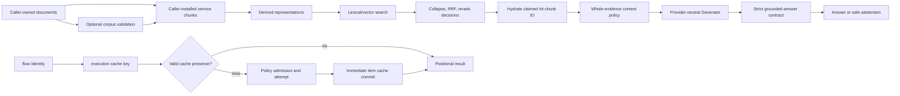

# Architecture Garden — Ragkit

Ragkit is a provider- and application-independent Go library for retrieval-augmented generation. It belongs in the Garden because its principal path preserves a difficult authority distinction: generated representations can influence search, fusion, and reranking, but hydration resolves hit chunk IDs from caller-installed service chunks, and reranker/augmenter text cannot replace those chunks. Generic search-hit lineage and corpus validity remain caller/adapter obligations. Its second major subsystem executes expensive typed work through semantic cache identity that is deliberately separate from worker, admission, retry, and failure policy (`rag/types.go:3-109`, `rag/answering/service.go:18-30,166-204,370-399,628-688`, `rag/retrieval/retrieval.go:123-150`, `flow/step.go:13-103`).

Ragkit was extracted from rag-ttc, but it is not the complete experiment laboratory. It has no command application, bundled provider adapter, run directory, canonical per-run result stream, terminal run state, authentication surface, deployment, or published release workflow at this snapshot. The complete committed workflow set is verification-only (`README.md:1-57`; `boundary_test.go:9-38`; `.github/workflows/push.yml:1-32`; `.github/workflows/lint.yml:1-31`; `.github/workflows/security.yml:1-31`; `.github/workflows/codeql.yml:1-23`; `.github/workflows/secret-scanning.yml:1-24`).

> [!summary]
> - Hydration resolves hit chunk IDs from caller-installed service chunks, and reranker/augmenter text cannot replace those chunks; generic hit lineage and chunk validity are not established by `Service`.
> - Semantic work coordinates are separate from execution policy; cache lookup precedes costly admission and each successful miss is committed independently.
> - Content-addressed index bundles are verified retrieval materializations, not source proof by themselves or behavior-complete releases.
> - Rag-ttc is strong lineage correspondence; neither Ragkit nor Ragopt imports the other, while a pinned RAG-TTC product adapter composes both.
> - Cache-key completeness, cross-invocation and cross-process duplicate execution, bundle source proof, and a time-local Git configuration anomaly remain visible obligations.

## Snapshot identity and evidence

| Field | Value |
|---|---|
| Repository | `/home/manuel/code/wesen/go-go-golems/ragkit` |
| Remote | `git@github.com:go-go-golems/ragkit.git` |
| Branch | `main` |
| Commit | `c4a236643c964d7c4d555b63c7e5e10bef75d678` |
| Commit date | `2026-08-09T17:44:19-04:00` |
| Commit subject | `build: add standard go-go-golems repository plumbing` |
| Worktree | Clean committed source at analysis and review; the local `.git/config` changes described below did not change Ragkit source |
| Analysis date | `2026-08-10` |
| Analysis scope | Whole committed repository; no live provider or downstream deployment audit |

The study inspected runtime values and interfaces, exact-source validators, representation construction, retrieval and answering, evaluation, the persistent bundle builder/opener, execution and flow engines, focused tests, dependency guards, module/build files, and CI/release paths. Decisive paths were independently reread at the pinned commit after the evidence handoff. Full, focused race, and vet checks are recorded below.

During initial analysis the local, uncommitted `.git/config` had `core.bare=true`, so ordinary worktree commands failed; explicit Git-directory/worktree status and diff checks still showed no source changes. At review, `/home/manuel/code/wesen/go-go-golems/ragkit/.git/config` had subsequently changed to `core.bare=false`, and ordinary `git status --short` succeeded and remained empty. Neither local configuration state is committed Ragkit source, and the Ragkit commit/worktree source analyzed here did not change. Git variables were not exported into Go tests because `rag/gochunk` tests create their own temporary repositories.

## Architecture and runtime path



### Source-to-answer authority path

1. `Document`, half-open `Range`, `Chunk`, derived `Representation`, backend `Hit`, fused hit, and hydrated `Evidence` are separate values (`rag/types.go:3-109`). When invoked, `ValidateChunk` requires valid UTF-8, digest agreement, and chunk text equal to the declared document byte slice; corpus and representation validators enforce identity uniqueness and lineage, including raw representation equality with its chunk (`rag/validate.go:62-179`; negative tests in `rag/validate_test.go:30-79`). `Service` itself does not invoke those corpus validators.
2. `answering.Service.ValidateRequest` rejects missing identities, unavailable strategy dependencies, nonpositive limits, invalid RRF values, and undersized rerank candidate sets before effects (`rag/answering/service.go:47-143`). `Answer` then retrieves, prepares, generates, and interprets; a provider error retains the raw provider result and usage in an explicit provider-failure contract (`rag/answering/service.go:166-204`).
3. Search results must have complete identities and finite scores before `retrieval.Collapse` selects the best representation observation per chunk or document. `WeightedRRF` accumulates channel contributions by the hit's claimed chunk ID and uses deterministic tie-breaking; `Hydrate` then looks up that chunk ID directly in caller-installed `Service.Chunks` (`rag/answering/service.go:18-30,370-399`, `rag/retrieval/retrieval.go:21-150`). `Service` does not call `ValidateCorpus` or prove `Hit.ChunkID = parent(Hit.RepresentationID)` for an arbitrary `rag.Searcher`; those are caller/adapter laws. Verified built-in bundle indexes establish the relation through validated bundle representations and backend data (`rag/indexbundle/build.go:26-180`, `rag/indexbundle/open.go:126-306`).
4. Reranker and augmenter outputs are treated only as order/score decisions. Unknown or duplicate IDs are rejected, and accepted IDs are genuinely rebound to caller-installed `Service.Chunks` rather than trusting provider-supplied replacement text (`rag/answering/service.go:628-688`; authority tests in `rag/answering/service_test.go:154-225,348-400`). This proves text rebinding, not corpus validity.
5. `ApplyContextPolicy` admits whole evidence chunks in rank order and records omissions; it never truncates source text. Preparation may map immutable chunk IDs to ordinal presentation labels, but retains the reverse mapping (`rag/answering/context.go:9-27`, `rag/answering/service.go:402-440`).
6. Grounded output is strict-decoded. A non-abstaining answer needs text and distinct citations drawn from supplied evidence; abstention must not cite. Staged interpretation revalidates serialized evidence against service chunks and maps ordinal labels back to chunk IDs. Invalid output becomes safe abstention (`rag/answering/contract.go:31-111`, `rag/answering/service.go:443-467,706-778`; `rag/answering/contract_test.go:17-64`).

Citation membership proves only that a supplied caller-installed chunk ID was named. It does **not** prove corpus validity, entailment, factual truth, answer quality, causal inference, or provider determinism.

### Cache-first expensive-work path

`flow.Step` contains three authorities that must remain separate: `Identity` projects a semantic item to `execution.Key`; `Policy` controls workers, admission, retry, and failure destiny; `Do` performs the external or local effect (`flow/step.go:13-75`, `flow/policy.go:9-97`). `MapCached` groups equal keys only within one invocation, loads all groups before worker/limiter admission, executes each unique miss once in that invocation, stores each success with `context.WithoutCancel`, then reconstructs input order (`execution/cached_map.go:44-172`). Flow extends this with preflight, bounded attempts, typed error classification, retry charging, per-`Run` in-flight deduplication, and success storage despite sibling cancellation; each `Run` constructs a fresh runner and in-flight map, then performs leader/follower deduplication only inside that runner (`flow/run.go:381-413,548-626,692-757,881-956,984-1093`). Concurrent `MapCached` or `Run` invocations in one process can therefore duplicate misses, as can separate processes.

The item cache is recoverable partial progress, not run custody. A cache file has operation/version/input identity and envelope integrity; a flow report has item indices, work calls, retries, meters, and observations. Neither supplies a durable run occurrence, immutable run input set, retry request identity, terminal fence, or an event-sourced canonical state (`execution/cache.go:20-215`, `flow/report.go:42-155`).

### Retrieval bundle publication path

`indexbundle.Build` validates corpus and representations, computes corpus/chunk/representation/backend digests and a bundle ID, validates any existing destination before reuse, builds data and indexes under a temporary sibling directory, validates persisted backend content, syncs, renames to the bundle ID, and syncs the root (`rag/indexbundle/identity.go:11-93`, `rag/indexbundle/build.go:26-221`; tamper/reuse tests in `rag/indexbundle/indexbundle_test.go:62-97,154-216,312-347,391-431`). `Open` rechecks schema, counts, digests, backend identity, query embedding compatibility, and bundle identity (`rag/indexbundle/open.go:15-94,126-306`).

`Open` can prove stored chunk self-consistency, but cannot reconstruct the original document-slice relation from stored chunks alone. Serving paths needing source-document metadata and complete lineage must additionally call `LoadVerifiedDocuments`, which confines and strict-loads the source corpus and reruns full validation (`rag/indexbundle/open.go:266-306`, `rag/indexbundle/verified_documents.go:15-73`; `rag/indexbundle/verified_documents_test.go:58-139`). The bundle is an immutable retrieval materialization—not source proof alone, an active pointer, a deployable release, or a published artifact.

### Evaluation path

Retrieval collapse and evaluation share the explicit target vocabulary `representation`, `chunk`, `document`, and `unit`; retrieval admits only chunk/document collapse while evaluation resolves all four. One query's judgments must stay at one target level, rankings are deduplicated, skipped queries remain counted, and aggregation averages only evaluated queries (`rag/target.go:5-30`, `rag/evaluation/target.go:11-55`, `rag/evaluation/retrieval.go:38-233`, `rag/evaluation/targetlevel.go:23-149`). These checks establish coordinate coherence and metric arithmetic, not judgment truth, sampling validity, scientific reproducibility, or fixed corpus identity when the dataset omits `CorpusDigest` (`rag/dataset/load.go:16-85`).

## Authority and state map

| Object family | Owner/authority | Identity or order | Custody | Must not be confused with |
|---|---|---|---|---|
| Source revision | Caller loader; optionally admitted by `rag` validators | Document ID + exact content digest | Caller-defined | Current metadata, chunk, or release |
| Source chunk | Caller; optionally admitted by chunker/corpus validator | Declared chunk ID + document ID + ordinal/range/digest/chunker | Caller or verified bundle | Retrieval representation or proof of corpus admission |
| Retrieval representation | Representation builder | Representation ID + parent chunk + kind/digest + optional model/prompt | Bundle/caller | Source evidence |
| Channel hit | Search backend; answering shape-validates | Representation/chunk/document + channel/rank/score | Observation/result | Proven parent lineage, evidence, judgment, or truth |
| Fused hit | Retrieval reducer | Chunk ID + contribution word + deterministic rank | Rebuildable | Backend truth or cited text |
| Evidence | Hydrator over caller-installed service chunks | Ordered `(ChunkID, ContentDigest)`; scores excluded | Request/result | Representation, corpus-validation proof, or provider-authored replacement text |
| Generation result | Provider behind narrow interface | Kind/model plus caller-projected semantic input | Optional cache | Validated answer |
| Judgment | Evaluation dataset | Query + target level + target ID + grade | Caller file | Retrieval observation |
| Cache item | `execution.Cache` | Step + version + input digest; envelope has value digest | Durable file or store | Run, attempt, exactly-once fence, or bundle |
| Retrieval bundle | `indexbundle` | Projection of corpus/derivation/backend identities | Durable directory | Source corpus, release root, or active pointer |
| Flow event/report | Runner/caller ledger | Item index/stage/attempt observation | Durable only if caller persists | Canonical run evidence or event-sourced truth |

Identity discipline is exact: logical document ID ≠ document digest; chunk ID ≠ ordinal ≠ range ≠ digest; representation ID ≠ derivation model/prompt lineage; query ID ≠ answering turn ID; rank/score ≠ evidence identity ≠ judgment grade; cache key ≠ cache file digest ≠ bundle ID; item index ≠ provider retry attempt. Ragkit has no durable run ID.

## Candidate common vocabulary

| Proposed term | Project-local name | Invariant | Nearby ecosystem names | Difference retained |
|---|---|---|---|---|
| **Source revision** | `Document` | Logical ID plus exact text digest | Corpus document | Metadata is not source bytes or a release |
| **Admitted source segment** | `Chunk` after corpus validation | Exact validated half-open source slice | Evidence chunk | Arbitrary `Service.Chunks` need not be admitted; not a retrieval derivation |
| **Retrieval derivation** | `Representation` | Searchable value points to one source segment and carries derivation identity | Summary/question/raw representation | Generated text is not answer authority |
| **Channel observation** | `Hit` | Backend rank/score with complete retrieval coordinates | Retrieval result | Score is neither identity nor grade |
| **Source-authority rebound** | `Hydrate` and rerank/augmentation validation | Hit IDs resolve to caller-installed chunks; reranker/augmenter text is discarded | Evidence hydration | Does not establish corpus validity, generic hit-parent lineage, or entailment |
| **Semantic work coordinate** | `execution.Key`, `flow.Identity` | Operation/version/input projection governs reuse | Cache key | Not run, request, attempt, or artifact identity |
| **Execution policy** | `flow.Policy` | Admission/retry/failure controls attempts, not semantic reuse | Scheduler policy | Behavior-changing provider settings belong in identity |
| **Retrieval materialization** | index `Bundle` | Verified immutable index/data directory under semantic identity | Index snapshot | Not complete source proof or release root |
| **Evaluation identity level** | `rag.Target` | One query is compared at one identity family | Relevance target | Unit identity is product-defined metadata |

> [!important] Vocabulary discipline
> Source derivation must remain distinct from evidence authority; cache identity from execution policy; cache item from run custody; bundle identity from release identity; and operational observations from canonical events, scientific evidence, or PBUI occurrences.

## Mathematical and computer-science foundations

### 1. Exact-source lineage and authority rebound

Let `ByteString` be the set of finite byte strings; let `DocumentID`, `ChunkID`, and `RepresentationID` be pairwise distinct nominal sets; let `Digest` be the set of lowercase SHA-256 strings; and let `Natural` be the nonnegative integers. An admitted document is a tuple

$$
d=(i,t,h)\in DocumentID\times ByteString\times Digest
$$

with $h=\operatorname{SHA256}(t)$. An admitted chunk is

$$
c=(j,i,a,b,u,h_c)\in ChunkID\times DocumentID\times Natural\times Natural\times ByteString\times Digest.
$$

For the admitted document named by $i$, validation enforces

$$
0\le a\le b\le |t|,\qquad u=t[a:b],\qquad h_c=\operatorname{SHA256}(u).
$$

Let $C_s$ be the finite set of chunks a caller installs in one `Service`, whether or not that caller previously admitted them with `ValidateCorpus`, and let $hydrate_s:ChunkID\rightharpoonup C_s$ be lookup by chunk ID. Let $Hit$ be the set of search observations and define $chunkID:Hit\to ChunkID$ and $representationID:Hit\to RepresentationID$ from their concrete fields. For a selected hit $h\in Hit$, answering computes

$$
evidence(h)=hydrate_s(chunkID(h)).
$$

A separate adapter law would require

$$
chunkID(h)=parent(representationID(h)),
$$

where $parent:RepresentationID\rightharpoonup ChunkID$ is the lineage map. `Service` does not prove that equation for a generic `rag.Searcher`. It is established for built-in indexes opened from bundles whose representations and backend data passed bundle build/open validation (`rag/indexbundle/build.go:26-180`, `rag/indexbundle/open.go:126-306`).

**Operational consequence:** a successful hydration uses caller-installed chunk bytes, and reranker/augmenter replacement text is discarded; with a verified built-in bundle index, the selected representation also returns to its validated parent chunk.

**Limit:** arbitrary adapters can claim a mismatched existing chunk ID, and callers can install chunks that never passed corpus validation. Collision resistance is assumed, and `indexbundle.Open` without original documents establishes stored-chunk self-consistency rather than the source-slice equation.

### 2. Semantic cache identity is a projection

Let `StepName`, `Version`, and `Input` be distinct sets. Let $J:Input\to ByteString$ be the accepted JSON or caller key encoding and $H:ByteString\to Digest$ be SHA-256. Define

$$
K(s,v,x)=(s,v,H(J(x)))\in StepName\times Version\times Digest.
$$

Within one `MapCached` or `Run` invocation, equal final key digests are grouped and a miss executes once. Worker count, rate limits, retry limits, and failure policy are absent from $K$ (`execution/cache.go:20-77`; `execution/cached_map.go:74-159`; `flow/step.go:79-103`; `flow/run.go:692-757,881-956`; tests `execution/cached_map_test.go:88-122` and `flow/run_test.go:148-173`).

**Operational consequence:** equivalent semantic work can replay across policy changes without costly admission, and duplicate inputs share work within one invocation.

**Limit:** $K$ is not injective, a proof of provider determinism, or automatically complete. Omitted model controls, endpoint identity, tools, seeds, decoding settings, or other behavior inputs can create an unsound hit. Concurrent invocations in one process and invocations in separate processes can both miss and execute; there is no cross-invocation or cross-process single-flight or compare-and-swap.

### 3. Weighted reciprocal-rank fusion

Let `Channel` and `ChunkID` be distinct finite sets. For channel $a\in Channel$, let $r_a(c)\in\mathbb{N}_{>0}$ be the rank of chunk $c$ when present, let $w_a\in\mathbb{R}_{\ge0}$ be its effective weight, and let $k\in\mathbb{R}_{>0}$. Ragkit computes

$$
F(c)=\sum_{a:\,c\text{ occurs in }a}\frac{w_a}{k+r_a(c)}.
$$

Chunks are ordered by descending $F(c)$ and ascending `ChunkID` on ties (`rag/retrieval/retrieval.go:65-121`, `rag/ordering.go:3-21`).

**Operational consequence:** incompatible raw backend score scales need not be compared, while tied fused scores remain repeatable.

**Limit:** $F$ is selection arithmetic, not relevance probability. Low-level `WeightedRRF` maps zero weight to one while answering validation rejects nonpositive explicit weights (`rag/retrieval/retrieval.go:74-83`, `rag/answering/service.go:112-126`).

### 4. Positional batches and attempt-priced admission

For an input word $x=(x_0,\ldots,x_{n-1})\in I^n$, where $I$ is the input set, successful map/run output is $y=(y_0,\ldots,y_{n-1})\in O^n$, where $O$ is the output set and $y_i$ is produced from $x_i$ regardless of completion order. For a named budget with initial units $B\in\mathbb{N}$ and committed spend $s_t$ after attempt $t$, built-in budget admission enforces

$$
0\le s_t\le B,\qquad s_{t+1}=s_t+u
$$

for each admitted fresh attempt of positive cost $u$; a cache hit leaves $s_t$ unchanged (`execution/map.go:9-112`, `execution/budget.go:11-102`, `flow/run.go:984-1061`).

**Operational consequence:** joins by input position stay stable, cache replay is free, and retries cannot escape the declared built-in ceiling.

**Limit:** accounting does not prove provider billing, effect idempotence, or distributed serialization; custom non-reservable limiters cannot roll back provisional admission (`execution/chain.go:11-64`).

### 5. Target-coherent evaluation

Let $Target=\{representation,chunk,document,unit\}$. For a query $q$ and exactly one $t\in Target$, judgments form a finite partial map $J_q:ID_t\rightharpoonup\mathbb{R}_{\ge0}$, where $ID_t$ is the identifier set at level $t$. The ranked result is a duplicate-free finite word $R_q\in ID_t^*$. Metrics are functions of $(R_q,J_q,k)$ for cutoff $k\in\mathbb{N}_{>0}$.

**Operational consequence:** metric labels retain their identity level, and missing rankings or judgments stay visible rather than becoming implicit zero-quality observations.

**Limit:** this establishes shape and arithmetic, not judgment authority, scientific truth, or corpus binding when `CorpusDigest` is empty.

## Correlation with the Pattern Zoos

| Project evidence | Zoo relation | Grade | Boundary |
|---|---|---|---|
| Cache and bundle identity are explicit projections of selected fields | [[Transcripts/Research/09 - RAG-MATHS Pattern Zoo#Pattern 1 — Semantic Identity as Explicit Projection|RAG 1 — Semantic Identity as Explicit Projection]] | Strong | Key completeness and collision resistance remain assumptions |
| Documents/chunks, derivations, hits, and evidence remain distinct | [[Transcripts/Research/09 - RAG-MATHS Pattern Zoo#Pattern 2 — Entity–Derivation–Observation Separation|RAG 2 — Entity–Derivation–Observation Separation]] | Strong | Retrieval score is an observation, not scientific truth or a general provenance graph |
| RRF accumulates numeric per-channel rank contributions before immediate selection | [[Transcripts/Research/09 - RAG-MATHS Pattern Zoo#Pattern 3 — Accumulate Before Selecting|RAG 3 — Accumulate Before Selecting]] | Partial | The shared nucleus is accumulate-before-select; RRF counts duplicate contributions and is not the Zoo's order-independent, associative, commutative, idempotent, variant-preserving evidence join |
| Cache-first admission and resource preflight reject infeasible work before effects | [[Transcripts/Research/09 - RAG-MATHS Pattern Zoo#Pattern 9: Constraint-First Decisions and Partial Preference|RAG 9 — Constraint-First Decisions and Partial Preference]] | Adjacent | The shared nucleus is feasibility-before-effects; Ragkit has no three-valued feasibility, non-inferiority, Pareto, lexicographic, or candidate-preference stage |
| Manifest/digest validation admits bundle materialization | [[Transcripts/Research/09 - RAG-MATHS Pattern Zoo#Pattern 10 — Large Producers, Small Trusted Validators / Proof-Carrying Artifacts|RAG 10 — Large Producers, Small Trusted Validators]] | Partial | Validation proves byte/identity coherence, not source truth or retrieval quality |
| Bundle directory is immutable and content-addressed | [[Transcripts/Research/09 - RAG-MATHS Pattern Zoo#Pattern 11 — Immutable Release as Synchronization Root|RAG 11 — Immutable Release as Synchronization Root]] | Non-equivalent | It omits executable/provider/deployment/config authorities and has no active pointer |
| Strict JSON values cross provider/cache boundaries | [[Transcripts/Research/10 - PBUI-MATHS Pattern Zoo Handbook#Pattern 8 — Serializable Semantic Contract|PBUI 8 — Serializable Semantic Contract]] | Adjacent | No Goja/browser/generated semantic contract exists |

A retrieval hit is not a PBUI mounted occurrence; evidence order is not occurrence order; `Target` is not a runtime semantic type; a resource name is not an authorization scope; and a bundle is not a UI release root.

## Cross-project comparison

| Project | Shared invariant | Grade | Important difference |
|---|---|---|---|
| [[Research/Software Architecture Garden/rag-ttc/04 - Representation-Centered Retrieval Architecture|rag-ttc representation retrieval]] | Derived retrieval values return to exact source chunks | Strong | Extraction lineage, not independent confirmation; Ragkit omits run custody and provider/application code |
| [[Research/Software Architecture Garden/rag-ttc/02 - Recoverable and Resource-Bounded Execution|rag-ttc recoverable execution]] | Cache-first admission and successful-item durability | Strong | Same extraction lineage; Ragkit has no canonical completed-run stream |
| [[Research/Software Architecture Garden/researchctl/README|Researchctl]] | Semantic coordinates stay separate from attempt policy and durable invalid presence fails closed | Partial | Researchctl owns specification/replicate/attempt laboratory authority; a Ragkit cache item is not terminal run evidence |
| [[Research/Software Architecture Garden/ragopt/README|Ragopt]] | Product adapters can retain Ragkit-native evidence under Ragopt evaluation custody | Partial | Neither module imports the other or shares authority; pinned RAG-TTC composes both, but bundle/cache IDs remain distinct from candidate/run/cell coordinates and retrieval evaluation is not a gate |
| [[Research/Software Architecture Garden/geppetto/README|Geppetto]] | Provider-neutral requests and usage-preserving error boundaries | Partial | Geppetto supplies provider engines, turns, tools, sessions, and Goja; Ragkit intentionally ships no adapter |
| [[Research/Software Architecture Garden/scraper/README|Scraper]] | Bounded cancellation-aware work with retained partial progress | Adjacent | Scraper has durable DAG/lease fencing; Ragkit has invocation-local deduplication and no external-effect idempotency fence |

Neither pinned Ragkit nor Ragopt module imports the other, and they share no semantic or custody authority. Integration is product-owned: current RAG-TTC commit `6c7b1c0860d385edad13707cceb52be6d38c19f0` composes both libraries in one adapter, as pinned and bounded in the Ragopt study.

## Pattern maturity assessment

| Pattern or law | Maturity | Evidence or limitation |
|---|---|---|
| Caller-installed chunk rebound against reranker/augmenter replacement text | Established | Hydration plus rerank, augmentation, and citation tests prove ID-based text rebinding, not generic corpus validity |
| Generic search-hit lineage and service-chunk validity | Open correctness obligation | `Service` accepts arbitrary searchers/chunks and does not call `ValidateCorpus` or verify hit representation-parent lineage |
| Semantic work identity separated from execution policy | Established | `flow.Identity`, `flow.Policy`, cache compatibility and policy/admission tests |
| Cache-first admission with immediate item commit | Established | Full and race-tested cache/flow paths; deduplication is per `MapCached`/`Run` invocation |
| Content-addressed verified retrieval materialization | Established | Build/open/tamper tests; source proof and activation remain separate |
| Explicit target-level evaluation | Established | Resolver, mixed-level rejection, retrieval metric and dataset tests |
| Caller-owned source-authority rebound as shared ecosystem vocabulary | Candidate ecosystem pattern | Strong Ragkit/rag-ttc lineage and Zoo object separation; independent confirmation is still needed |
| Generic cache-key completeness | Open correctness obligation | Callers choose behavior-relevant key bytes; common provider controls are not universally typed |
| Initially observed local `core.bare=true` configuration | Architecture debt | It broke ordinary tooling during initial analysis, was `false` at review, and neither state is committed source |

## Architecture debt and open laws

### Semantic key completeness and cross-invocation/cross-process execution

**Required law:** for behaviorally distinct effective provider inputs $x\not\equiv x'$, cache projection must satisfy $K(x)\ne K(x')$ at the caller's observation boundary; execution must not be described as once-per-process because no winner spans separate invocations.

**Current evidence:** generation adapters include model, kind, query, ordered evidence, prompt, schema, adapter version, and context policy (`rag/generation/cached.go:15-79`); grouping and in-flight dedup are tested within one `MapCached`/`Run` invocation.

**Gap:** endpoint, seed, temperature, tools, decoding settings, or other provider behavior can be omitted unless callers encode them. Two concurrent invocations in one process, or two processes, can both miss, execute, and race to publish differing valid values. Atomic rename prevents partial files, not duplicate effects, idempotence, or deterministic winner selection.

**Likely validation:** provider-configuration key goldens plus concurrent two-invocation and two-process divergent-result race tests, followed by an explicit lock/CAS decision if single execution is required.

### Cache result, ledger observation, callback, and terminal state

**Required law:** documentation must state which write is authoritative and how replay reconciles later observation failure.

**Current evidence:** a successful item stores despite sibling cancellation, then ledger/result hooks run (`flow/run.go:1064-1093`).

**Gap:** these effects are not one transaction; a stored value may survive a failed ledger or hook. `context.WithoutCancel` also has no deadline for a blocking custom store. This is recoverability, not exactly-once run custody or event sourcing.

**Likely validation:** failure-injection tests at each boundary and an explicit bounded commit/reconciliation policy supplied by a future run host.

### Bundle verification, publication, and activation

**Required law:** any serving path claiming original-source lineage must pass through `LoadVerifiedDocuments`; concurrent builders and activation must have explicit winner/current-pointer semantics if callers need them.

**Current evidence:** temporary publication and strict open validation reject partial or tampered materializations.

**Gap:** `Open` alone cannot prove original slicing; same-ID concurrent builders can produce a rename loser; there is no active pointer, reader fence, rollback, or cleanup protocol. No release workflow publishes a behavior-complete artifact.

**Likely validation:** a serving constructor requiring a verified-source type, concurrent-builder tests, and a caller-owned atomic pointer protocol.

### Evaluation and fusion coordinates

**Required law:** an experiment host must bind evaluation-set identity and corpus digest, and the public RRF API must give zero weight one meaning.

**Current evidence:** target-level coherence and finite metric arithmetic are tested.

**Gap:** `EvaluationSet.ID` is not retained by `LoadEvaluation`, empty corpus digest skips binding, and low-level versus answering zero-weight semantics differ. None of the checks establishes scientific truth or causal inference.

**Likely validation:** fail-closed host fixtures for set/corpus identity and aligned RRF API/goldens.

### Security, providers, and delivery

Ragkit has no network principal, tenant, or authorization boundary. Observation disclosure settings (`rag/generation/observed.go:24-107`) do not authorize storage, retention, or access. The structural dependency test forbids Geppetto, Pinocchio, Glazed, Cobra, and Bubble Tea in core compile dependencies, but does not prove provider integration, minimal supply-chain footprint, or adapter correctness (`boundary_test.go:9-38`). CI checks generation, tests, vet, build, lint, CodeQL, secret scanning, and security; the complete workflow set contains no release publisher (`.github/workflows/push.yml:1-32`; `.github/workflows/lint.yml:1-31`; `.github/workflows/security.yml:1-31`; `.github/workflows/codeql.yml:1-23`; `.github/workflows/secret-scanning.yml:1-24`).

## Implications for composable APIs

1. Use nominal types for document, chunk, representation, query, turn, cache-key, bundle, and evaluation-target identifiers so adjacent string families cannot substitute silently.
2. Keep narrow provider interfaces, but make effective provider/config identity a typed projection consumed by all cache-key constructors; callbacks and clients remain execution capabilities, not serialized identity.
3. Make item outcomes an exhaustive `Success | Quarantined | Skipped` sum and keep run termination separate from partial item reports.
4. Name recovery honestly: `loadOrExecuteItem`, `replayCached`, and `openVerifiedBundle`; avoid `resumeRun`, `exactlyOnce`, and `release` without those protocols.
5. Distinguish `VerifiedBundle` from `VerifiedSourceBundle` if original-source proof must dominate serving.
6. Keep composition narrow: `Pipe` is ordered stage composition, RRF is named rank accumulation, and cache identity does not compose automatically with provider effects or evaluation coordinates.
7. If a durable experiment host is added, introduce run, repeat, attempt, cell, and terminal coordinates without reusing cache identity.

There is no JavaScript/TypeScript/Goja API in this repository. Branded JS types and codecs are therefore not justified at this snapshot.

## Candidate ecosystem patterns

1. **Caller-owned source-authority rebound after derived retrieval** — derivations may govern selection, but evidence resolves by selected chunk ID to caller-installed source values and provider replacement text is discarded; generic hit-parent lineage and corpus admission remain separate adapter obligations.
2. **Semantic work coordinate before execution policy** — cache reuse is projected from behavior-relevant input, while workers, admission, and retries govern attempts separately.
3. **Cache-first item durability** — valid presence is checked before costly admission, and every completed semantic item commits independently of sibling failure.

Promotion beyond candidate status needs an independent implementation under comparable constraints—not only rag-ttc extraction lineage—and evidence that the common interface removes duplicate semantic authority.

## Recommended next investigations

1. Audit a real provider adapter's complete effective configuration against generation, embedding, and reranking keys.
2. Race two invocations in one process and two processes on one key, plus two builders on one bundle identity, to decide required winner semantics.
3. Add a complete deterministic consumer example from verified source bundle through grounded-answer interpretation.
4. Require evaluation-set/corpus coordinates in an experiment host and align RRF zero-weight behavior.
5. Audit the current RAG-TTC Ragkit-backed Ragopt adapter to confirm it preserves, rather than aliases, Ragkit bundle/cache and Ragopt candidate/run/cell identity families.

## Validation evidence

Passed from the pinned Ragkit root with Git variables explicitly removed:

```text
env -u GIT_DIR -u GIT_WORK_TREE GOWORK=off go test ./... -count=1
env -u GIT_DIR -u GIT_WORK_TREE GOWORK=off go test ./flow ./execution ./rag/answering ./rag/evaluation ./rag/indexbundle ./rag/retrieval -race -count=1
env -u GIT_DIR -u GIT_WORK_TREE GOWORK=off go vet ./...
```

The shell Go was `go1.25.5 linux/amd64`; automatic toolchain selection satisfied `go.mod`'s Go `1.26.1` requirement (`go.mod:1-3`). These are local deterministic tests, not live-provider or release-publication evidence.

## Related studies

- [[Research/Software Architecture Garden/README|Software Architecture Garden]]
- [[Research/Software Architecture Garden/rag-ttc/README|rag-ttc]]
- [[Research/Software Architecture Garden/rag-ttc/02 - Recoverable and Resource-Bounded Execution|rag-ttc — Recoverable and Resource-Bounded Execution]]
- [[Research/Software Architecture Garden/rag-ttc/04 - Representation-Centered Retrieval Architecture|rag-ttc — Representation-Centered Retrieval Architecture]]
- [[Research/Software Architecture Garden/ragopt/README|Ragopt]]
- [[Research/Software Architecture Garden/ragkit/designs/01 - Source-Authoritative Evidence Ledger Kernel|Source-Authoritative Evidence Ledger Kernel]]
- [[Research/Software Architecture Garden/researchctl/README|Researchctl]]
- [[Research/Software Architecture Garden/geppetto/README|Geppetto]]
- [[Research/Software Architecture Garden/scraper/README|Scraper]]
- [[Transcripts/Research/09 - RAG-MATHS Pattern Zoo|RAG-MATHS Pattern Zoo]]
- [[Transcripts/Research/10 - PBUI-MATHS Pattern Zoo Handbook|PBUI-MATHS Pattern Zoo Handbook]]
