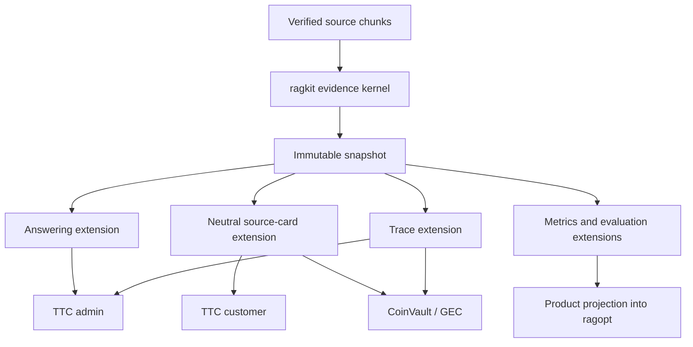

# Source-Authoritative Evidence Ledger Kernel

This design records a small evidence-ledger kernel for ragkit. The goal is to remove duplicate ledger mechanics from rag-ttc and CoinVault/GEC without replacing straightforward product code with a generic framework. Mathematical structure defines the laws; the public Go API remains `New`, `Admit`, `Snapshot`, and `Resolve`.

> [!summary]
> - The kernel admits immutable source chunks by ID through a trusted source resolver; callers never provide authoritative text.
> - Ledger state is an ordered, duplicate-free word of chunks under explicit item and rune limits. Stable `E1`, `E2`, and later labels derive from position.
> - Ragkit extensions provide bundle sources, answering, traces, cards, metrics, and evaluation. Products retain lifecycle, authorization meaning, UI payloads, prompts, and experiment policy.
> - Ragopt receives summary metrics and a native trace artifact. A ledger snapshot is not a ragopt run, cell, or custody protocol.

> [!important] Proposed pattern, deferred implementation
> This note preserves a design candidate for later study. COINVAULT-045 should first complete conservative ragkit/ragopt/rag-ttc unification while leaving the current TTC and GEC ledger APIs and semantics in place. Implement this kernel only through a separate follow-up ticket after its source, scope, extension, and identity contracts receive additional review.

## Why this design exists

Ragkit already defines `Document`, exact-source `Chunk`, derived `Representation`, backend `Hit`, fused hit, hydrated `Evidence`, and score-independent `EvidenceIdentity`. It does not define the stateful mechanism that products use across multiple search calls. That mechanism is duplicated today:

- CoinVault has `internal/knowledge.EvidenceLedger` for one answer run.
- TTC customer search has a private conversation/session ledger.
- TTC admin tool answering has another answer-run ledger and two evidence projections.

All three implementations perform the same transition:

```text
resolve chunk
    → reuse its prior E-label if already admitted
    → otherwise reject if item/rune constraints fail
    → otherwise append it and assign the next E-label
```

The outer records differ. TTC customer needs trusted URLs and source cards. TTC admin needs first-tool-call provenance and forensic traces. CoinVault needs source roles, heading paths, access policy, protobuf cards, and ragopt evaluation. Those differences are projections and policies around one common admission kernel.

The design therefore uses a thin waist:



## Pattern correlations

This design is a concrete combination of several patterns from [[Transcripts/Research/09 - RAG-MATHS Pattern Zoo|RAG-MATHS Pattern Zoo]]. The correlations are deliberately not all “full implementations.” The ledger is order-sensitive and bounded, so it is not the commutative evidence join described by every variant of accumulate-before-select.

| Ledger design element | Pattern Zoo relation | Strength | Important boundary |
|---|---|---|---|
| Policy and snapshot identity are explicit projections. | [[Transcripts/Research/09 - RAG-MATHS Pattern Zoo#Pattern 1 — Semantic Identity as Explicit Projection|Pattern 1 — Semantic Identity]] | Strong | Scope occurrence, scores, timestamps, and display metadata are excluded from semantic identity. |
| Chunk entity, retrieval observation, admission decision, label, and use remain distinct. | [[Transcripts/Research/09 - RAG-MATHS Pattern Zoo#Pattern 2 — Entity–Derivation–Observation Separation|Pattern 2 — Entity–Derivation–Observation Separation]] | Strong | A citation label is a view coordinate, not source identity. |
| Duplicate chunks are accumulated idempotently before product projections select citations or cards. | [[Transcripts/Research/09 - RAG-MATHS Pattern Zoo#Pattern 3 — Accumulate Before Selecting|Pattern 3 — Accumulate Before Selecting]] | Partial | Immediate bounded admission is order-sensitive; it is not a commutative global merge or CRDT. |
| Admission is a typed `New | Reused | Rejected` outcome, while traces are optional observations. | [[Transcripts/Research/09 - RAG-MATHS Pattern Zoo#Pattern 5 — Explicit Outcomes and Observation Algebra|Pattern 5 — Explicit Outcomes and Observation Algebra]] | Strong | Infrastructure errors remain distinct from expected policy rejection. |
| Repeated claims can be modeled as an internal event word reduced into state. | [[Transcripts/Research/09 - RAG-MATHS Pattern Zoo#Pattern 7: Append-Only Events, Pure Reducers, and Observable Idempotence|Pattern 7 — Append-Only Events and Reducers]] | Adjacent | The public API is not an event store; durable history is an optional trace extension. |
| Source, core limits, and every extension rule are checked before append. | [[Transcripts/Research/09 - RAG-MATHS Pattern Zoo#Pattern 9: Constraint-First Decisions and Partial Preference|Pattern 9 — Constraint-First Decisions]] | Strong | Ledger admission is feasibility, not Pareto optimization. |
| A small source resolver and kernel validate claims from larger retrieval/provider components. | [[Transcripts/Research/09 - RAG-MATHS Pattern Zoo#Pattern 10 — Large Producers, Small Trusted Validators / Proof-Carrying Artifacts|Pattern 10 — Small Trusted Validators]] | Strong | Validation proves identity and source consistency, not truth or entailment. |
| Product authorization must dominate admission and every later disclosure. | [[Transcripts/Research/09 - RAG-MATHS Pattern Zoo#Pattern 12 — Authorization Dominates Disclosure|Pattern 12 — Authorization Dominates Disclosure]] | Strong goal | A product rule alone is insufficient if retrieval, tracing, caching, or cards can bypass it. |

## Vocabulary and authority

The word “evidence” currently names several distinct things. This design uses a narrower vocabulary.

| Term | Meaning | Authority |
|---|---|---|
| Source chunk | Exact text slice from one validated source revision. | Verified source/catalog |
| Retrieval observation | A channel, query, rank, score, or contribution that points at a chunk. | Search backend for the observation only |
| Claim | A request to admit a chunk ID into one ledger scope. | Caller request, not source authority |
| Admission decision | `New`, `Reused`, or `Rejected` under one identified policy. | Evidence kernel |
| Ledger entry | One ordered admitted source chunk and its stable label. | Evidence kernel plus source resolver |
| Presentation | A selected view supplied to a model or UI. | Projection policy |
| Citation use | A model or UI occurrence referring to a label/entry. | Observed occurrence, not proof of support |
| Support judgment | A claim/evidence assessment. | Product evaluator or human reviewer |
| Ragopt proposal basis | Diagnostics motivating a candidate. | Ragopt candidate artifact; not answer evidence |
| Ragopt run custody | Immutable run inputs, native artifacts, and cell journal. | Ragopt run store; not the live ledger |

The authority chain is:

$$
Cited \subseteq Presented \subseteq Admitted \subseteq Verified.
$$

Citation membership proves that a model named supplied evidence. It does not prove entailment, factual truth, or causal model use.

## Mathematical backbone

### Verified source set

Let $V$ be the finite set of source chunks admitted by a validated corpus. Each chunk has identity

$$
I(c)=(ChunkID(c),DocumentID(c),ContentDigest(c)).
$$

Rank, retrieval score, reranker score, title, URL, and `E#` label are excluded.

A caller submits a claim containing a chunk ID. The source resolver is a partial function

$$
resolve:ChunkID\rightharpoonup V.
$$

An unresolved claim is rejected. Caller-provided text never substitutes for the resolved chunk.

### Internal event-word model

Within one scope, claims form an ordered word

$$
w=(q_1,q_2,\ldots,q_m)\in Q^*.
$$

Concatenation gives the internal composition law

$$
Fold(s,x\cdot y)=Fold(Fold(s,x),y).
$$

This law supports deterministic replay and incremental snapshots. It remains an implementation and testing model: the ordinary public API exposes repeated `Admit` calls, not a general event store. The optional trace extension can preserve occurrence history when a product needs it.

### Ordered unique state

A ledger contains an ordered word of distinct chunks:

$$
L=(c_1,c_2,\ldots,c_n)
$$

with

$$
ChunkID(c_i)\ne ChunkID(c_j)\quad\text{when }i\ne j.
$$

Repeated admission is idempotent at the ledger boundary:

$$
admit(admit(L,c),c)=admit(L,c)
$$

where the second operation returns `Reused` and does not consume additional budget.

The unbounded ordered union is left-biased and idempotent. Bounded admission is a deterministic fold over claims, not a commutative merge. This distinction prevents an incorrect CRDT claim.

### Resource measure

Every new chunk has charge

$$
\mu(c)=(1,runes(c))\in\mathbb{N}\times\mathbb{N}.
$$

The configured budget is

$$
B=(B_{items},B_{runes}).
$$

A new entry is feasible when

$$
used(L)+\mu(c)\le B
$$

under componentwise order. Reuse and rejection have zero charge.

### Deterministic transition

For fixed policy $P$:

$$
step_P:L\times Claim\rightarrow L\times Decision
$$

where

$$
Decision=New(Entry)\mid Reused(Entry)\mid Rejected(Violations).
$$

Expected policy rejection is data. Resolver failure, canceled execution, or source inconsistency is a Go error and leaves state unchanged.

### Label projection

Labels are derived from one-based position:

$$
label_L(i)=E_i.
$$

Appending evidence preserves every prior label. `E1` is meaningful only with its scope and snapshot; immutable chunk ID remains the durable citation identity.

## Kernel API

The package should be:

```text
github.com/go-go-golems/ragkit/rag/evidence
```

The public API is intentionally smaller than the underlying model.

### Source interface

The kernel should resolve only exact chunks. Document metadata belongs to a separate catalog extension.

```go
type Source interface {
    Identity() string

    ResolveChunk(
        context.Context,
        string, // chunk ID
    ) (rag.Chunk, bool, error)
}
```

This is narrower than returning a full document and prevents display requirements from widening the trusted kernel.

A separate extension interface serves titles and URIs:

```go
type DocumentCatalog interface {
    ResolveDocument(
        context.Context,
        string, // document ID
    ) (rag.Document, bool, error)
}
```

### Scope and limits

```go
type ScopeKind string

const (
    ScopeTurn         ScopeKind = "turn"
    ScopeAnswerRun    ScopeKind = "answer_run"
    ScopeConversation ScopeKind = "conversation"
)

type Scope struct {
    Kind ScopeKind
    ID   string
}

type Limits struct {
    Distinct int
    Runes    int
}

type Config struct {
    Scope  Scope
    Limits Limits
    Rules  []Rule
}
```

The host supplies positive limits explicitly. Ragkit does not guess product defaults.

### Claim, entry, and decision

```go
type Label string

type Origin struct {
    ToolCallID string
    QueryID    string
}

type Claim struct {
    ChunkID string
    Origin  Origin
}

type Entry struct {
    Ordinal     int
    Label       Label
    Chunk       rag.Chunk
    FirstOrigin Origin
}

type Status string

const (
    StatusNew      Status = "new"
    StatusReused   Status = "reused"
    StatusRejected Status = "rejected"
)

type Violation struct {
    Rule    string
    Code    string
    Message string
}

type Decision struct {
    Status     Status
    Entry      Entry
    Violations []Violation
}
```

`Entry` does not contain title, URL, role, score, heading path, widget identity, or admission time. Those values either belong to the trusted document catalog or to an occurrence trace.

### Ledger and snapshot

```go
type Ledger struct {
    // unexported source, mutex, policy, entries, index, and accounting
}

func New(source Source, config Config) (*Ledger, error)

func (l *Ledger) Admit(
    context.Context,
    Claim,
) (Decision, error)

func (l *Ledger) Snapshot() Snapshot
func (l *Ledger) PolicyID() string

type Snapshot struct {
    Scope     Scope
    SourceID  string
    PolicyID  string
    Entries   []Entry
    UsedRunes int
}

func (s Snapshot) Resolve(Label) (Entry, bool)
func (s Snapshot) Require(...Label) ([]Entry, error)
func (s Snapshot) SourceEvidence() []rag.Evidence
func (s Snapshot) OrdinalEvidence() []rag.Evidence
func (s Snapshot) SemanticIdentity() (string, error)
```

The primary call path reads as ordinary Go:

```go
ledger, err := evidence.New(source, evidence.Config{
    Scope: evidence.Scope{Kind: evidence.ScopeAnswerRun, ID: runID},
    Limits: evidence.Limits{Distinct: 12, Runes: 18_000},
})
if err != nil {
    return err
}

decision, err := ledger.Admit(ctx, evidence.Claim{
    ChunkID: hit.ChunkID,
    Origin: evidence.Origin{ToolCallID: callID, QueryID: queryID},
})
if err != nil {
    return err
}

switch decision.Status {
case evidence.StatusNew, evidence.StatusReused:
    toolResult.EvidenceID = string(decision.Entry.Label)
case evidence.StatusRejected:
    toolResult.Omitted++
}
```

## Extension interface

The only admission extension is a deterministic, read-only rule.

```go
type View interface {
    Len() int
    UsedRunes() int
    ContainsChunk(string) bool
    CountDocument(string) int
    Entries() []Entry
}

type Candidate struct {
    Chunk  rag.Chunk
    Origin Origin
}

type Rule interface {
    // ID contains version and all behavior-affecting configuration.
    ID() string

    // Check is deterministic and side-effect free.
    Check(View, Candidate) []Violation
}
```

Rules compose by conjunction. All rules see the same pre-admission view. The kernel sorts violations by rule ID and code before returning them.

Rules may reject and explain. They may not:

- provide source text;
- force admission;
- assign labels;
- mutate state;
- hide resource charges;
- change the deduplication key.

An out-of-process plugin can later be wrapped behind `Rule`. Plugin transport does not enter the kernel API. Its version and configuration digest must appear in `ID()`.

## Kernel laws

The implementation and review tests should state these laws directly.

### Source authority

Every entry equals the chunk returned by `Source.ResolveChunk`. Searcher, reranker, model, and widget text are never authoritative.

### Reuse idempotence

Repeated claims produce one entry and one budget charge.

### Prefix stability

Appending later entries never changes prior ordinals, labels, or chunk content.

### Rejection purity

A rejected claim leaves entries, used runes, and semantic snapshot identity unchanged.

### Score independence

Changing retrieval rank or score does not change entry or snapshot identity.

### Deterministic rule composition

Permuting rule registration does not alter admission, sorted violations, or policy identity.

### Citation safety

`Resolve` succeeds exactly for labels in the snapshot. `Require` fails when any requested label is unknown and preserves requested order.

### Linearizable in-process concurrency

Concurrent `Admit` calls produce one mutex-defined total order, unique contiguous labels, and exact accounting. The package makes no distributed-merge claim.

## Identity projections

Policy identity names admission semantics:

```text
kernel schema/version
scope kind
fixed chunk-ID deduplication law
fixed E-label law
item/rune limits
sorted rule identities
```

Snapshot semantic identity names ordered admitted source material:

```text
source identity
policy identity
ordered (chunk ID, document ID, content digest)
```

It excludes:

- scope occurrence ID;
- tool/query occurrence IDs;
- timestamps;
- rank and score;
- title, URL, role, heading path, and snippets;
- labels, because labels derive from order.

A durable trace digest may include occurrence data. It must not be called the snapshot semantic identity.

## Ragkit-provided extensions

### Verified bundle source

`rag/evidence/bundle` constructs `Source` and `DocumentCatalog` from `LoadVerifiedDocuments` and an opened bundle. It reuses corpus validators and preserves original-source slicing.

### Answering bridge

`rag/evidence/answering` converts snapshots into ordinal model evidence, applies the existing strict grounded-answer contract, and maps valid labels back to immutable chunk IDs.

### Neutral source cards

`rag/evidence/sourcecard` resolves labels against a snapshot and title/URI against the trusted document catalog. TTC and CoinVault map neutral cards to their own widget/protobuf types.

### Trace extension

`rag/evidence/trace` records claims, decisions, optional retrieval observations, presentations, citation uses, text digests, bounded archived text, and occurrence correlation. The event-word model belongs here, not in the basic call site.

### Metrics extension

`rag/evidence/metrics` summarizes claims, new/reused/rejected decisions, admitted entries, used runes, presentations, citations, and unknown citations. Products can map those values into ragopt metrics without making ragopt import ragkit.

### Evaluation extension

`rag/evidence/evaluation` implements required evidence groups. For an observed identity set $A$ and expected group $G_i$, satisfaction is

$$
A\cap G_i\ne\varnothing.
$$

Product datasets still define the groups and target level.

### Common rules

`rag/evidence/rules` may ship concrete, versioned rules such as maximum chunks per document. Avoid anonymous callback rules whose behavior has no stable identity.

## Product extensions

### TTC customer

TTC customer provides:

- conversation or answer-run lifecycle;
- search routes and tool registration;
- public-source policy;
- URL normalization and customer-safe snippets;
- source-results widget publication;
- the rule that final prose hides internal `E#` labels.

It should delete its private item/rune/deduplication ledger after parity. `Citation` may remain a tool-result DTO projected from shared entries.

### TTC admin

TTC admin provides:

- answer-run provider/tool orchestration;
- broader agent trace and archive retention;
- redaction and encrypted-payload policy;
- evidence, funnel, document, prompt, and contract TUI views.

It should replace `toolanswer.EvidenceLedger`, ordinal/immutable conversion, and local citation mapping. The shared trace extension supplies evidence-specific occurrence data; admin retains the broader agent trace.

### CoinVault / GEC

CoinVault provides:

- answer-run lifecycle;
- access-scope and source-role meaning;
- query transforms and comparison intents;
- retrieval/reranker/tool-description identities;
- canonical URL and heading-path projection;
- protobuf source cards;
- SQL evidence;
- ragopt cases, treatments, required groups, and judge semantics.

It should remove `internal/knowledge.EvidenceLedger` after parity and use shared policy/snapshot identities in its native ragopt artifact.

### Ragopt

Ragopt remains downstream:

```text
shared snapshot + optional trace
             |
             +--> summary metrics
             +--> native artifact
             |
             v
       ragopt Outcome
```

Ragopt owns candidate, run, case/repeat/arm cell, comparison, gate, and report coordinates. It does not execute the live evidence ledger.

## Minimal implementation path

The safe minimum implements fewer features, not weaker semantics.

### E0 — Freeze fixtures

Capture new, reuse, item rejection, rune rejection, unknown source, label mapping, score independence, and source-card failure behavior across TTC and CoinVault.

### E1 — Build only the kernel

Implement `Source`, `Config`, `Claim`, `Decision`, `Entry`, `Ledger`, and `Snapshot`, plus law and race tests. Do not start with traces, cards, metrics, or ragopt integration.

### E2 — Prove it in TTC admin

TTC admin has the strongest existing label, budget, first-call, immutable-mapping, trace, and UI tests. Replace only its ledger mechanics first; retain current trace projection temporarily.

### E3 — Add extensions under migration pressure

Add answering, bundle source, trace, source cards, metrics, and evaluation only when the first real consumer needs each interface.

### E4 — Migrate TTC customer and CoinVault

Migrate one product boundary at a time and delete local mechanics only after parity and released-module tests pass.

> [!warning] Do not publish the weaker intermediate API
> An unexported prototype may use `AddOrReuse(rag.Chunk, callID)`. The published ragkit API should not. Accepting arbitrary chunks would leave source authority to callers and force a second migration when `Source.ResolveChunk` is introduced.

## Failure modes and non-goals

- **Product DTO in the kernel:** A `Citation`, protobuf source card, or CoinVault search item becomes accidental authority.
- **One score on the entry:** Repeated discovery observations are collapsed into a misleading canonical value.
- **Generic `Ledger[T]`:** Chunk authority laws disappear behind caller-provided type parameters.
- **Anonymous rule:** Admission behavior changes without policy identity changing.
- **Mutable scope policy:** Previously admitted evidence bypasses a newly changed permission rule.
- **Snapshot treated as trace:** Rejections, repeated observations, and presentations disappear from forensic evidence.
- **Trace treated as ragopt run:** Ledger occurrence identity is aliased with candidate/run/cell identity.
- **Citation treated as entailment:** Membership is reported as factual support.
- **CRDT overclaim:** Order-sensitive labels and budgets are described as commutatively mergeable.

## Open design questions

1. Is TTC customer evidence intentionally conversation-scoped, or should it reset per assistant answer?
2. Should neutral source cards land with the first kernel release or after one consumer migration?
3. Which trace append is authoritative when a product requires durable evidence before returning a tool result?
4. Should CoinVault authorization remain entirely upstream of admission, or should a product rule also record denial reasons?
5. Which existing ragopt metric names are frozen promotion-policy inputs?
6. Should `ragopt/candidate.Evidence` later be renamed to `ProposalBasis` to reduce vocabulary collision?

## Working rules

- Implement less functionality first, but do not implement weaker source or identity semantics.
- Keep the kernel concrete to source chunks until another evidence kind proves the same laws.
- Keep labels and deduplication fixed in v1.
- Make every behavior-changing rule identifiable.
- Treat snapshots as semantic values and traces as occurrence artifacts.
- Keep product authorization, presentation, and evaluation meaning in product packages.
- Migrate one consumer, prove parity, and only then add the next extension.

## Source material

- [[Research/Software Architecture Garden/ragkit/README|Architecture Garden — Ragkit]]
- [[Transcripts/Research/09 - RAG-MATHS Pattern Zoo|RAG-MATHS Pattern Zoo]]
- `/home/manuel/workspaces/2026-08-09/unify-rag/coinvault/ttmp/2026/08/09/COINVAULT-045--align-coinvault-with-current-ragkit-ragopt-and-rag-ttc-boundaries/design-doc/02-mathematical-evidence-ledger-kernel-intern-design-and-implementation-guide.md`
- `/home/manuel/workspaces/2026-08-09/unify-rag/ragkit/rag/types.go`
- `/home/manuel/workspaces/2026-08-09/unify-rag/ragkit/rag/evidence_identity.go`
- `/home/manuel/workspaces/2026-08-09/unify-rag/rag-ttc/pkg/ttc/toolanswer/evidence.go`
- `/home/manuel/workspaces/2026-08-09/unify-rag/rag-ttc/pkg/ttc/search/search.go`
- `/home/manuel/workspaces/2026-08-09/unify-rag/coinvault/internal/knowledge/evidence.go`
