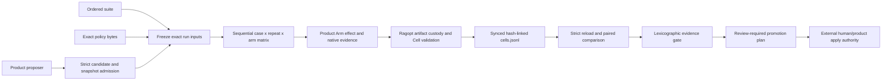

# Architecture Garden — Ragopt

Ragopt is an evidence-gated incumbent/challenger experiment kernel. A product supplies a content-identified candidate, ordered cases, two in-process arms, product-native evidence and metrics, and a product-authored gate policy. Ragopt validates and freezes declared inputs, executes a deterministic paired matrix, takes native artifact custody, appends hash-linked cell evidence, resumes exact missing coordinates, preserves missing/failure denominators, applies constraints before preferences, and emits a plan that always requires human application (`pkg/candidate/candidate.go:12-166`, `pkg/eval/runner.go:60-196,301-435`, `pkg/gate/evaluate.go:43-121`, `pkg/report/render.go:18-79`).

It is not a retrieval framework, automatic candidate proposer, population optimizer, general workflow scheduler, scientific inference engine, deployment authority, or authorization service. Product code retains effect, scoring, metric-definition, and promotion authority; Ragopt owns generic validation, local run custody, common comparison mechanics, and the pure gate decision.

> [!summary]
> - A candidate is a complete parent/child snapshot pair with exactly one independently detected mutable byte change under locked declared state.
> - A run freezes candidate, suite, exact policy bytes, snapshots, and assets before a sequential paired matrix begins.
> - Product-native evidence remains semantically authoritative while Ragopt takes byte custody and commits a bounded common `Cell` projection.
> - Gates preserve missing/failure denominators and apply identity/hard/target/regression constraints before cost preferences; every promotion plan remains non-applying and human-required.
> - Single-writer resume, external-effect idempotency, native-file/cell atomicity, scientific validity, and review/gate integration remain open boundaries.

## Snapshot identity and evidence

| Field | Value |
|---|---|
| Repository | `/home/manuel/code/wesen/go-go-golems/ragopt` |
| Remote | `git@github.com:go-go-golems/ragopt.git` |
| Branch | `main` |
| Commit | `0e9c584fee2db0de34f3ebacb32c8da757023333` |
| Commit date | `2026-08-09T16:42:54-04:00` |
| Commit subject | `fix: harden ragopt durable read boundaries` |
| Worktree | Clean; committed source only |
| Analysis date | `2026-08-10` |
| Analysis scope | Whole repository, including review and delivery boundaries; no live provider or deployment audit |

The study inspected candidate/snapshot/suite/policy ingress, run preparation and frozen input binding, arm execution and evidence guards, native artifact custody, JSONL append/recovery, strict readers, comparison, gates, reports, human review, public Go and CLI surfaces, tests, the pinned consumer evidence below, the committed GEC proof record, GoReleaser configuration, and CI. Runtime code and tests take precedence over older design/reference prose. Decisive candidate, runner, resume, gate, and report paths were independently reread at the pinned snapshot after the evidence handoff.

The module is `github.com/go-go-golems/ragopt`, declares Go `1.26.1` and toolchain `go1.26.5`, and the checkout was clean before and after analysis (`go.mod:1-5`). No source repository was modified.

### Consumer evidence

Current consumer evidence is pinned separately to RAG-TTC repository `/home/manuel/workspaces/2026-06-30/benchmark-cpu-inference/rag-ttc`, commit `6c7b1c0860d385edad13707cceb52be6d38c19f0`, branch `task/rag-ttc-tui-polish`, inspected on `2026-08-10`. The checkout was dirty only by untracked `apps/customer/web/packages/ttc-garden-assistant/tsconfig.tsbuildinfo`; therefore the claims below are about committed source read with `git show`, not a clean consumer worktree or uncommitted behavior.

RAG-TTC pins Ragopt (`go.mod:15`), loads candidate/suite inputs and supplies incumbent/challenger arms (`cmd/rag-ttc/cmds/tooleval/ragopt.go:97-140`), then executes its product runtime, writes native evidence, and projects that evidence to a Ragopt `Outcome` (`cmd/rag-ttc/cmds/tooleval/ragopt.go:261-375`). Its review adapter maps Ragkit grounded answers and evidence into Ragopt's structurally blinded review types (`pkg/ttc/review/projection.go:14-50`), and its admin TUI opens Ragopt runstores through strict readers (`internal/admin/tui/runstorebrowser.go:37-70`). Thus Ragopt has no direct module dependency on Ragkit and neither library owns the other's identities or authority, while this product adapter composes both libraries.

Ragopt's committed GEC record at `ttmp/2026/08/06/RAGOPT-001--reusable-reproducible-self-optimization-harness/reference/09-first-gec-feedback-proof-and-source-role-candidate-rejection.md:59-91` records Ragkit hybrid retrieval feeding native evidence and a Ragopt cell/gate. It is recorded proof evidence inside the analyzed Ragopt commit, not an independently audited current consumer checkout.

## Architecture and runtime path



### Candidate and suite admission

1. `candidate.LoadCandidate` strict-decodes a one-document YAML manifest, confines canonical relative asset paths to the resolved bundle root, rereads files, verifies size/SHA-256, sorts declarations, and recomputes parent/child snapshot identity (`pkg/candidate/candidate.go:12-59`, `pkg/candidate/yaml.go:12-29`, `pkg/candidate/path.go:11-60`, `pkg/candidate/snapshot.go:19-128`).
2. Candidate validation compares complete loaded snapshots rather than trusting the declared mutation. System, dimensions, locked assets, and mutable-name domains must agree; unchanged mutable assets cannot alter metadata/path; exactly one mutable byte sequence must differ; and its name must equal the declaration (`pkg/candidate/candidate.go:116-166`; negative tests in `pkg/candidate/candidate_test.go:63-88,151-166`). Hypothesis, target metric, proposer, risks, and diagnostic provenance participate in candidate identity (`pkg/candidate/types.go:34-92`, `pkg/candidate/digest.go:44-67`).
3. `eval.LoadSuite` strict-loads ordered JSON. Case IDs are unique, opaque inputs are canonicalized with `json.Number`, groups are normalized, and case order remains part of the suite digest because it controls execution (`pkg/eval/types.go:18-39`, `pkg/eval/suite.go:21-129`).
4. Gate policy is strict one-document YAML with required product-authored metric names and thresholds. Ragopt retains both the exact byte digest that binds execution and a normalized semantic digest that identifies parsed policy meaning (`pkg/policy/policy.go:21-57,61-180`). Neither digest makes the thresholds a universal quality standard.

### Frozen run input and occurrence path

Before creating work, `eval.Run` reloads/revalidates candidate and suite and binds exact suite/policy/candidate/snapshot/arm/repeat/mutation coordinates into `RunConfig` (`pkg/eval/runner.go:22-42,60-85,116-196`). `runstore.Create` adds a timestamp/name/random `run_id`, creates local input/result/native custody directories, records host/build metadata, canonicalizes/hashes configuration, and publishes config, manifest, and active status as three individually atomic/synced artifact writes (`pkg/runstore/run.go:68-155`, `pkg/runstore/types.go:10-72`). The random ID names a run **occurrence**; it is not semantic candidate or experiment identity. There is no atomic whole-run transaction across those files.

`bindInputs` copies the raw suite, raw policy, candidate and both snapshot manifests, and all parent/child assets. It checks the exact expected role/digest set and gives arms only absolute paths to run-owned copies (`pkg/eval/bind.go:17-75,102-167,184-235`). `runstore.CopyInput` uses a pending file, atomically updates the input manifest, renames and syncs; explicit resume can recover a pending input, while read-only `Open` never silently repairs (`pkg/runstore/input.go:11-86`, `pkg/runstore/read.go:238-295`). This is the proposal-to-frozen-input authority transition.

### Paired execution and evidence custody

V1 schedules sequentially in suite order, then repeat index, then incumbent and challenger (`pkg/eval/runner.go:301-312`). Each product `Arm` is an in-process capability with `Name()` and `Run(context.Context, Request) (Outcome,error)`; it receives exact case/repeat coordinates, a cloned candidate view, the run directory, and a unique native directory (`pkg/eval/types.go:105-132`). There is no worker pool, random arm assignment, general subprocess/RPC/plugin protocol, automatic retry, or distributed lease.

Before invoking an arm, the runner clears only the uncommitted cell directory and snapshots protected run evidence. After return it verifies that the arm did not mutate manifest, config, status, frozen inputs, or the committed journal (`pkg/eval/runner.go:314-344`, `pkg/eval/evidence_guard.go:14-83`). An ordinary arm error becomes a durable failed outcome and execution continues; cancellation/deadline creates no synthetic cell and leaves the run active (`pkg/eval/runner.go:345-364,479-503,708-723`). Product failure is therefore distinct from custody failure and cancellation.

Successful outcomes require finite metrics, nonnegative costs/duration, coherent completion/failure/abstention flags, and a native artifact under the assigned directory. The runner replaces the arm-controlled inode with a synced run-owned copy, breaking hard links, then records artifact path/digest/size (`pkg/eval/runner.go:365-435,505-573,586-696`). Product-native evidence remains the semantic authority; `Outcome` is Ragopt's bounded common comparison projection (`pkg/eval/types.go:41-67`).

A sealed `Cell` carries `CandidateID` and binds run, suite, exact policy bytes, side-specific snapshot, case, repeat, arm, time, outcome, predecessor digest, and own digest; the candidate digest and remaining frozen identities live in `RunConfig` and its manifest config digest (`pkg/eval/types.go:69-85`, `pkg/eval/runner.go:24-42,173-189`, `pkg/runstore/read.go:62-72`, `pkg/eval/cell_chain.go:10-52`). `AppendJSONL` appends one bounded compact record, fsyncs, closes, and syncs a new directory entry; successful return is the declared cell commit boundary (`pkg/runstore/run.go:256-307`). Finalization strictly reloads the active run, then writes summary and terminal complete status as separate individually atomic/synced artifacts (`pkg/eval/runner.go:266-299`, `pkg/runstore/terminal.go:10-53`). This journal is append-only experiment evidence, not event-sourced product state, and terminal publication is not one multi-file transaction.

### Cancellation, resume, and strict reads

`runstore.Resume` accepts only an active run and exact canonical config digest, and explicitly leaves single-writer ownership to the operator; it has no inter-process lock (`pkg/runstore/run.go:31-65`). `loadCompletedCells` may truncate only a final non-newline fragment. Every retained line is strict-decoded, hash-chain checked, matched to the deterministic schedule and frozen identity, duplicate-rejected, and native-artifact-reverified (`pkg/eval/resume.go:13-129`). Resume executes only absent full coordinates. `RunConfig` plus the cell key bind the frozen identities: `RunConfig` carries the semantic candidate digest and all run-level inputs, while each cell/key carries `CandidateID`, suite digest, exact policy-byte digest, side snapshot digest, case ID, repeat index, and arm name (`pkg/eval/runner.go:24-42,173-189,735-757`, `pkg/eval/types.go:69-85`).

The interruption test proves that a committed prefix survives cancellation, a truncated tail is removed, only missing cells run, and normalized resumed output equals uninterrupted output (`pkg/eval/runner_test.go:26-99`). It does **not** prove exactly-once external effects, idempotent cross-process execution, retry identity, or concurrent-writer safety.

Read-only `runstore.Open` verifies run/basename identity, strict schemas, config digest, legal status combination, complete summary, exact input manifest, every copied byte digest/size, and absence of untracked inputs (`pkg/runstore/read.go:22-95,145-235`). `eval.LoadArtifactRun` additionally validates `RunConfig`, exact input roles, copied suite/policy identity, cell chain/coordinates, and native artifacts; active and failed runs may be inspected but not repaired (`pkg/eval/artifacts.go:47-118,171-221,231-318`).

### Comparison, gate, report, and human authority

`compare.Build` reloads durable evidence, rejects cross-run, duplicate, or unexpected cells, and joins one incumbent and challenger only at equal `(case ID, repeat index)` (`pkg/compare/build.go:20-114`). Missing sides remain `MissingPair`, never score zero. Candidate-minus-incumbent deltas are computed only where both metrics exist; expected pairs, complete pairs, and metric-present pairs remain distinct denominators, while failures, contract validity, abstention, and costs aggregate separately (`pkg/compare/types.go:9-102`, `pkg/compare/build.go:117-286`).

`gate.Evaluate` is pure and lexicographic: identity, hard completion/contract/failure/floor checks, target checks, regressions, then informational cost tie-breakers. `stopAfter` prevents later preference from rescuing a failed invariant (`pkg/gate/evaluate.go:43-121,123-233,258-292`; goldens in `pkg/gate/evaluate_test.go:16-69`). Product policy supplies all metric meaning and thresholds. A pass is transparent policy evaluation, not scientific proof or causal inference.

`report.Build` reloads durable evidence and copied policy, rebuilds comparison, recomputes the decision, rejects mismatches, and produces `state=review_required` with `human_apply_required=true` (`pkg/report/render.go:18-79`, `pkg/report/types.go:10-37`). There is no apply/promote command. `report.Write` stages and syncs Markdown and JSON and attempts rollback, but explicitly cannot make two arbitrary POSIX paths one indivisible transaction (`pkg/report/write.go:13-59,145-166,228-351`). Human/product Git or deployment workflow alone may apply a candidate.

### Structurally blinded review is separate

`pkg/review` builds reviewer queues whose queue type cannot encode variant and a separate unblinding key; this is structural blinding, not cryptographic secrecy (`pkg/review/review.go:19-83`). Deterministic review IDs include protocol/subject/variant/product-owned identity, annotation loading strict-validates IDs/dimensions/ranges/reviewer uniqueness, and aggregation pairs subject/variant values after averaging reviewers/items (`pkg/review/review.go:127-267`, `pkg/review/aggregate.go:67-321`). Bootstrap intervals appear only at at least 30 paired subjects.

The package is used by the pinned RAG-TTC consumer described under **Consumer evidence**, but it has no Ragopt CLI and is not wired into `pkg/eval`, `pkg/gate`, or promotion reports. Review queue/key custody, annotation durability, access control, and any gate integration remain caller-owned.

## Authority and state map

| Object family | Owner/authority | Exact identity/custody coordinate | Durable form | Must not be confused with |
|---|---|---|---|---|
| Candidate declaration | Product proposer; loader admits | Human candidate ID + semantic candidate digest | Source manifest then run copy | Applied change, snapshot, or run |
| Parent/child snapshot | Candidate loader | Digest of system, sorted verified assets, dimensions | Manifest/files then run copies | Run occurrence or release root |
| Locked asset | Product declares; validator compares | Name + path + digest + size + media type | Bundle/run copy | Authorization or immutable deployment dependency |
| Mutable intervention | Validator independently detects | Exactly one asset name + parent/child byte digests | Complete replacement bytes | Patch, optimizer population, or promotion |
| Suite | Product owns cases/groups/meaning | Semantic digest; ordered cases affect identity | Copied raw JSON | Scoring authority or random sample proof |
| Gate policy | Product owns semantics | Exact byte digest + distinct normalized semantic digest | Copied YAML | Universal quality truth |
| Run occurrence | Runstore | Timestamp/name/random `run_id` | Local directory | Semantic experiment coordinate |
| Cell | Eval runner | `RunConfig` plus suite/policy bytes/`CandidateID`/snapshot/case/repeat/arm + chain digest | Synced JSONL | Independent `CandidateDigest`, retry attempt, provider request, or event-sourced state |
| Native artifact | Product creates; runner takes custody | Run-relative path + digest + size | Run-owned file | Common `Outcome` or score truth |
| Outcome | Product projects; eval validates | Embedded in exact cell | JSONL | Full native evidence |
| Comparison | Comparator | Run identities + pair `(case,repeat)` | Rebuildable | Canonical evidence or zero-filled table |
| Gate decision | Pure evaluator | Policy semantic digest + comparison identities | Rebuildable/report | Authorization or promotion |
| Promotion plan | Reporter | Run/candidate/snapshots/policy/decision | Caller-owned JSON | Apply operation; always human-required |
| Review item/annotation | Product/reviewer; review loader admits | Review ID and `(review ID, reviewer)` | Caller-owned files | Eval cell or gate input |

Identity discipline is non-negotiable: asset digest ≠ snapshot ID ≠ candidate digest ≠ run ID ≠ cell digest; exact policy byte digest ≠ semantic policy digest; case repeat ≠ retry attempt; arm error ≠ custody corruption; native artifact ≠ `Outcome`; comparison ≠ canonical cell evidence; decision ≠ promotion; blind review queue ≠ eval suite.

## Candidate common vocabulary

| Proposed term | Project-local name | Invariant | Nearby ecosystem names | Difference retained |
|---|---|---|---|---|
| **System snapshot coordinate** | `SnapshotID` | Projection over declared verified assets, system, and dimensions | Specification/bundle identity | Not run occurrence or release root; completeness is product-owned |
| **Locked intervention** | `Candidate`, `Mutation` | Parent/child differ in one mutable byte sequence under equal locked state | Experiment configuration change | Complete replacement, not search proposal or patch |
| **Run-bound input** | `InputRef` | Exact source bytes are copied and digest/size checked under one run | Input custody | Original path is provenance, not post-copy authority |
| **Evaluation cell** | `Cell` | One committed outcome at exact frozen case/repeat/arm coordinates | Attempt observation | Not retry attempt or scientific replicate by itself |
| **Product-native evidence** | `NativeArtifact` | Product-complete evidence remains retained and content-identified | Native trace/artifact | Ragopt validates custody, not truth |
| **Common comparison projection** | `Outcome` | Small completion/metric/cost view shared across products | Arm outcome | Does not replace native evidence |
| **Pair coordinate** | `PairKey` | Incumbent/challenger join only at identical case/repeat | Paired sample | Missing is explicit, never zero |
| **Evidence gate** | `Policy`, `Decision` | Hard constraints dominate preference | Promotion/admission gate | Product owns metric semantics and thresholds |
| **Non-applying promotion evidence** | `PromotionPlan` | Evidence-bound recommendation always requires a human | Change plan | Not deployment authority or current pointer |
| **Blind review item** | `QueueEntry`, `KeyEntry` | Reviewer queue omits variant; unblinding value is separate | Blinded packet | Structural omission, not secrecy or gate integration |

> [!important] Vocabulary discipline
> Candidate, run, cell, and native evidence are different custody families. Exact policy bytes bind execution while semantic policy digest identifies parsed decision semantics. A repeat is scientific matrix position, not an execution retry. Human promotion must remain outside gate decision authority.

## Mathematical and computer-science foundations

### 1. Snapshot identity as explicit projection

Let $S_{snap}$ be the set of snapshots admitted by `LoadSnapshot`; let $B$ be the set of bytes and $B^*$ finite byte strings; let $D_{sha}$ be the set of `sha256:`-prefixed lowercase SHA-256 strings. Let $N_{snap}:S_{snap}\to B^*$ sort locked/mutable asset references by logical name and JSON-encode API version, system, assets, and dimensions exactly as `DigestSnapshot`; let $H_{sha}:B^*\to D_{sha}$ be SHA-256 rendering. Define

$$
I_{snap}(s)=H_{sha}(N_{snap}(s)).
$$

**Operational consequence:** declaration order does not change identity; asset path/media type/digest/size and dimensions do (`pkg/candidate/digest.go:17-42`; `pkg/candidate/candidate_test.go:42-60`).

**Limit:** collision resistance is assumed, and product-required environmental dimensions can be omitted. Identity proves declared verified values, not behavior-complete reproducibility or a release.

### 2. Candidate admission is a singleton intervention

For admitted parent and child snapshots $p,c\in S_{snap}$, let $A_{mut}$ be the set of mutable asset names and let $M_p:A_{mut}\rightharpoonup B^*$ and $M_c:A_{mut}\rightharpoonup B^*$ map names to verified bytes. Define

$$
\Delta_{mut}(p,c)=\{a\in A_{mut}\mid M_p(a)\ne M_c(a)\}.
$$

Admission requires equal system, dimensions, locked assets, and mutable-name domains, plus

$$
|\Delta_{mut}(p,c)|=1
\quad\land\quad
\operatorname{declaredAsset}=\text{the unique member of }\Delta_{mut}(p,c).
$$

**Operational consequence:** observed deltas can be attributed to one declared mutable surface within the frozen declared coordinate.

**Limit:** one byte intervention does not prove causality when provider state, undeclared environment, product preflight, or stochastic sampling lies outside the snapshot.

### 3. Exact evaluation coordinates form a finite product

Let $Q_{case}$ be the finite ordered set of suite cases; for repeat count $n\in\mathbb{N}_{>0}$ let $R_{repeat}=\{0,\ldots,n-1\}$; let $A_{arm}=\{incumbent,challenger\}$. Expected matrix work is

$$
W_{eval}=Q_{case}\times R_{repeat}\times A_{arm}.
$$

Let $D_{candidate}$ be the set of candidate digests and $I_{candidate}$ the set of candidate IDs. `RunConfig` binds one $d_c\in D_{candidate}$ together with suite, policy, parent/child snapshots, arm names, repeats, mutation, asset digests, and copied-input digests. Each cell key carries one $i_c\in I_{candidate}$—not $d_c$—plus suite digest, exact policy-byte digest, side-specific snapshot digest, case, repeat, and arm. The pair consisting of the admitted `RunConfig` and a cell key therefore binds the complete frozen coordinate. Pairing projects $W_{eval}$ onto $Q_{case}\times R_{repeat}$ and requires one value from each member of $A_{arm}$.

**Operational consequence:** resume skips only an exact committed coordinate under the admitted run config; comparison cannot pair across frozen identities.

**Limit:** a cell does not independently carry the candidate digest, and a cell key is not provider idempotency identity, retry-attempt identity, random assignment, or causal estimand.

### 4. Cell custody is an ordered hash-linked word

Let $C_{cell}$ be the set of valid sealed cells and $C_{cell}^*$ finite words over them. For history $h=c_1\cdots c_m\in C_{cell}^*$, each $c_j$ contains the digest of $c_{j-1}$ (empty for $j=1$) and its own digest over all fields with its digest field blank. Append is order-sensitive and noncommutative.

**Operational consequence:** deletion, reordering, and in-place modification of retained committed cells are detected during full reload; append/fsync establishes a recoverable prefix.

**Limit:** the hash chain is not signed authenticity, immutable media, a transaction with native artifact creation, global causal order, event sourcing, or exactly-once effects.

### 5. Paired deltas retain explicit denominators

Let $M_{metric}$ be the set of metric names. For metric $m\in M_{metric}$ and a complete pair $(q,r)\in Q_{case}\times R_{repeat}$ where both values are present, let $v_c(m,q,r),v_i(m,q,r)\in\mathbb{R}$ be challenger and incumbent values. Define

$$
\delta_m(q,r)=v_c(m,q,r)-v_i(m,q,r).
$$

Ragopt retains distinct natural counts $N_{expected}$, $N_{complete}$, and $N_{metric}(m)$ for expected pairs, complete pairs, and pairs containing both values of $m$.

**Operational consequence:** missing cells/metrics cannot silently improve a mean; higher challenger value has no desirability meaning until product policy supplies it.

**Limit:** means and signs do not establish uncertainty, causal effect, metric comparability, sufficient sample size, or scientific truth.

### 6. Feasibility precedes preference

Let $P_I$, $P_H$, $P_T$, and $P_R$ be Boolean conjunctions of Ragopt's identity, hard, target, and regression checks. Gate pass requires

$$
P_I\land P_H\land P_T\land P_R.
$$

Cost tie-break observations are evaluated only after the conjunction is true.

**Operational consequence:** cost savings cannot rescue missing evidence, contract failure, quality-floor failure, or declared regression.

**Limit:** a structurally valid product policy may still use weak metrics or thresholds; Ragopt does not establish causal or scientific validity.

### 7. Review pairing is a separate domain

Let $S_{subject}$, $V_{variant}$, $D_{dimension}$, and $R_{reviewer}$ be distinct sets. Review aggregation first averages annotations for one identified item over $R_{reviewer}$, then multiple item identities sharing one $(s,v,d)\in S_{subject}\times V_{variant}\times D_{dimension}$, and compares variants only where both sides exist.

**Operational consequence:** reviewer multiplicity and product item multiplicity do not become pseudo-independent eval cells.

**Limit:** this subject-paired projection is not the eval cell algebra and is not a gate input at this snapshot.

## Correlation with the Pattern Zoos

| Project evidence | Zoo relation | Grade | Boundary |
|---|---|---|---|
| Snapshot/candidate/suite/policy identities are tested explicit projections | [[Transcripts/Research/09 - RAG-MATHS Pattern Zoo#Pattern 1 — Semantic Identity as Explicit Projection|RAG 1 — Semantic Identity as Explicit Projection]] | Strong | These projections remain distinct and can omit product environment |
| Outcomes retain completion, contract, abstention, failure, metrics, costs, and native reference | [[Transcripts/Research/09 - RAG-MATHS Pattern Zoo#Pattern 5 — Explicit Outcomes and Observation Algebra|RAG 5 — Explicit Outcomes and Observation Algebra]] | Partial | Boolean/optional fields are not an exhaustive sum and there is no general observation algebra |
| Hash-linked cells and exact resume preserve a committed prefix | [[Transcripts/Research/09 - RAG-MATHS Pattern Zoo#Pattern 7: Append-Only Events, Pure Reducers, and Observable Idempotence|RAG 7 — Append-Only Events, Pure Reducers, and Observable Idempotence]] | Partial | Cells do not rebuild product truth and external effects are not idempotent |
| `RunConfig` plus cell key couple all frozen matrix identities while run occurrence remains separate | [[Transcripts/Research/09 - RAG-MATHS Pattern Zoo#Pattern 8: Exact Experimental Coordinates and Explicit Coupling|RAG 8 — Exact Experimental Coordinates and Explicit Coupling]] | Strong | Each cell carries `CandidateID`, not `CandidateDigest`; repeat is not retry and undeclared provider/environment state can remain external |
| Gate constraints dominate cost preference | [[Transcripts/Research/09 - RAG-MATHS Pattern Zoo#Pattern 9: Constraint-First Decisions and Partial Preference|RAG 9 — Constraint-First Decisions and Partial Preference]] | Strong | Product policy quality and statistical validity remain external |
| Product Arms produce native evidence; Ragopt admits bounded common values after validation | [[Transcripts/Research/09 - RAG-MATHS Pattern Zoo#Pattern 10 — Large Producers, Small Trusted Validators / Proof-Carrying Artifacts|RAG 10 — Large Producers, Small Trusted Validators]] | Strong | Validation proves identity/custody/shape, not truth, correctness, or authorization |
| Promotion plan binds evidence but never applies it | [[Transcripts/Research/09 - RAG-MATHS Pattern Zoo#Pattern 11 — Immutable Release as Synchronization Root|RAG 11 — Immutable Release as Synchronization Root]] | Non-equivalent | Candidate/run/plan is not a complete release or atomic activation root |
| Candidate/suite/policy values cross CLI/product boundaries | [[Transcripts/Research/10 - PBUI-MATHS Pattern Zoo Handbook#Pattern 8 — Serializable Semantic Contract|PBUI 8 — Serializable Semantic Contract]] | Partial | `Arm` remains an in-process executable capability and case/product semantics are opaque |

A locked asset is not authorization; a run cell is not a PBUI semantic occurrence; a candidate graph is not a binding graph; a run directory is not an immutable release; and Glazed command settings are not mounted command offers.

## Cross-project comparison

| Project | Shared invariant | Grade | Important difference |
|---|---|---|---|
| [[Research/Software Architecture Garden/rag-ttc/03 - Reproducible Experiment Custody and Semantic Identity|rag-ttc experiment custody]] | Exact input/config identity, per-unit durable progress, and replay without repeating committed work | Strong | Extraction lineage and pinned current consumer, not independent confirmation; RAG-TTC owns RAG/provider/product semantics |
| [[Research/Software Architecture Garden/researchctl/README#Architecture and runtime path|Researchctl experiment laboratory]] | Canonical descriptors precede effects; exact case/replicate-like coordinates retain failures | Strong | Researchctl uses SQLite, concurrency, and attempt coordinates; Ragopt has two arms, local directories, no retry attempt, and a promotion gate |
| [[Research/Software Architecture Garden/ragkit/README|Ragkit]] | Product adapters can retain Ragkit content-identified inputs and native evidence under Ragopt custody | Partial | Neither module directly depends on the other or shares authority; pinned RAG-TTC composes both, but Ragkit bundle/cache identity is not Ragopt snapshot/candidate/run/cell identity and retrieval evaluation is not a gate |
| [[Research/Software Architecture Garden/sessionstream/README|Sessionstream]] | Ordered durable observations and strict replay reads | Partial | Sessionstream events rebuild projections and stream live suffixes; cells are terminal matrix evidence with no projection cursor |
| [[Research/Software Architecture Garden/scraper/README|Scraper]] | Durable coordinates, cancellation, native artifacts, and explicit recovery | Adjacent | Scraper has DAG queues, retries, leases, and fencing; Ragopt is sequential and lacks effect-idempotency fencing |
| [[Research/Software Architecture Garden/geppetto/README|Geppetto]] | Product adapters can retain provider/tool-native evidence and cost observations | Adjacent | Geppetto performs effects; Ragopt freezes/evaluates coordinates. Tool/session/turn IDs are not cell keys |
| [[Research/Software Architecture Garden/rag-evaluation-system/README|rag-evaluation-system]] | Evaluation-related naming only | Non-equivalent | Existing study covers Widget/React/Goja delivery, not backend experiment custody |

The Ragopt↔Ragkit relation is a substantiated product-level complement. Neither pinned library module imports the other, so there is no direct module dependency or shared authority. Current RAG-TTC commit `6c7b1c0860d385edad13707cceb52be6d38c19f0` composes both as documented under **Consumer evidence**; that integration does not merge their semantic or custody identities.

## Pattern maturity assessment

| Pattern or law | Maturity | Evidence or limitation |
|---|---|---|
| Strict content-identified snapshots and singleton intervention | Established | Runtime loader, negative tests, and recorded product candidates |
| Frozen input custody and strict durable reads | Established | Individually atomic/synced artifacts, explicit pending-input recovery, byte verification, race tests, and pinned consumer read path; no whole-run atomicity |
| Exact sequential paired runner with explicit resume | Established | End-to-end interruption/resume equivalence and pinned RAG-TTC adapter |
| Missing/failure-preserving paired comparison | Established | Comparator tests, gate goldens, and recorded rejection runs |
| Product-native evidence separated from common outcome | Candidate ecosystem pattern | Pinned consumer adapter and committed GEC proof preserve the split; semantics stay product-owned |
| Lexicographic evidence gate with non-applying plan | Candidate ecosystem pattern | Runtime/tests and recorded rejected candidates; thresholds remain local |
| Structurally blinded review library boundary | Established | Dedicated tests and pinned RAG-TTC consumer; structural rather than cryptographic |
| Human review integrated with run/gate/promotion lifecycle | Emergent | Review has no CLI, runstore custody, gate phase, or report integration |
| Single-writer run ownership and external-effect replay safety | Open correctness obligation | Resume has no writer lock or stable effect-idempotency key |
| Live `report --help` two-file atomicity claim | Architecture debt | CLI says both outputs are written atomically, while `report.Write` guarantees only individually atomic files |
| Stale CLI/design reference paths and flags | Architecture debt | Runtime help differs from early `run inspect` and `--policy` prose |

## Architecture debt and open laws

### Single-writer resume and external effects

**Required law:** at most one writer may append under one run journal head; if an external effect must not repeat, its product adapter needs a stable argument-bound idempotency coordinate distinct from repeat index.

**Current evidence:** active-only exact-config resume, strict chain validation, and missing-cell scheduling protect one operator-controlled writer (`pkg/runstore/run.go:31-65`, `pkg/eval/resume.go:13-129`).

**Gap:** no process lock or lease fences concurrent writers. Cancellation after an arm effect but before cell append reruns the coordinate. Resume is not retry, exactly-once execution, or cross-process idempotence.

**Likely validation:** barrier-start two resume processes and require one lock winner; inject cancellation after effect/before append and test a product-owned idempotency contract.

### Native artifact and cell commit

**Required law:** recovery must distinguish referenced native evidence from an orphan created before journal commit.

**Current evidence:** native bytes are copied/synced before the cell append, and resume clears only the uncommitted coordinate directory.

**Gap:** native file and JSONL record are two commits. Crash can leave an orphan, so the path is recoverable but not atomic. Hash chaining does not confer signed authenticity or immutable storage.

**Likely validation:** crash injection after native sync and before append, followed by exact resume and orphan cleanup assertions.

### Source binding and local path trust

**Required law:** copied run inputs must match the exact expected role/digest set, while documentation must retain the trusted-local-workspace boundary.

**Current evidence:** preparation reloads values and binding rechecks copied bytes; readers reject drift, unknown inputs, symlinked run evidence, and digest mismatch (`pkg/eval/bind.go:102-235`, `pkg/runstore/read.go:145-295`).

**Gap:** source filesystem reads are not one atomic snapshot, and path confinement does not defend against another same-principal process racing path changes (`pkg/runstore/path.go:16-18`). “Locked” is experimental invariance, not principal authorization.

**Likely validation:** concurrent source-mutation fixtures and explicit threat-model documentation, not sandbox claims.

### Policy, metrics, and scientific interpretation

**Required law:** exact policy bytes must bind the run, normalized semantics must identify the gate, and product metric definitions/directions must remain explicit.

**Current evidence:** runtime distinguishes `ByteDigest` from semantic `Digest`; comparison preserves denominators; gate checks phases lexicographically.

**Gap:** historical schemas overload `policy_digest`; metric range/direction/definition revision are naming conventions; core gates use means/signs without randomization, uncertainty, or multiple-comparison models. A gate pass is not scientific truth, causal proof, or deployment authorization.

**Likely validation:** nominal digest types, versioned metric-definition fixtures, and product-level statistical review appropriate to the experiment.

### Review lifecycle custody

**Required law:** review evidence cannot influence promotion until queue, key custody, annotation set, protocol, aggregation revision, and policy phase have versioned identities.

**Current evidence:** structural blinding and strict annotation/aggregation behavior are tested.

**Gap:** files are caller-owned, the unblinding key is not access-controlled by Ragopt, and review is not integrated with eval/gate/report. It must not be presented as a current promotion gate.

**Likely validation:** only after a concrete product need, design a digest-named review bundle and explicit gate phase; preserve review pairing separately from eval cells.

### Report and release boundaries

The live public `report --help` text says the command will “atomically write a Markdown review and JSON promotion plan” (`cmd/ragopt/commands/report/report.go:32-40`). That is an architecture-debt overclaim: `report.Write` makes each output individually atomic/durable but cannot atomically publish two arbitrary paths (`pkg/report/write.go:13-17`). A coherent report artifact would require a manifest/directory publication root.

The runstore has the same scope boundary: input recovery is explicit and individual files/journal appends are atomic/synced, but config/manifest/status creation and summary/status terminal publication are separate writes (`pkg/runstore/run.go:146-153`, `pkg/runstore/input.go:11-86`, `pkg/runstore/terminal.go:36-52`). There is no whole-run or terminal multi-file atomic transaction.

GoReleaser builds, checksums/signs, and packages Linux/Darwin amd64/arm64 binaries for Homebrew/deb/rpm/Fury, and the release workflow coordinates split builds (`.goreleaser.yaml:1-103`, `.github/workflows/release.yaml:1-145`). This is release packaging evidence, not proof that a release was published or deployed. There is no container, server, database migration, or application deployment.

Ragopt has no authentication, tenant authorization, or disclosure enforcement. Native artifacts may contain product-sensitive data; redaction, retention, and access control remain product obligations.

## Implications for composable APIs

1. Introduce nominal types for snapshot digest, candidate digest, exact policy-byte digest, semantic policy digest, run ID, case ID, repeat index, arm name, cell digest, and review ID.
2. Keep product execution behind the narrow in-process `Arm`; do not add a subprocess/plugin protocol until independent consumers require one transport contract.
3. If retry appears, add an `AttemptIndex` distinct from `RepeatIndex` and a stable effect identity; never reinterpret resume as retry.
4. Preserve `NativeArtifact` as content-identified product evidence and keep `Outcome` small; a generic transcript would duplicate product authority.
5. Name recovery `ResumeActiveExact` or equivalently expose active-only, exact-config, operator-single-writer semantics.
6. If report and plan need coherent publication, emit a digest-named bundle directory and one manifest/current pointer rather than claiming two-path atomicity.
7. If review becomes a gate input, first version its custody bundle and aggregation revision; do not feed an unversioned aggregate into promotion.
8. Keep policy product-authored with no universal quality defaults, and bind metric direction/range/definition revision when names cease to be sufficient.
9. Preserve human application outside library authority even when the decision passes.

There is no JavaScript/TypeScript/Goja, HTTP, WebSocket, browser, or database API in this repository. The public Go packages and Glazed/Cobra artifact CLI are the supported boundaries. The CLI exposes only `candidate validate`, `compare`, and `report`; product execution remains library-first (`cmd/ragopt/main.go:21-84`, `cmd/ragopt/commands/candidate/validate.go:31-99`, `cmd/ragopt/commands/compare/compare.go:28-70`, `cmd/ragopt/commands/report/report.go:32-88`).

## Candidate ecosystem patterns

1. **Locked intervention with paired evidence** — independently prove one declared mutable intervention under locked declared state, then compare both arms only at identical frozen coordinates.
2. **Native evidence plus common comparison projection** — retain product-complete evidence while admitting a small cross-product outcome for generic comparison.
3. **Constraint-first, non-applying promotion evidence** — identity and hard quality gates dominate preferences, and a decision recommends but never authorizes mutation.

Promotion needs another independent implementation under comparable constraints. RAG-TTC at the pinned consumer commit is extraction lineage and a current consumer, not independent confirmation of every generic mechanic; Ragopt's committed GEC `reference/09` is recorded proof, not a separately audited current checkout. Researchctl strongly confirms exact experimental coordinate separation but differs in store, scheduler, attempt, and promotion authority.

## Recommended next investigations

1. Add an inter-process writer fence and test simultaneous resumes.
2. Audit one real product arm for effect-idempotency identity across cancellation-before-commit.
3. Crash-test the native-file/cell boundary and report two-file publication boundary.
4. Version metric definitions and clarify exact-byte versus semantic policy digest types in APIs/schemas.
5. Integrate human review only after defining its durable identity and explicit policy role.
6. Audit the current RAG-TTC Ragkit-backed arm to ensure Ragkit source/bundle/cache identities remain native inputs rather than substitutes for Ragopt snapshot/cell coordinates.

## Validation evidence

All of the following passed from the pinned Ragopt root:

```text
GOWORK=off go test ./... -count=1
GOWORK=off go test ./pkg/eval ./pkg/runstore ./pkg/candidate ./pkg/compare ./pkg/gate ./pkg/report ./pkg/review -race -count=1
GOWORK=off go build ./...
GOWORK=off go run ./cmd/ragopt --help
GOWORK=off go run ./cmd/ragopt compare --help
GOWORK=off go run ./cmd/ragopt report --help
```

The CLI smoke confirmed root commands `candidate`, `compare`, and `report`, current compare input `--run` without the obsolete documented `--policy`, and the live `report --help` atomic-two-file overclaim recorded as debt above. These checks establish build/test/CLI behavior, not a live provider campaign, scientific validity, release publication, or deployment.

## Related studies

- [[Research/Software Architecture Garden/README|Software Architecture Garden]]
- [[Research/Software Architecture Garden/rag-ttc/README|rag-ttc]]
- [[Research/Software Architecture Garden/rag-ttc/03 - Reproducible Experiment Custody and Semantic Identity|rag-ttc — Reproducible Experiment Custody and Semantic Identity]]
- [[Research/Software Architecture Garden/ragkit/README|Ragkit]]
- [[Research/Software Architecture Garden/researchctl/README|Researchctl]]
- [[Research/Software Architecture Garden/sessionstream/README|Sessionstream]]
- [[Research/Software Architecture Garden/scraper/README|Scraper]]
- [[Research/Software Architecture Garden/geppetto/README|Geppetto]]
- [[Research/Software Architecture Garden/rag-evaluation-system/README|rag-evaluation-system]]
- [[Transcripts/Research/09 - RAG-MATHS Pattern Zoo|RAG-MATHS Pattern Zoo]]
- [[Transcripts/Research/10 - PBUI-MATHS Pattern Zoo Handbook|PBUI-MATHS Pattern Zoo Handbook]]
