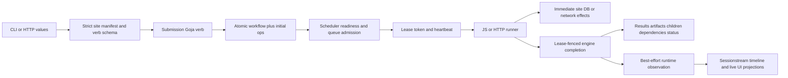

# Architecture Garden — Scraper

Scraper is a SQLite-backed durable dependency-graph workflow engine intended for DAGs and specialized by filesystem-loaded site packages. Go owns bootstrap and manifest admission, the store APIs for workflow and operation state, dependency scheduling, queue limits, leases, retries, the Goja host, generic result/artifact custody, HTTP APIs, and runtime-observation transport. JavaScript owns submission-time workflow seeding and most site-specific execution behavior, including parsing, fan-out, direct site-database writes, and declared artifacts/results. Both submission and worker runtimes also receive a writable `scraper-db` handle to engine SQLite, so admitted JavaScript can bypass the Go store APIs and their lease/atomicity checks.

Its strongest local pattern is durable dependency-graph execution behind lease-fenced **store-API** commitment. Workflow plus initial operations commit atomically; workers derive readiness and lease by queue policy; heartbeat long work; and the store completion/failure APIs accept result, artifacts, children, dependency edges, and final status only for the current unexpired lease. That fence protects engine state only when mutation crosses those APIs. Writable `scraper-db`, earlier HTTP, and site-database effects lie outside it.

> [!summary]
> - Lease-fenced durable dependency-graph execution is established for store completion/failure APIs, not arbitrary engine SQLite writes.
> - Strict manifest/schema/root admission is established; manifest `modules` is a compatibility selector, not a capability allowlist.
> - Runtime events are best-effort observations around activity; only scheduler transition events follow their corresponding store transitions.
> - External-effect idempotency, dual-database atomicity, workflow-status reconciliation, consistent snapshots, authorization, and release completeness remain open.

## Snapshot identity and evidence

| Field | Value |
|---|---|
| Repository | `/home/manuel/code/wesen/go-go-golems/scraper` |
| Remote | `git@github.com:go-go-golems/scraper` |
| Branch | `main` |
| Commit | `803a28ef4e85eb2c12eea4b2ccc8ff3dd4c2dc27` |
| Commit date | `2026-07-20T16:41:38-04:00` |
| Commit subject | `Merge pull request #9 from go-go-golems/task/benchmark-cpu-inference` |
| Worktree | Clean; committed `HEAD` only |
| Analysis scope | Bootstrap, manifests, CLI/HTTP submission, scheduler/store/runners, site DB, runtime events/UI, tests, build/release |

The repository has no `AGENTS.md` or `CLAUDE.md` at this snapshot. Evidence therefore uses runtime source and public interfaces first, tests second, then `README.md`, embedded help, `Makefile`, workflows, manifests, and release configuration. No source was changed; no live-site scrape, production Redis/metrics deployment, benchmark, or release publication was performed. Design-ticket prose is not treated as runtime proof.

Focused validation passed with `GOWORK=off go test ./pkg/engine/... ./pkg/js/runtime ./pkg/sites/... ./pkg/runtimeevents/... ./pkg/services/... ./pkg/api/... ./pkg/cmd -count=1`. `python3 .pi/skills/architecture-garden-analysis/scripts/validate_garden_entry.py "Research/Software Architecture Garden/scraper/README.md"` reported `24 wikilinks, 0 errors, 0 warnings`, and `git diff --check` passed. `cd web && npm run test:unit` could not start tests because dependencies are absent (`sh: 1: vitest: not found`, exit 127); this is an unavailable test environment, not a passing frontend result.

## Architecture and runtime path

### `js-demo seed` through durable completion

The complete path is exercised by `TestJSDemoSubmitThenWorkerRun` (`pkg/cmd/site_test.go:171-221`).

1. `cmd/scraper/main.go:11-19` calls `NewRootCommandFromBootstrap` with raw arguments. Bootstrap gathers app config, `SCRAPER_SITES_MANIFEST_DIRS`, and raw flags, then normalizes/deduplicates ordered roots (`pkg/cmd/bootstrap.go:46-53`; `pkg/cmd/app_config.go:66-77`).
2. Registry construction scans child `site.yaml` files. The loader uses `yaml.Decoder.KnownFields(true)`; validation rejects missing names/database files, root escape, duplicate or unsupported module IDs, and invalid queue policies (`pkg/sites/manifest/loader.go`; `pkg/sites/manifest/validation.go:12-52`). The manifest admits filesystem roots, discovered verbs, migrations, and queue policy. Its `modules` field is not a capability allowlist: `default-registry` is a validated compatibility no-op because default modules are implicit (`pkg/sites/manifest/modules.go:21-32`), and preconfigured database modules are added outside that list.
3. `pkg/sites/submitverbs/register.go:22-101` scans JavaScript verb declarations with `jsverbs`, treats diagnostics as fatal, and creates Glazed/Cobra commands. `sites/jsdemo/verbs/seed.js:1-27` defines fields and a `seed(ctx)` function that emits one initial `js` op and names an expected summary target.
4. CLI and HTTP converge on `submitverbs.Host.Submit` (`pkg/sites/submitverbs/host.go:63-144`; `pkg/services/submission/service.go:54-117`). A fresh submission Goja runtime invokes the captured function. The built-in seed verb uses host methods such as `ctx.emit` to collect workflow metadata and operation specs as data (`pkg/sites/submitverbs/runtime.go:70-159`; `sites/jsdemo/verbs/seed.js:1-27`). The runtime does not enforce that separation: `Host.Submit` also supplies the writable engine database as `scraper-db` (`pkg/sites/submitverbs/host.go:88-119`).
5. `scheduler.CreateWorkflow` delegates to the SQLite store. `pkg/engine/store/sqlite/workflow_store.go:14-46` inserts workflow and all initial ops in one transaction; independent ops start ready and dependent ops pending (`pkg/engine/store/sqlite/sql_helpers.go:58-108,132-137`). Successful commit is the submission linearization point. Response and observation publication occur afterward.
6. `Scheduler.RunOnce` transactionally refreshes runnable operations, lists `(site,queue)` candidates, and leases in round-robin passes up to `MaxWorkers` (`pkg/engine/scheduler/scheduler.go:223-333`). Refresh recovers expired leases, propagates required-dependency blocking, reopens repaired descendants, and promotes eligible pending work (`pkg/engine/store/sqlite/op_store.go:82-164`).
7. `TryLeaseNextOp` refills durable token-bucket state, checks active queue leases, selects the oldest ready operation, creates token/expiry, and marks it running in one engine transaction (`pkg/engine/store/sqlite/lease_store.go:15-126`). The scheduler starts runner and heartbeat contexts; heartbeat extends ownership and cancels work if ownership is lost (`pkg/engine/scheduler/scheduler.go:336-475`).
8. The JS runner resolves site definition and script, creates a fresh Goja runtime, and exposes workflow/op/lease coordinates, dependency lookup, child emission, staged records/artifacts, and preconfigured engine/site database modules (`pkg/engine/runner/js.go:31-56`; `pkg/js/runtime/executor.go:54-125,143-238`; `pkg/js/runtime/databases.go:28-45`). Scheduler wiring passes the engine handle into this runtime (`pkg/engine/scheduler/scheduler.go:369-377`). The exported `scraper-db` module permits arbitrary `query`, `exec`, and transactions (`go-go-goja@v0.8.3/modules/database/database.go:220-235,384-395`).
9. `sites/jsdemo/scripts/seed.js` emits three deterministic items plus a summary with required dependencies. Each `sites/jsdemo/scripts/build_item.js:4-40` upserts `demo_items`, stages a generic record and JSON artifact. The site's `(run_id,item_key)` primary key makes this example's row replacement retry-tolerant at that identity, but does not establish framework-wide effect idempotency.
10. `CompleteOp` verifies current unexpired lease token and, in one engine transaction, writes result JSON, artifacts, emitted children/dependencies, deletes the lease, and marks success (`pkg/engine/store/sqlite/result_store.go:15-63`). Stale and expired token tests prove rejected engine completion (`pkg/engine/store/sqlite/store_test.go:529,544`).
11. Dependency refresh admits item operations and then summary. `sites/jsdemo/scripts/summarize.js:18-88` reads dependency results/artifacts, upserts `demo_runs`, and stages summary output. The end-to-end test observes five succeeded operations and five results.
12. `refreshWorkflowStatus` derives workflow status from operation counts in a separate write (`pkg/engine/scheduler/scheduler.go:521-565`). Scheduler transition observations are emitted after their corresponding store transition and may become typed runtime events, timeline entities, and WebSocket UI events. Other observations bracket activity: runner `started` precedes execution, runner `completed` precedes durable `CompleteOp`, and request-received precedes the HTTP handler (`pkg/runtimeevents/runner.go:38-53,86-97`; `pkg/api/server/middleware_request.go:15-43`). Observer failure does not roll back engine commits.

The intended boundary lies between steps 8 and 10, but only the store API enforces it. JavaScript can use `scraper-db.exec` or a transaction to mutate engine tables directly, bypassing `CompleteOp`, lease checks, atomic child/result custody, and submission-time intent collection. An active NEREVAL script already imports `scraper-db`, currently for reads (`sites/nereval/scripts/extract_list.js:1-27`), so this is an admitted public capability rather than hypothetical scaffolding. Even without that bypass, direct site SQL and HTTP runner requests occur before lease-fenced engine acceptance and use independent resources. Lease loss after an effect but before `CompleteOp` can cause a retry that repeats the effect. No exactly-once consequence follows.

### Transport, persistence, and delivery

Engine workflow/ops/results/artifacts/dependencies/leases/rate state occupy one SQLite file. Each site projection uses a separate SQLite file and migration sequence. Runtime timeline hydration may use a third Sessionstream SQLite database. Redis is optional observation transport; `docker-compose.yml` disables Redis persistence and allows eviction, so it cannot be canonical evidence.

`RuntimeEventV1` protobuf values are routed through Sessionstream into timeline and live UI projections (`proto/scraper/runtime/v1/events.proto`; `pkg/runtimeevents/sessionstream/projections.go:15-81`). They are best-effort observations around runtime activity, not uniformly post-transition evidence. Publication failures are logged; `ProjectionErrorPolicyAdvance` may advance observation progress after projection error (`pkg/runtimeevents/sessionstream/runtime.go:57-108`). Browser code deduplicates by event ID and sorts by wall-clock time (`web/src/api/runtimeEventsApi.ts`); this is presentation ordering, not engine causal order.

The API serves engine routes and a runtime-event WebSocket, but not the frontend bundle. Release configuration packages the Go binary without site directories or Vite assets. The default registry is empty unless manifest directories are supplied. Therefore binary, site packages, and frontend are separate delivery artifacts.

## Authority and state map

| Object | Owner/admission | Identity or coordinate | Durable? | Must not be confused with |
|---|---|---|---|---|
| Site definition | Strict manifest loader/registry | `SiteName` | Filesystem source | Authorization or frozen plugin release |
| Submit verb | JS source scanned by host | Site + verb/function | Filesystem source | Workflow invocation/effect |
| Workflow run | Engine SQLite | `WorkflowID` | Yes | Runtime-event session/experiment coordinate |
| Durable step | Engine SQLite op | Globally primary-keyed `OpID` | Yes | Lease attempt; `DedupKey` is unenforced data |
| Dependency edge | Engine SQLite | `(op_id, depends_on_op_id)` | Yes | Provenance proof |
| Attempt authority | Engine SQLite lease | Op + token + worker + expiry | Transient durable | Semantic op identity |
| Generic result/artifact | Engine SQLite | Op ID / artifact label | Yes | Site projection; artifact is not content hash |
| Declared record | Result JSON `RecordWrite` | Collection + key | Yes inside result | Materialized site row |
| Site projection | Site-specific SQLite | Site schema keys | Yes | Engine canonical state/pure reducer |
| Writable engine SQL capability | Goja `scraper-db` | Runtime-scoped DB handle | Mutates engine SQLite | Lease-fenced store API or read-only query view |
| Runtime observation | Runtime wrapper/scheduler/protobuf | Event ID and session ordinal | Optional/lossy | Workflow event store/audit truth |
| Timeline entity | Sessionstream projection | Event ID and ordinals | Optional SQLite | Engine result/workflow snapshot |
| Workflow API snapshot | Engine view service | Workflow ID/update time | Response only | Database-consistent cut |

`WorkflowID`, `OpID`, lease token, `ArtifactID`, runtime-event ID, and Sessionstream ordinal are distinct. Dependency edges control admission rather than record derivation. Artifact labels can be overwritten and do not provide immutable content identity.

## Candidate common vocabulary

| Proposed term | Project-local name | Invariant | Nearby ecosystem names | Difference retained |
|---|---|---|---|---|
| **Workflow run** | `WorkflowRun` | One durable graph instance. | Job/run | Not session, experiment coordinate, or attempt. |
| **Durable step** | op/`OpSpec` | Persisted unit with dependencies, runner kind, queue, retry policy. | Job node/plan op | String kind and JSON are not a closed typed sum. |
| **Attempt fence** | `Lease.Token` | Only current unexpired token may commit engine state. | Fencing token | Does not fence network/site DB effects. |
| **Dependency admission edge** | `Dependency` | Controls readiness and blocking. | DAG edge | Not provenance or UI binding. |
| **Runner interpreter** | `Runner` | Maps durable operation intent to effects and result. | Plan interpreter | Effectful and not replay-pure. |
| **Declared result record** | `RecordWrite` | Named JSON output retained with result. | Evidence/projection update | Not automatically materialized. |
| **Site projection** | Site database tables | Query state owned by one site. | Materialized view | Not transactionally derived from canonical events. |
| **Operational observation** | `RuntimeEventV1` | Typed telemetry/UI report around engine and request activity. | Runtime event | Potentially lossy; only scheduler transition events are post-transition. |
| **Strict site-package admission** | `site.yaml` registry definition | Validated schema, filesystem roots, discovered verbs, migrations, and queue policy assemble at startup. | Module boundary | `modules` is not a capability allowlist; source is mutable and unversioned. |

## Mathematical and computer-science foundations

### 1. Dependency-graph readiness and repair closure

Let $V$ be the set of persisted operations, $\mathrm{Status}$ the operation-status set, and $\operatorname{status}:V\to\mathrm{Status}$. Let $D_{\mathrm{req}},D_{\mathrm{opt}}\subseteq V\times V$ be required and optional dependency edges, and let $\mathrm{Terminal}=\{\mathrm{Succeeded},\mathrm{Failed},\mathrm{Blocked},\mathrm{Canceled}\}$. `RefreshRunnableOps` promotes a pending operation exactly when

$$
\operatorname{Promote}(v)
\iff
\operatorname{status}(v)=\mathrm{Pending}
\land \forall(u,v)\in D_{\mathrm{req}}:\operatorname{status}(u)=\mathrm{Succeeded}
\land \forall(u,v)\in D_{\mathrm{opt}}:\operatorname{status}(u)\in\mathrm{Terminal}.
$$

Let $\mathbb{T}$ be the time domain. For $v\in V$ and $t\in\mathbb{T}$, $\operatorname{due}(v,t)$ means the operation's scheduled time has arrived, $\operatorname{queueAdmits}(v,t)$ means durable queue concurrency/rate policy admits it, and $\operatorname{unleased}(v,t)$ means no live lease owns it. Due time belongs to the later lease transition:

$$
\operatorname{Leaseable}(v,t)
\iff
\operatorname{status}(v)=\mathrm{Ready}
\land \operatorname{due}(v,t)
\land \operatorname{queueAdmits}(v,t)
\land \operatorname{unleased}(v,t).
$$

The refresh repeatedly propagates blocking to a fixed point, reopens repaired descendants, then promotes eligible work; leasing later checks due time, queue policy, and lease state (`pkg/engine/store/sqlite/op_store.go:82-164`; `pkg/engine/store/sqlite/lease_store.go:15-126`). This supports restart-safe admission and repair for a durable dependency graph intended to be acyclic. No cycle/scope validator establishes a DAG invariant; a required cycle may remain pending rather than fail with a named cycle outcome.

### 2. Lease fencing

Let $K_L$ be the lease-token set and $V_L\subseteq V$ the operations with a live lease. A lease record has type $L:V_L\to K_L\times\mathbb{T}\times\mathrm{Status}$. Its projections are $\operatorname{token}:V_L\to K_L$ and $\operatorname{expiry}:V_L\to\mathbb{T}$. For $v\in V_L$, candidate token $k\in K_L$, and $t\in\mathbb{T}$, completion is admitted exactly when

$$
\operatorname{AdmitComplete}(v,k,t)
\iff
\operatorname{status}(v)=\mathrm{Running}
\land \operatorname{token}(v)=k
\land t<\operatorname{expiry}(v).
$$

The store checks this predicate inside completion/failure transactions. An expired prior worker cannot overwrite a later accepted engine result. The token does not dominate side effects that occur before the transaction.

### 3. Retry state machine

An operation moves among `pending`, `ready`, `running`, `succeeded`, `failed`, `blocked`, and `canceled`. Let $\mathcal{R}$ be the semantic result family:

$$
\mathcal{R}
=
\mathrm{Succeeded}(\mathrm{Result})
+
\mathrm{Retryable}(\mathrm{Error},\mathrm{nextAt})
+
\mathrm{Failed}(\mathrm{Error})
+
\mathrm{LeaseLost}
+
\mathrm{Cancelled}.
$$

Concrete APIs distribute these cases across status, errors, and observations rather than one tagged result. Retry timing and attempt caps are explicit (`pkg/engine/scheduler/scheduler.go:567-627`), but cancellation and lease loss are not uniform terminal values end to end.

### 4. Atomic engine product, not global atomicity

Accepted completion transactionally updates

$$
\mathcal{C}
=
(\mathrm{result},\mathrm{artifacts},\mathrm{children},\mathrm{dependencies},\mathrm{lease},\mathrm{opStatus}).
$$

Either all of $\mathcal{C}$ commits or none does. Site projection $S$, remote-effect state $R$, telemetry $T$, and workflow-status projection $W$ are outside that transaction, so global state $(\mathcal{C},S,R,T,W)$ is not atomic.

### 5. Observable retry obligation

Let $K$ be the set of stable semantic effect/idempotency keys shared across retry attempts, $E$ the set of external effects, and $B$ an external observation boundary. For $k\in K$, let $\operatorname{effect}:K\to E$ and let $\operatorname{observe}_B$ denote the observations visible at $B$. Safe duplicate effect requires

$$
\operatorname{observe}_B(\operatorname{effect}(k));
\operatorname{observe}_B(\operatorname{effect}(k))
\equiv
\operatorname{observe}_B(\operatorname{effect}(k)).
$$

Lease tokens and attempt numbers change across retries, so they cannot serve as $k$. The framework does not enforce this law: `DedupKey` has no unique index or admission lookup, direct SQL can commit before engine acceptance, and mutating HTTP requests have no framework idempotency key.

## Correlation with the Pattern Zoos

| Scraper evidence | Zoo relation | Strength and boundary |
|---|---|---|
| Submission JS emits serializable workflow/operation intent; worker owns effects | [[Transcripts/Research/10 - PBUI-MATHS Pattern Zoo Handbook#Pattern 5 — Command as Data|PBUI 5 — Command as Data]] | **Partial.** Background work is not a UI command offer and request authorization/idempotency are absent. |
| Scheduler and registered runners interpret one operation envelope | [[Transcripts/Research/09 - RAG-MATHS Pattern Zoo#Pattern 4 — Typed Plans and Multiple Interpreters|RAG 4 — Typed Plans and Multiple Interpreters]] | **Partial.** Shared nucleus, but string kinds/JSON and no whole-plan analysis interpreter limit correspondence. |
| Explicit status, retryable error, attempt and failure observations | [[Transcripts/Research/09 - RAG-MATHS Pattern Zoo#Pattern 5 — Explicit Outcomes and Observation Algebra|RAG 5 — Explicit Outcomes and Observation Algebra]] | **Partial.** No general observation algebra or uniform cancellation/lease-loss sum exists. |
| Stale lease tests plus prior site/network effects | [[Transcripts/Research/09 - RAG-MATHS Pattern Zoo#Pattern 7: Append-Only Events, Pure Reducers, and Observable Idempotence|RAG 7 — Append-Only Events, Pure Reducers, and Observable Idempotence]] | **Negative.** The writable SQL bypass and repeatable pre-commit effects demonstrate why fence acceptance is not effect idempotence; mutable tables and lossy observations are not event sourcing. |
| Strict YAML/verb/protobuf boundaries and duplicate-rejecting registries | [[Transcripts/Research/10 - PBUI-MATHS Pattern Zoo Handbook#Pattern 8 — Serializable Semantic Contract|PBUI 8 — Serializable Semantic Contract]]; [[Transcripts/Research/10 - PBUI-MATHS Pattern Zoo Handbook#Pattern 9 — Registry and Module Boundary|PBUI 9 — Registry and Module Boundary]] | **Partial.** Several seams are bounded; operation envelopes remain generic and package versions are unpinned. |
| Transactional cancellation/retry bookkeeping but escaping effects | [[Transcripts/Research/10 - PBUI-MATHS Pattern Zoo Handbook#Pattern 14 — Transactional Interaction and Evidence|PBUI 14 — Transactional Interaction and Evidence]] | **Partial.** Store transactions are real; writable engine SQL can bypass them, and invocation identity/external evidence are not committed with engine truth. |

Dependencies are not entity-derivation-observation proofs. Runtime UI events are not PBUI mounted occurrences. Workflow or artifact IDs are not immutable release roots. Queue/site scope is resource/routing scope rather than authorization scope.

## Cross-project comparison

| Project | Shared invariant | Grade and retained difference |
|---|---|---|
| [[Research/Software Architecture Garden/sessionstream/README|sessionstream]] | One typed observation feeds timeline and live UI projections | **Strong.** Scraper reuses the substrate, while its observations bracket runtime activity and cannot rebuild workflow truth. |
| [[Research/Software Architecture Garden/rag-ttc/README|rag-ttc]] | Durable long-running work, attempts, recovery, and artifact custody | **Partial.** rag-ttc binds exact experiment/config coordinates; Scraper does not pin behavior-complete site/config inputs. |
| [[Research/Software Architecture Garden/rag-evaluation-system/README|rag-evaluation-system]] | JavaScript-authored semantic data interpreted by trusted Go hosts | **Partial.** Widget IR is presentation data; Scraper operation specs are durable work and its frontend is separately delivered. |
| [[Research/Software Architecture Garden/upwork-tracker/README|Upwork Tracker]] | Canonical SQLite state is distinct from projections/evidence | **Adjacent.** Upwork's CAS/receipt lifecycle and Scraper's lease/DAG scheduler protect different failures. |
| [[Research/Software Architecture Garden/geppetto/README|Geppetto]] | Goja runtimes and retries around external effects | **Adjacent.** Geppetto's tool effects cross a host executor, whereas Scraper exposes writable engine SQL that can bypass host store authority; both still lack framework-wide effect dedupe. |

## Pattern maturity assessment

| Pattern or law | Maturity | Evidence or limitation |
|---|---|---|
| Lease-fenced store-API commitment in durable dependency-graph execution | **Established** | Established locally through transactional readiness/lease/completion and stale-token/crash-recovery tests; writable engine SQL bypasses the fence. |
| Strict manifest/schema/root admission | **Established** | Established locally through strict loader/validation, duplicate rejection, and dynamic command tests; modules are not a capability allowlist. |
| Capability-scoped, versioned immutable site package | **Open correctness obligation** | No enforced module allowlist or package/script/config digest is bound to workflow or operation. |
| Submission intent separated from durable execution | **Emergent** | Built-in verbs use `ctx.emit`, but the submission runtime can mutate engine SQL directly. |
| Engine store physically separated from site projection | **Established** | Physical separation is established locally through distinct stores/schemas; authority separation and dual-store recovery remain open. |
| Operational observation with timeline/live projections | **Established** | Established locally through Sessionstream projection and WebSocket tests; delivery remains optional/lossy. |
| External effect before fenced commit | **Architecture debt** | SQL/network effects can escape a stale attempt. |
| Retry idempotency and enforced `DedupKey` | **Open correctness obligation** | No uniqueness/deduplication law. |
| Workflow status and snapshot consistency | **Open correctness obligation** | Separate writes/reads can expose lag or mixed cuts. |
| Authorization and release completeness | **Open correctness obligation** | Reachability is trusted; binary excludes sites/frontend. |

## Architecture debt and open laws

### Engine SQL and external effects need an authoritative fence

Lease tokens fence only store completion/failure APIs. Both Goja environments receive writable `scraper-db`, whose `exec` and transaction functions can mutate engine tables without `CompleteOp` or lease validation (`pkg/sites/submitverbs/host.go:88-119`; `pkg/engine/scheduler/scheduler.go:369-377`; `pkg/js/runtime/databases.go:28-45`; `go-go-goja@v0.8.3/modules/database/database.go:220-235,384-395`). Make this capability read-only or remove it from admitted scripts before claiming engine-state authority domination. Site SQL and network effects also escape after cancellation or before a failed/stale completion; they require stable effect keys, an outbox/inbox, or an explicit saga/reconciliation contract.

### `DedupKey` must be enforced or renamed

The field is persisted and documented as deduplication but has no unique index, lookup, or argument-binding rule. `OpID` is the actual primary key. Documentation and APIs should not present `DedupKey` as retry identity until duplicate admission has an executable law.

### Site and engine stores need reconciliation

A site row may commit while engine result fails, or accepted engine custody may coexist with incomplete projection effects. Selected upsert scripts are locally retry-tolerant, but framework-wide replay is unsafe. Separate immediate capabilities from host-controlled declared outputs, or add an outbox/reconciler.

### Workflow status must reconcile with operation truth

Completion commits before `refreshWorkflowStatus`; a crash can leave terminal operation census with workflow status `running`. A later idle cycle may not select that workflow. Terminal census and workflow status should commit together or an independent reconciliation pass must discover stale projections.

### Snapshots and mutations need revision contracts

`GetWorkflowSnapshot` reads workflow and stats separately, and list snapshots load rows in multiple reads. Retry/cancel routes have no request key or expected revision. Use a read transaction for a declared cut and expected revision/idempotency for concurrent operator mutation.

### Authorization and execution-input coherence are absent

Configurable HTTP routes have no authentication/authorization middleware. Site files are read at bootstrap and scripts again at execution, so a worker may run changed source under earlier command/manifest assumptions. Persist a manifest/script/module/config digest with each operation when reproducibility matters.

Further debt includes cooperative/delayed cancellation, `context.Background()` dependency reads, globally keyed op/artifact collision risk, uneven envelope schema versioning, non-content-addressed artifact overwrite, and `RecordWrite` naming that overstates materialization.

## Implications for composable APIs

1. Version and type built-in operation envelopes as tagged sums while preserving an explicit extension envelope.
2. Brand workflow, operation, attempt-token, artifact, runtime-event, and ordinal coordinates.
3. Return explicit succeeded, retry-scheduled, failed, canceled, and lease-lost outcomes with attempt and next time.
4. Bind operations to immutable site-package/script and effective worker-policy coordinates when reproducible replay is required.
5. Separate declared projection/HTTP intents from explicitly unsafe immediate SQL/network capabilities.
6. Add stable request identity for retryable mutating HTTP effects and revision/idempotency keys for operator routes.
7. Name observation recovery semantics and retain the distinction between transport events and durable engine truth.

## Candidate ecosystem patterns

1. **Lease-fenced durable step API** — through the store completion/failure API, only the current unexpired attempt may atomically commit engine result, child graph, artifacts, and status; writable engine SQL remains a bypass.
2. **Strict site-package admission** — strict package metadata admits filesystem roots, discovered verbs, migrations, and queue policy before runtime assembly; it does not currently scope runtime capabilities.
3. **Submission intent before durable execution** — built-in request handling can collect effect intent as data before workers interpret it, but writable engine SQL makes this shape only emergent.

The first requires independent comparison with the same stale-attempt failure before ecosystem promotion. The second requires both capability scoping and immutable package/version coordinates. The third has independent typed-intent analogies, but Scraper's submission runtime does not enforce intent-only behavior.

## Recommended next investigations

1. Test and design effect idempotency/outbox behavior under lease loss after site SQL or mutating HTTP.
2. Add workflow-status reconciliation, consistent snapshot transactions, and operation graph cycle/scope validation.
3. Pin site package/config identity and define deployable composition of binary, sites, and frontend.

## Related studies

- [[Research/Software Architecture Garden/README|Software Architecture Garden]]
- [[Research/Software Architecture Garden/sessionstream/README|sessionstream]]
- [[Research/Software Architecture Garden/geppetto/README|Geppetto]]
- [[Research/Software Architecture Garden/rag-ttc/README|rag-ttc]]
- [[Research/Software Architecture Garden/rag-evaluation-system/README|rag-evaluation-system]]
- [[Research/Software Architecture Garden/upwork-tracker/README|Upwork Tracker]]
- [[Transcripts/Research/09 - RAG-MATHS Pattern Zoo|RAG-MATHS Pattern Zoo]]
- [[Transcripts/Research/10 - PBUI-MATHS Pattern Zoo Handbook|PBUI-MATHS Pattern Zoo Handbook]]
