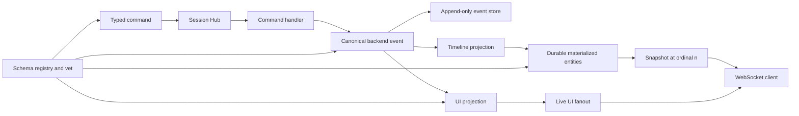

# Architecture Garden — sessionstream

`sessionstream` is a framework for session-scoped applications in which typed commands cause work, handlers publish canonical backend events, projections derive live and durable views, and reconnecting clients receive a snapshot before future live events. Pinocchio chat and CoinVault are downstream product contexts; this study concerns the reusable substrate rather than their product behavior.

This repository is a useful bridge between the [[Transcripts/Research/09 - RAG-MATHS Pattern Zoo|RAG-MATHS zoo]], the [[Transcripts/Research/10 - PBUI-MATHS Pattern Zoo Handbook|PBUI-MATHS zoo]], and several existing Garden projects. It implements concepts that those studies describe under different names: commands as data, append-only evidence, reducers, projection cursors, scoped runtimes, serializable contracts, revision fences, snapshot roots, and trusted schema boundaries. The shared vocabulary should be based on the protected invariant, not on whichever package first supplied a name.

> [!summary]
> - The central candidate ecosystem pattern is a **typed session event kernel**: command routing, canonical events, several projections, durable materializations, replay, and transport are separate contracts.
> - The mathematical center is a family of session-indexed ordered event words interpreted by stateful folds and output projections.
> - Snapshot-before-live is a **prefix-cut protocol**: a snapshot represents one event prefix and buffered live events provide the ordered suffix.
> - Protobuf schemas and schema-vet form a small trusted admission boundary around Go, Goja, JSON, persistence, and browser clients.
> - Best-effort observer delivery is a separate bounded concurrency contract; see [[Research/Software Architecture Garden/sessionstream/designs/01 - Bounded Asynchronous Observer Dispatcher|Bounded Asynchronous Observer Dispatcher]].
> - Bus, Pipeline, Transport, Error, heartbeat, and Systemlab traces share a typed transition-and-trace foundation without sharing one reliability policy; see [[Research/Software Architecture Garden/sessionstream/designs/02 - Typed Transition Systems and Trace Algebra|Typed Transition Systems and Trace Algebra]].
> - Heartbeat and chat startup share an effect-acknowledged state-machine model, but only heartbeat currently has a pure reducer and serialized supervisor; see [[Research/Software Architecture Garden/sessionstream/designs/03 - Effect-Acknowledged State Machines and Runtime Refinement|Effect-Acknowledged State Machines and Runtime Refinement]].
> - The observer is a diagnostic trace projection with a deliberately weaker bounded/lossy delivery contract; its model/interval evidence and refinement obligations are documented in [[Research/Software Architecture Garden/sessionstream/designs/04 - Observer as Diagnostic Projection and Refinement Boundary|Observer as Diagnostic Projection and Refinement Boundary]].
> - PR #15’s persistence review adds four candidate laws: [[Research/Software Architecture Garden/sessionstream/designs/05 - Volatile Admission Is Not Durable Append|volatile admission is not durable append]], [[Research/Software Architecture Garden/sessionstream/designs/06 - Admission and Shutdown Share One Linearization Boundary|admission and shutdown share one linearization boundary]], [[Research/Software Architecture Garden/sessionstream/designs/07 - Storage Equality Is a Domain Identity Contract|storage equality is a domain identity contract]], and [[Research/Software Architecture Garden/sessionstream/designs/08 - Snapshot Ordinals Require a Transactional Read Cut|snapshot ordinals require one transactional read cut]].
> - The implementation is strongest at contract separation and reconnect fencing. Per-session serialization, stable redelivery identity, exact cross-backend identity, consistent database cuts, atomic projection progress, and async lifecycle soundness remain important laws to harden.
> - The next production-refinement research project combines bounded flight recording, multi-dispatcher partition validation, and versioned seeded workload plans; see [[Research/Software Architecture Garden/sessionstream/designs/research/03 - Continuous and Reproducible Refinement Evidence - Flight Recorders Multi-Dispatcher Harvests and Seeded Schedules|Continuous and Reproducible Refinement Evidence]].

## Snapshot identity and evidence

| Field | Value |
|---|---|
| Repository | `/home/manuel/code/wesen/go-go-golems/sessionstream` |
| Remote | `git@github.com:go-go-golems/sessionstream` |
| Branch | `main` |
| Commit | `fb6b70d62915874e3d3cb9c0b1557814e638ac68` |
| Commit subject | `Merge pull request #8 from go-go-golems/task/goja-sessionstream` |
| Worktree | Clean |
| Primary implementation | `pkg/sessionstream` |

The analysis used the README, core Hub and consumer pipeline, schema and ordinal registries, SQLite hydration store, WebSocket snapshot/fanout adapter, chat example, Systemlab ordering and hydration chapters, and their focused tests. It did not audit downstream Pinocchio or CoinVault integration.

## The architecture in one diagram

The diagram contains the central separation. A handler does not return UI state. A backend event describes what happened. A UI projection decides what a connected client should observe now. A timeline projection decides what durable materialized state should exist. Hydration loads that materialization; fanout transports a live projection. These values are related, but none is an alias for another.

## Candidate common vocabulary

| Proposed ecosystem term | sessionstream name | Invariant it should mean | Nearby names elsewhere |
|---|---|---|---|
| **Scope key** | `SessionId` | Indexes one independent routing, ordering, state, cursor, and fanout domain. | PBUI runtime scope; devctl environment/run scope; tenant scope in zitadel-go-test. |
| **Intent value** | `Command` | Serializable typed request; not authority and not the effect itself. | PBUI command/action/verb; go-go-datadrop verb; rag-evaluation `ActionSpec`. |
| **Canonical event** | `Event` | Typed statement admitted to the backend event path under one scope and ordinal; it becomes durable replay evidence only when an `EventStore` is configured. | devctl journal record; Upwork application event; RAG job event. |
| **Projection** | `UIProjection`, `TimelineProjection` | Interpretation of canonical input into one view without changing the input's identity. | PBUI renderer/adapter; Upwork remote projection; devctl reconciled snapshot. |
| **Materialized entity** | `TimelineEntity` | Durable query-oriented state derived from an event prefix. | Current projection, read model, timeline row, cached view. |
| **Sequence coordinate** | `Ordinal` | Monotone per-scope position used for ordering and freshness. | Journal sequence, revision, event offset, stream ID. |
| **Prefix cut** | `SnapshotOrdinal` | Declares the greatest event coordinate represented by one coherent snapshot. | Release root, revision fence, hydration cursor, checkpoint. |
| **Projection checkpoint** | projection cursor | Greatest event prefix successfully interpreted by a named projector. | Reducer offset, materialization watermark, reconciliation cursor. |
| **Admission registry** | `SchemaRegistry` | Binds stable symbolic names to concrete transport and persistence schemas and rejects conflicts. | PBUI registry/module boundary; devctl plugin catalog; Widget adapter registry. |
| **Live suffix** | buffered and future `UIEvent` values | Ordered observations strictly newer than the snapshot cut. | Event tail, journal follow, replay suffix. |

> [!important] Vocabulary discipline
> A command is not an event. An event is not a timeline entity. A timeline entity is not a snapshot. An ordinal orders within one session but is not semantic identity. A projection checkpoint records interpreter progress; it is not automatically the same as the event-store cursor or snapshot cut.

## Mathematical and computer-science foundations

### 1. Session-indexed event words

For each session $s$, let $E_s$ be the set of admitted typed backend events. Its finite history is a word in the free monoid $E_s^*$, with concatenation and the empty history $\epsilon$.

$$
H_s = e_1 e_2 \cdots e_n \in E_s^*.
$$

This gives replay its simplest law: regrouping a sequential fold may change evaluation strategy but not the result.

$$
\operatorname{fold}(S_0,xy)
=
\operatorname{fold}(\operatorname{fold}(S_0,x),y).
$$

This is the mathematical core of [[Transcripts/Research/09 - RAG-MATHS Pattern Zoo#Pattern 7: Append-Only Events, Pure Reducers, and Observable Idempotence|RAG Pattern 7]]. It does **not** imply that events commute. Sessionstream materializations use ordered replacement and tombstones; reversing two events may change the state.

### 2. Stateful event algebras

A timeline projector is best modeled as a state transition over one event:

$$
\delta_T:S\times E\to S.
$$

A UI projector also emits an output word:

$$
\delta_U:S\times E\to S\times U^*.
$$

In the current API, both projectors read the pre-event `TimelineView`; the timeline projector returns replacement entities and the UI projector returns zero or more `UIEvent` values. They are two algebras over one typed event signature. This resembles the multiple-interpreter theme in [[Transcripts/Research/09 - RAG-MATHS Pattern Zoo#Pattern 4 — Typed Plans and Multiple Interpreters|RAG Pattern 4]], but the objects differ: a backend event records an occurrence, while a typed plan describes work still to perform.

### 3. Product decomposition and noninterference

The global state is intended to decompose by session:

$$
S = \prod_{s\in\mathrm{Sessions}} S_s.
$$

An event for session $a$ should modify $S_a$ without changing $S_b$ for $a\ne b$. Therefore operations from distinct sessions may commute because they act on disjoint components, while events within one session require a declared order. This is the foundation beneath [[Transcripts/Research/10 - PBUI-MATHS Pattern Zoo Handbook#Pattern 10 — Scoped Runtime and Context|PBUI Pattern 10]], devctl's scoped runs, and tenant isolation in [[Research/Software Architecture Garden/zitadel-go-test/README|zitadel-go-test]]. It is a state-separation law, not by itself an authorization policy.

### 4. Snapshots as cuts in the prefix order

Event histories are ordered by the prefix relation:

$$
x\preceq y \quad\text{when}\quad \exists z:\;xz=y.
$$

A snapshot at ordinal $n$ claims to materialize the prefix $e_1\ldots e_n$. Reconnect correctness requires that only the suffix strictly after that cut is delivered as live output:

$$
\operatorname{fold}(S_n,e_{n+1}\ldots e_m)=S_m.
$$

The WebSocket adapter implements this shape by registering a hydrating subscription, buffering concurrent UI batches, sending the snapshot, discarding buffered batches at or before `SnapshotOrdinal`, flushing later batches in ordinal order, and only then marking the subscription live. Focused tests exercise fanout during snapshot load, late-buffer ordering, duplicate coverage, overflow, and the transition to live delivery.

This is related to [[Transcripts/Research/09 - RAG-MATHS Pattern Zoo#Pattern 11 — Immutable Release as Synchronization Root|RAG Pattern 11]] and [[Research/Software Architecture Garden/publish-vault/README|publish-vault's atomic snapshot swap]], but it is not identical. A session snapshot is a materialized event-prefix cut; a RAG release is a behavior-complete immutable dependency root; publish-vault swaps an in-memory publication epoch.

### 5. Temporal materialization

The SQLite store keeps current entities and historical entity versions. `CreatedOrdinal`, `LastEventOrdinal`, tombstones, and `Snapshot(asOf)` give the materialization temporal semantics. Conceptually, entity lookup is indexed by both semantic key and event cut:

$$
\operatorname{entityAt}:(\mathrm{Kind},\mathrm{ID},n)\to \mathrm{Entity}\cup\{\mathrm{missing}\}.
$$

This is adjacent to [[Transcripts/Research/10 - PBUI-MATHS Pattern Zoo Handbook#Pattern 11 — Authoritative State, Resolver, and Revision|PBUI Pattern 11]]: identity, current resolution, and revision evidence remain separate.

### 6. Typed sums at trust boundaries

Commands, events, UI events, entities, and WebSocket frames are finite named alternatives carrying concrete protobuf messages. They should be understood as tagged sums rather than arbitrary JSON:

$$
\mathrm{EventPayload}
=
E_1 + E_2 + \cdots + E_k.
$$

`SchemaRegistry` binds names to concrete message descriptors; protobuf `oneof` defines transport alternatives; schema-vet rejects top-level `google.protobuf.Struct`. This supplies practical evidence for [[Transcripts/Research/10 - PBUI-MATHS Pattern Zoo Handbook#Pattern 8 — Serializable Semantic Contract|PBUI Pattern 8]], [[Transcripts/Research/10 - PBUI-MATHS Pattern Zoo Handbook#Pattern 9 — Registry and Module Boundary|PBUI Pattern 9]], and the small-validator boundary in [[Transcripts/Research/09 - RAG-MATHS Pattern Zoo#Pattern 10 — Large Producers, Small Trusted Validators / Proof-Carrying Artifacts|RAG Pattern 10]]. It is schema evidence, not proof that an event's business claim is true.

The contract is not statically closed end to end: transport payloads use `google.protobuf.Any`, event names remain strings, and `Session.Metadata` is `any`. Browser and JavaScript clients therefore need descriptor distribution, runtime unpacking, and an explicit schema-evolution policy. The generated envelope is a typed sum around a deliberately dynamic payload slot.

### 7. Streaming work as a labeled transition system

The chat example moves through started, zero or more delta, and finished or stopped events. A command starts an effectful machine whose observations unfold over time:

$$
\gamma:W\to E\times W + O,
$$

where $W$ is running work and $O$ is a terminal outcome. This coalgebraic view is useful for JavaScript APIs because it distinguishes a durable event stream from a callback, Promise settlement, or mutable UI object. Cancellation and terminal-state uniqueness become explicit safety laws.

## Correlation with the Pattern Zoos

| sessionstream evidence                                                   | Zoo relation                                                                                                               | Strength and boundary                                   |                                                                                                         |
| ------------------------------------------------------------------------ | -------------------------------------------------------------------------------------------------------------------------- | ------------------------------------------------------- | ------------------------------------------------------------------------------------------------------- |
| Typed commands routed to effect-owning handlers                          | [[Transcripts/Research/10 - PBUI-MATHS Pattern Zoo Handbook#Pattern 5 — Command as Data                                    | PBUI 5 — Command as Data]]                              | Strong for intent/effect separation; the command name alone grants no authority.                        |
| Protobuf event and transport contracts; rejection of top-level `Struct`  | [[Transcripts/Research/10 - PBUI-MATHS Pattern Zoo Handbook#Pattern 8 — Serializable Semantic Contract                     | PBUI 8 — Serializable Semantic Contract]]               | Strong.                                                                                                 |
| Schema and command registries reject duplicate names and type mismatches | [[Transcripts/Research/10 - PBUI-MATHS Pattern Zoo Handbook#Pattern 9 — Registry and Module Boundary                       | PBUI 9 — Registry and Module Boundary]]                 | Strong for deterministic admission; registry assembly is currently process-local.                       |
| Session-indexed routing, state, cursors, fanout, and hydration           | [[Transcripts/Research/10 - PBUI-MATHS Pattern Zoo Handbook#Pattern 10 — Scoped Runtime and Context                        | PBUI 10 — Scoped Runtime and Context]]                  | Strong for scope; authentication and authorization are external.                                        |
| Stable entity key plus created/last-event ordinals and `asOf` lookup     | [[Transcripts/Research/10 - PBUI-MATHS Pattern Zoo Handbook#Pattern 11 — Authoritative State, Resolver, and Revision       | PBUI 11 — Authoritative State, Resolver, and Revision]] | Strong for revisioned materialization; timeline entities are projections, not canonical domain objects. |
| Append/replay, timeline rebuild, monotone projector cursor               | [[Transcripts/Research/09 - RAG-MATHS Pattern Zoo#Pattern 7: Append-Only Events, Pure Reducers, and Observable Idempotence | RAG 7 — Append-Only Events and Reducers]]               | Strong for append and replay; observable idempotence across bus redelivery is not yet complete.         |
| UI and timeline projections over one backend event                       | [[Transcripts/Research/09 - RAG-MATHS Pattern Zoo#Pattern 4 — Typed Plans and Multiple Interpreters                        | RAG 4 — Typed Plans and Multiple Interpreters]]         | Structural analogy only: events are not plans.                                                          |
| Snapshot-before-live with an ordinal fence                               | [[Transcripts/Research/09 - RAG-MATHS Pattern Zoo#Pattern 11 — Immutable Release as Synchronization Root                   | RAG 11 — Immutable Release Root]]                       | Strong synchronization analogy, but different identity and immutability semantics.                      |
| Error kinds, error store, pipeline observer, projection policies         | [[Transcripts/Research/09 - RAG-MATHS Pattern Zoo#Pattern 5 — Explicit Outcomes and Observation Algebra                    | RAG 5 — Explicit Outcomes and Observations]]            | Partial: failures are explicit and observable, but no general observation-combine algebra is declared.  |

The RAG entity–derivation–observation pattern is deliberately not claimed. Sessionstream separates canonical events, projections, and materialized entities, but it does not define derivation objects that prove why a semantic entity exists. PBUI semantic occurrences are also distinct: a `UIEvent` is a transport observation, not a mounted visual occurrence with lifecycle identity.

## Cross-project comparison

| Project | Shared invariant | Important difference |
|---|---|---|
| [[Research/Software Architecture Garden/devctl/README|devctl]] | Ordered durable evidence, cursors, current projections, reconnect/follow, and explicit terminal records. | devctl reconciles process truth from heterogeneous artifacts; sessionstream folds typed application events. devctl also preserves raw byte streams, which sessionstream's canonical event log does not replace. |
| [[Research/Software Architecture Garden/upwork-tracker/README|Upwork Tracker]] | Immutable lifecycle evidence, rebuildable projections, revision checks, and durable replay identity. | Upwork's confirmation boundary joins eligibility, audit, and business transition; sessionstream provides substrate mechanics but not product constraints or atomic domain admission. |
| [[Research/Software Architecture Garden/publish-vault/README|publish-vault]] | Readers must observe one coherent state epoch while updates occur. | publish-vault builds then swaps an immutable in-memory snapshot; sessionstream materializes an ordered prefix and delivers a live suffix. |
| [[Research/Software Architecture Garden/rag-ttc/README|rag-ttc]] | Exact coordinates, durable custody, interruption recovery, and replay without repeating expensive work. | rag-ttc retains experiment artifacts and ordinary Go policy; sessionstream retains an event history and reconstructable views. Neither automatically supplies the other's identity contract. |
| [[Research/Software Architecture Garden/rag-evaluation-system/README|rag-evaluation-system]] | Typed semantic values cross Goja/Go/browser boundaries and trusted hosts interpret effects. | Widget IR describes presentation; sessionstream events describe backend occurrences. |
| [[Research/Software Architecture Garden/go-go-datadrop/README|go-go-datadrop]] | Visible operations are serializable data interpreted at one trusted effect seam. | DataDrop verbs are presentation affordances; sessionstream commands enter a session event machine. |
| [[Research/Software Architecture Garden/zitadel-go-test/README|zitadel-go-test]] | Scoped identities and noninterference must survive every adapter and infrastructure boundary. | sessionstream partitions by `SessionId` but deliberately leaves authentication, authorization, origin policy, and rate limiting to production wrappers. |

## Maturity assessment

| Pattern | Maturity | Evidence or limitation |
|---|---|---|
| Command → canonical event → projection separation | Candidate ecosystem pattern | Core interfaces, chat example, Goja module, and tests use the boundary. |
| Concrete protobuf schemas across runtime boundaries | Established locally | Registry validation, generated transport frames, schema-vet, and focused tests. |
| Per-session event append and replay | Established locally | SQLite event store accepts identical duplicates, rejects ordinal conflicts, and supports ordered replay. |
| Timeline rebuild from event history | Established locally | Retry-from-cursor and from-scratch rebuild tests exist; rebuild suppresses live fanout. Deterministic replay still depends on application projector behavior. |
| Deterministic projector semantics | Open correctness obligation | Projector interfaces do not prohibit clocks, randomness, mutable metadata, I/O, or other state not represented in `(event, prior view)`. |
| Snapshot-before-live hydration fence | Established locally | WebSocket tests exercise hydration races, cut filtering, overflow, and late fanout. |
| Session product decomposition | Candidate ecosystem pattern | Routing and persistence are session-indexed; cross-session noninterference deserves explicit tests. |
| Stable redelivery identity | Emergent | Idempotence is tied to `(SessionId, Ordinal)`; duplicate bus delivery can receive a new ordinal without a stable event ID. |
| Per-session serial application | Open correctness obligation | Ordinal allocation is serialized, but local projection/application occurs after the ordinal lock is released. |
| Atomic event/project/checkpoint commit | Open correctness obligation | Event append, entity apply, projection-cursor advance, and fanout are separate boundaries. Replay repairs some failures but the contract is not one transaction. Design 05 states the durable-prefix law. |
| Volatile admission separated from durable append | Candidate ecosystem pattern / open correctness obligation | PR #15 demonstrates that queue acceptance behind `EventStore.AppendEvent` weakens the source-before-projection invariant. See design 05. |
| Gate-serialized bounded-writer lifecycle | Candidate ecosystem pattern / open correctness obligation | The proposed protocol has a clean linearization law; PR #15 and its WIP provide FIFO, close-race, and lost-wake counterexamples. See design 06. |
| Storage equality preserves domain identity | Candidate ecosystem pattern / open correctness obligation | MySQL Unicode CI collation aliases exact session/entity/projector keys; migration and shared identity tests remain open. See design 07. |
| Consistent transactional snapshot cut | Candidate ecosystem pattern / open correctness obligation | SQLite and MySQL read cursor and entities separately; a transactionally coherent `(ordinal, rows)` pair remains to implement. See design 08. |
| Production authorization boundary | Intentionally external | WebSocket documentation requires authentication, authorization, origin policy, and rate limiting wrappers. |

## Laws that should guide hardening

### Per-session serializability

For one session, visible materialization should be observationally equivalent to applying events in ordinal order:

$$
\operatorname{observe}(\operatorname{concurrentApply}(H_s))
=
\operatorname{observe}(\operatorname{fold}(H_s)).
$$

`nextLocalOrdinal` serializes assignment, but `projectAndApply` runs after releasing that mutex. Two concurrent publishers can therefore receive $n$ and $n+1$ yet apply in the opposite order. A per-session sequencer, transactional compare-and-set on ordinal, or store-enforced stale-write rejection would make the law executable.

### Consistent-cut snapshots

Every returned entity must satisfy

$$
\operatorname{lastEventOrdinal}(x)\le \operatorname{snapshotOrdinal}.
$$

The SQLite implementation currently obtains the cursor and entity rows in separate operations. A read transaction should bind them to one database snapshot if concurrent application is supported.

### Stable retry identity

Duplicate delivery of one logical event should not create another accepted event:

$$
\operatorname{accept}(e);\operatorname{accept}(e)
\equiv
\operatorname{accept}(e).
$$

The store enforces this only when the duplicate retains the same ordinal and payload. Bus messages need a stable event identity or stable stream-coordinate rule so redelivery does not become a fresh ordinal.

### Atomic projection progress

A projector checkpoint at $n$ should mean that every event through $n$ has its promised materialization and no later event is claimed as part of that projector's prefix. Event append, entity apply, and cursor advancement need a transactional contract or an explicit recovery state machine. UI fanout remains a separate delivery effect and should not be confused with durable projection success.

### Deterministic replay

For a fixed initial view, session metadata, schema version, and event prefix, rebuild should produce the same timeline materialization:

$$
\operatorname{rebuild}(S_0,H)=\operatorname{liveFold}(S_0,H).
$$

The equation is intentionally direct; the burden is identifying every input hidden behind either side. Projectors should not read clocks, randomness, networks, mutable globals, or drifting metadata unless those dependencies are explicit coordinates or their observations are already canonical events.

### Snapshot-plus-suffix completeness

For a subscription cut $n$, every delivered live batch must have ordinal greater than $n$, and every accepted live batch after registration must either be represented in the snapshot, delivered exactly once in the suffix, or cause an explicit overflow/reconnect outcome. The current hydration buffer is a concrete implementation of this law.

## Implications for elegant JavaScript APIs

The theory should simplify JavaScript rather than expose category-theory vocabulary directly.

1. **Generate branded, typed values from protobuf.** `SessionId`, `EventOrdinal`, command names, event names, and entity kinds should not collapse into interchangeable strings.
2. **Expose commands as data.** A JS call such as `session.command.startInference(args)` should construct a typed intent and submit it to a host-owned interpreter; it should not serialize callbacks or hidden authority.
3. **Expose event history as an ordered `AsyncIterable`.** The API should make snapshot, suffix, terminal outcome, cancellation, and overflow distinct values rather than implicit callback conventions.
4. **Make projections pure by default.** A projector should map `(event, readView)` to declared UI events or entity updates. External effects belong in handlers or explicit effect interpreters.
5. **Provide lawful combinators.** Product composition can run independent projections over the same event; filtering must preserve ordinals; replay must use the same projector; checkpointing must occur only after successful materialization.
6. **Keep wire representations behind codecs.** `Any`, protobuf JSON strings for `uint64`, and schema names are protocol details. Generated wrappers should expose typed domain values while retaining exact round-trip behavior.
7. **Surface guarantees in names.** Prefer `snapshotThenLive`, `replayFrom`, `projectUntil`, and `subscribeAfterCut` over a generic `subscribe` whose recovery behavior must be guessed.

A useful first compositional law for two independent projectors $p$ and $q$ is product interpretation:

$$
(p\otimes q)(s,e)=(p(s,e),q(s,e)).
$$

This law justifies deriving UI, timeline, audit, metrics, and accessibility views from one canonical event without coupling their representations. It does not justify letting one projector perform hidden effects that alter another projector's input.

## Design entries

### Bounded asynchronous observer dispatcher

[[Research/Software Architecture Garden/sessionstream/designs/01 - Bounded Asynchronous Observer Dispatcher|Bounded Asynchronous Observer Dispatcher]] separates a domain observer from its callback-delivery mechanism. It specifies bounded admission, ordered asynchronous delivery, nonblocking producers, explicit drop accounting, panic isolation, admission closure, accepted-work draining, and completion waiting.

The design is relevant to Sessionstream because WebSocket `TransportObserver` delivery currently embeds queue and lifecycle state in `ws.Server`. A later cross-workspace audit found rag-ttc uses subscribed-stage observations for reconnect metrics, so the transport observer and dispatcher remain supported. Bus, Pipeline, and Error observers were removed with Systemlab. The generic mechanism remains unextracted because there is still only one retained delivery use.

### Typed transition systems and trace algebra

[[Research/Software Architecture Garden/sessionstream/designs/02 - Typed Transition Systems and Trace Algebra|Typed Transition Systems and Trace Algebra]] identifies the common mathematical structure behind canonical events, projections, heartbeat reducers, Bus/Pipeline/Transport/Error observers, bounded dispatch, and Systemlab checks. It models subsystems as typed transitions, histories as words, projections and checks as folds, observers as trace projections, and dispatchers as queue transducers with explicit loss and lifecycle laws.

The report also explains why this common structure should not become one universal event bus. It compares Kahn process networks, Reactive Streams, publish/subscribe, CloudEvents, OpenTelemetry, failure detectors, linearizability, and finite-capacity queueing. Its primary sources and specification snapshots are retained under `designs/sources/` with checksums and provenance.

### Effect-acknowledged state machines and runtime refinement

[[Research/Software Architecture Garden/sessionstream/designs/03 - Effect-Acknowledged State Machines and Runtime Refinement|Effect-Acknowledged State Machines and Runtime Refinement]] compares the implemented heartbeat reducer/supervisor with chat startup and cancellation. Both follow `State × Event → State × Action*`, but chat's lifecycle state is still distributed across handlers, an active-run map, goroutines, contexts, publication, and cleanup.

The design defines commit-before-concurrency, action completion events, lifecycle laws, generation isolation, linearization points, abstraction mappings, trace inclusion, deterministic barriers, `testing/synctest`, and state-aware runtime fuzzing. It explains how to extend correctness evidence beyond a pure kernel to the runtime machinery that interprets it.

### Observer as diagnostic projection and refinement boundary

[[Research/Software Architecture Garden/sessionstream/designs/04 - Observer as Diagnostic Projection and Refinement Boundary|Observer as Diagnostic Projection and Refinement Boundary]] documents the current WebSocket observer as a diagnostic projection rather than an authority path. It generalizes the bounded asynchronous dispatcher, records its ownership, FIFO, drop, panic, close, drain, and wait laws, and explains the model/interval trace design through labeled transition systems, free-monoid histories, linearizability, happens-before, partial orders, safety/liveness, and concrete-to-abstract refinement.

### Volatile admission is not durable append

[[Research/Software Architecture Garden/sessionstream/designs/05 - Volatile Admission Is Not Durable Append|Volatile Admission Is Not Durable Append]] extracts the PR #15 cross-store law: a durable projection checkpoint must not outrun the contiguous durable event prefix that justifies it. It separates queue acceptance from database durability and compares synchronous append, explicit buffered sinks, whole-pipeline queuing, and atomic projected-event commits.

### Admission and shutdown share one linearization boundary

[[Research/Software Architecture Garden/sessionstream/designs/06 - Admission and Shutdown Share One Linearization Boundary|Admission and Shutdown Share One Linearization Boundary]] specifies a lossless bounded writer as a linearizable concurrent object. One context-aware admission gate serializes successful command admission with close/failure transitions; one private command FIFO supplies backpressure and barriers; one worker establishes a committed-prefix law. The note distinguishes this correctness-critical protocol from design 01’s deliberately lossy diagnostic dispatcher.

### Storage equality is a domain identity contract

[[Research/Software Architecture Garden/sessionstream/designs/07 - Storage Equality Is a Domain Identity Contract|Storage Equality Is a Domain Identity Contract]] treats SQL collation, binary representation, normalization, padding, and length as implementations of the domain’s identity equivalence relation. It uses PR #15’s `utf8mb4_unicode_ci` aliasing of exact session/entity/projector keys and the corresponding Pinocchio finding as evidence for cross-backend identity contract tests and collision-audited migrations.

### Snapshot ordinals require a transactional read cut

[[Research/Software Architecture Garden/sessionstream/designs/08 - Snapshot Ordinals Require a Transactional Read Cut|Snapshot Ordinals Require a Transactional Read Cut]] develops the existing consistent-cut obligation into a concrete database pattern: `(SnapshotOrdinal, Entities)` is one object and must come from one read transaction or version-bounded reconstruction. It keeps the storage cut distinct from the already-tested WebSocket snapshot-before-live transport fence.

### Verification research: proving the dispatcher

[[Research/Software Architecture Garden/sessionstream/designs/research/01 - Proving the Bounded Asynchronous Observer Dispatcher|Proving the Bounded Asynchronous Observer Dispatcher]] attacks the observer-dispatcher contract with four formal lenses and one executable scaffold: a TLA+ concurrent model (exhaustive check plus a send-after-close counterexample for the racy variant), an Alloy temporal model (which additionally surfaces a post-exit drain violation), mechanized invariant proofs of the transition kernel in both Coq and Lean 4 (arbitrary capacity and run length, axiom-audited), and a Go verification scaffold replaying execution traces through an oracle transliterated from the proved kernel, with deterministic and turnstile tests, a 3.3M-execution fuzz campaign, and five contract-targeted mutations that are all caught. Artifacts live in `designs/research/specs/`.

### Verification research: constraining the Go executable

[[Research/Software Architecture Garden/sessionstream/designs/research/02 - Constraining the Go Binary - Layered Refinement from Proved Kernels to Executables|Constraining the Go Binary]] focuses on the refinement boundary the first study exposes. It proposes a proved deterministic kernel, a thin Go concurrency shell, versioned model events checked with a PGo/TraceLink-style constrained TLC validator, Gobra verification of mutex/channel ownership, optional Goose/Perennial proofs, Gomela/SPIN protocol exploration, deterministic `testing/synctest` shell tests, Go memory-model reasoning, and correlated `runtime/trace` diagnostics. Its `designs/research/sources/` archive retains 15 Defuddle snapshots and 12 primary papers/theses with provenance and SHA-256 checksums.

## Candidate ecosystem patterns

The comparison suggests six vocabulary entries worth developing across projects:

1. **Typed Intent, Host-Owned Effect** — commands and verbs are serializable values; current authority is checked by the interpreter.
2. **Canonical Event, Multiple Projections** — record one admitted occurrence and derive several purpose-specific views.
3. **Scope-Indexed Ordered State** — each explicit scope owns its ordering, cursors, materialization, and fanout.
4. **Snapshot Cut plus Live Suffix** — reconnect begins from a coherent prefix and continues with only newer observations.
5. **Durable Evidence plus Rebuildable Projection** — canonical history survives while read models may be discarded and regenerated.
6. **Small Schema Admission Kernel** — open producers submit typed values through a deterministic registry and bounded validator.
7. **Durable Prefix Before Projection Progress** — derived checkpoints never outrun the contiguous durable source history that justifies them.
8. **Gate-Serialized Admission and Shutdown** — accepted bounded work and lifecycle transition share one linearization boundary.
9. **Storage Equality as Identity Contract** — every persistence adapter preserves the domain’s equivalence relation and declared length constraints.
10. **Transactional Snapshot Cut** — a declared revision and represented rows come from one coherent database snapshot.

These names should remain candidates until compared with consumers and additional repositories. The goal is not to make all systems event-sourced. It is to let RAG experiments, semantic UIs, local operators, assistants, and workflow tools share precise laws where they genuinely solve the same problem.

## Recommended next investigations

1. Implement and validate designs 05–08: durable source/projection custody, gate-serialized writer lifecycle, exact storage identity, and transactional snapshot cuts.
2. Compare the Goja module and generated TypeScript declarations against the typed-intent and snapshot-suffix vocabulary above.
3. Audit Pinocchio and CoinVault as independent consumers: which framework laws do they rely on, bypass, or duplicate?
4. Compare sessionstream journals directly with devctl run journals and Upwork proposal evidence without flattening raw logs, canonical events, and business evidence into one object.
5. Prototype small JS projection combinators and test identity, associativity of product composition, replay equivalence, and cancellation/terminal-state laws.
6. Decide whether the common vocabulary belongs in a dedicated Garden glossary after at least one more independent project confirms each candidate.

## Related studies

- [[Research/Software Architecture Garden/sessionstream/Index of Design Patterns|Index of Design Patterns]] — back-of-the-book index of this study's patterns and vocabulary, with a companion [[Research/Software Architecture Garden/sessionstream/Index of Design Patterns - Rationale|rationale]]
- [[Research/Software Architecture Garden/README|Software Architecture Garden]]
- [[Transcripts/Research/09 - RAG-MATHS Pattern Zoo|RAG-MATHS Pattern Zoo]]
- [[Transcripts/Research/10 - PBUI-MATHS Pattern Zoo Handbook|PBUI-MATHS Pattern Zoo Handbook]]
- [[Research/Software Architecture Garden/devctl/README|devctl architecture study]]
- [[Research/Software Architecture Garden/upwork-tracker/README|Upwork Tracker architecture study]]
- [[Research/Software Architecture Garden/publish-vault/README|publish-vault architecture study]]
- [[Research/Software Architecture Garden/rag-ttc/README|rag-ttc architecture study]]
- [[Research/Software Architecture Garden/rag-evaluation-system/README|rag-evaluation-system architecture study]]
- [[Research/Software Architecture Garden/go-go-datadrop/README|go-go-datadrop architecture study]]
- [[Research/Software Architecture Garden/zitadel-go-test/README|zitadel-go-test architecture study]]
- [[Research/Software Architecture Garden/sessionstream/designs/01 - Bounded Asynchronous Observer Dispatcher|Bounded Asynchronous Observer Dispatcher design]]
- [[Research/Software Architecture Garden/sessionstream/designs/02 - Typed Transition Systems and Trace Algebra|Typed Transition Systems and Trace Algebra design]]
- [[Research/Software Architecture Garden/sessionstream/designs/03 - Effect-Acknowledged State Machines and Runtime Refinement|Effect-Acknowledged State Machines and Runtime Refinement design]]
- [[Research/Software Architecture Garden/sessionstream/designs/04 - Observer as Diagnostic Projection and Refinement Boundary|Observer as Diagnostic Projection and Refinement Boundary design]]
- [[Research/Software Architecture Garden/sessionstream/designs/05 - Volatile Admission Is Not Durable Append|Volatile Admission Is Not Durable Append]]
- [[Research/Software Architecture Garden/sessionstream/designs/06 - Admission and Shutdown Share One Linearization Boundary|Admission and Shutdown Share One Linearization Boundary]]
- [[Research/Software Architecture Garden/sessionstream/designs/07 - Storage Equality Is a Domain Identity Contract|Storage Equality Is a Domain Identity Contract]]
- [[Research/Software Architecture Garden/sessionstream/designs/08 - Snapshot Ordinals Require a Transactional Read Cut|Snapshot Ordinals Require a Transactional Read Cut]]
