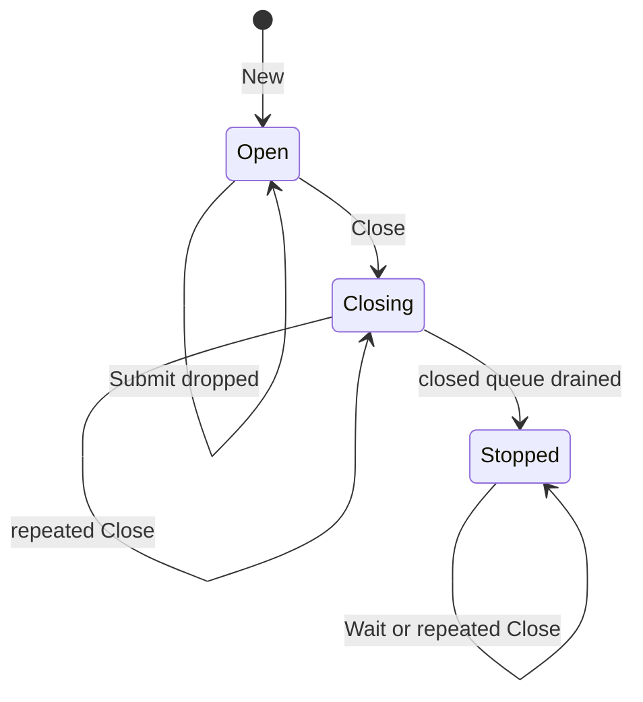

# Bounded Asynchronous Observer Dispatcher

This design records a reusable pattern for diagnostic callback delivery. Producers submit immutable observations without waiting for callback execution. A bounded single-worker dispatcher preserves admission order, rejects overflow explicitly, isolates callback panic, closes admission safely, drains accepted work, and exposes a completion boundary.

The pattern arose in Sessionstream's WebSocket `TransportObserver`. Its mechanics are general, but its applicability is narrow: it is correct only when diagnostics may be dropped, producer progress has priority over observation completeness, one ordered callback worker is sufficient, and accepted work should drain during graceful shutdown.

> [!summary]
> - The observer defines domain records and callback meaning; the dispatcher defines delivery mechanics and lifecycle.
> - The core contract combines bounded admission, FIFO asynchronous delivery, nonblocking producers, drop accounting, panic isolation, admission closure, draining, and completion waiting.
> - One buffered channel, one mutex, one closing flag, one counter, and one WaitGroup can implement the generic mechanism.
> - Protocol, persistence, authorization, heartbeat, and request queues must not reuse this pattern when dropping is invalid.
> - If the sole demonstrated consumer is removed, deletion is preferable to preserving or generalizing unused infrastructure.

## Problem statement

A direct observer call is synchronous:

```go
observer.Observe(ctx, record)
```

That call makes callback latency, cancellation, and panic part of the producer's execution. Diagnostic extension code can delay or fail the system it observes.

Moving delivery to a goroutine removes direct callback latency but creates new obligations:

```text
How much work may wait?
What happens when full?
What order is preserved?
Who owns retained values?
Can a callback panic terminate delivery?
What happens during concurrent close and submit?
Are accepted items drained?
How does shutdown know delivery ended?
```

The dispatcher pattern is the smallest unit that answers those questions under one explicit policy.

## Pattern boundary

The pattern consists of two contracts.

### Domain observer

The observer defines a typed callback:

```go
type Observer[T any] interface {
    Observe(context.Context, T)
}
```

A concrete observer API may use domain names:

```go
type TransportObserver interface {
    OnTransport(context.Context, TransportRecord)
}
```

The domain layer owns:

- record schema;
- stage semantics;
- data cloning;
- context lifetime policy;
- filtering and rendering;
- compatibility commitments.

### Delivery dispatcher

The dispatcher accepts prepared values:

```go
type Dispatcher[T any] struct { ... }

func New[T any](capacity int, deliver func(T)) (*Dispatcher[T], error)
func (d *Dispatcher[T]) TrySubmit(T) bool
func (d *Dispatcher[T]) Close()
func (d *Dispatcher[T]) Wait()
func (d *Dispatcher[T]) Dropped() uint64
```

The delivery layer owns:

- bounded storage;
- admission serialization;
- FIFO callback execution;
- overflow rejection;
- panic recovery;
- close/drain lifecycle;
- worker completion.

It does not know context, protobuf, WebSocket, session, or transport semantics.

## Behavioral contract

Let `Submit(x)` attempt to admit `x`, and let `Close` terminate admission.

```text
D1. Queue length never exceeds Capacity.
D2. Submit never waits for queue space or callback completion.
D3. Accepted values are delivered in admission order.
D4. Capacity rejection increments a monotone drop counter.
D5. One callback panic does not terminate later delivery.
D6. Close is idempotent and serializes against Submit.
D7. Submit after Close returns false without panic.
D8. Every accepted value is offered to the callback before worker exit.
D9. Wait returns only after the worker exits.
D10. One dispatcher has exactly one callback worker.
```

The word “offered” is deliberate. A callback may panic after partial side effects. The dispatcher guarantees invocation and continued worker progress, not transactional observer behavior.

## State machine



The implementation may represent only `closing bool` and worker completion. The conceptual states remain useful for invariants.

### State invariants

```text
I1. Open implies the queue is not closed.
I2. Closing implies future submissions cannot send.
I3. Stopped implies admission has closed.
I4. Queue close occurs exactly once.
I5. Every successful send linearizes before queue close.
I6. Every delivered item was previously accepted.
I7. Worker exit occurs only after closed-queue drain.
I8. Dropped never decreases.
```

## Reference Go implementation

```go
package asyncdispatch

import (
    "fmt"
    "sync"
)

type Dispatcher[T any] struct {
    deliver func(T)
    queue   chan T

    mu      sync.Mutex
    closing bool
    dropped uint64

    wg sync.WaitGroup
}

func New[T any](capacity int, deliver func(T)) (*Dispatcher[T], error) {
    if capacity <= 0 {
        return nil, fmt.Errorf("dispatcher capacity must be positive")
    }
    if deliver == nil {
        return nil, fmt.Errorf("dispatcher delivery function is nil")
    }

    d := &Dispatcher[T]{
        deliver: deliver,
        queue:   make(chan T, capacity),
    }
    d.wg.Add(1)
    go d.run()
    return d, nil
}

func (d *Dispatcher[T]) TrySubmit(item T) bool {
    if d == nil {
        return false
    }

    d.mu.Lock()
    defer d.mu.Unlock()

    if d.closing {
        return false
    }

    select {
    case d.queue <- item:
        return true
    default:
        d.dropped++
        return false
    }
}

func (d *Dispatcher[T]) Close() {
    if d == nil {
        return
    }

    d.mu.Lock()
    defer d.mu.Unlock()

    if d.closing {
        return
    }
    d.closing = true
    close(d.queue)
}

func (d *Dispatcher[T]) Wait() {
    if d != nil {
        d.wg.Wait()
    }
}

func (d *Dispatcher[T]) Dropped() uint64 {
    if d == nil {
        return 0
    }
    d.mu.Lock()
    defer d.mu.Unlock()
    return d.dropped
}

func (d *Dispatcher[T]) run() {
    defer d.wg.Done()
    for item := range d.queue {
        func() {
            defer func() { _ = recover() }()
            d.deliver(item)
        }()
    }
}
```

## Why one channel is sufficient

A buffered channel implements both bounded FIFO storage and graceful-close notification.

```text
open channel with capacity N
    -> accept at most N queued values
close channel
    -> reject future sends through dispatcher state
    -> receive buffered values
    -> range terminates after drain
```

Separate `stop` and `stopped` channels are unnecessary when the only shutdown mode is close-admission-and-drain. A WaitGroup represents worker completion. A mutex-protected closing flag makes close idempotent and prevents send-after-close.

A distinct stop signal remains appropriate when the API supports both:

```text
graceful close: drain
abort: discard and exit
```

That is not the contract described here.

## Bounded admission

Bounded storage protects the observed process from diagnostic memory growth. The capacity is a resource policy and belongs in configuration or a named internal constant.

The queue contains at most `N` waiting values. One value may also be executing:

```text
retained work <= N queued + 1 active
```

Capacity planning must consider deep item size. A typed record containing cloned protobufs or slices may retain substantially more memory than its shallow struct size.

## Ordered asynchronous delivery

One worker preserves admission order. If concurrent producers submit values, mutex acquisition order defines admission order. The dispatcher does not promise timestamp, network, session-ordinal, or causal order unless those orders already determine admission.

Multiple workers would change the contract. They permit overlapping callbacks and completion reordering. Parallelism requires an explicit weaker order or partitioning key.

## Nonblocking producers

The send operation uses `select/default`, so a full queue rejects immediately. Producers may wait briefly for the admission mutex, but never for queue space or callback completion.

```go
select {
case queue <- item:
    return true
default:
    dropped++
    return false
}
```

The boolean result is important. Callers may deliberately ignore it, but the API must not imply guaranteed delivery.

## Drop accounting

Every overflow rejection increments `Dropped`. This distinguishes a trace with no relevant record from a trace known to be incomplete.

The base pattern does not count submissions rejected after close as capacity drops. They are lifecycle rejections. A richer metrics API may separate:

```text
accepted
delivered
overflow dropped
closed rejected
callback panics
high-water mark
```

Add those counters only when a consumer needs them.

## Panic isolation

Recovery is scoped around each callback invocation. Recovering only at worker exit would let one panic terminate future delivery.

The pattern does not undo callback side effects, cancel blocked callbacks, or record panic automatically. An optional panic-report function can be added, but it must have an independent failure policy.

## Close admission

`Submit` and `Close` hold the same mutex. Therefore either submission sends before close, or it observes `closing` afterward and returns false. There is no execution in which a sender uses a closed channel.

The close linearization point is the state change and channel close inside the critical section.

## Drain accepted work

Ranging over the closed queue drains buffered values before exit. The worker does not need a second drain loop.

A bounded queue does not imply bounded close latency. One callback can block indefinitely. The owner may bound its wait with a context, but Go cannot terminate arbitrary callback code safely.

## Wait for completion

`Wait` joins the delivery worker. It is separate from `Close` so an owner can initiate shutdown and compose waiting with a larger lifecycle.

If the dispatcher itself needs `WaitContext`, a completion channel may be preferable to a WaitGroup:

```go
select {
case <-done:
    return nil
case <-ctx.Done():
    return ctx.Err()
}
```

The core pattern allows either completion representation. It does not require both.

## Ownership transfer

Asynchronous admission transfers value ownership to the dispatcher. The submitted value must be immutable or independently owned after `TrySubmit` returns true.

For Sessionstream transport records, preparation includes:

```go
item := transportObservation{
    ctx: context.WithoutCancel(normalizeContext(ctx)),
    rec: cloneTransportRecord(rec),
}
```

Context detachment preserves values while removing producer cancellation and deadlines. Deep cloning protects slices and protobuf payloads from later producer mutation.

These are adapter policies, not generic dispatcher behavior.

## Sessionstream correlation

Sessionstream currently embeds observer delivery state inside `ws.Server`:

```text
observer mutex
record queue
stop channel
stopped channel
closing flag
dropped counter
stop Once
```

The current implementation satisfies the intended behavior. A concrete `observerDispatcher` extraction could simplify `Server`. A generic dispatcher could simplify that concrete unit further.

The initial repository-only audit found only Systemlab, but the later cross-workspace audit found rag-ttc uses subscribed-stage observations for reconnect metrics. `TransportObserver` and its dispatcher therefore remain. Bus, Pipeline, and Error observers were removed with Systemlab. There is still only one retained dispatcher use, so generic extraction remains premature.

## Relation to other Sessionstream observers

Sessionstream also has:

- `PipelineObserver`;
- `BusObserver`;
- `ErrorObserver`.

Their callback semantics must be audited before reuse. [[Research/Software Architecture Garden/sessionstream/designs/02 - Typed Transition Systems and Trace Algebra|Typed Transition Systems and Trace Algebra]] models all four as typed projections of execution traces and explains why that common structure does not imply a common reliability policy. A generic type is mechanically applicable only if each observer accepts:

```text
bounded best-effort loss
one ordered worker
nonblocking producers
drain-on-close
no retry
no persistence
```

Changing a synchronous observer to asynchronous delivery is an API behavior change even if method signatures remain the same.

## Invalid applications

Do not use this dispatcher for work whose loss changes correctness:

- heartbeat pong events;
- outbound WebSocket frames;
- ordered client requests;
- canonical event persistence;
- projection materialization;
- authorization decisions;
- shutdown commands.

Those systems require blocking, explicit error propagation, connection failure, retry, persistence, or other domain-specific policy.

## Testing obligations

### Deterministic tests

1. Accepted values are delivered in order.
2. Full queue rejects and increments drops.
3. Closing drains accepted values.
4. Submission after close returns false.
5. Repeated close is harmless.
6. One panic does not prevent later delivery.
7. Wait blocks while a callback is blocked.
8. Wait returns after release and drain.
9. Final queue slot is delivered.

### Concurrency tests

Run many producers concurrently with close under `-race` and assert:

```text
no panic
no race
accepted count == delivered count after Wait
post-close accepted count == 0
```

### Adapter tests

Domain adapters separately test:

- deep cloning;
- context detachment;
- record mapping;
- callback filtering;
- owner shutdown integration.

## Decision record: Generic mechanism, delayed abstraction

- **Context:** The delivery mechanics are general, and rag-ttc is now a demonstrated non-test consumer of Transport observation, but no second retained dispatcher use exists.
- **Options considered:** Keep mechanics embedded; extract a transport-specific dispatcher; create a generic internal dispatcher immediately; replace the observer with a narrower callback.
- **Decision:** Retain the concrete transport dispatcher and preserve this Garden design. Do not implement a generic package until a second matching consumer justifies the abstraction.
- **Rationale:** One valid consumer justifies behavior, not generalization. The existing implementation is tested and matches rag-ttc's best-effort diagnostic use.
- **Consequences:** Dispatcher state remains embedded in `ws.Server`. A later extraction has explicit contracts and tests if another use appears.
- **Status:** accepted

## Decision record: One buffered channel

- **Context:** The current transport dispatcher uses queue, stop, and stopped channels.
- **Options considered:** Three channels; queue plus WaitGroup; custom ring buffer plus condition variable; third-party queue.
- **Decision:** Use one buffered queue channel plus mutex and WaitGroup when implementing the generic contract.
- **Rationale:** Queue closure expresses admission closure and drain. The mutex prevents send-after-close. The WaitGroup joins the worker.
- **Consequences:** The abstraction supports graceful drain only, not immediate abort. Add a separate signal only if abort becomes a real requirement.
- **Status:** proposed until implementation

## Working rules

- Define observer delivery guarantees independently from callback types.
- Make drop policy explicit in API names and metrics.
- Transfer immutable ownership before asynchronous submission.
- Serialize close and submit before closing a queue.
- Recover panic per callback.
- Keep callback execution outside producer and lifecycle locks.
- Use one worker when order is promised.
- Do not claim bounded shutdown without callback latency bounds.
- Do not reuse best-effort diagnostics infrastructure for correctness-critical work.
- Delete unsupported observer infrastructure rather than generalizing it.

## References

- `pkg/sessionstream/transport/ws/observer.go`
- `pkg/sessionstream/transport/ws/server.go`
- `pkg/sessionstream/transport/ws/server_test.go`
- `cmd/sessionstream-systemlab/ws_observer.go`
- `pkg/sessionstream/pipeline_observer.go`
- `pkg/sessionstream/bus.go`
- `pkg/sessionstream/hub.go`
- `ttmp/2026/05/06/SS-OBSERVERS--add-hub-and-websocket-observers-for-sessionstream-diagnostics/design-doc/01-observer-implementation-guide.md`
- [[Research/Software Architecture Garden/sessionstream/designs/02 - Typed Transition Systems and Trace Algebra|Typed Transition Systems and Trace Algebra]]
- [[Research/Software Architecture Garden/sessionstream/designs/03 - Effect-Acknowledged State Machines and Runtime Refinement|Effect-Acknowledged State Machines and Runtime Refinement]]
