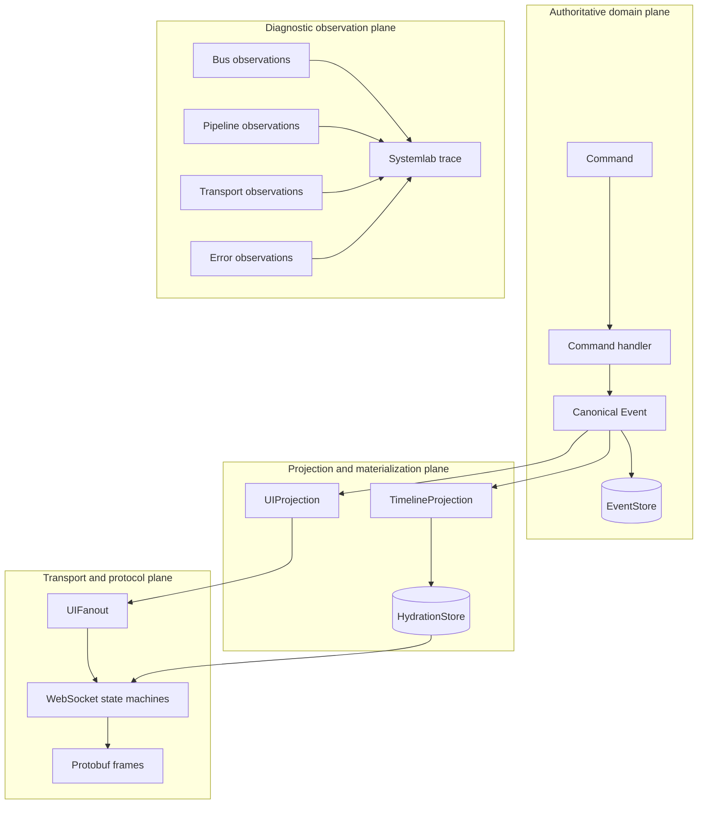

# Typed Transition Systems and Trace Algebra

Sessionstream contains commands, canonical events, projections, Watermill messages, WebSocket frames, heartbeat inputs and actions, four observer APIs, and Systemlab teaching traces. These values all describe occurrences or transitions, but they do not have the same reliability, ordering, ownership, or lifecycle contract. Treating them as instances of one undifferentiated event bus would erase the distinctions on which correctness depends.

There is nevertheless a common foundation. Each Sessionstream subsystem can be described as a typed transition system. It receives an input, changes state, and emits an ordered finite sequence of actions or observations. Histories are ordered words. Projections and checks are folds over those words. Observers are trace projections. Dispatchers are queue transducers that apply a declared delivery policy. Composition is wiring between typed outputs and inputs, not conversion into one universal record.

This report develops that model and applies it directly to `BusObserver`, `PipelineObserver`, `TransportObserver`, `ErrorObserver`, the WebSocket heartbeat reducer, the Sessionstream event pipeline, and Systemlab. Its principal recommendation is deletion-first: preserve the mathematical contracts, remove observer infrastructure without an independent consumer, and extract a generic runtime mechanism only when at least two retained consumers require the same semantics.

> [!summary]
> - The common center is a **typed transition-and-trace model**, not one generic event bus.
> - Canonical events, transport messages, diagnostic observations, and effects occupy different semantic planes even when all are represented as Go structs.
> - Event histories form ordered words; state reconstruction and Systemlab checks are folds; observers are order-preserving trace projections.
> - The bounded dispatcher is a finite lossy queue transducer whose output, after graceful drain, is exactly the accepted subsequence of attempted submissions.
> - Lamport order, event ordinals, writer order, and dispatcher admission order are distinct relations. No timestamp or global callback sequence should silently replace them.
> - Reactive Streams, Kahn process networks, CloudEvents, and OpenTelemetry solve adjacent problems. None is a drop-in universal kernel for Sessionstream.
> - Sessionstream can simplify by keeping pure reducers and explicit durable event contracts, deleting unused observer APIs, and using standard telemetry adapters where operational diagnostics are still required.

## 1. The direct answer

### Is there a common system at the heart of Bus, Pipeline, Transport, and Error observation?

At the level of semantics, yes. Each observer consumes a typed projection of an internal execution trace:

```text
internal transition
    -> construct a domain record
    -> transfer safe ownership
    -> apply a delivery policy
    -> invoke a diagnostic consumer
```

At the level of production runtime policy, no. The current observers differ materially:

| Observer | Observed occurrence | Current invocation | Failure and pressure policy |
|---|---|---|---|
| `BusObserver` | Watermill publication or consumption | Synchronous on publisher/consumer paths | No local panic recovery; no queue; no drop metric |
| `PipelineObserver` | One aggregate Hub projection/application attempt | Synchronous at function return through `defer` | Cloned record and panic recovery; no queue |
| `TransportObserver` | Fine-grained WebSocket and heartbeat stage | Ordered asynchronous worker | Bounded queue, overflow drop count, panic recovery, close/drain/wait |
| `ErrorObserver` | Runtime error occurrence | Synchronous after optional durable error recording | Cloned record and panic recovery; no queue |

A common Go interface can hide these differences, but it cannot make them disappear. If the same dispatcher were placed behind every observer, it would change when callbacks run, what contexts mean, whether records may be lost, how shutdown behaves, and what tests may assume.

### What is the useful mathematical commonality?

Three constructions account for most of the system:

1. **Transition:**

   $$
   \delta:S\times I\to S\times A^*
   $$

   One state and one input produce a new state and an ordered finite word of actions.

2. **Fold:**

   $$
   \operatorname{fold}_\delta:S\times I^*\to S
   $$

   Repeatedly applying transitions reconstructs state from an ordered input history.

3. **Trace projection:**

   $$
   \pi:T^*\to O^*
   $$

   An observer selects or transforms internal transitions into a diagnostic trace while preserving the order it is given.

The dispatcher is then a separate transition system over a bounded queue. It does not define observation meaning. It decides which prepared observations are accepted and when callbacks are invoked.

### The practical conclusion

The repository does not need a new universal event framework. It needs a small set of explicit laws:

```text
Reducers own state transitions.
Canonical stores own durable history.
Adapters own representation changes.
Observers own diagnostic meaning.
Dispatchers own callback delivery policy.
Lifecycle owners close and join their workers.
```

These laws can simplify Sessionstream even if no new generic package is created.

## 2. Vocabulary: five values that must remain distinct

The word “event” is used broadly in software. Sessionstream needs narrower terms because several values can refer to one occurrence.

| Term | Definition | Sessionstream examples |
|---|---|---|
| **Occurrence** | Something that happens during execution. It is not itself a Go value. | A Watermill message is acknowledged; a snapshot finishes loading; a ping reaches its deadline. |
| **Canonical event** | A typed domain statement admitted to replayable application history. | `sessionstream.Event`. |
| **Message** | A transport representation sent between components. | Watermill `message.Message`; protobuf JSON `ClientFrame` or `ServerFrame`. |
| **Action** | An effect request emitted by a pure transition function for a runtime adapter to interpret. | `heartbeat.ActionSendPing`, `ActionArmDeadline`, `ActionCloseConnection`. |
| **Observation** | A diagnostic record derived from an occurrence or transition. It must not become the authority for product state. | `BusRecord`, `PipelineRecord`, `TransportRecord`, `ErrorRecord`, Systemlab `traceEntry`. |

CloudEvents makes a similar distinction between an occurrence, an event data record expressing that occurrence and its context, and a message that transports the event. That distinction is useful here. Adopting the full CloudEvents envelope for in-process callbacks is not required.

The distinction prevents several invalid substitutions:

```text
A TransportRecord is not proof that a browser applied a frame.
A queued ServerFrame is not a canonical backend Event.
A PipelineRecord is not a replay log.
A Systemlab traceEntry is not product state.
An ErrorObserver callback is not necessarily durable error custody.
A heartbeat timeout observation is not proof of process failure.
```

## 3. Current Sessionstream as several typed planes

Sessionstream already contains a coherent decomposition, although the observer APIs cut across it.



### 3.1 Authoritative domain plane

`pkg/sessionstream/types.go` defines `Command` and canonical `Event`. A `CommandHandler` in `handler.go` receives a command, session, and `EventPublisher`. The handler publishes what happened rather than returning final UI state.

When an `EventStore` is configured, `projectAndApply` appends the canonical event before materializing timeline state. `RebuildTimeline` later reads ordered events and re-executes timeline projection. This is the repository's event-sourcing boundary.

This plane cannot use a best-effort dispatcher. Dropping one canonical event changes replay, materialization, and product behavior.

### 3.2 Projection and materialization plane

`UIProjection` and `TimelineProjection` interpret one canonical event against the current session and `TimelineView`:

```go
type UIProjection interface {
    Project(context.Context, Event, *Session, TimelineView) ([]UIEvent, error)
}

type TimelineProjection interface {
    Project(context.Context, Event, *Session, TimelineView) ([]TimelineEntity, error)
}
```

The UI projection emits transient output. The timeline projection emits durable entity replacements. They share an input but not an output contract. Their errors are governed by independent projection policies.

### 3.3 Transport and protocol plane

The WebSocket server owns connection state, subscriptions, snapshot-before-live hydration, one reader, one writer, request serialization, outbound queue bounds, and the heartbeat supervisor. Its protobuf frames are messages, not canonical events.

The pure heartbeat machine makes the transition-system structure explicit:

```go
func (m *Machine) Step(event heartbeat.Event) ([]heartbeat.Action, error)
```

Its state contains phase, generation, nonce, write time, deadline, and pending-pong time. Its actions request scheduling, writes, deadline changes, records, connection close, or stop. Timers, sockets, goroutines, and observers remain in the adapter.

### 3.4 Diagnostic plane

The four observer APIs expose selected execution evidence. Their records are projections of the other planes. Systemlab adapts those records into human-oriented `traceEntry` values:

```go
type traceEntry struct {
    Step    int
    Kind    string
    Message string
    Details map[string]any
}
```

The diagnostic plane may help prove or explain behavior, but it must not become a hidden prerequisite for the behavior it observes.

## 4. Transition systems: the smallest common semantic unit

A labeled transition system consists of states, labels, and a transition relation. A deterministic reducer can use a function:

$$
\delta:S\times I\to S.
$$

A system that requests effects as it transitions has the more useful form:

$$
\delta:S\times I\to S\times A^*.
$$

Here:

- $S$ is internal state;
- $I$ is a typed input alphabet;
- $A$ is a typed action alphabet;
- $A^*$ is an ordered finite sequence of requested actions.

The action sequence is important. A transition may require `CancelDeadline` before `RecordPong`, or `RecordSuspected` before `CloseConnection`. Returning a set would discard order. Returning one action would force incidental runtime calls back into the reducer.

### 4.1 Heartbeat as the concrete reference

The heartbeat reducer already has the desired separation:

$$
\delta_H:H\times I_H\to H\times A_H^*+\mathrm{Error}.
$$

Examples:

```text
(Idle, Tick)
    -> (Writing, [SendPing])

(Writing, matching PingWritten)
    -> (Awaiting, [ArmDeadline])

(Awaiting, timely matching PongReceived)
    -> (Idle, [CancelDeadline, RecordPong, ScheduleTick])

(Awaiting, DeadlineElapsed at or after deadline)
    -> (Suspected, [RecordSuspected, CloseConnection])
```

This model is easy to test because time is input data and effects are output data.

### 4.2 Hub processing as a less-pure transducer

`Hub.projectAndApply` has the same conceptual shape but currently interprets effects immediately:

```text
input Event
  -> append event
  -> load session and view
  -> run two projections
  -> apply timeline entities
  -> advance cursor
  -> fan out UI events
  -> emit errors and one aggregate PipelineRecord
```

A fully pure formulation could return an action plan, but doing so would introduce transaction and effect-interpreter infrastructure. The mathematical model is useful without requiring that refactor. It identifies which operations are state transitions and which are external effects, allowing tests and documentation to state the intended laws.

### 4.3 I/O automata and subsystem composition

Lynch and Tuttle's I/O-automaton perspective is relevant because Sessionstream is a composition of smaller machines:

- the Hub accepts commands and events;
- the store accepts append/apply/cursor operations;
- each WebSocket connection accepts frames and timer results;
- the heartbeat reducer accepts timed lifecycle events;
- the writer accepts outbound frames;
- the observer dispatcher accepts diagnostic records.

One subsystem's output action becomes another subsystem's input. Correctness can be reviewed at two levels:

1. Prove or test each component against its local transition contract.
2. Verify that the runtime wiring refines the high-level contract.

The heartbeat arbitration bug found during PR review was a refinement bug: the pure reducer handled admitted events correctly, but runtime selection among already-admitted channels could present a deadline before a timely pong. The shared arbitration helper restored the intended refinement.

## 5. Traces as words and folds

Let $A$ be a typed alphabet. The set $A^*$ contains every finite sequence over $A$, including the empty sequence $\epsilon$. With concatenation $\cdot$, it is the free monoid generated by $A$:

$$
(A^*,\cdot,\epsilon).
$$

This is not an abstract decoration. It captures the concrete shape of Sessionstream histories:

```text
[e1, e2, e3] ++ [e4, e5]
```

### 5.1 Reducers define actions of event words on state

A one-event reducer extends to a fold over a word:

$$
\operatorname{fold}_\delta(s,\epsilon)=s
$$

$$
\operatorname{fold}_\delta(s,xe)=
\delta(\operatorname{fold}_\delta(s,x),e).
$$

The resulting action satisfies:

$$
\operatorname{fold}_\delta(s,xy)
=
\operatorname{fold}_\delta(\operatorname{fold}_\delta(s,x),y).
$$

This is the basic replay law. It says that processing a prefix and then its suffix is equivalent to processing their concatenation from the same initial state. It does not say events commute. In general:

$$
\operatorname{fold}(s,e_1e_2)
\ne
\operatorname{fold}(s,e_2e_1).
$$

Sessionstream ordinals exist because order is semantically significant.

### 5.2 Projections are folds with different codomains

The same canonical event word can be interpreted into several states:

```text
event history
    -> timeline materialization
    -> UI output history
    -> audit summary
    -> metrics
    -> teaching trace
```

For timeline state:

$$
\alpha_T:S_T\times E^*\to S_T.
$$

For UI output, a transition can update projection state and append zero or more UI events:

$$
\delta_U:S_U\times E\to S_U\times U^*.
$$

Output concatenation supplies the accumulation law. This is the same structural reason the heartbeat reducer can return several ordered actions.

### 5.3 Systemlab checks are folds, even when written as loops

Functions such as `phase3SnapshotBeforeLive`, `phase4StopCoherent`, and `phase5ResumeWithoutGaps` scan `[]traceEntry` and accumulate finite state such as “snapshot seen,” “live event seen,” or “last ordinal.” They are reducers over a teaching trace.

The common form is:

```go
type CheckState struct {
    // finite state needed by one invariant
}

func StepCheck(s CheckState, e traceEntry) CheckState
func Result(s CheckState) bool
```

Recognizing these checks as folds can simplify tests and eliminate repeated scanning logic if Systemlab is retained. It does not justify retaining Systemlab solely to host the abstraction.

### 5.4 The universal property that matters in practice

Given a mapping from each input event to an element of another monoid, there is one structure-preserving extension to whole event words. In ordinary engineering terms:

```text
Define what one event contributes.
Combine contributions associatively.
Use the identity for an empty history.
The whole-history interpretation follows.
```

Examples include:

- count records with integer addition;
- concatenate selected trace entries;
- collect a set of affected session IDs with set union;
- combine several independent check states as a product;
- build a deterministic materialization with state-transition composition.

Hutton's fold tutorial is retained in `designs/sources` because it gives the formal proof and program-construction basis for this pattern.

## 6. Observers as trace projections

An execution transition contains more information than most consumers need. Represent one transition as:

$$
\tau=(s,i,s',a)
$$

where $s$ is the prior state, $i$ the input, $s'$ the resulting state, and $a\in A^*$ the requested actions. An observer adapter selects and encodes a diagnostic view:

$$
\omega:\tau\to O^*.
$$

Extending $\omega$ across an execution trace yields an ordered observation word. The adapter may:

- erase transitions it does not expose;
- emit one aggregate record;
- emit several stage records;
- summarize or clone payloads;
- add correlation metadata;
- redact sensitive values.

### 6.1 Filtering is an order-preserving erasure

For a subset of labels $B\subseteq A$, define:

$$
\pi_B:A^*\to B^*
$$

by retaining only labels in $B$. Then:

$$
\pi_B(xy)=\pi_B(x)\pi_B(y).
$$

Systemlab's `newWebsocketTraceObserver` performs exactly this operation plus mapping. It ignores most `TransportStage` values and renders a curated subset into teaching records. It preserves the order in which the selected transport observations reach it.

### 6.2 Mapping changes representation, not authority

A `TransportRecord` may be mapped to:

```go
traceEntry{
    Kind:    "transport",
    Message: "phase 3 snapshot sent",
    Details: ...,
}
```

The resulting `traceEntry` is a representation of the observation. It cannot strengthen the underlying claim. If the transport record means “snapshot frame was queued,” a teaching label must not silently claim “browser applied snapshot.”

This is a general law:

$$
\operatorname{claimStrength}(f(o))
\le
\operatorname{claimStrength}(o).
$$

Mapping may discard evidence. It cannot create evidence.

### 6.3 Observer noninterference

The intended observer law is semantic noninterference. Let $P$ erase diagnostic callbacks from an execution and retain product-visible state, returned errors, durable events, frames, and lifecycle outcomes. Then:

$$
P(\operatorname{run}(M,\mathrm{observer}=o))
=
P(\operatorname{run}(M,\mathrm{observer}=\varnothing)).
$$

This cannot promise identical wall-clock timing or goroutine scheduling. An observer consumes CPU and memory. The enforceable version is narrower:

- observer return values do not choose product behavior;
- observer panic does not escape;
- observer mutation cannot affect producer-owned records;
- bounded diagnostics cannot grow memory without limit;
- callback delay does not block designated critical paths;
- shutdown reports if accepted diagnostics cannot drain within its deadline.

`TransportObserver` now approximates this law more closely than the synchronous observers.

## 7. The four observers under one formal model

The observer record universe can be written as a tagged sum:

$$
O
=
O_{bus}+O_{pipeline}+O_{transport}+O_{error}.
$$

This equation means every observation is exactly one variant. It does not imply that production code should define one `interface{}` payload or one queue.

### 7.1 Bus observation

Bus observation exposes two labels:

$$
I_{bus}=\{\mathrm{Published},\mathrm{Consumed}\}.
$$

The record contains message ID, topic, and cloned metadata, while the callback also receives a cloned canonical `Event`.

Conceptually:

$$
\omega_{bus}:\tau_{watermill}\to
\mathrm{Published}(E,R)+\mathrm{Consumed}(E,R).
$$

Its current synchronous placement has behavioral consequences:

- `Published` runs after broker publication succeeds;
- `Consumed` runs after decode and ordinal assignment but before `projectAndApply`;
- callback delay extends publisher or consumer latency;
- callback panic can escape because this path has no local recovery.

A generic dispatcher could carry a tagged `busObservation`, but asynchronous conversion would alter these consequences. The consumer audit should decide whether to delete the API before changing it.

### 7.2 Pipeline observation

`PipelineRecord` summarizes one entire live or rebuild attempt. It is not one record per internal stage. It is a product of optional stage outcomes:

$$
O_{pipeline}
=
\mathrm{Mode}
\times\mathrm{EventIdentity}
\times\mathrm{AppendOutcome}
\times\mathrm{ViewOutcome}
\times\mathrm{UIOutcome}
\times\mathrm{TimelineOutcome}
\times\mathrm{ApplyOutcome}
\times\mathrm{CursorOutcome}
\times\mathrm{FanoutOutcome}.
$$

The `defer` around `projectAndApply` or `rebuildTimelineEvent` ensures that early returns still produce one aggregate observation. Cloning gives the observer independent ownership. Panic recovery gives callback isolation. Invocation remains synchronous.

Mathematically, Pipeline observation is a transition summary:

$$
\omega_{pipeline}:\tau_{hub}\to O_{pipeline}.
$$

It is useful for reconstruction because one record correlates all stages, but it can retain many cloned protobuf values. A bounded asynchronous queue would need capacity based on retained bytes and callback service time, not merely record count.

### 7.3 Transport observation

`TransportObserver` exposes a larger alphabet of fine-grained labels:

```text
connected
disconnected
client frame read or decoded
subscribe received or denied
snapshot load and send stages
subscription registration and live transition
UI event buffering and writing
heartbeat ping, pong, and timeout
fanout and queue outcomes
```

This is closest to a conventional event trace:

$$
\omega_{transport}:\tau_{ws}^*\to O_{transport}^*.
$$

It is already connected to a bounded asynchronous dispatcher. The record adapter clones protobuf and slice values, detaches cancellation while preserving context values, and submits without waiting for callback completion.

Transport observation is the exact source case for the generic dispatcher in design 01. It is also the strongest deletion candidate because Systemlab is its only demonstrated non-test in-repository consumer.

### 7.4 Error observation

`ErrorRecord` classifies decode, ordinal, UI projection, timeline projection, fanout, and store failures. `reportError` first writes to `ErrorStore` when available and then invokes `ErrorObserver`.

This gives two distinct semantics:

```text
ErrorStore
    durable custody and later query

ErrorObserver
    immediate best-effort notification
```

A generic bounded dispatcher is safe only if dropping observer notifications leaves `ErrorStore` or another authoritative signal intact. Without durable error custody, overflow could erase the only notification of a failure.

`ErrorObserver` therefore cannot inherit Transport delivery merely because its method shape is similar.

### 7.5 Why one shared queue is the wrong composition

A queue over the tagged sum $O$ would serialize unrelated traffic:

$$
Q:(O_{bus}+O_{pipeline}+O_{transport}+O_{error})^{\le N}.
$$

That creates cross-plane interference:

- a transport burst can evict an error;
- a blocked error callback can delay every transport observation;
- one capacity must cover radically different record sizes;
- Hub and WebSocket shutdown become one lifecycle;
- a global sequence suggests causal order where none exists.

If several observers survive and share the same delivery contract, use separate typed dispatcher instances. Share mechanism, not queue state.

## 8. Ordering: one system, several relations

Lamport's happened-before relation explains why one “event order” is insufficient. Define $a\to b$ when:

1. $a$ and $b$ occur in one sequential process and $a$ precedes $b$;
2. $a$ sends a message that $b$ receives; or
3. the relation follows transitively.

This relation is a partial order. Concurrent events may be incomparable.

Sessionstream currently uses several narrower orders:

| Relation | Scope | What it guarantees |
|---|---|---|
| Session event ordinal | One `SessionId` | Intended canonical event order and materialization freshness |
| Watermill backend order | Topic/partition/backend | Broker-specific delivery order |
| Connection request order | One WebSocket connection | Serialized handling of admitted client frames |
| Writer order | One WebSocket connection | Frames are written by one owner in queue order |
| Heartbeat generation | One connection heartbeat machine | Stale timer and pong events cannot affect a newer challenge |
| Dispatcher admission order | One dispatcher | Accepted diagnostics invoke one callback in FIFO admission order |
| Wall-clock timestamp | Clock domain | Measurement only; it does not establish causality by itself |

### 8.1 A total observer order is often arbitrary

A mutex around `TrySubmit` defines one total admission order among concurrent producers. That order is operationally valid for FIFO delivery, but it does not prove that one producer's occurrence caused another's.

For concurrent attempts $a$ and $b$:

$$
a\not\to b\quad\land\quad b\not\to a
$$

while the dispatcher must choose either:

$$
a<_{admit}b
$$

or:

$$
b<_{admit}a.
$$

A diagnostic UI should present this as admission sequence, not global causal truth.

### 8.2 Per-session order is a better public claim

Most Sessionstream invariants are scoped by `SessionId`. Product state decomposes approximately as:

$$
S=\prod_{sid}S_{sid}.
$$

Events for distinct sessions may proceed independently. A global observer worker is an implementation choice, not a product ordering requirement. If diagnostics need higher throughput, partitioning by session or connection can preserve the relevant local order without inventing a meaningful global one.

That optimization should only be implemented for a retained consumer with measured pressure.

## 9. The bounded dispatcher as a queue transducer

The generic dispatcher is itself a transition system. For capacity $N$, define state:

$$
D_N=(p,q,d)
$$

where:

- $p\in\{Open,Closing,Stopped\}$;
- $q\in T^{\le N}$ is the queued word;
- $d\in\mathbb{N}$ is overflow-drop count.

One item may be executing outside $q$.

### 9.1 Admission transitions

When open and not full:

$$
(Open,q,d)\xrightarrow{Submit(x)/Accepted}
(Open,qx,d)
\quad\text{if }|q|<N.
$$

When open and full:

$$
(Open,q,d)\xrightarrow{Submit(x)/Overflow}
(Open,q,d+1)
\quad\text{if }|q|=N.
$$

After close begins:

$$
(Closing,q,d)\xrightarrow{Submit(x)/Closed}
(Closing,q,d).
$$

### 9.2 Delivery transitions

With head $x$ and suffix $q$:

$$
(p,xq,d)\xrightarrow{Invoke(x)}(p,q,d).
$$

The callback may return or panic. Per-invocation recovery ensures the worker continues. The dispatcher guarantees invocation, not transactional completion of callback side effects.

### 9.3 Close and drain

$$
(Open,q,d)\xrightarrow{Close}(Closing,q,d)
$$

$$
(Closing,\epsilon,d)\xrightarrow{WorkerExit}(Stopped,\epsilon,d).
$$

Repeated close is a self-transition after `Closing`. `Wait` observes `Stopped`.

### 9.4 Safety invariants

```text
Q1. |q| never exceeds N.
Q2. An item is invoked only if its submission returned Accepted.
Q3. Invocations preserve accepted-admission order.
Q4. Queue closure occurs at most once.
Q5. No successful queue send occurs after queue closure.
Q6. Overflow drops are monotone.
Q7. Closed rejections are not silently counted as overflow.
Q8. At most one callback executes for one dispatcher at a time.
```

### 9.5 Liveness assumptions

Liveness requires assumptions that safety does not:

```text
L1. The worker goroutine is eventually scheduled.
L2. Every callback invocation eventually returns or panics.
L3. Close is eventually called when the owner stops accepting work.
```

Under those assumptions:

```text
Every accepted item is eventually invoked.
After Close, the queue eventually drains.
Wait eventually returns.
```

A blocked callback violates L2. No Go abstraction can safely terminate arbitrary callback code. `WaitContext` can bound the owner's wait, but it cannot make the worker disappear without abandoning or leaking it.

### 9.6 Conservation laws

Let:

- $A$ be accepted submissions;
- $O$ be overflow rejections;
- $C$ be post-close rejections;
- $V$ be callback invocations.

For completed submission attempts:

$$
Attempts=A+O+C.
$$

After graceful close and successful wait:

$$
V=A.
$$

The invoked word equals the accepted word:

$$
\operatorname{word}(V)=\operatorname{word}(A).
$$

These equalities are stronger and more useful than “best effort.” They identify exactly where loss occurs: at admission, not after acceptance.

### 9.7 Linearizability

`TrySubmit` and `Close` are operations on a concurrent object. Herlihy and Wing's linearizability criterion asks whether each operation can be viewed as taking effect at one point between invocation and return while preserving real-time order.

Using one mutex for closing state and queue send gives concrete linearization points:

```text
accepted TrySubmit: successful nonblocking channel send
full TrySubmit: default branch and counter increment
closed TrySubmit: observation of closing == true
Close: closing transition plus channel close in the same critical section
```

This is why `TrySubmit` and `Close` must serialize before the queue channel is closed. An atomic flag without coordination around the send permits send-after-close.

## 10. Queueing theory: what capacity can and cannot promise

A dispatcher has arrival rate $\lambda$, callback service rate $\mu$, and utilization:

$$
\rho=\frac{\lambda}{\mu}.
$$

If arrivals remain faster than callbacks for long enough, every finite queue eventually overflows. Capacity absorbs bursts; it does not repair sustained overload.

### 10.1 The M/M/1/K approximation

An M/M/1/K model assumes Poisson arrivals, exponentially distributed service times, one server, and total system capacity $K$. Its stationary full probability for $\rho\ne1$ is:

$$
P_K=\frac{(1-\rho)\rho^K}{1-\rho^{K+1}}.
$$

For $\rho=1$:

$$
P_K=\frac{1}{K+1}.
$$

For a Go channel of capacity $N$ plus one active callback, the corresponding total capacity is approximately $K=N+1$.

Real diagnostic arrivals are bursty and callback times are not generally exponential. The formula is therefore a planning approximation, not a production guarantee. Measurement is required.

### 10.2 Little's law

For a stable measured interval:

$$
L=\lambda_{eff}W
$$

where $L$ is average work in the system, $\lambda_{eff}$ is accepted throughput, and $W$ is average residence time. This suggests useful metrics:

```text
attempted
accepted
overflow_dropped
closed_rejected
invoked
callback_panics
queue_high_water
callback_duration
queue_residence_duration
```

The current transport dispatcher exposes only overflow drops. That is sufficient for its current contract but insufficient for serious capacity analysis.

### 10.3 Capacity must include retained bytes

`PipelineRecord` can retain cloned events, UI events, timeline entities, applied entities, and fanout events. `TransportRecord` can retain a cloned UI payload and slices. Queue capacity in records does not bound bytes tightly.

A stronger policy may need:

```text
maximum queued items
maximum estimated retained bytes
maximum record size
payload summarization before admission
```

Do not build those mechanisms without a retained diagnostic product that needs them.

## 11. Why adjacent stream models are not the same dispatcher

### 11.1 Kahn process networks

Kahn's model connects deterministic sequential processes with FIFO channels whose mathematical histories may be unbounded. Reads block on empty channels; the model's determinacy results depend on its communication semantics.

The Sessionstream diagnostic dispatcher differs:

```text
Kahn process network             Diagnostic dispatcher
------------------------------   ------------------------------
conceptually unbounded FIFO      finite FIFO
write participates in flow       TrySubmit never waits for space
no overflow loss in the model    overflow is explicit loss
network determinacy is central   scheduling may decide which concurrent item is admitted first
```

Kahn's stream-history semantics remain useful. Its execution policy is not the policy Sessionstream selected for best-effort diagnostics.

### 11.2 Reactive Streams

Reactive Streams defines publisher, subscriber, subscription, and processor protocols with demand-driven nonblocking backpressure. The subscriber requests a number of elements; the publisher must not emit more than requested.

Sessionstream's dispatcher has no demand signal:

```text
Reactive Streams: subscriber capacity controls upstream demand.
Dispatcher: producer attempts immediately; full capacity rejects the item.
```

Calling overflow drops “backpressure” is imprecise. They are overload shedding. Reactive Streams would be appropriate if diagnostics required negotiated demand and eventual delivery within requested bounds. That protocol would be excessive for one in-process best-effort callback.

### 11.3 Publish/subscribe

Eugster and coauthors analyze publish/subscribe in terms of decoupling in space, time, and synchronization. Sessionstream's APIs occupy different points:

| Mechanism | Space decoupling | Time decoupling | Synchronization decoupling |
|---|---:|---:|---:|
| Direct observer callback | Interface decoupling only | No | No when synchronous |
| Async in-process dispatcher | Interface decoupling only | Bounded and process-local | Yes |
| Watermill bus | Topic-based | Backend-dependent durability | Yes |
| EventStore replay | Consumer-independent durable history | Yes | Yes |

An observer interface is not automatically a publish/subscribe system. It commonly has one configured consumer, no subscription protocol, no durable history, and owner-coupled lifecycle.

### 11.4 CloudEvents

CloudEvents standardizes event context and data across services and protocols. It is useful when heterogeneous systems need an interoperable envelope.

Sessionstream could learn from its separation:

```text
context metadata
    identity, source, type, time, subject, correlation

data
    domain-specific typed payload
```

But replacing `PipelineRecord`, `TransportRecord`, and `ErrorRecord` with one CloudEvent-like map would weaken Go type safety and would not define callback delivery. Envelope interoperability and dispatcher semantics are orthogonal.

### 11.5 OpenTelemetry

OpenTelemetry separates instrumentation API from SDK configuration, semantic conventions, processing, sampling, and export. It also separates traces, metrics, and logs while sharing context propagation.

This is the closest existing general observability foundation for production diagnostics. Sessionstream stages could become:

- spans for command, projection, hydration, and subscribe operations;
- span events for queueing, heartbeat, and stage milestones;
- metrics for drops, queue depth, latency, and timeout suspicion;
- logs for structured errors and protocol violations.

OpenTelemetry should not become canonical application history or Systemlab's exact deterministic trace. Sampling and exporter behavior are unsuitable for product correctness. It may, however, eliminate the need for public bespoke observer APIs whose only intended use is production telemetry.

## 12. Failure detectors belong beside, not inside, observers

The heartbeat supervisor shows the boundary between state transition and observation.

A timeout-based detector maps timed evidence to suspicion:

$$
D:History\to\{Alive,Awaiting,Suspected,Stopped\}.
$$

Chandra and Toueg characterize failure detectors using completeness and accuracy properties. The Sessionstream detector is simpler and fixed-threshold, but the core limitation remains: in an asynchronous system, delayed communication and process failure can produce the same observed silence.

Therefore:

```text
DeadlineElapsed
    -> reducer enters Suspected
    -> runtime closes connection
    -> TransportObserver may report heartbeat_timeout
```

The observer does not decide suspicion. It reports the reducer's decision. Moving deadline events through the best-effort diagnostic dispatcher would invert that dependency and make correctness lossy.

This is a general rule:

> If dropping a value can change protocol state, that value is an input or action of the protocol machine, not a diagnostic observation.

## 13. A possible generic foundation, kept deliberately small

If retained consumers eventually justify common code, the foundation should have layers rather than one universal bus.

### 13.1 Layer 1: pure transition vocabulary

A specification-level generic shape is:

```go
type Step[S, I, A any] func(state S, input I) (
    next S,
    actions []A,
    err error,
)
```

Useful laws:

```text
Same state plus same input yields the same next state and action word.
The reducer owns no goroutines, clocks, timers, sockets, stores, or callbacks.
Actions are interpreted in returned order.
Invalid or stale inputs have explicit behavior.
```

Not every Hub path needs to be rewritten into this type. The type is most valuable where concurrency or timing makes hidden effects hard to test, as heartbeat already demonstrates.

### 13.2 Layer 2: typed observation adapters

Keep domain records specific:

```go
type Observer[T any] interface {
    Observe(context.Context, T)
}

type ObserverFunc[T any] func(context.Context, T)

func (f ObserverFunc[T]) Observe(ctx context.Context, item T) {
    if f != nil {
        f(ctx, item)
    }
}
```

Domain adapters retain meaningful names:

```go
type TransportObserver interface {
    OnTransport(context.Context, TransportRecord)
}
```

An adapter bridges without replacing the public domain contract:

```go
func transportDelivery(o TransportObserver) func(transportObservation) {
    return func(item transportObservation) {
        o.OnTransport(item.ctx, item.record)
    }
}
```

### 13.3 Layer 3: explicit admission results

A boolean distinguishes accepted from rejected but not overflow from closed lifecycle. A reusable dispatcher may expose:

```go
type Admission uint8

const (
    AdmissionAccepted Admission = iota
    AdmissionOverflow
    AdmissionClosed
)

type TrySink[T any] interface {
    TrySubmit(T) Admission
}
```

This makes the conservation law observable and avoids counting lifecycle rejection as load shedding.

Do not force this API into existing code unless a caller uses the distinction.

### 13.4 Layer 4: one delivery policy per type

A dispatcher instance owns one typed stream and one policy:

```go
type Dispatcher[T any] struct { /* bounded FIFO state */ }

func NewDispatcher[T any](capacity int, deliver func(T)) (*Dispatcher[T], error)
func (d *Dispatcher[T]) TrySubmit(T) Admission
func (d *Dispatcher[T]) Close()
func (d *Dispatcher[T]) Wait()
func (d *Dispatcher[T]) Stats() Stats
```

Separate instances should serve Bus, Pipeline, Transport, or Error observations if those APIs survive and independently choose bounded lossy delivery.

### 13.5 Layer 5: optional trace composition

Small functional adapters can support tests or teaching tools:

```go
func MapObserver[A, B any](mapFn func(A) B, dst Observer[B]) Observer[A]
func FilterObserver[T any](keep func(T) bool, dst Observer[T]) Observer[T]
func TeeObserver[T any](left, right Observer[T]) Observer[T]
```

Their laws should be explicit:

```text
Map composition: Map(f, Map(g, o)) behaves as Map(g∘f, o).
Filter composition: Filter(p, Filter(q, o)) keeps p ∧ q.
Tee preserves each branch's input order.
Adapter panic and mutation policy remain declared at the boundary.
```

These combinators are only useful if real retained callers repeatedly implement them. They should not be added preemptively.

## 14. Why a universal observation envelope is usually a regression

A tempting API is:

```go
type Observation struct {
    Kind         string
    Stage        string
    SessionID    string
    ConnectionID string
    Ordinal      uint64
    Data         any
    Err          error
}
```

It appears to eliminate four record types. It actually moves distinctions from the type system into conventions:

- Which fields are required for each `Kind`?
- Does `Ordinal` mean event, snapshot, write, or admission sequence?
- Is `Data` immutable, cloned, serializable, or safe to retain?
- Can this observation be dropped?
- Which lifecycle owns delivery?
- Which error classifications are stable public API?

A typed sum is mathematically sound, but Go should normally represent its variants as separate types or protobuf `oneof`, not a bag of optional fields. A cross-process diagnostic protocol may justify a serialized union. In-process callbacks do not.

## 15. Simplification opportunities for Sessionstream

The mathematical model suggests subtraction before extraction.

### 15.1 Delete observation projections with no consumer

If Systemlab remains the only non-test consumer of `BusObserver`, `PipelineObserver`, and `TransportObserver`, remove:

```text
observer interfaces and function adapters
record and stage types used only by those observers
With...Observer options
record construction and cloning
callback call sites
transport dispatcher lifecycle
observer-specific tests
Systemlab trace adapters
```

This preserves the authoritative machines and removes their diagnostic projections.

### 15.2 Keep the heartbeat reducer

The heartbeat state machine has independent protocol value. Its pure transition form reduces timer, generation, timestamp, and pending-pong ambiguity. It should remain even if `TransportObserver` disappears.

Delete `ActionRecord...` actions only if they exist solely to feed the deleted observer and no retained hook or metric needs them. Do not merge protocol actions and diagnostic delivery merely to reduce enum values.

### 15.3 Separate durable errors from telemetry

`ErrorStore` has a stronger contract than `ErrorObserver`. A simplification path is:

```text
retain ErrorRecord as durable error schema
retain ErrorStore and ErrorRecordStore where used
replace or remove ErrorObserver after consumer audit
emit standard log/OTel signals from application-owned adapters
```

If callers need immediate in-process error hooks for control flow, the API is misnamed: control flow should use returned errors or an explicit reliable channel, not a best-effort observer.

### 15.4 Keep Watermill and observer semantics separate

Watermill carries canonical events between publisher and consumer. `BusObserver` only describes that path. Removing `BusObserver` must not alter topic metadata, ordinal assignment, acknowledgment, event decoding, or projection.

### 15.5 Put laws in tests instead of framework types

Many mathematical foundations provide greater value as executable properties than as exported abstractions:

```text
replay prefix/suffix equivalence
snapshot plus live suffix completeness
per-session ordinal monotonicity
heartbeat generation isolation
dispatcher conservation and drain
observer noninterference
```

A twenty-line test helper can preserve a law without adding a new public package.

### 15.6 Use OpenTelemetry for operational diagnostics where possible

If a downstream application needs production introspection, prefer an application-owned OTel integration over a Sessionstream-owned record warehouse. Stable semantic attributes might include:

```text
sessionstream.session.id
sessionstream.event.name
sessionstream.event.ordinal
sessionstream.connection.id
sessionstream.transport.stage
sessionstream.projection.mode
sessionstream.heartbeat.generation
```

Avoid payload capture by default. Product payloads may contain sensitive data and can be large.

## 16. Simplification opportunities for Systemlab

SESSIONSTREAM-006 plans to remove Systemlab. The mathematical analysis supports that decision: Systemlab is a consumer and presentation layer over reusable contracts, not the source of those contracts.

If Systemlab is deleted:

- retain the design reports and focused executable tests;
- move the minimal browser heartbeat conformance snippet to durable protocol documentation;
- keep examples/chatdemo as a smaller product-oriented integration example if it has independent value;
- delete observer APIs whose evidence role disappears;
- do not create a generic trace package merely to preserve Systemlab's internal representation.

If a smaller teaching tool is retained instead, it should use one explicit trace model.

### 16.1 A minimal teaching trace

```go
type TeachingEvent struct {
    Sequence uint64
    Scope    string
    Kind     string
    Stage    string
    Fields   map[string]string
}

type Trace struct {
    Events []TeachingEvent
}
```

Each domain adapter maps a typed observation into zero or more `TeachingEvent` values. Checks become folds over `Trace.Events`. Rendering becomes another projection. The tool should not expose arbitrary `map[string]any` as its source of truth.

### 16.2 One trace does not imply one runtime observer

The teaching trace can merge several already-produced diagnostic streams for presentation. Its sequence field means recorder admission order. Correlation fields retain session ordinal, connection ID, and other domain coordinates. The UI must not claim that merged sequence is a causal total order.

### 16.3 Static chapters plus tests may be enough

Many Systemlab lessons concern stable laws:

```text
command produces canonical events
projections derive distinct views
ordinals order one session
snapshot precedes live suffix
rebuild reproduces timeline state
heartbeat timeout means suspicion
```

A small example, focused tests, and Architecture Garden reports can teach those laws with substantially less runtime and frontend machinery.

## 17. Testing the mathematics directly

### 17.1 Reducer laws

For pure reducers:

```go
func TestDeterminism(t *testing.T) {
    next1, actions1, err1 := step(state, input)
    next2, actions2, err2 := step(state, input)
    require.Equal(t, next1, next2)
    require.Equal(t, actions1, actions2)
    require.Equal(t, err1, err2)
}
```

State-aware fuzzers should generate only transitions relevant to reachable states, while also probing stale and invalid inputs deliberately.

### 17.2 Fold decomposition

For an event history split into prefix and suffix:

```go
whole := Fold(initial, append(prefix, suffix...))
mid := Fold(initial, prefix)
parts := Fold(mid, suffix)
require.Equal(t, whole, parts)
```

This catches hidden dependencies on replay batch boundaries.

### 17.3 Projection product law

Independent projections should not mutate shared input or each other:

```text
run p then q
run q then p
compare p output and q output independently
```

This is not a claim that external effects commute. It is a test that projection functions behave as independent interpreters of cloned/read-only input.

### 17.4 Dispatcher conservation

Concurrent tests should record every admission result and callback invocation:

```text
accepted IDs form one sequence A
invoked IDs form one sequence V
after Close and Wait, V == A
overflow metric == count(AdmissionOverflow)
post-close accepted == 0
```

Run under `-race`. Include a callback that blocks, a callback that panics, concurrent submitters, concurrent close, repeated close, and final-slot drain.

### 17.5 Trace-projection laws

For map/filter adapters:

```text
filter preserves relative order
mapping does not mutate source records
projection of concatenation equals concatenation of projections
empty input produces empty output
```

### 17.6 Observer noninterference

Run the same product scenario with no observer, a recording observer, a panicking observer, and a blocked observer under the observer's documented isolation boundary. Compare:

```text
returned result
durable event history
timeline snapshot
wire frames or explicit disconnect outcome
lifecycle completion
```

A blocked asynchronous observer may delay graceful drain. That is part of lifecycle behavior and should be asserted separately.

### 17.7 Ordering assertions

Tests should name the order they prove:

```text
per-session event ordinal order
per-connection request order
writer queue order
heartbeat generation order
dispatcher admission order
```

Avoid test names such as `TestEventsAreOrdered` without a scope and relation.

## 18. Decision records

### Decision: Use a common semantic model, not one universal event bus

- **Context:** Commands, canonical events, messages, actions, and observations all resemble events but carry different reliability and lifecycle contracts.
- **Options considered:** One untyped bus; one serialized universal envelope; separate APIs with a shared transition-and-trace vocabulary.
- **Decision:** Keep operational APIs separate and use typed transition systems, folds, trace projections, and explicit delivery policies as the common foundation.
- **Rationale:** The model exposes real commonality without erasing correctness boundaries.
- **Consequences:** Some types and adapters remain domain-specific. Documentation and tests gain a consistent set of laws.
- **Status:** accepted

### Decision: Preserve typed observer records if an observer survives

- **Context:** A universal record with optional fields appears simpler.
- **Options considered:** `Observation{Kind, Data any}`; protobuf universal envelope; separate typed records.
- **Decision:** Retain separate domain record types or a real tagged union when serialization requires one.
- **Rationale:** Required fields, ownership, claim strength, and compatibility remain explicit.
- **Consequences:** Generic dispatch works over a type parameter rather than one global event type.
- **Status:** proposed pending observer retention audit

### Decision: Keep dispatcher policy separate from observer meaning

- **Context:** Transport uses bounded asynchronous delivery while other observers are synchronous.
- **Options considered:** Make every observer async; keep every observer synchronous; choose delivery per retained observer.
- **Decision:** Treat dispatch as an adapter selected only when bounded loss and drain-on-close match the observer contract.
- **Rationale:** Changing invocation timing is an API behavior change, not an implementation detail.
- **Consequences:** Different observers may use different sinks or no observer at all.
- **Status:** accepted

### Decision: Delete before extracting generic infrastructure

- **Context:** Systemlab is the only demonstrated non-test consumer of Bus, Pipeline, and Transport observers.
- **Options considered:** Extract a generic event kernel now; preserve current code; remove unsupported observers first.
- **Decision:** Complete SESSIONSTREAM-006 consumer audit and deletion before adding generic packages.
- **Rationale:** A mathematically reusable mechanism is not automatically a product requirement.
- **Consequences:** This report remains the specification if a second retained use later appears.
- **Status:** accepted

### Decision: Prefer durable stores or standard telemetry for errors

- **Context:** Error observation may carry operationally important failures.
- **Options considered:** Bounded lossy callback; synchronous callback; durable `ErrorStore`; OpenTelemetry/log adapter.
- **Decision:** Treat `ErrorStore` or returned errors as authoritative. Use observer/telemetry only as supplemental notification.
- **Rationale:** Overflow must not erase the only evidence of a runtime failure.
- **Consequences:** `ErrorObserver` may be removed after downstream audit even if `ErrorRecord` remains.
- **Status:** proposed

## 19. Recommended implementation sequence

### Phase 1: Finish the deletion audit

1. Search all local workspaces and GitHub for the four observer APIs.
2. Identify which callbacks are product requirements, diagnostic conveniences, or Systemlab-only teaching infrastructure.
3. Decide public compatibility and release versioning.
4. Record ErrorStore and OpenTelemetry alternatives separately.

### Phase 2: Remove Systemlab and orphan projections

1. Delete the application and its build, release, CI, and documentation edges.
2. Preserve a minimal browser heartbeat conformance reference.
3. Remove Bus, Pipeline, and Transport observers with no retained consumer.
4. Remove observer-only cloning, stage records, dispatcher lifecycle, and tests.
5. Rewrite any test that used an observer to prove a real protocol law through authoritative outputs instead.

### Phase 3: Keep mathematical contracts executable

1. Retain heartbeat reducer and state-aware fuzzing.
2. Add or preserve replay decomposition tests.
3. Name ordering relations explicitly in tests.
4. Preserve snapshot-plus-suffix and per-session ordinal invariants.
5. Record before/after source, API, dependency, and lifecycle-state reduction.

### Phase 4: Add standard telemetry only from evidence

1. Determine whether downstream applications need production spans, metrics, or logs.
2. Define stable low-cardinality semantic attributes.
3. Keep instrumentation API optional and application-owned where possible.
4. Do not capture product payloads by default.

### Phase 5: Extract a generic dispatcher only after a second use

A second use qualifies only if it needs the same full contract:

```text
bounded FIFO
nonblocking TrySubmit
explicit overflow
one ordered worker
per-callback panic recovery
close admission
drain accepted work
wait for completion
```

If the second consumer needs blocking backpressure, retries, persistence, priorities, partitioned workers, or immediate abort, it is not the same abstraction.

## 20. Risks and limits of the model

### Formal vocabulary can outgrow the code

The equations should reduce ambiguity, not require a framework rewrite. A local loop may remain clearer than a generic fold package. A concrete state machine may remain clearer than a universal reducer registry.

### Trace semantics do not guarantee distributed delivery

An in-memory observation word says what one process admitted or invoked. It does not prove broker persistence, network receipt, browser application, or durable custody unless the record's stage corresponds to that boundary.

### “Best effort” remains too vague without counters

If a retained API can drop, it should say where and expose enough accounting to distinguish no activity from lost activity.

### One worker creates head-of-line blocking

FIFO order and callback isolation do not guarantee latency. A single slow callback delays every later record. Partitioning changes the ordering contract and should be driven by measured need.

### OpenTelemetry has different goals

Sampling, batching, export failure, and semantic convention evolution make OTel unsuitable as canonical history or deterministic teaching evidence. It is an operational telemetry system.

### Mathematical determinism depends on explicit inputs

A reducer that reads clocks, random values, mutable globals, or external services is not deterministic merely because its function is named `Step` or `Project`. Those dependencies must become inputs or recorded canonical evidence.

## 21. Open questions

1. Does any downstream application consume Bus, Pipeline, or Transport observers after Systemlab removal?
2. Does `ErrorStore` cover every environment that currently relies on `ErrorObserver`?
3. Should production instrumentation be a small optional OTel adapter package or entirely application-owned?
4. Which current tests use observers as probes for behavior that should instead be asserted through stores, frames, or returned errors?
5. Are per-session event application and SQLite snapshot cuts sufficiently serialized for the fold and prefix-cut laws already claimed by the architecture README?
6. Does any retained diagnostic consumer need a cross-process schema, making a protobuf tagged union or CloudEvents mapping worthwhile?
7. Is one observer callback worker adequate under measured transport-stage volume, if `TransportObserver` survives?
8. Should dispatcher accounting distinguish accepted, invoked, completed, panicked, overflow-rejected, and closed-rejected values?

## 22. Working rules

- Use “canonical event” only for replayable domain history.
- Use “message” for a transport representation.
- Use “action” for an effect requested by a pure machine.
- Use “observation” for non-authoritative diagnostic evidence.
- Name the scope and ordering relation in every ordering guarantee.
- Model stateful protocols as reducers when timing or concurrency makes hidden effects hard to test.
- Model histories as ordered words and checks as folds.
- Preserve typed records across domain boundaries.
- Select blocking, demand, rejection, persistence, disconnection, or dropping explicitly; do not call all of them backpressure.
- Serialize concurrent submit and close before closing a queue.
- Count every intentional loss class that matters to the consumer.
- Never route correctness-critical heartbeat, request, persistence, authorization, or frame work through a best-effort diagnostic dispatcher.
- Delete an unused observer projection before extracting its delivery mechanism.

## 23. Source archive

The primary papers and specification snapshots used for this report are preserved in:

`Research/Software Architecture Garden/sessionstream/designs/sources/`

See [sources/README.md](sources/README.md) for original URLs, relevance notes, retrieval method, source revisions, and integrity instructions. Run:

```bash
cd "Research/Software Architecture Garden/sessionstream/designs/sources"
sha256sum --check SHA256SUMS
```

The most directly relevant sources are:

1. [Lamport — Time, Clocks, and the Ordering of Events](sources/01-lamport-time-clocks-ordering.pdf)
2. [Herlihy and Wing — Linearizability](sources/02-herlihy-wing-linearizability.pdf)
3. [Kahn — Semantics of a Simple Language for Parallel Programming](sources/03-kahn-semantics-parallel-programming.pdf)
4. [Hutton — Universality and Expressiveness of Fold](sources/04-hutton-universality-expressiveness-fold.pdf)
5. [Eugster et al. — The Many Faces of Publish/Subscribe](sources/05-eugster-many-faces-publish-subscribe.pdf)
6. [Chandra and Toueg — Unreliable Failure Detectors](sources/06-chandra-toueg-unreliable-failure-detectors.pdf)
7. [Lynch and Tuttle — Hierarchical Correctness Proofs and I/O Automata](sources/07-lynch-tuttle-io-automata.pdf)
8. [Reactive Streams specification](sources/08-reactive-streams-jvm-specification.md)
9. [OpenTelemetry specification overview](sources/09-opentelemetry-specification-overview.md)
10. [OpenTelemetry signals](sources/10-opentelemetry-signals.md)
11. [CloudEvents specification](sources/11-cloudevents-specification.md)
12. [Fowler — Event Sourcing](sources/12-fowler-event-sourcing.md)
13. [MIT queueing models notes](sources/13-mit-queueing-models.pdf)

## 24. Repository evidence

The analysis is grounded in these Sessionstream files at PR #11 head `86f7616911c63d3d932d3ef90c47e567ae646b8f`:

- `pkg/sessionstream/types.go`
- `pkg/sessionstream/handler.go`
- `pkg/sessionstream/bus.go`
- `pkg/sessionstream/consumer.go`
- `pkg/sessionstream/pipeline_observer.go`
- `pkg/sessionstream/hub.go`
- `pkg/sessionstream/projection.go`
- `pkg/sessionstream/hydration.go`
- `pkg/sessionstream/ordinals.go`
- `pkg/sessionstream/transport/ws/server.go`
- `pkg/sessionstream/transport/ws/observer.go`
- `pkg/sessionstream/transport/ws/heartbeat.go`
- `pkg/sessionstream/transport/ws/internal/heartbeat/machine.go`
- `pkg/sessionstream/transport/ws/heartbeat_arbitration_test.go`
- `cmd/sessionstream-systemlab/lab_environment.go`
- `cmd/sessionstream-systemlab/trace_helpers.go`
- `cmd/sessionstream-systemlab/ws_observer.go`
- `cmd/sessionstream-systemlab/phase2_runtime.go`
- `cmd/sessionstream-systemlab/phase3_lab.go`
- `cmd/sessionstream-systemlab/phase4_lab.go`
- `cmd/sessionstream-systemlab/phase5_runtime.go`
- `ttmp/2026/05/06/SS-OBSERVERS--add-hub-and-websocket-observers-for-sessionstream-diagnostics/design-doc/01-observer-implementation-guide.md`
- `ttmp/2026/08/10/SESSIONSTREAM-005--timed-failure-detector-and-websocket-heartbeat-state-machine/`
- `ttmp/2026/08/11/SESSIONSTREAM-006--remove-systemlab-and-downstream-diagnostic-complexity/`

## Closing conclusion

Bus, Pipeline, Transport, Error, heartbeat, projection, and Systemlab traces share a mathematical shape: typed transitions generate ordered histories, and other components interpret or project those histories. That commonality is strong enough to guide APIs, invariants, and tests. It is not strong enough to erase delivery semantics.

The most generic reusable object is not an `Event` struct. It is the combination of:

```text
a typed input alphabet
a state transition
a finite ordered action word
a trace projection
a declared delivery policy
an explicit lifecycle owner
```

Sessionstream should preserve that structure where it protects correctness and delete implementations that no longer serve a consumer. If a future second consumer needs bounded ordered best-effort callback delivery, design 01 already specifies the dispatcher. Until then, the simplest generic foundation is a set of precise laws backed by focused code and tests.
